# Grimo — 產品需求文件（PRD）

**狀態：** v0.5 圖解導讀草稿 · **負責人：** samzhu · **日期：** 2026-05-30
**下一步交接：** `/planning-project`

---

## 0. 圖解導讀

這份 PRD 的一句話版本：

> Grimo 是本地優先的 AI 開發工作台，把聊天、issue、CLI agent 工作收斂成可定義、可排程、可執行、可審查、可學習的 Task。

先看本節就能理解產品骨架；後面的章節保留問題、原則、驗收、範圍、決策紀錄和風險。

### 0.1 產品全貌

Grimo 的核心不是聊天視窗，而是 Project 底下的 Task 工作台。Chat、Codex、Claude Code、issue 都只是工作入口；進來後都變成同一種 Grimo Task。
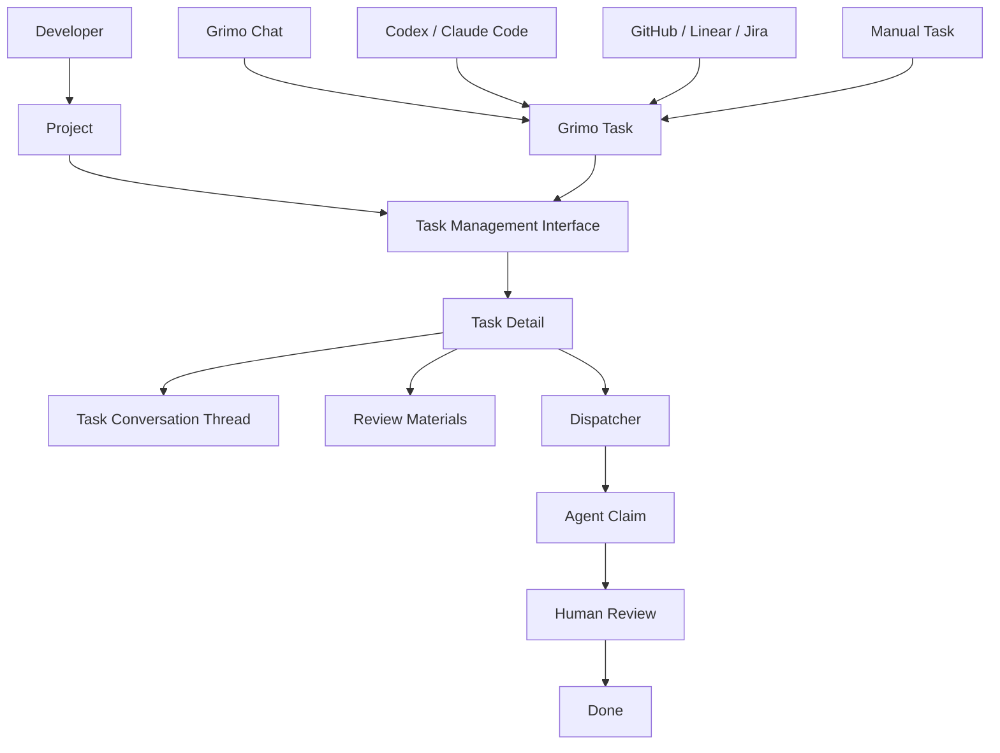

重點：

- `Project` 決定工作流和品質基準。
- `Task State Machine` 用 BACKLOG、DEFINING、READY、RUNNING、REVIEW、DONE、BLOCKED 呈現外層進度。
- `Workflow Recipe` 把使用者原本手動切換的 skill 開發流，拆成可由角色各司其職推進的 steps。
- `Task` 是使用者真正管理的一件工作。
- `Chat` 是 Task 的討論入口，不是產品本體。
- `Review Materials` 是 approve/reject 的依據。
- `Dispatcher` 只在使用者啟動執行窗口後才派工。

### 0.2 使用者每天看到的畫面

使用者主要在三個地方移動：Task 工作台、Task detail、Task Chat。其他 workflow、dispatcher、quality loop 都是支撐這三個畫面的產品能力。

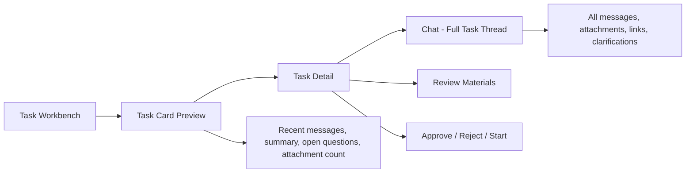

畫面語義：

| 畫面 | 使用者用它做什麼 | 不應該變成什麼 |
| --- | --- | --- |
| Task Workbench | 掃描狀態、找待處理、看 READY/RUNNING/REVIEW | workflow engine console |
| Task Card | 看狀態、標籤、摘要、留言/附件數 | raw chat transcript |
| Task Detail | 看定義、缺口、品質、evidence、下一步 | 只讀摘要頁 |
| Chat | 回到該 Task 的完整討論 | 新開空白 generic chat |
| Review Materials | approve/reject 的完整證據包 | 零散附件列表 |

### 0.3 一件 Task 的生命週期

看板只呈現外層 Task State Machine；底層開發步驟放在 Task detail 裡。`BACKLOG -> DEFINING -> READY -> RUNNING -> REVIEW -> DONE` 是使用者看得懂的狀態機，用來回答「這件 Task 目前在哪裡」。每個狀態底下有自己的 State Workflow：有些狀態會展開成 workflow steps，有些狀態是 queue、gate、review point 或 evidence holder。

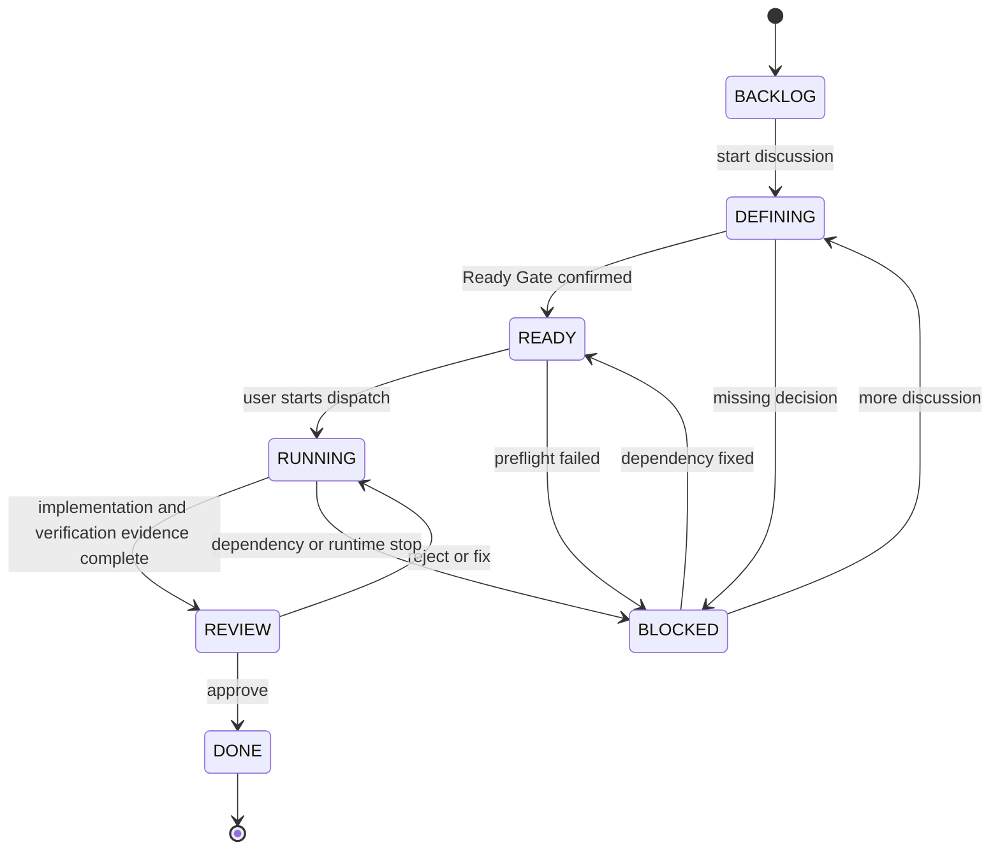

狀態翻成白話：

| Task State | 白話意思 | State Workflow |
| --- | --- | --- |
| `BACKLOG` | 有這件事，但還沒認真定義 | 保存想法、外部匯入或 follow-up；還不啟動主動定義流程。 |
| `DEFINING` | 正在透過 Chat / research / spec 把需求問清楚 | 展開 Discuss、Explore、Prototype、Spec、Usage、Tkt 等 definition workflow steps。 |
| `READY` | 定義和品質門檻已確認，可以排程，但還沒自動跑 | 等待使用者啟動 Dispatch Window 或手動開始；Dispatcher 做 preflight。 |
| `RUNNING` | Agent 已 claim 任務，正在 worktree/sandbox 裡開發、驗測與自審 | 展開 Dev、Auto-Review、Unit-test fe/be、Integration-test、E2E-test 等 execution workflow steps。 |
| `REVIEW` | 執行和驗測證據已交齊，等人 approve/reject | 人類檢視 Review Materials，決定 approve 或 reject。 |
| `DONE` | 原 Task 完成，進入 release 收尾 | 保存完成紀錄、release evidence；若有新方向，建立 Follow-up Task 回 BACKLOG。 |
| `BLOCKED` | 缺決策、環境、權限、依賴或資訊，需要人處理 | 停下並顯示 blocked reason；解除後回到適合的 Task State。 |

### 0.4 Task 裡面有哪些資料

Task 不是單張卡片；它是一個本地保存的工作封包。

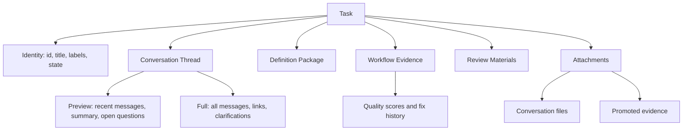

設計分工：

- `Task Conversation Thread`：完整對話、附件、外部連結、後續澄清。
- `Task Conversation Preview`：卡片或收合狀態只顯示最近幾則、摘要、未決問題、附件數。
- `Definition Package`：讓 Task 進 READY 前必須看懂的需求定義。
- `Workflow Evidence`：每個 recipe step、quality score、fix history、worker log。
- `Review Materials`：人類 approve/reject 前看的 evidence package。

### 0.5 Coding Task Recipe

MVP 預設 workflow 是軟體開發工作流。每個主要 Workflow Step 都有自己的 Step Sub-workflow；目前最重要的 Step Sub-workflow 是 Quality Loop，通過 `quality_score > 9` 才前進。Web 開發 recipe 會在 `RUNNING` 底下展開開發、自審與驗測，讓使用者在 Task detail 裡知道目前是在寫 code、跑自審，還是在補 unit / integration / E2E evidence。

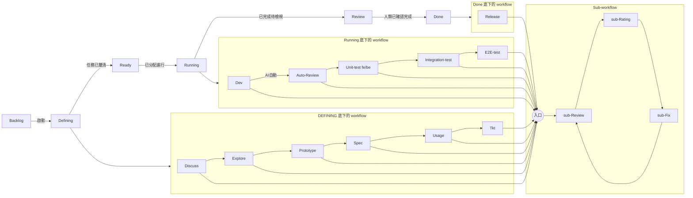

`Release` 是 DONE 底下的收尾 workflow，不是新的看板狀態。原 Task 在 REVIEW approve 後進 DONE；如果需要 merge、cleanup、delivery summary、short retro 或 learning proposal，這些收尾證據會保存在 DONE task 裡。若收尾結論產生新的優化方向，Grimo 會建立帶來源的 Follow-up Task 回到 BACKLOG。

### 0.6 Dispatch Window

READY 代表「可排程」，不是「Grimo 會 24 小時自動跑」。使用者必須手動啟動一段 dispatch window，或手動開始單一 Task。

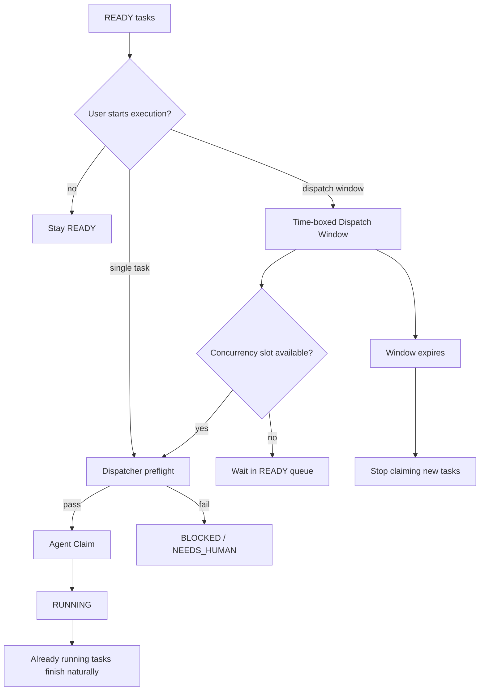

---

## 1. 問題陳述

開發者現在已經能用 Claude Code、Codex CLI、Gemini CLI / Antigravity CLI 等 coding agents 寫程式，但從「我有一件工作」到「AI 團隊穩定做完、留下可審查成果」之間，仍然隔著一堆人工配置和流程斷點：

1. **原始想法缺少討論到任務的穩定路徑。** 使用者在 chat 裡說「幫我做 X」後，真正需要的是一段頻繁的人機討論，把模糊目標、限制、成功條件和風險問清楚，再沉澱成 Task；今天使用者仍要自己拆 issue、寫 prompt、決定誰做、追狀態。
2. **Agent 配置成本太高。** Claude Code 要 `CLAUDE.md`、skills、subagents；Codex / Gemini / OpenClaw 也各有 models、I/O、actions、triggers、permissions。能力不是問題，問題是每次開新工作流都要重新配一輪；使用者也常被迫自己切換 PM、Architect、Frontend、Backend、QA、Release 等心智角色，手動套用 skills、整理 evidence、補品質檢查。
3. **任務系統和本地 agents 割裂。** GitHub Issues、Linear、Jira 裡的工作和本機 coding agent 執行狀態分開；完成結果、PR、review、fix history 很難回寫成一致的工作項目紀錄。反過來說，如果 Codex / Claude Code 想像接 Linear issue 一樣接本地任務，也缺少一個 agent-facing task system。
4. **Task 若只是待辦卡，品質仍然靠運氣。** 只把工作拆成 Task 不夠；每個 Task 都要經過穩定 workflow，從討論、探索、原型、規格、使用情境、票據化、開發、審查到收尾，都要有 review、rating、fix 的品質循環。
5. **AI 寫 code 後，人類缺少完整驗收包。** 單看 diff 不夠；使用者需要看到 Definition Package、每個 execution step 分數、跑了哪些測試、AI 自己檢討了什麼、另一個 reviewer agent 查出什麼、修過幾次、剩餘風險是什麼。
6. **流程知識沒有回流。** 每次任務的 retro、review、rating、fix、驗收結果，如果沒有沉澱到 skills / workflow recipes / project docs，下一次仍然會犯同樣錯。
7. **本地產品不能假設使用者環境完美。** Grimo 跑在使用者自己的電腦上；Java、Docker、git、CLI agent、模型登入、filesystem 權限、native library、SQLite driver、port binding 都可能缺失或版本不同。產品不能把這些當成安裝前提後直接失敗，而要能檢查、提示、降級或把 Task 標成可理解的 BLOCKED / NEEDS_HUMAN。
8. **雲端工作台容易讓使用者失去工作資料正本。** Coding agent workflow 會產生大量有價值的資料：Task、討論脈絡、Definition Package、step output、quality score、fix history、review result、retro、learning proposal。如果這些只存在遠端 SaaS 或 provider session，使用者失去網路、帳號、訂閱或服務時，就失去自己的開發歷史和流程知識。

市場也正在往這個方向走：Symphony 把 Linear 類 issue tracker 變成 Codex orchestration control surface；Multica 用 issue 指派 + 本地 daemon + 本地 coding tools；Linear 把 agents 當 workspace 裡的 contributor；GitHub 把 Claude / Codex / Copilot coding agents 放到 Issues、PR comments、Agents tab 和 VS Code 裡；Helio 用 AI coworkers / channels 包裝多角色任務協作；Nezha 把本機多專案 coding agent session、任務和檔案視圖收在桌面 app 裡。Grimo 的定位要跟上這個變化：不是另一個 chat，不是另一個模型選單，而是把本機 AI 開發工作變成可排隊、可指派、可執行、可審查、可學習的工作台。

## 2. 解決方案

Grimo 對使用者說是 **AI 開發工作台（AI Development Workbench）**；工程定義是 **本地 agent control plane（Local Agent Control Plane）**。

Grimo 在本機管理 Project、Task、Task Conversation Threads、Attachments、Session、Skills、MCP servers、Workflow Recipes、Subagent Execution、Review Materials、Release evidence 和 Learning Loop。MVP 中 Project 代表一個本機 repo / codebase；Task 代表使用者想完成的一件工作，而不是 workflow 拆出的內部 step。每個 Task 都擁有完整可回放的 Task Conversation Thread：點開 `Chat` 會看到完整對話紀錄、附加檔案、外部連結與後續澄清；收合 Chat 或只看卡片時，只顯示最近幾則對話、重點摘要、未決問題和附件數。Grimo 讓使用者把聊天、local tasks、未來的 GitHub Issues / Linear / Jira 工作項目統一成 Grimo Task；人類確認後進入 Ready Task；使用者手動啟動 dispatch window 後，AI agent 才能在該窗口內領走 READY 任務執行；最後在 REVIEW 階段交回完整審查資料給人類 approve/reject。

Grimo 也可以扮演像 Linear 一樣的任務編排系統，提供 Agent-Facing Task API 給 Codex、Claude Code 或其他 coding agent runtime 來 claim 任務、取得 Definition Package、回報 execution step output、review result 與 Release evidence。即使任務是外部 agent 領走，Grimo 仍是流程與狀態控制面：Ready 邊界、Agent Assignment、Workflow Recipe、Quality Loop、Learning Loop 和 connector sync 都由 Grimo 管。

主要產品流程是：建立或選擇 Project，進入 Task Management Interface 追蹤 Task，需要建立或推進工作時才打開 task-forming chat。Chat 是工作入口，不是產品本體；Task Management Interface 才是使用者追蹤狀態、驗收 evidence 和做 approve/reject 的主介面。Chat 也不是一次性 provider transcript：它是 Task 的完整討論 thread，類似 GitHub issue 留言串的產品角色，但 Grimo 會額外產生重點摘要、定義缺口、附件提示與 workflow evidence 連結。

系統視圖分成兩種：

1. **工作入口（Work Entry Clients）**：Codex、Claude Code、Grimo Chat 都可以把對話、指令或 issue link 接到 Grimo Workflow，形成 Task 或推進 Task。
2. **任務管理介面（Task Management Interface）**：Grimo 自帶的任務管理介面顯示 Project、Task 狀態、dependencies、assignment、dispatcher、worker log、run history、Review Materials、Release evidence 與 connector sync。

Grimo Workflow Task Management 是兩種視圖背後的核心。Project 層級選擇開發工作流；MVP Project 預設使用 Coding Task Recipe。Task 建立時不要求使用者選 Task Type 或 Workflow Recipe，只保存 title、body、source、labels、status、conversation summary、recent messages、attachments metadata 與後續討論脈絡；其中 source 是系統依入口自動標註的 provenance，手動建立固定為 `manual`，不出現在 Create Task 表單。執行與定義階段繼承 Project 的 workflow 設定，再由 Ready Gate / Dispatcher 決定 Agent Profile / runtime、skills 與 MCP servers。Task State Machine 是跨領域的大抽象狀態；開發、研究、分析、行銷、影片製作等未來 Project workflow 都可使用同一組 board-facing 狀態，但每個 Task State 底下的 State Workflow 可由 Project 選定的 Workflow Recipe 定義。

Grimo 也會把使用者目前手動維護的 skill 開發流收斂成 Project workflow：使用者不用同時扮演 PM、Architect、Frontend、Backend、QA 和 Release，也不用記得每一步該切哪個 skill、跑哪些品質檢查。Project 選定 Workflow Recipe 後，Grimo 依 step 帶出對應 Agent Profile、skills、Quality Loop 和 evidence；使用者主要負責補決策、開啟 dispatch window、審查 Review Materials，以及決定是否接受 Release evidence 產生的 follow-up。

Grimo 的產品語言維持 Task 工作台：一般使用者在 list / board 上看到簡化 Task State Machine，例如 BACKLOG、DEFINING、READY、RUNNING、REVIEW、DONE、BLOCKED，不需要理解底層 agent workflow 實作。卡片可以顯示留言數、附件數、最近對話提示或重點摘要，但不顯示完整 raw transcript。完整 Task Conversation Thread、Task Attachments、CLAIMED、DEV、Release evidence、recipe steps、Step Sub-workflow、Quality Loop、quality_score、fix history、worker log、run history、diff、測試輸出或其他領域 evidence，都屬於 Task detail evidence。內部 execution substrate 則以 Pollack AI Lab `Agent Workflow` 為主：Workflow Recipe 映射成 `Workflow`；每個 recipe step 底下都跑自動 `sub-Review -> sub-Rating -> sub-Fix` 的 Quality Loop，直到 `quality_score > 9` 才能進下一個主要 step。Quality Loop 是每個主要 step 的 Step Sub-workflow，不是頂層 workflow step。Coding Task Recipe 是 MVP 的第一個具體 recipe，涵蓋 Discuss / Explore / Prototype / Spec / Usage / Tkt / Dev / Auto-Review / Unit-test fe/be / Integration-test / E2E-test / Release；完成這些 RUNNING evidence 後才進產品狀態 REVIEW。需要 merge、cleanup、delivery summary 或 learning proposal 時，收尾內容保存在 DONE task 的 Release evidence 裡。這套 SDD 開發流程適合軟體開發，不是所有 Project workflow 的固定流程。流程控制、品質門檻與可恢復執行分別透過 `Step`、`Gate`、`StepRunner`、checkpoint、trace 與 sandbox / judge 相關套件落地。

核心流程：

```mermaid
graph TD
  Project["Project - local repo or codebase"] --> Direction["Product Definition Task or Product Definition Review"]
  Direction --> Planning["Project Planning Task - architecture, standards, QA strategy, Project Quality Gate"]
  Planning --> Entry["Work Entry - Codex, Claude Code, Grimo Chat, Local Task, External Work Item"]
  Entry --> Task["Task - source, discussion context, inherits Project Workflow Recipe"]
  Task --> Definition["Definition steps - Discuss, Explore, Prototype, Spec, Usage, Tkt"]
  Definition --> DefQL["Quality Loop on each step - sub-Review, sub-Rating, sub-Fix, quality score gt 9"]
  DefQL --> Package["Definition Package"]
  Package --> Ready["READY - human confirms and assigns thin Agent Profile"]
  Ready --> Dispatch["Dispatch Window or manual start - time boxed, concurrency limited"]
  Dispatch --> Claim["Dispatcher preflight - dependencies, runtime, permissions"]
  Claim --> Running["Agent Claim - RUNNING"]
  Running --> Execution["RUNNING workflow - Dev, Auto-Review, Unit-test fe/be, Integration-test, E2E-test"]
  Execution --> ExecQL["Quality Loop plus Project and Task Gate evidence"]
  ExecQL --> HumanReview["REVIEW - human approve or reject"]
  HumanReview -- "approve" --> Done["DONE"]
  HumanReview -- "reject / fix" --> Running
  Done --> ReleaseEvidence["Release evidence - cleanup, summary, retro if needed"]
  ReleaseEvidence --> Learning["Follow-up proposal - optional skill or recipe improvement"]
```

開發流程確認圖：

下面幾張圖是同一套流程的不同切面，用來避免把 Project onboarding、Task State Machine、Workflow Recipe step 和 Dispatcher 規則混在同一張圖裡。

#### Project onboarding 與工作流選擇

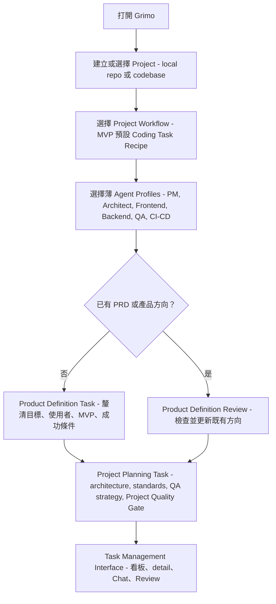

#### 看板只呈現 Task State Machine

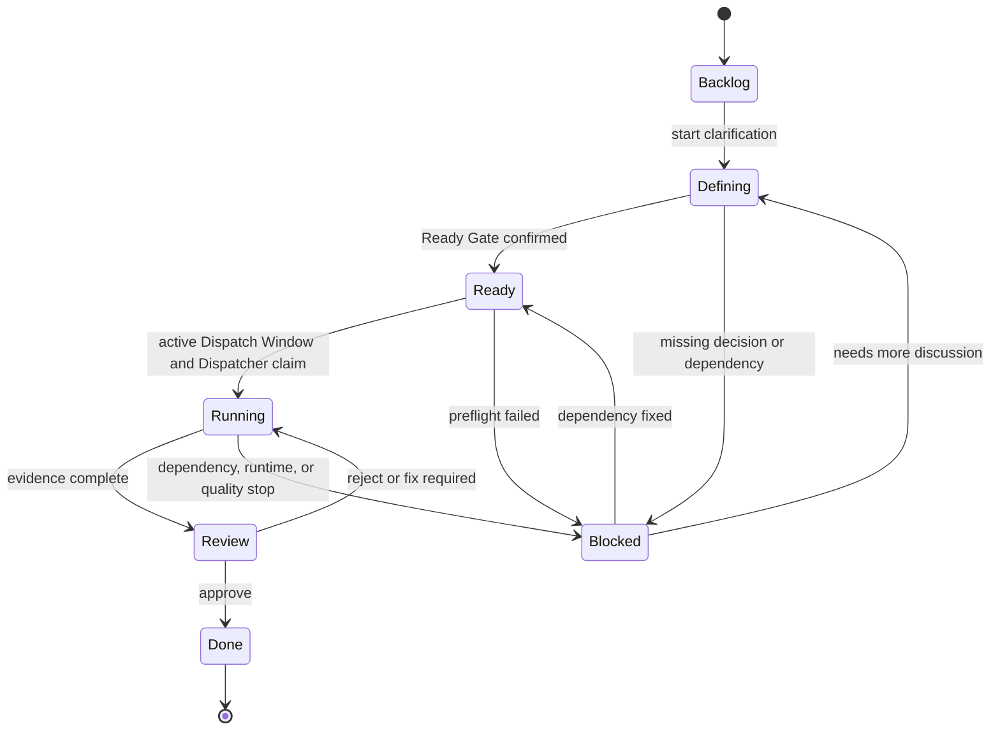

`Discuss / Explore / Prototype / Spec / Usage / Tkt / Dev / Auto-Review / Unit-test fe/be / Integration-test / E2E-test / Release` 不作為看板欄位；它們是 Task detail 裡的 workflow evidence。REVIEW 是看板上的人類審查狀態，Release evidence 放在 DONE task 裡檢視，不是讓原 Task 多跑一個看板狀態。

#### Coding Task Recipe 與 Quality Loop

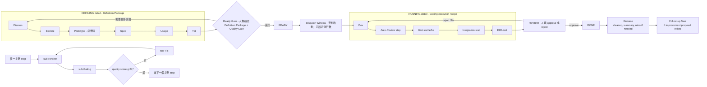

#### Dispatch Window 與並行規則

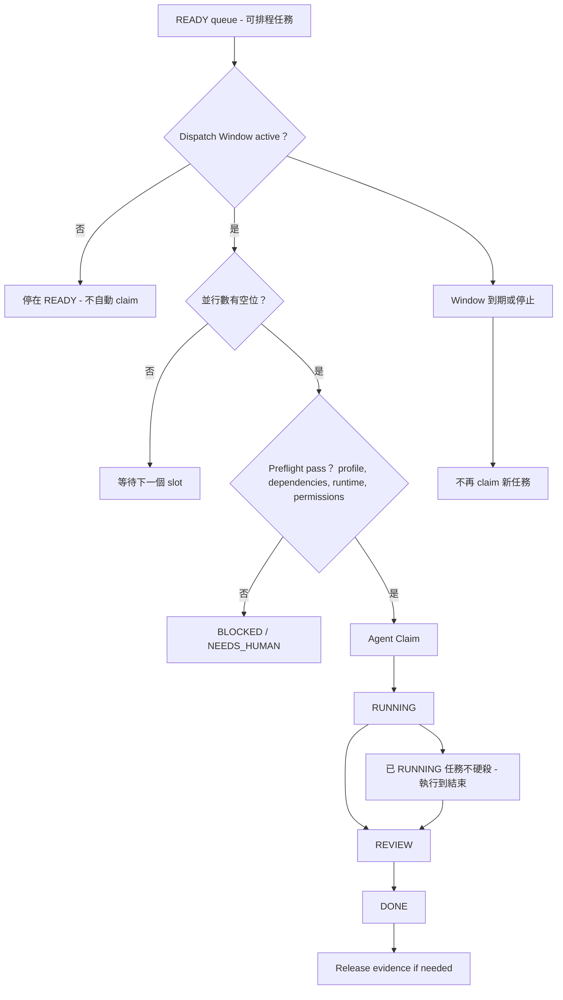

#### 完整單圖

```mermaid
graph TD
  Start["打開 Grimo"] --> Project["建立或選擇 Project - local repo 或 codebase"]
  Project --> Workflow["選擇 Project Workflow - MVP 預設 Coding Task Recipe"]
  Workflow --> Profiles["選擇薄 Agent Profiles - PM, Architect, Frontend, Backend, QA, CI-CD"]
  Profiles --> HasPRD{"已有 PRD 或產品方向？"}
  HasPRD -- "否" --> ProductDef["Product Definition Task - 目標、使用者、MVP、成功條件"]
  HasPRD -- "是" --> ProductReview["Product Definition Review - 檢查並更新既有方向"]
  ProductDef --> Planning["Project Planning Task - architecture, standards, QA strategy, Project Quality Gate"]
  ProductReview --> Planning

  Planning --> Entry["Work Entry - Grimo Chat, Codex, Claude Code, issue, manual"]
  Entry --> Task["Task - title, body, labels, source, inherits Project workflow"]
  Task --> Backlog["BACKLOG - 低承諾暫存"]
  Backlog --> Defining["DEFINING - 開始收斂 Definition Package"]

  subgraph DefinitionRecipe["DEFINING detail - Coding definition recipe"]
    Discuss["Discuss - Chat 探索與釐清"] --> DiscussQL["Quality Loop - sub-Review, sub-Rating, sub-Fix, quality score gt 9"]
    DiscussQL --> Explore["Explore - 技術調研與可行性"]
    Explore --> ExploreQL["Quality Loop"]
    ExploreQL --> Prototype["Prototype - 必要時做低保真驗證"]
    Prototype --> PrototypeQL["Quality Loop"]
    PrototypeQL --> Spec["Spec - 技術規格"]
    Spec --> SpecQL["Quality Loop"]
    SpecQL --> Usage["Usage - 使用情境與 acceptance"]
    Usage --> UsageQL["Quality Loop"]
    UsageQL --> Tkt["Tkt - ticketized tasks"]
    Tkt --> TktQL["Quality Loop"]
  end

  Defining --> Discuss
  TktQL --> DefinitionPackage["Definition Package - Spec, Usage, tickets, Acceptance Gate"]
  DefinitionPackage --> ReadyGate{"Ready Gate - 人類確認？"}
  ReadyGate -- "否，回 Chat / Task detail 釐清" --> Defining
  ReadyGate -- "是，指定 Agent Profile" --> Ready["READY - 可排程，不自動執行"]

  Ready --> DispatchStart{"使用者啟動執行？"}
  DispatchStart -- "否" --> Ready
  DispatchStart -- "手動開始單一 Task" --> Preflight
  DispatchStart -- "開啟 Dispatch Window" --> Window["Dispatch Window - 有期限，可設定並行數"]
  Window --> Capacity{"並行 slot 有空？"}
  Capacity -- "否" --> Ready
  Capacity -- "是" --> Preflight{"Dispatcher preflight - profile, dependencies, runtime, permissions"}
  Preflight -- "失敗" --> Blocked["BLOCKED / NEEDS_HUMAN - 顯示修復路徑"]
  Preflight -- "通過" --> Claim["Agent Claim"]
  Claim --> Running["RUNNING - worktree, sandbox, worker log"]

  Window --> WindowEnd["Window 到期或停止"]
  WindowEnd --> StopNew["停止 claim 新任務"]
  Running --> Continue["已 RUNNING 不硬殺 - 執行到結束"]

  subgraph ExecutionRecipe["RUNNING detail - Coding execution recipe"]
    Dev["Dev - 實作 + Project/Task Quality Gate evidence"] --> DevQL["Quality Loop - sub-Review, sub-Rating, sub-Fix, quality score gt 9"]
    DevQL --> AutoReview["Auto-Review - AI self-review + Review Materials"]
    AutoReview --> ReviewQL["Quality Loop - quality score gt 9"]
    ReviewQL --> UnitTest["Unit-test fe/be - save verification evidence"]
    UnitTest --> IntegrationTest["Integration-test - save verification evidence"]
    IntegrationTest --> E2ETest["E2E-test - save verification evidence"]
  end

  Continue --> Dev
  E2ETest --> HumanReview["REVIEW - 人類 approve 或 reject"]
  HumanReview -- "reject / fix required" --> Dev
  HumanReview -- "approve" --> Done["DONE"]
  Done --> ReleaseEvidence["Release evidence - merge, cleanup, delivery summary, short retro if needed"]
  ReleaseEvidence --> Learning{"建議優化 skill / recipe？"}
  Learning -- "是" --> Proposal["Learning Proposal - pending human review"]
  Learning -- "否" --> FinishedEvidence["只保留 DONE evidence"]
  Proposal --> Followup["Follow-up Task - BACKLOG / pending human review"]

  Blocked -- "需要更多討論" --> Defining
  Blocked -- "依賴修復 / preflight 通過" --> Ready
  Done --> Finished["結束 - local evidence preserved"]
```

### 定位表

| Grimo 是 | Grimo 不是 |
| --- | --- |
| AI 開發工作台：把想法、任務、agent 執行、審查和學習放在同一個本機產品裡 | 新的 LLM、聊天模型或 IDE |
| Local Agent Control Plane：管理本地 CLI agents、skills、workflow recipes、worktrees、execution history | 只包一層 Claude/Codex/Gemini 的薄 CLI launcher |
| Workflow task management core：Codex、Claude Code、Grimo Chat 都可以接進同一套 workflow | 每個前端各跑一套互不相干的任務狀態 |
| Agent-facing task system：可像 Linear 類工作系統一樣，讓 Codex / Claude Code 來接 Ready Task 並回報結果 | 把任務丟給外部 agent 後就失去流程控制的 issue mirror |
| 本地優先、單使用者開發工具 | 多租戶 SaaS 或企業工單平台 |
| 以 Task / Ready Task / Agent Claim / Review / Release evidence 為主軸的工作系統 | 只有 prompt history 的聊天工具 |
| 六角架構設計的 connector 平台，MVP 先 Grimo local，未來接 GitHub / Linear / Jira | 第一版就做完整外部 issue 雙向同步 |

## 3. 目標使用者與場景

### 目標使用者

- 已使用至少一個 coding agent（Claude Code、Codex CLI、Gemini CLI / Antigravity CLI、OpenClaw、Aider 等）的開發者。
- 想要讓 AI 不只是臨時 chat，而是能領任務、跑流程、交結果的工程 teammate。
- 想把本地 coding agents 和 Project / Task / issue 管理接起來。
- 想保留本地優先、使用既有 CLI 登入與訂閱帳號，不想每個工具都重建 API key 和配置。
- 需要完整驗收資訊，而不是只收到一段 diff。

### 代表性場景

- **Project 先定義方向，再設計架構。** 使用者建立 Project 後，Grimo 先透過 Product Definition Task 釐清要做什麼；若 repo 已有 PRD，這個 Task 會改成 Product Definition Review，檢查、更新和補齊既有方向。方向明確後，才由 Project Planning Task 產出 architecture、development standards、QA strategy 和 Project Quality Gate。
- **Discuss 靠 chat 頻繁互動。** 使用者在 `POST /api/chat` 說「幫我把 session branch 支援補完」後，主代理先在 chat 裡追問目標、限制、成功條件與風險；必要時也在 chat 中觸發研究分析，將外部資料、現有程式與競品/框架資訊帶回對話。這段互動仍屬於 Coding Task Recipe 的 Discuss step，收斂後產生可被 Quality Loop 審查的 Discuss output。
- **Task Chat 保存完整討論。** 使用者在 Task detail 點 `Chat` 會進入該 Task 的完整 Task Conversation Thread，能看到所有歷史訊息、agent 回覆、附件、引用檔案、外部連結與後續澄清；收合 Chat 或只看卡片時，Grimo 只顯示最近幾則對話、重點摘要、附件數與未決問題，像 issue 留言摘要一樣幫人快速回到上下文。
- **多種工作入口接同一個 workflow。** 使用者可以從 Grimo Chat、Codex 或 Claude Code 發起工作；不管入口是哪一個，最後都進同一套 Grimo Workflow Task Management，產生相同的 Task、狀態、Review Materials 與 Release evidence。外部入口可以建立或推進 defining work，但不能直接把 Task 移到 READY。
- **Skill 開發流由角色各司其職。** 使用者原本要自己切換 planning、frontend、backend、testing、release 等 skills；在 Grimo 裡，Project Workflow Recipe 會把這些能力分配到對應 Agent Profile 和 workflow steps。使用者仍負責決策與最後審查，但不需要手動扮演所有工程角色或追每個品質循環。
- **需求定義落成文件。** Discuss step 透過 chat 與研究分析產出的 task title/body/source/labels/acceptance hints 會進入 Project 選定的開發工作流；MVP 依 Coding Task Recipe 執行 Explore、Prototype（必要時）、Spec、Usage、Tkt，並讓每個主要 step 的自動 Quality Loop 通過後才前進，最後形成 Definition Package。
- **人類確認 Ready Task。** 使用者確認 Definition Package 與該 Task 採用的 Quality Gate 後，才把 Task 移到「待執行」狀態，指定「Backend Engineer」這個薄 Agent Profile。
- **AI 自主領走任務。** READY 任務都可以被排程執行，但自動派工必須由使用者手動啟動 dispatch window；Grimo 不會 24 小時常駐自動領任務。Agent Claim 後，Grimo 建 worktree、套用 skills，進入 RUNNING；細節頁顯示 CLAIMED / DEV / Auto-Review、Unit-test fe/be、Integration-test、E2E-test、Quality Loop、worker log、run history 與 evidence；DONE task 內可檢視 Release evidence。
- **外部 coding agent 接任務。** Codex / Claude Code 可透過 Agent-Facing Task API 取得 Ready Task、claim、回報 step output；Grimo 仍保存 workflow state、quality score、review result 與 Release evidence。
- **Dispatcher 守住可執行邊界。** READY 不等於馬上跑；Dispatcher 只有在使用者手動開啟 dispatch window 或手動開始單一 Task 時，才會檢查 assignee/profile、dependencies、runtime availability 與人類核准狀態，並建立 Agent Claim。Dispatch window 是有期限的執行窗口，不是永久開關；MVP UI 應提供「執行 1 小時」「執行到明早 8 點」「只跑選取任務」這類明確選項，並可設定並行數。Window 到期後不再 claim 新任務，但已經 RUNNING 的任務會執行到結束。
- **每個階段都被品質出口守住。** Coding recipe 中的 Discuss / Explore / Prototype / Spec / Usage / Tkt / Dev / Auto-Review / Unit-test fe/be / Integration-test / E2E-test / Release 每個主要 step 都先跑 Quality Loop；其他 Project workflow 的 recipe steps 也套用同一個 Quality Loop 機制。`quality_score > 9` 後預設自動進下一個主要 step。RUNNING 的出口必須依 Project Quality Gate 與 Task/Spec Acceptance Gate 保存足夠 verification evidence；REVIEW 是人類審查狀態；Release evidence 只在 DONE task 需要時整理交付摘要、短 retro 與是否邀請優化流程的建議。
- **人類在 REVIEW 審完整資料。** 使用者 approve/reject 發生在 REVIEW；REVIEW 代表 Auto-Review、Quality Loop、測試或不適用理由和 Review Materials 已完成，現在等人類判斷。審查資料包含 Definition Package、execution step outputs、quality scores、final diff、verification evidence、retro、review findings、fix history、risk notes、PR link。Release evidence 只在 DONE task 需要時保存收尾摘要、cleanup 與流程優化邀請。
- **Follow-up Task 只提案，不自動開工。** Agent 在執行或審查中發現額外工作時，可以建立帶來源、理由與建議 priority 的 Follow-up Task，但預設只能進 BACKLOG 或 DEFINING，不能直接 READY 或 RUNNING。
- **任務系統逐步接入。** MVP 使用 Grimo Local Connector；未來 Project 建立時可選 GitHub Issues、Linear、Jira connector，title/body/source/labels/assignee/status/執行結果雙向同步，衝突時停下等人處理。

## 4. 核心原則

### P1 — Workbench first, provider second

使用者先看到 Project、Task、Backlog、Ready Task、Agent Assignment、Running、Review、Done、Blocked，而不是先選 Claude / Codex / Gemini。Provider 是 runtime 選項；工作台主語是工作本身。

### P2 — Chat creates work; execution needs confirmation

Task-forming chat 是 Discuss step 的入口：主代理透過多輪 chat 把原始想法問清楚，必要時觸發研究分析，沉澱成 Task，但不直接改檔。每個 Task 的 chat 都保存為 durable Task Conversation Thread，包含完整歷史訊息和附件；收合狀態只顯示 preview，例如最近幾則、重點摘要、未決問題和附件數。Task 接著由 Pollack Agent Workflow 驅動 Explore / Prototype / Spec / Usage / Tkt 等主要 steps，將需求落成 Definition Package，並選用或補充 Task/Spec Acceptance Gate。各主要 step 的自動 Quality Loop 通過後會自動前進；人類把 Definition Package 和 Quality Gate 確認為 Ready Task 後，Task 進入可排程狀態，直到使用者手動啟動 dispatch window 或手動開始單一 Task，AI 才能正式領走執行。

### P3 — Thin Agent Profile, real capability in skills and recipes

Agent Profile 是給人類看的薄角色入口：名稱、用途、預設 provider/runtime、enabled skills、assignment rules。UI 可以用「Backend Engineer」「Architect」「Code Reviewer」等人類可讀名稱，但 profile 本質不是厚 AI coworker，不擁有獨立 inbox、人格或行事曆。MVP 先服務 coding work；角色模型保留未來透過 skills / recipes 延伸到 research、analysis、marketing、video production、finance 等非開發工作。

### P4 — Workflow Recipe over hope-based prompting

Skill 是能力包；Workflow Recipe 是穩定流程。Task 只是管理單位，真正保證品質與完整落實的是 recipe-controlled work：Project 層級選擇 Workflow Recipe，Task 繼承該 Project workflow，不在新增 Task 時要求使用者選擇工作流。每個 step 底下都有自動 sub-Review、sub-Rating、sub-Fix 的 Quality Loop 子流程。只有該節點的 `quality_score > 9`，流程才前進；未達標則自動回到該節點的修正循環，而不是只希望 AI 讀完 prompt 後照做。Coding Task Recipe 的 Discuss / Explore / Prototype / Spec / Usage / Tkt / Dev / Auto-Review / Unit-test fe/be / Integration-test / E2E-test / Release 是軟體開發案例；完成 RUNNING evidence 後才進產品狀態 REVIEW；Release evidence 是 DONE task 需要時才保存的 cleanup、delivery summary、short retro 或 learning proposal。研究、分析、行銷、影片製作等未來工作流應由 Project 選擇，不干擾單筆 Task 建立。Grimo 不新增抽象方法論名稱；它把可重複的專業工作實務工程化為 Workflow Recipe、Skills、Quality Gate 和 Review Materials。

### P5 — Quality-gated progress

每個主要流程節點都有出口條件：不論該節點來自 coding、research、analysis、marketing 或 video production recipe，都各自先跑自動 sub-Review、sub-Rating、sub-Fix 的 Quality Loop；該節點預設 `quality_score > 9` 才能進下一節點，且通過後自動前進。未達標時，Quality Loop 會自動執行 fix attempt 並重新 review / rating，直到通過或碰到明確停止條件。人類確認保留在特定產品 gate，例如 Definition Package 轉 READY、REVIEW approve/reject，或高風險操作。具體驗收不是固定 checklist：Project 設計階段先依 repo/codebase 型態定義 Project Quality Gate；Task / Spec 再挑選、補充或覆寫為 Task/Spec Acceptance Gate。Release evidence 只在 DONE task 需要收尾時整理 delivery summary、short retro 與是否邀請優化流程的建議；若發現可重複改善項，只建立提案，不自動套用。

### P6 — Human-gated autonomy

AI 可以自主領 Ready Task，但 Ready Task 必須先由人類確認 Definition Package 和 Quality Gate，且自動派工必須由使用者手動啟動 dispatch window。READY 代表可被排程，不代表 Grimo 24 小時自動執行；Dispatcher 只會在 active dispatch window 或單一 Task 手動開始時，把符合 assignment、dependency 與 runtime 條件的 Ready Task 轉成 Agent Claim。Dispatch window 必須 time-boxed、可設定並行數，並可停止 claim 新任務；window 到期或停止後，已經 RUNNING 的任務不硬殺，會執行到結束。Claim 後 Task 在 board 上進入 RUNNING，細節頁顯示 CLAIMED / DEV / Auto-Review / verification evidence 等執行狀態；DONE task 內可檢視 Release evidence。Auto-Review、必要測試與 Review Materials 完成後，Task 才進 REVIEW 等待人類審查。任何主要 workflow step 的 Quality Loop 不通過時，系統會依停止條件自動 fix / review / rating；仍無法通過時才停下給人看。

### P7 — Review owns approval; DONE owns release evidence

人類 approve/reject 發生在產品狀態 REVIEW，不是 Release 之後。這個 REVIEW gate 不等於每個主要 step 內部的 sub-Review 子流程；它代表 Auto-Review、Quality Loop、必要 verification evidence 和 Review Materials 已完成，現在輪到人類拿完整審查資料判斷是否可收尾。審查資料包含 Definition Package、execution step outputs、quality scores、final diff、Project/Task Quality Gate evidence、Implementer Retro、Reviewer Agent 結果、Fix Attempt 歷史與風險說明。Task 通過後進 DONE；若任務需要 merge/cleanup、delivery summary、release short retro 或流程優化邀請，這些內容保存成 DONE task 的 Release evidence。

### P8 — Learning Loop proposes, never silently applies

Release evidence 若出現，可以在單筆 DONE task 中提出「這件事是否值得優化流程」的短 retro；定時 agent CLI 則檢視多筆任務紀錄、Definition Packages、execution step outputs、quality scores、retro、review、fix 和驗收結果，提案更新 skills 或 workflow recipes。兩者都只提案，人類批准後才生效。

### P9 — Local-first ownership, connectors second

Grimo 的本地資料庫與工作區資料是 Project / Task / Workflow Evidence 的正本；GitHub Issues、Linear、Jira、Symphony 類入口是 connector projection，不是 source of truth。Local-first 不是只代表程式跑在本機，也不是 local-only；它代表使用者在沒有網路、沒有外部 connector、甚至外部帳號失效時，仍然能開啟 Project、查看 Task、讀取 Definition Package、review history、quality scores、fix history 與 delivery summary。協作與跨裝置同步可以加入，但不能犧牲本地速度、離線可讀、可匯出、可備份與使用者所有權。MVP 先做本地正本與外部 connector projection，不承諾完整 CRDT / OT 多端同步引擎。

### P10 — External work items stay consistent

Task 和 External Work Item 是同一件工作的不同呈現。完整 connector 需要雙向同步 title、body、labels、assignee、status 與執行結果；Sync Conflict 時停下等人處理。

### P11 — Host main agent, sandboxed execution

主代理在主機執行，負責對話與規劃；MVP 不承諾程式層完全阻擋主代理寫入。寫 code 的正式路徑是 subagent 在每任務 git worktree + Docker sandbox 中執行，最後回報 review result 與 Release evidence。

### P12 — Grimo can be an agent-facing task system

Grimo 不只會自己啟動 subagent，也可以提供 Ready Task / Agent Claim / Workflow Step / Review Materials / Release evidence contract 給外部 Codex、Claude Code 或未來 runtime 來接。外部 agent 可以是 worker；Grimo 仍是 task orchestration、workflow state、quality gate 與 connector sync 的 source of truth。

### P13 — Two interfaces, one workflow core

Codex、Claude Code、Grimo Chat 是工作入口；Grimo 的任務管理介面是看板與審查入口。兩者都接到同一套 Grimo Workflow Task Management，不各自保存任務狀態。Task 繼承 Project 選定的 Workflow Recipe；Grimo 再依 Task context、Ready Gate 和 Dispatcher 決定需要的 Agent Profile、runtime、skills 與 MCP servers，並在執行前準備好。

### P14 — Local environment is variable, product must absorb it

Grimo 是跑在使用者電腦上的本地產品，不是受控雲端環境；因此設計不能預設 Java、Docker、git、CLI provider、模型登入、native library、filesystem 權限或 port 都已經正確。所有 runtime capability 都要能被 preflight check 檢查，缺失時提供可理解的診斷、安裝/登入提示、fallback 或明確的 `BLOCKED / NEEDS_HUMAN` 狀態。SQLite、file-backed journal/memory、provider adapter 與 sandbox 都要服務這個原則：先讓單機 MVP 在更少外部前提下可靠運作，再逐步啟用更重的能力。

### P15 — Product direction before project architecture

Project onboarding 先釐清要做什麼，再設計怎麼做。沒有 PRD 或產品方向時，Grimo 先建立 Product Definition Task；已有 PRD 時，走 Product Definition Review 檢查、更新和補齊既有方向。方向明確後，Project Planning Task 才由架構師類 Agent Profile 依 project-planning Workflow Recipe 產出 architecture、development standards、QA strategy 和 Project Quality Gate。

## 5. SBE 驗收標準

### AC1 — Chat 建立 Task，但不執行

```gherkin
Given  使用者對 `POST /api/chat` 送出「幫我把 Task lifecycle 補上 READY 狀態」
When   主代理判斷這是寫入型工作
And    主代理透過 chat 追問成功條件、限制與風險
Then   Grimo 建立一筆 Task
And    response 包含 taskNumber
And    Task 狀態是 TRIAGE 或 DEFINING
And    Task body 保存 Discuss phase 的摘要與待確認欄位
And    沒有建立 worktree
And    沒有啟動 subagent execution
```

### AC1.0 — Task Chat 保存完整對話與附件，收合時顯示摘要

```gherkin
Given  Task #42 是從 Grimo Chat、Codex 或手動建立而來
And    Task #42 已有 12 則對話訊息、2 個附件和 1 個外部連結
When   使用者在 Task detail 點擊 Chat
Then   Grimo 顯示 Task #42 的完整 Task Conversation Thread
And    使用者可以看到所有歷史訊息、附件、外部連結與後續澄清
When   使用者收合 Chat 或回到 Task list / board
Then   Grimo 只顯示最近幾則對話、重點摘要、未決問題和附件數
And    卡片不顯示完整 raw transcript
And    附件不被當成 label 或 source 顯示
```

### AC1.1 — 多種工作入口接同一套 Grimo Workflow

```gherkin
Given  使用者在 Codex、Claude Code 或 Grimo Chat 任一入口說「幫我把 Task lifecycle 補上 READY 狀態」
When   入口 client 將工作送進 Grimo Workflow
Then   Grimo 建立同一種 Task
And    Task 有相同的 title/body/source/labels/status 欄位
And    Task 可在 Grimo 任務管理介面看到
And    Task 繼承所屬 Project 的 Workflow Recipe
And    後續 Definition、Ready、RUNNING workflow、REVIEW、DONE 與 Release evidence 不依賴原始入口
```

### AC2 — Definition Phase 落成文件後，Task 才能進 READY

```gherkin
Given  Task #42 已透過 chat 完成 Discuss phase
When   Discuss step 的 Quality Loop 通過 quality_score > 9
Then   Grimo 自動進入 Explore / Prototype / Spec / Usage / Tkt 等後續主要 workflow steps
And    每個主要 workflow step 通過 quality_score > 9 後自動進下一步
And    Grimo 產生或更新 Spec、Usage stories 與 ticketized Tasks
And    保存 Definition Package
And    使用者可以 approve Definition Package
And    approve 後 Task #42 才能移到 READY
```

### AC3 — 人類確認 Ready Task 並啟動 dispatch window 後，AI 才能領走

```gherkin
Given  Task #42 已完成 Definition Phase
When   使用者將 Task #42 移到 READY
And    指派給 Agent Profile「Backend Engineer」
Then   Task #42 出現在可排程的待執行佇列
And    只有被授權的 agent/runtime 可以 claim
And    Dispatcher 不會在 dispatch window 未啟動時建立 Agent Claim
When   使用者手動啟動 dispatch window 或手動開始 Task #42
Then   Dispatcher 可根據 assignee/profile、dependencies 與 runtime availability 建立 Agent Claim
And    若 Task #42 有未完成 dependencies，Dispatcher 不會建立 Agent Claim
```

### AC4 — Coding Task Recipe 的 execution steps 都有 Quality Loop

```gherkin
Given  Task #42 是 READY
When   Agent claim Task #42
Then   Grimo 建立每任務 git worktree
And    將相關 skills 投影到 worktree
And    將 Discuss phase 摘要與 Definition Package 作為 Task context
And    以 Pollack Agent Workflow 執行 Coding Task Recipe
And    Discuss / Explore / Prototype / Spec / Usage / Tkt / Dev / Auto-Review / Unit-test fe/be / Integration-test / E2E-test / Release 都是主要 workflow steps
And    每個主要 workflow step 都執行 sub-Review -> sub-Rating -> sub-Fix 的 Quality Loop 子流程
And    每個主要 workflow step 的 quality_score 必須大於 9 才能自動進入下一個主要 step
And    Task detail 顯示目前主要 step 與其 Quality Loop 子流程狀態
And    進入 Dev step 後完成實作
And    RUNNING workflow 依序保存 Auto-Review、unit test、integration test、E2E test 或明確不適用理由
And    Auto-Review step 會聚合 Definition Package、diff、測試證據、Implementer Retro、fix history 與風險說明作為 Review Materials
And    E2E-test step 的 quality_score 必須大於 9 且人類 approve 才能完成任務
And    Release evidence 只在 DONE task 需要 merge/cleanup、delivery summary、short retro 或流程優化邀請時出現
And    保存每個 step 的 output、review findings、quality_score、fix history
And    保存 review result 與 Release evidence（如有）
```

### AC5 — 單一步驟未達標時自動進入 Quality Loop 修正

```gherkin
Given  Task #42 已完成 DEV 並進入 REVIEW
And    Reviewer Agent 給出 quality_score = 8/10
When   Grimo 的 Quality Loop 判斷未達 quality_score > 9
Then   Grimo 自動啟動 Fix Attempt
And    執行 AI 收到 reviewer findings 並修正該主要 workflow step 的 output
And    修正後自動再次進入 review、rating
And    若仍未達 quality_score > 9，Quality Loop 依停止條件決定繼續自動 fix 或停在 NEEDS_HUMAN 狀態
And    每次 review、rating、fix attempt 都保存到 step trace 與 Review Materials
```

### AC6 — 人類在 REVIEW 審完整資料

```gherkin
Given  Task #42 已完成 RUNNING 階段
And    Auto-Review、Quality Loop 與 Task Quality Gate evidence 都已完成
And    Grimo 已產生 Review Materials
When   使用者打開 REVIEW
Then   使用者看到 final diff、verification evidence、Implementer Retro、Reviewer Agent 結果、Fix Attempt 歷史與風險說明
And    使用者看到 Definition Package 與每個 execution step 的 output、quality_score 與是否曾經 fix
And    使用者可 approve 或 reject
And    approve 後 Task #42 進入 DONE
And    若需要收尾，DONE task 內會顯示 Release evidence
```

### AC7 — Learning Loop 只提案，不自動套用

```gherkin
Given  Release evidence 或過去 10 筆 Coding Task 發現重複 review findings
When   Release AI 或 Learning Loop agent CLI 執行
Then   Grimo 產生一筆 skill 或 Coding Task Recipe 修改提案
And    提案狀態是 pending
And    未經人類 approve 前，不會改變任何正在使用的 skill 或 recipe
```

### AC8 — MVP Project 使用 Grimo Local Connector

```gherkin
Given  使用者建立 Project「grimoAPP」
When   connector 選擇「Grimo local」
Then   Project 可以建立、列出、更新 Tasks
And    Task 不需要外部 issue id
And    未配置 GitHub/Linear/Jira OAuth 也能完整跑 Coding Task Recipe
```

### AC9 — Work Item Connector 保留雙向同步契約

```gherkin
Given  未來 Project 綁定 GitHub Issues connector
When   GitHub Issue title/body/source/labels/assignee/status 改變
Then   對應 Grimo Task 欄位也更新
And    Grimo Task 的執行結果可同步回 GitHub Issue
And    若同一欄位兩邊都修改，Task 標記 Sync Conflict 並停止自動覆蓋
```

### AC10 — Modulith 邊界可驗證

```gherkin
Given  codebase 結構化為 Spring Modulith modules
When   `./gradlew test` 執行
Then   `ApplicationModules.of(GrimoApplication.class).verify()` 通過
And    Work Item Connector、Workflow Recipe、Task Execution 透過命名介面或事件連接
```

### AC11 — 外部 coding agent 接 Ready Task 的契約保留

```gherkin
Given  Task #42 已由人類移到 READY
And    Task #42 指派給 Agent Profile「Backend Engineer」
When   Codex 或 Claude Code runtime 透過 Agent-Facing Task API claim Task #42
Then   Grimo 將 Task #42 標記為 CLAIMED
And    Task #42 在 board 上進入 RUNNING
And    Grimo 回傳 Task context、Definition Package、Workflow Recipe、step rubrics 與需要投影的 skills
And    Grimo 回傳或準備該 Task 需要的 MCP servers
And    runtime 回報每個 execution step 的 output、review findings、quality_score 與 fix history
And    Grimo 建立 Review Materials、review result 與 Release evidence（如有）
And    Task 狀態與執行結果仍透過 Work Item Connector 同步
```

## 6. MVP 範疇

### 關鍵路徑

1. **Project + Grimo Local Connector + Development Workflow**
   Project 建立時可選 Grimo local，並在 Project 層級選擇開發工作流；MVP 中 Project 代表一個本機 repo / codebase，預設使用 Coding Task Recipe 建立本地 Tasks，不依賴外部 issue 系統。單筆 Task 建立時不選 workflow。

2. **Product Definition / Review**
   Project onboarding 先釐清要做什麼。沒有 PRD 時建立 Product Definition Task；已有 PRD 時執行 Product Definition Review，檢查、更新和補齊產品方向。

3. **Project Planning + Project Quality Gate**
   方向明確後建立 Project Planning Task，由架構師類 Agent Profile 依 project-planning Workflow Recipe 產出 architecture、development standards、QA strategy 和 Project Quality Gate。Project Quality Gate 依 repo/codebase 型態與最佳實踐定義 baseline，不讓每個 Task 從零決定合格線。

4. **Chat Discuss to Task**
   主代理透過 chat 和使用者頻繁互動，將原始想法問清楚並沉澱成 Task；不直接執行。每個 Task 都保存完整 Task Conversation Thread 與 Task Attachments；點開 Chat 看到完整紀錄，收合時顯示最近幾則與重點摘要。新增 Task 的可見表單欄位對齊 GitHub issue style：title、body、labels；source 由系統依入口自動標註，手動建立固定為 `manual`，不給使用者選。status 由系統設定，workflow 由 Project 繼承。

5. **SDD Definition Steps**
   將 Discuss 結果交給 Pollack Agent Workflow 繼續跑 Explore / Prototype（必要時）/ Spec / Usage / Tkt；每個主要 step 都先通過自動 Quality Loop，最後形成可審查的 Definition Package 和 Task/Spec Acceptance Gate。

6. **Minimal Task Management Interface**
   Grimo MVP 必須提供任務管理介面，讓使用者看到 Project、Task list/detail、簡化 Task State Machine（BACKLOG / DEFINING / READY / RUNNING / REVIEW / DONE / BLOCKED）、dependencies、assignment、dispatcher、worker log、run history、Review Materials，並能執行 Ready / Review approve / reject 等必要操作。Task State Machine 是跨任務類型的外層狀態機；CLAIMED、DEV、Auto-Review、Unit-test fe/be、Integration-test、E2E-test、Release evidence、recipe steps、Step Sub-workflow 和 Quality Loop 放在 detail evidence，不作為 board 主欄位。

7. **Ready Task + Agent Assignment**
   人類確認 Task 可執行、Definition Package 與 Quality Gate 已清楚後，指定薄 Agent Profile；READY 任務都可被排程，但自動派工必須由使用者手動啟動 dispatch window，或手動開始單一 Task。Dispatch window 可設定並行數；到期後不再 claim 新任務，但不硬殺已 RUNNING 任務。AI 自選依 label / skill match / 任務難度判斷放到後續。外部入口建立的 Task 預設只能到 BACKLOG / DEFINING，不能直接 READY。

8. **Role-based Skills Provisioning**
   使用者原本手動執行的 skill 開發流，會由 Workflow Recipe、Agent Profile 和 Project Quality Gate 承接。Project 先保存工作流和角色基本設定；Task READY 後，Grimo 依 assigned Agent Profile、current workflow step 和 Task context 準備需要的 skills / MCP servers，讓 PM、Architect、Frontend、Backend、QA、Release 類角色各司其職，而不是要求使用者每次手動切換 skill 和品管步驟。

9. **Agent Claim + Dev Worktree Sandbox**
   Dispatcher 只在 active dispatch window 或單一 Task 手動開始時檢查 assignment、dependencies、runtime availability 後建立 Agent Claim；Ready Task 被 claim 後在 board 上進入 RUNNING，建立 git worktree，並在 Docker sandbox 中執行。

10. **Coding Task Recipe + Review + Release**
   MVP Project 預設選擇 Coding Task Recipe。Coding recipe 是第一個領域 recipe，適合軟體開發：Discuss 由 chat 互動完成並沉澱為 Task context；Explore / Prototype / Spec / Usage / Tkt 形成 Definition Package；Dev、Auto-Review、Unit-test fe/be、Integration-test、E2E-test 是 RUNNING detail，不是 board 欄位；完成實作、自審與 Project/Task Quality Gate evidence 後才進產品狀態 REVIEW；每個主要 workflow step 內部的 Quality Loop 會依停止條件自動 review / rating / fix；Release evidence 只在 DONE task 需要時整理交付摘要、短 retro 與流程優化邀請。未來 research、analysis、marketing、video production、finance 等工作流可在 Project 層級選擇，但單筆 Task 不顯示 workflow 選擇，仍共用 Task State Machine、Ready Gate、Dispatcher、Review Materials 與 Quality Loop 機制。

### 支援性關注點

- 本地優先單使用者部署；預設 bind `127.0.0.1`。
- 本地環境不可預設完整；必須有 runtime preflight checks、capability detection、diagnostics、fallback 與可理解的 blocked state。缺 Docker、缺 CLI login、缺 native access、port 被占用、filesystem 不可寫、SQLite driver/native library 載入失敗，都應回報成使用者能修復的狀態，而不是靜默失敗。
- Local-first 資料所有權：Grimo local database / workspace evidence 是正本，external issue trackers、cloud sync、agent provider sessions 都只是同步或執行投影。即使離線或外部帳號失效，使用者仍應能讀取既有 Project、Task、Definition Package、workflow trace、review materials 與 Release evidence。
- SQLite-first local database POC 保存 Project、Task、Task Conversation Thread、Task attachments metadata、Task dependencies、Task events、Worker logs、Run history、Session、Execution、Credential、Workflow step outputs、quality scores、fix history；production-ready path 保留 Postgres。Pollack `workflow-batch` checkpoint / trace 已驗證可用 SQLite；Agent Journal / Agent Memory 目前採 file-backed storage，若要集中進 SQLite 需另實作 adapter。
- Spring Modulith + 六角架構守住 module boundaries。
- 既有 CLI provider / runtime 可替換；Claude/Codex/Gemini/Antigravity 只是 adapter。
- Skills 投影到 worktree / CLI 原生路徑。
- Workflow Recipe + Skills + Quality Gate + Review Materials 用來把可重複的專業工作實務工程化，不新增額外產品方法論名稱。
- Project-level Workflow Recipe 模型保留多工作類型延伸，但 MVP Project 預設只選 coding；research、analysis、marketing、video production、finance 放入後續 extension。所有 Project workflow 共用 Task State Machine，差異在各自 Task State 底下的 State Workflow 和 Workflow Recipe 專業步驟。
- MCP / Skill provisioning：Grimo 依 Project 選定的 Workflow Recipe、Task context 與 Agent Profile 決定需要的 MCP servers / skills，並在 worker 執行前準備或提示安裝。
- Credential pool 與 CLI native auth fallback。
- Dispatcher：在使用者手動啟動的 dispatch window 或單一 Task 手動開始時掃描 Ready Task，檢查 assignee/profile、Task dependencies、runtime availability，依 dispatch window 並行數建立 Agent Claim；不 24 小時常駐自動領任務。Window 到期或停止後不再 claim 新任務，已 RUNNING 任務執行到結束。
- Task conversation and execution evidence：Task detail 需要能查完整 Task Conversation Thread、attachments、events、worker log、run history、dependencies，不只顯示 final status 或聊天摘要。
- 內部 Agent Claim port 對齊 Agent-Facing Task API shape；公開給 Codex / Claude Code 類外部 coding agent 的 connector 放入 Backlog。
- Learning Loop Proposal：定時 agent CLI 檢視 execution history、step outputs、quality scores 與 fix patterns，提案更新 skills / workflow recipes；不自動套用。

### Backlog

- GitHub Issues connector：雙向同步 title/body/source/labels/assignee/status、Review/Release Postback、Sync Conflict。
- Linear connector：同上，並支援 Linear agent contributor 語意。
- Jira connector。
- Agent-facing task connectors：讓 Codex / Claude Code 以 worker 身分接 Grimo Ready Task，而不是只能由 Grimo 主動啟動 subagent。
- 完整任務看板 UI（Task Board）：Kanban 欄位、篩選、display controls、profile lanes、Dispatcher nudge 與進階 Review Materials viewer。
- AI 自選任務：依 labels、skill match、任務難度、provider cost、agent availability 派工。
- 多 reviewer / jury review。
- Cost routing / budget dashboard：從「每輪 chat 路由」改成「任務派工與 recipe step runtime 選擇」。
- Full SDD Recipe：需求探索、spec、tasks、implementation、QA、release。
- Research Project Workflow Recipe。
- External issue comment commands / Symphony-style automation triggers。
- 完整 Workflow Recipe editor。
- 非開發 Project workflow extensions：Research、Analysis、Marketing、Video Production、Finance 等。
- Cross-project / cross-issue knowledge retrieval。
- Native image 生產級交付。

### 超出範疇

- 多租戶 SaaS。
- 無人類確認的任務自動改 production。
- 無審查自動套用 Learning Loop 提案。
- 把 Grimo 做成新的 LLM provider 或 IDE。
- 第一版完整取代 GitHub / Linear / Jira。

## 7. 架構概覽

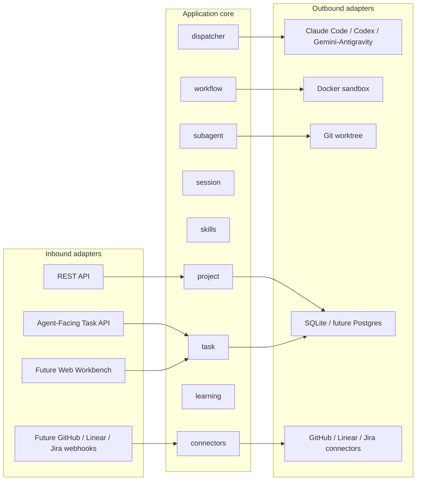

關鍵資料流：

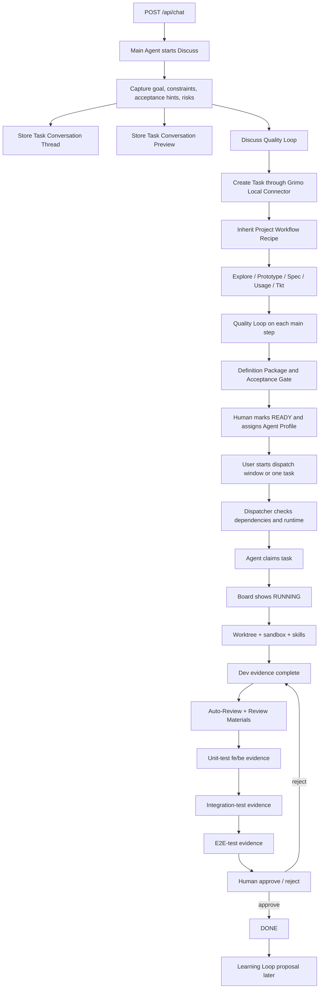

## 8. 決策日誌

| # | 決策 | 理由 | 被拒絕的替代方案 |
| --- | --- | --- | --- |
| D1 | 對使用者定位為 **AI 開發工作台**，工程定義為 **Local Agent Control Plane** | 現有程式已有 Project / Task / Session / Subagent / Credential / Execution tables；市場也從 chat 轉向 issue/task 指派給 AI agents。 | 繼續稱「CLI user harness」作為主定位；太窄且不符合現有產品形狀。 |
| D2 | Chat 是 Discuss phase；建 Task，不直接執行 | 主代理硬性唯讀很難完整做到；先透過 chat 把原始想法問清楚，再把寫入工作沉澱成 Task，最後由人類確認 Ready，是更可驗收的行為。 | Chat 直接改檔；安全與責任邊界不清。 |
| D2.1 | 每個 Task 保存完整 Task Conversation Thread，列表只顯示 preview | 使用者點開 Task 的 Chat 應能回看完整討論、附件、引用檔案和外部連結；但 board/list 需要快速掃描，所以只顯示最近幾則、重點摘要、未決問題和附件數。這接近 GitHub issue comments 的心智模型，但 Grimo 仍以 Task 狀態、Definition Package、Quality Gate 和 Review Materials 管理 AI 工作。 | 只保存 provider chat transcript；會失去本地正本與跨入口一致性。列表直接顯示完整對話；會讓 Task Management Interface 變成聊天紀錄牆。只保存摘要；會讓使用者無法回溯決策與附件。 |
| D3 | MVP 以人類確認 Ready Task 加手動 dispatch window 作為 AI 可執行邊界 | 保留 AI 自主領任務的效率，同時避免未確認想法或背景常駐自動改 repo；READY 表示可排程，真正自動派工要由使用者手動啟動一段 dispatch window。 | 每個 action 都問；回到 approval fatigue。READY 後 24 小時常駐自動執行；太早且信任邊界不清。 |
| D4 | MVP 人工指定 Agent Profile 為主 | 指派給「Backend Engineer」「Code Reviewer」比指派給 provider 更符合工作台語言；MVP 先人工指定降低錯派風險。 | 全自動排程；需要成熟 skill matching / complexity routing。 |
| D5 | Agent Profile 必須薄 | 對 AI 有用的是 skills、recipe、task context、project docs；profile 主要給人類理解和指派。 | 厚 AI coworker profile（獨立 inbox、日程、長期人格）；太像 Helio workforce，超出 MVP。 |
| D5.1 | Skill 開發流由 Workflow Recipe 和 Agent Profile 承接 | 使用者想要 Grimo 最終整合目前手動的 skill 開發流，讓 PM、Architect、Frontend、Backend、QA、Release 類角色各司其職。產品上，使用者只需要建立 Project、選 workflow、補決策、啟動 dispatch、審查 Review Materials；技術上，Workflow Recipe 定義 steps，Agent Profile 綁定 skills / runtime / assignment rules，Quality Loop 負責品管。 | 讓使用者每次手動選 skill、切角色、記品質步驟；會把 Grimo 退回 prompt / skill launcher。把角色做成厚 AI coworker；會超出 MVP 並模糊 workflow source of truth。 |
| D6 | MVP Project 預設 Coding Task Recipe | 現有程式已靠近 worktree + Docker + diff review；coding recipe 最能落地。Recipe 涵蓋 Discuss / Explore / Prototype / Spec / Usage / Tkt / Dev / Auto-Review / Unit-test fe/be / Integration-test / E2E-test / Release；需要收尾時，結果保存成 DONE task 的 Release evidence。其中 Discuss 由 chat 高頻互動與研究分析完成，其餘主要 step 由 Pollack Agent Workflow 控制並通過自動 Quality Loop，確保 Task 不是單純待辦卡。這是 Project 層級選定的第一個開發工作流，不要求每張 Task 選 workflow。 | Full SDD Release Recipe；價值大但範圍太大。只做 Dev/Review/Release；會缺少需求定義與品質驅動的前段證據。Task 建立時選 workflow；太複雜且干擾記錄工作。 |
| D7 | RUNNING 完成 Quality Gate evidence 後才進產品狀態 REVIEW | 設計品質與完整落實不能只靠最後看 diff；coding recipe 先以 Discuss / Explore / Prototype / Spec / Usage / Tkt 形成 Definition Package，RUNNING detail 需完成 Dev、Auto-Review、Unit-test fe/be、Integration-test、E2E-test、Quality Loop 與 Project/Task Quality Gate evidence，才進產品狀態 REVIEW 等待人類 approve/reject。其他 Project workflow 也需依自己的 recipe steps 形成 Definition Package 與 evidence。各主要 step 內部的 sub-Review / sub-Rating / sub-Fix 屬於自動 Quality Loop，不等於產品狀態 REVIEW。 | 寫完 code 就進人類 review；會讓測試責任落到 reviewer 身上。把內部 Review 子流程和產品 REVIEW gate 混在一起；會讓狀態語意混亂。 |
| D8 | Implementer Retro 與 Reviewer Agent 分離 | 實作 AI 在 context 尚未清空前產生 retro；另一個 reviewer agent 審 step output / diff / tests / task / retro，避免自己審自己。 | 同一 AI 自己 review；容易漏掉同樣盲點。 |
| D9 | Quality Loop 不通過時自動 review / rating / fix | 每個主要 workflow step 都有自動 Quality Loop；未達 `quality_score > 9` 時，系統依 reviewer findings 自動 fix，再重新 review / rating，直到通過或碰到停止條件。 | 每步只自動 fix 一次；可能太早停下，無法體現品質驅動流程。無限制重試；資源與信任風險高。 |
| D10 | 人類在 REVIEW approve 完整審查資料 | 使用者需要看到 Definition Package 如何形成、每個 execution step 如何過關、AI 怎麼做、怎麼自檢、怎麼被審、修過什麼，而不只是 diff；通過後若需要收尾，cleanup 和 summary 保存為 DONE task 的 Release evidence。 | Release 後才 approve 一包交付物；會和 REVIEW 職責重疊。 |
| D11 | Release short retro 與 Learning Loop 都只提案，不自動套用 | Release 只在單筆任務需要收尾時提醒是否優化流程；Learning Loop 從多筆任務找模式。兩者都保留人類控制，避免技能或流程漂移。 | 自動更新 skills / recipes；信任風險高。 |
| D12 | MVP connector 先 Grimo local | 核心工作流不應被 GitHub / Linear OAuth、webhook、sync conflict 阻塞。 | MVP 就接 GitHub / Linear；範圍過大。 |
| D13 | Work Item Connector 未來需雙向同步 title/body/source/labels/assignee/status/執行結果 | Grimo Task 和外部 issue 是同一件工作的不同呈現，要保持一致；source 記錄任務來自 manual、chat、Slack、Telegram、Line、Codex、GitHub、Linear 或 Jira 等入口，讓 provenance、audit 和 connector sync 可追溯。source 是系統欄位，不是手動 Create Task 表單選項；手動建立固定為 `manual`。 | 只留言 postback；會讓內外狀態分裂。Task 沒有 source；會讓多入口任務難以回溯。 |
| D14 | 主代理在主機執行，正式寫入走 subagent sandbox | 寫 code 的可靠路徑是 Task/subagent/worktree；主代理負責對話、討論、規劃與建立 Task。 | 主代理也容器化；認證和 latency 成本高。 |
| D16 | Agent Client / provider adapter 視為高變動依賴 | Grimo 應擁有自己的 Task / Session / Recipe / Execution / Evidence 模型；provider 與 agent client libraries 只是 adapter，版本與 namespace 變動不應改變產品核心。 | 把產品核心綁死在單一 provider、agent-client API 或 Spring AI runtime。 |
| D17 | Grimo 也可作為 Agent-Facing Task System | Codex / Claude Code 可以像接 Linear issue 一樣接 Grimo Ready Task；但 Workflow Recipe、Quality Loop、Review Materials、Release evidence 與 connector sync 仍由 Grimo 管。 | 只把 Grimo 做成主動 launch subagent 的工具；會限制未來接不同 runtime 與背景 worker。 |
| D18 | Dispatcher 是 Ready Task 到 Agent Claim 的守門元件 | Hermes Agent 參考設計顯示 READY 與 IN PROGRESS 中間需要 dispatcher tick；Grimo 也需要檢查 dependencies、assignment 與 runtime availability，避免 READY 直接等於執行。Dispatcher 只在使用者手動開啟 dispatch window 或手動開始單一 Task 時運作，不做 24 小時常駐自動派工。 | 使用者一按 READY 就直接啟動 worker；會跳過依賴與派工檢查。READY 後背景常駐自動跑；會模糊使用者控制感。 |
| D19 | 對使用者維持 Task 工作台，內部 execution 以 Pollack Agent Workflow 為主 | 一般使用者不需要理解底層 workflow engine；產品畫面維持 Task、狀態、Review Materials 與 dispatcher。內部需要更縝密的 workflow semantics，因此 Workflow Recipe 應映射到 Pollack `Workflow` / `Step` / `Gate` / `StepRunner`；每個 recipe step 下方都以自動 sub-Review -> sub-Rating -> sub-Fix 作為 Quality Loop，通過 `quality_score > 9` 才進下一步，並使用 checkpoint、trace、Agent Client、Agent Sandbox、Agent Judge 等 AgentWorks 套件。Coding recipe 的 Discuss / Explore / Prototype / Spec / Usage / Tkt / Dev / Auto-Review / Unit-test fe/be / Integration-test / E2E-test / Release 是第一個落地案例；Release evidence 屬於 DONE task detail。 | 把產品改成 Pollack Workflow console；會讓使用者直接面對 Step/Gate/Runner 等工程概念。只把 Pollack 當 adapter；無法充分利用 Agent Workflow 的 durable execution 與 quality gates。 |
| D20 | Quality Loop 是主要 workflow step 的自動子流程 | 使用者應該理解 Task 卡在某個 recipe-defined 主要流程節點，而不是被 sub-Review / sub-Rating / sub-Fix 的內部迴圈打散。內部 trace 仍需保存子流程狀態、評分、review findings 與 fix attempt；子流程會自動循環直到通過或碰到停止條件。 | 把 sub-Review / sub-Rating / sub-Fix 攤平成頂層 workflow steps；會讓 Task 進度難讀，且弱化主要 recipe step 的語意。手動觸發每次 fix；會破壞品質循環的自動化價值。 |
| D21 | 主要 workflow step 通過品質門檻後自動前進 | 每個 Workflow Recipe 定義的主要 step 都由 workflow 控制；當該 step 的 Quality Loop 通過 `quality_score > 9` 後，自動進下一個主要 step。人類確認只保留在產品 gate，例如 Definition Package 轉 READY、REVIEW approve/reject，或高風險操作。 | 每個 step 都要求人類按確認；會造成 approval fatigue，也破壞 workflow 自動化價值。完全取消人工 gate；會讓 READY 與 Review approval 的責任邊界不清。 |
| D22 | Pollack storage surface 以 SQLite POC 分層處理 | Grimo 需要 local-first workflow evidence；ADR-001 已接受 SQLite 作為 MVP local persistence path，並確認 Pollack `workflow-batch` 的 checkpoint / trace 可走 SQLite。 | 把整個 Pollack stack 都當成 DB framework；會製造不必要的實作量。只用 H2；無法符合 local-first 方向。 |
| D23 | 使用者電腦環境不可預設滿足所有 runtime 要求 | Grimo 是本地產品，必須把 Java / Docker / git / CLI provider / model login / native library / filesystem / port 等環境差異視為產品設計輸入。MVP 需要 capability detection、preflight diagnostics、fallback 與 `BLOCKED / NEEDS_HUMAN` 狀態，讓使用者知道缺什麼、怎麼補、哪些任務仍可繼續。 | 把完整環境列為硬性安裝前提；會讓產品在真實使用者電腦上脆弱。全部包進 heavy VM/container；會增加安裝、認證、效能與本地 CLI 整合成本。 |
| D24 | Grimo local store 是 workflow evidence 的正本 | Local-first 案例強調速度、離線、可持續性、隱私與所有權；Grimo 應把 Task、Task Conversation Thread、attachments metadata、Definition Package、workflow trace、quality scores、review materials、fix history、Release evidence 與 learning proposals 保存在使用者可掌握的本地 store。外部 issue tracker、雲端同步和 agent provider session 都應視為 projection / execution channel。 | 以雲端 SaaS 或外部 issue tracker 作正本；會讓使用者在斷網、帳號停權、服務關閉或 provider session 遺失時失去自己的 workflow history。只存 provider chat transcript；無法形成可審查、可備份、可遷移的產品資料。 |
| D25 | MVP 不承諾 full local-first sync engine | Grimo MVP 先把 single-user local store、workflow evidence、export/backup、connector projection 做穩；跨裝置或多人即時協作放入後續 spec。 | 一開始就做 CRDT / OT 多端同步；風險高且會拖慢核心 Task Workflow。假裝只要加一個 sync library 就完成；會低估 domain-specific conflict 與權限問題。 |
| D26 | MVP Project 代表一個本機 repo / codebase | Worktree、sandbox、test commands、Project Quality Gate 和 evidence path 都天然綁定 repo；MVP 先讓 Project 邊界清楚。 | Project 代表多 repo product workspace；未來可做，但會讓第一版 execution path 和品質門檻複雜化。 |
| D27 | Task 是使用者層級的一件工作 | 使用者追蹤的是「這件工作完成了沒」；底層 recipe steps、Quality Loop、CLAIMED / DEV / Auto-Review / Unit-test fe/be / Integration-test / E2E-test / Release evidence 是 Task detail evidence。新增 Task 的可見表單只捕捉 title、body、labels；source 由系統自動標註，workflow 由 Project 層級設定繼承。 | 把 workflow step 也稱為 Task；會讓 board 變成 workflow console，使用者需要理解太多內部環節。讓 Task 建立時選 workflow；會把記錄工作變成流程配置。讓使用者在手動建立時選 source；會暴露系統 provenance 細節。 |
| D28 | Board 顯示簡化 Task State Machine | BACKLOG / DEFINING / READY / RUNNING / REVIEW / DONE / BLOCKED 是跨 Project workflow 的外層狀態機，足以回答進度和是否需要人類介入；細節頁依 State Workflow / Workflow Recipe 顯示開發、研究、分析、行銷、影片製作等專業步驟、Quality Loop 和 evidence。 | 把 Discuss / Explore / Prototype / Spec / Usage / Tkt / Dev / Auto-Review / Unit-test fe/be / Integration-test / E2E-test / Release 或其他領域步驟都當 board columns；會讓進度難讀，也把 coding recipe 誤當成所有任務的固定流程。 |
| D29 | REVIEW 代表等待人類 approve / reject | REVIEW 只在 Auto-Review、Quality Loop、必要 verification evidence 和 Review Materials 完成後出現，讓 REVIEW 欄等同於人類待審工作。 | 把 AI reviewer 正在跑、自動 fix 中和人類 review 都混在 REVIEW；會讓使用者不知道是否該介入。 |
| D30 | Project onboarding 先 Product Definition，再 Project Planning | 先定義要做什麼、目標使用者、核心價值、MVP 範圍和成功條件，再設計架構、standards、QA strategy 和 Project Quality Gate。 | 建立 Project 後直接做 architecture；容易在產品方向未明時過早設計。 |
| D31 | 已有 PRD 時 Product Definition Task 轉成 Product Definition Review | 對既有 Project 不必從零重寫產品方向，但要檢查定位、補 glossary、更新 open questions，確保 planning-project 不基於過時 PRD。 | 有 PRD 就跳過產品定義；可能把模糊或過時方向直接帶進架構。 |
| D32 | Project Quality Gate 是 planning-project 必產物 | 合格線應在 Project 設計階段依 repo/codebase 型態與最佳實踐定義 baseline，Task / Spec 再挑選、補充或覆寫。 | 每個 Task 臨場決定測試和 evidence；會造成標準不一致。固定所有 coding task 都跑同一套測試；不符合前端、後端、全端、docs/config 等差異。 |
| D33 | Workflow Recipe 在 Project 層級選擇，Task 不選 workflow | MVP 定位仍是 AI 開發工作台，coding workflow 要做深；Project-level Workflow Recipe / Agent Profile / Skills 保留 research、analysis、marketing、video production、finance 等未來角色。這些 Project workflow 共用 Task State Machine、Ready Gate、Dispatcher、Review Materials 和 Quality Loop，但各自定義不同 State Workflow / Workflow Recipe steps。 | MVP 直接泛化成 AI workspace；會跟 Helio 類產品正面撞，也稀釋第一版交付。把模型寫死 coding-only；會封死未來角色擴展。讓每張 Task 選 Task Type / Workflow Recipe；會增加新增任務摩擦，也和 GitHub issue 的輕量建立模式不符。 |
| D34 | Agent Profile 是薄角色模型，可人類可讀但不是厚 AI coworker | 使用者可以指派給 Architect、Backend Engineer、Code Reviewer 等角色，但本質是 runtime、skills、rules，不是有 inbox、人格、行事曆的 AI 同事。 | 做厚 AI teammate；範圍會擴張到 general workforce。只顯示 provider/runtime；對使用者不夠可讀。 |
| D35 | 外部入口不能直接 READY | Codex / Claude Code 類入口可像 Linear issue entry 一樣建立或推進 Grimo Task，但 READY 必須經 Grimo Ready Gate 人類確認。 | 外部 client 直接塞 READY work 給 agent 跑；會繞過 Definition Package 和 Quality Gate。 |
| D36 | Follow-up Task 只建立待確認工作 | Agent 可在執行或審查時提出帶來源、理由和 priority 的 Follow-up Task，但只能進 BACKLOG / DEFINING，不能自動執行。 | Agent 發現新工作就直接開工；容易產生 scope creep 和 backlog 噪音。 |
| D37 | Dispatch Window 是有期限的手動自動化窗口 | READY 任務都可被排程，但使用者必須明確開啟一段 dispatch window，才能讓 Dispatcher 自動領 READY 任務。MVP UI 應提供「執行 1 小時」「執行到明早 8 點」「只跑選取任務」等有邊界的選項，並顯示剩餘時間、正在排隊的 READY 任務、並行數、目前 claims 與停止控制。Window 到期後不再 claim 新任務；已 RUNNING 任務不硬殺，會執行到結束。 | 永久自動執行 toggle；使用者容易忘記背景自動化還在跑。到期硬殺 running task；會破壞 worktree、測試與 evidence。只允許單筆手動開始；會失去夜間或批次執行的效率。 |

## 9. 研究參考索引

PRD 只保留產品結論；研究細節放在 reference notes，需要時再讀：

- Local-first 產品精神、sync 邊界與來源整理：`docs/grimo/references/local-first.md`
- Pollack AgentWorks 套件角色、Workflow DSL 與 BOM 研究：`docs/grimo/references/agentworks.md`
- 市場與產品參考：`docs/grimo/references/product-landscape.md`
- 業務領域模型、DTO、資料表與 read model 草稿：`docs/grimo/domain-model.md`
- SQLite 選型與 Pollack workflow-batch 驗證：`docs/grimo/adr/ADR-001-pollack-workflow-sqlite-poc.md`

## 10. 風險登錄

| # | 風險 | 可能性 | 衝擊 | 緩解 |
| --- | --- | --- | --- | --- |
| R1 | PRD 從 CLI harness 轉成 Workbench 後，現有 roadmap 與 architecture 部分過時 | 高 | 高 | 以本 PRD 為新 source of truth；後續 `/planning-project` 同步 architecture / roadmap。 |
| R2 | Coding Task Recipe 需要保存 step outputs、quality scores、fix history，現有 `grimo_task_execution` 欄位不足 | 高 | 中 | 新 spec 設計 `workflow_step_execution` 或 JSON step output schema。 |
| R3 | RUNNING 必須補齊 Quality Gate evidence，任務時間增加 | 中 | 中 | MVP 要求依 Project/Task Quality Gate 保存 verification evidence 或不適用理由；Reviewer 只審證據與品質，不負責補做測試。 |
| R4 | Agent Profile 容易長成厚 AI coworker | 中 | 中 | PRD 明確限制 profile 很薄；能力放 skills / recipes。 |
| R5 | 外部 connector 雙向同步很複雜 | 高 | 中 | MVP 只做 Grimo local；connector 單獨規劃，Sync Conflict 必須停下等人。 |
| R6 | Provider 生態快速變動（Gemini -> Antigravity、Agent Client namespace 遷移） | 高 | 中 | 核心依賴 Grimo 自己的 Task/Recipe/Execution 模型；provider 僅 adapter；Agent Client / Sandbox 版本由 AgentWorks BOM 管理。 |
| R7 | 主代理未硬性唯讀，可能直接改檔 | 中 | 中 | 文件與 prompt 要求主代理轉 Task；正式寫入路徑只承認 Task/subagent/review result/Release evidence。未來可另規劃 guard。 |
| R8 | 外部 agent worker 接任務後繞過 Grimo workflow | 中 | 高 | Agent-Facing Task API 只接受 Definition Package + execution step-based 回報；未回報 quality score / fix history / review result 的任務不能 DONE。 |
| R9 | Task Board 太早變成 UI 重心 | 中 | 中 | MVP 先把 Task status、dependencies、dispatcher、events、worker log、run history 做成領域能力；看板是這些資料的投影，不是第一個核心交付。 |
| R10 | AgentWorks BOM 文件、Maven metadata 與 published BOM POM 不一致 | 中 | 中 | `/planning-project` 固定版本策略；每次新增 Pollack dependency 都先跑 Gradle resolution。預設省略版本使用 BOM；若 BOM 指到不存在 artifact，才用明確 released version 並在 ADR 記錄原因。 |
| R11 | 使用者電腦缺少必要 runtime 或權限，導致 Task 執行失敗 | 高 | 高 | 設計 Environment Capability Registry 與 preflight checks；READY -> CLAIMED 前檢查 Java、git、Docker、provider CLI、登入狀態、filesystem、SQLite/native access、port availability。缺失時 Task 進 `BLOCKED / NEEDS_HUMAN` 並顯示修復指引。 |
| R12 | 外部 connector 或 provider session 被誤當 workflow evidence 正本 | 中 | 高 | Grimo domain model 必須保存本地正本；connector sync、provider transcript、PR comment 都只是 projection。離線時至少可讀取既有任務、review materials、trace、summary 與 learning proposals。 |
| R13 | 過早承諾跨裝置 / 多人 local-first sync | 中 | 高 | MVP 明確限定為 single-user local-first + connector projection。若未來要同步，先設計 operation log、conflict policy、partial sync、schema migration、permission model 與 audit story，再選 CRDT / OT / sync engine。 |

## 11. 成功指標（post-MVP）

- **Task conversion:** chat 中被判定為 executable work 的訊息，≥ 80% 能建立可讀 Task。
- **Ready-to-execution latency:** 使用者啟動 dispatch window 或手動開始 READY Task 後，agent claim 到開始執行的中位時間 ≤ 30 秒。
- **Project quality readiness:** 每個完成 Project Planning Task 的 Project 都有 architecture、development standards、QA strategy 和 Project Quality Gate。
- **Definition completeness:** 每個 Ready Task 都有 Definition Package：Spec、Usage stories、ticketized Tasks、限制、成功條件、風險與 Task/Spec Acceptance Gate。
- **Dev verification completeness:** 每個進入 REVIEW 的 Task 都有對應 Project/Task Quality Gate 的 verification evidence 或明確不適用理由。
- **Step quality completeness:** 每個完成的 Coding Task 都有每個 execution step 的 output、quality_score、review findings、fix history（如有）。
- **Role/skill fit:** 每個進入 RUNNING 的 Coding Task 都能回看 assigned Agent Profile、投影的 skills / MCP servers，以及它們對應的 workflow step。
- **Review materials completeness:** 每個進入 REVIEW 的 Coding Task 都有 Definition Package、diff、Quality Gate evidence、retro、review result、fix history（如有）。
- **Execution trace completeness:** 每個完成的 Coding Task 都能回看 task events、worker log、run history、dependencies。
- **Release retro completeness:** 每個 DONE task 若需要收尾，都有 Release short retro，並標記是否建議優化 skill / workflow recipe。
- **Reviewer usefulness:** 人類在 approve 前至少查看 reviewer result 的比例 ≥ 70%。
- **Learning proposal acceptance:** 每 30 天至少 1 個 Learning Loop proposal 被接受。
- **Local-first reliability:** 沒有 GitHub/Linear/Jira connector 的 Project 也能完整跑通 Coding Task Recipe。
- **Environment diagnosability:** 當使用者電腦缺 Docker、CLI login、filesystem permission、SQLite native access 或 port availability 時，Grimo 能在任務執行前顯示明確 blocked reason 與修復提示。
- **Local ownership:** 斷網或外部 issue tracker / provider 不可用時，使用者仍能開啟既有 Project、Task、Definition Package、workflow evidence、Review Materials 與 Release evidence。

## 12. 開放問題

1. `TaskStatus` 採用 board-facing `BACKLOG / DEFINING / READY / RUNNING / REVIEW / DONE / BLOCKED`，並用 execution detail 表示 `CLAIMED / DEV / NEEDS_HUMAN / REJECTED / ARCHIVED / CONFLICT`；Release evidence 是 DONE task detail，不是 TaskStatus。
2. Dispatch Window 已決定為 time-boxed manual automation window，可設定並行數；到期後不再 claim 新任務，已 RUNNING 任務執行到結束。仍需設計預設時間長度、夜間排程 UI、並行數預設值與停止控制細節。
3. `Agent Profile` 是否需要資料表，或先以 config / skill bundle 表示？
4. Project-level `Workflow Recipe` 的格式：YAML、JSON、DB rows，或 skills directory 下的 recipe file？
5. Project Quality Gate 應主要寫在 `docs/grimo/qa-strategy.md`、`docs/grimo/development-standards.md`，還是獨立 `quality-gates.md`？
6. `Quality Loop` 的 rubrics 與 `quality_score > 9/10` 門檻是否每個 execution step 可 override？
7. `Review Materials` 是動態聚合 view、獨立 tables，還是 JSON document？
8. Reviewer Agent 使用同 provider 還是不同 provider？
9. Learning Loop agent CLI 的排程方式：cron、app scheduler、手動 trigger？
10. Grimo local connector 的 API 是否先抽成 `WorkItemConnectorPort`，即使只有一個本地實作？
11. 外部 assignee 同步如何拆 human owner / AI contributor？
12. Agent-Facing Task API 是否先做本機 REST，或直接做 MCP / CLI connector？
13. Future sync 若進入 scope，要採 CRDT、OT、append-only operation log、SQLite replication，還是 server-mediated connector sync？哪些 Grimo entities 可以自動 merge，哪些必須 human conflict resolution？
14. Task dependencies 是只有 parent/child DAG，還是要支援 typed dependency（blocks、reviews、fixes、verifies）？
15. `Source` 應先用固定 enum（manual、chat、slack、telegram、line、codex、github_issue、linear_issue、jira_issue、agent_proposed、api）還是 connector-defined source type？

---

*詞彙表請見 `docs/grimo/glossary.md`。此 PRD 使用的 Product Language 以 glossary 為準。*
