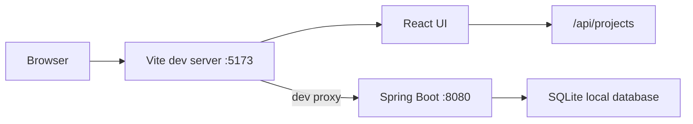
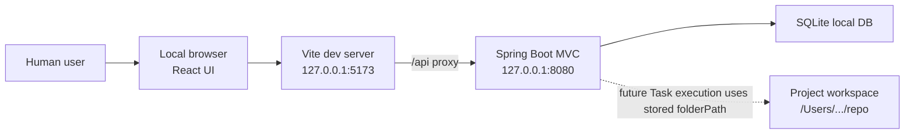
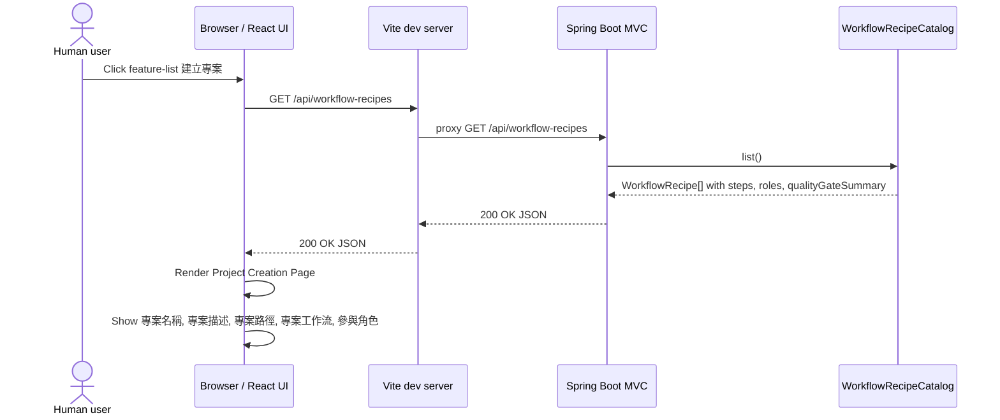
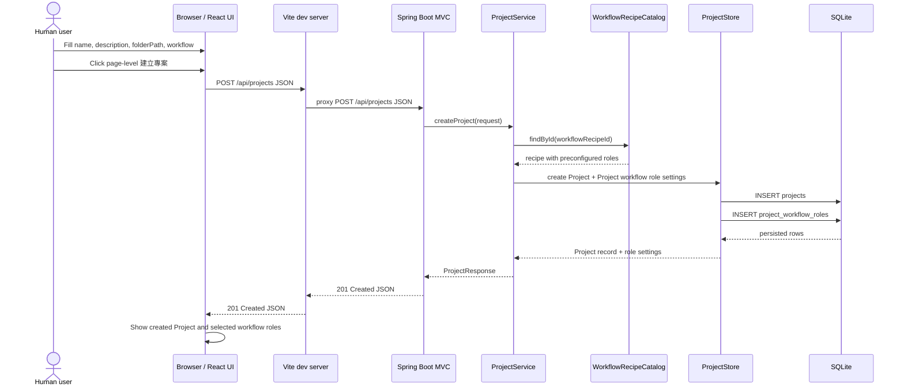

# Grimo Architecture

**Status:** Living architecture baseline through S002 planning  
**Last updated:** 2026-06-01

## State At Planning

Repo 目前已有兩個可獨立啟動的 POC surface：

| Surface | Current state | Evidence |
| --- | --- | --- |
| `frontend/` | React + Vite UI POC，已有 Task workbench、Projects、Workflow、Playwright visual snapshots | `frontend/package.json`、`frontend/src/features/*`、`frontend/e2e/task-workbench.visual.spec.ts` |
| `backend/` | Spring Boot skeleton，已有 Pollack AgentWorks / SQLite POC tests，但尚未有 production REST API | `backend/build.gradle.kts`、`backend/src/main/java/io/github/samzhu/grimo/GrimoApplication.java`、`backend/src/test/java/io/github/samzhu/grimo/poc/*` |
| `scripts/verify-release.sh` | 目前 release gate 主要跑 frontend build 與 visual regression | `scripts/verify-release.sh` |

缺口：

- backend 尚未提供 `Project` REST API。
- frontend `Projects` view 仍是 fixture / local UI，不會呼叫 backend。
- `docs/grimo/specs/spec-roadmap.md` 尚未存在；S001 會建立第一個可實作 spec。

## Packaging And Development Target

S001 採用前後端分別啟動，方便開發環境測試：



開發期：

- Frontend: `npm --prefix frontend run dev`
- Backend: `cd backend && ./gradlew bootRun`
- API calls: frontend 使用相對路徑 `/api/...`，由 Vite `server.proxy` 轉到 backend。

未決：

- Production packaging 尚未決定，不在 S001 內解決。
- Spring Boot serve frontend build、desktop installer、container image 都保留給後續 spec。

## arc42 Runtime And Environment View — Project Creation

arc42 的 runtime view 用具體情境描述 building blocks 在執行時如何互動；deployment view 則補足需要知道的基礎設施與環境節點。S002 只需要描述 Project Creation 的開發期本機 runtime，不決定 production packaging。

### Environment Nodes



Runtime facts for S002:

- Grimo is executed locally; the browser is only the human operator UI.
- Frontend and backend are still started separately in development.
- `POST /api/projects.folderPath` is the authoritative workspace path string.
- After Spring Boot receives `folderPath`, backend-owned features can operate that local workspace in later specs.
- S002 stores `folderPath` as data only; it does not run shell commands, inspect the repo, or start agent execution.
- No Electron, Tauri, native desktop shell, or OS-level file chooser bridge is assumed in S002.

### Runtime Scenario: Enter Project Creation Page



### Runtime Scenario: Submit Project Creation



## Module Map

| Module | Responsibility | Rule |
| --- | --- | --- |
| `frontend/src/features/projects` | Project list、Project create form、current project selection UI | 不直接寫 fixture 作為真狀態；透過 frontend API client 呼叫 backend。 |
| `frontend/src/domain/project` | Project frontend type、request/response shape、workflow recipe labels | 對齊 backend API 欄位名稱。 |
| `frontend/src/shared/api` | Thin fetch client | 只處理 HTTP request/response 與 user-readable error，不放 domain rule。 |
| `backend/src/main/java/io/github/samzhu/grimo/project` | Project domain、repository、service、REST controller | 第一個 production backend package。 |
| `backend/src/main/resources` | SQLite datasource、schema migration 設定 | 本地 DB path 必須可覆寫，測試不得碰使用者真資料。 |

## Framework Dependency Table

| Package | Version | Primary import / module | Verified |
| --- | --- | --- | --- |
| Java | 25 | Gradle toolchain `JavaLanguageVersion.of(25)` | build file |
| Spring Boot Gradle plugin | 4.0.6 | `org.springframework.boot` | build file + official docs |
| Spring dependency management plugin | 1.1.7 | `io.spring.dependency-management` | build file |
| Spring Web MVC | managed by Spring Boot 4.0.6 | `org.springframework.boot:spring-boot-starter-webmvc`, `org.springframework.web.bind.annotation.RestController` | official Spring Boot 4 migration / web docs |
| Spring Web MVC Test | managed by Spring Boot 4.0.6 | `org.springframework.boot:spring-boot-starter-webmvc-test`, `org.springframework.boot.webmvc.test.autoconfigure.WebMvcTest` | official Spring Boot 4 testing docs |
| Spring Validation | managed by Spring Boot 4.0.6 | `jakarta.validation.Valid`, `jakarta.validation.constraints.*` | official Spring MVC validation docs |
| Spring Data JDBC | managed by Spring Boot 4.0.6 | `org.springframework.boot:spring-boot-starter-data-jdbc`, `org.springframework.data.repository.CrudRepository` | official Spring Boot SQL docs + Spring Data Relational docs; SQLite requires custom dialect validation |
| Spring JDBC | managed by Spring Boot 4.0.6 | `org.springframework.jdbc.core.simple.JdbcClient`, `NamedParameterJdbcTemplate` | official Spring Boot SQL docs |
| SQLite JDBC | managed by Spring Boot; POC resolved `3.50.3.0` | `org.xerial:sqlite-jdbc` | ADR-001 POC |
| AgentWorks BOM | 1.0.12 | `io.github.markpollack:agentworks-bom` | ADR-001 POC |
| React | 19.2.6 | `react` | `frontend/package.json` |
| React DOM | 19.2.6 | `react-dom` | `frontend/package.json` |
| TypeScript | 6.0.3 | `typescript` | `frontend/package.json` |
| Vite | 8.0.14 | `defineConfig` from `vite`; Node engine `^20.19.0 || >=22.12.0` | `frontend/package.json` + npm registry + official Vite docs |
| Playwright | 1.60.0 | `@playwright/test` | `frontend/package.json` |

## Key Architecture Decisions

### A001 — Frontend And Backend Run Separately During Development

Decision: S001 uses separate Vite and Spring Boot dev servers. Vite proxies `/api` to Spring Boot.

Reason:

- Matches the user-confirmed development need: independently start frontend and backend for fast testing.
- Keeps Vite HMR and existing Playwright visual gate intact.
- Avoids premature production packaging decisions.

### A002 — Project Is Backend-Owned

Decision: `Project` is created through backend API and stored in the local backend store. Frontend state reflects backend responses.

Reason:

- PRD says Project owns Task, workflow recipe and evidence.
- Local-first references say Grimo local store is the source of truth.
- A frontend-only project list would not prove the first full-stack capability.

### A002a — SQLite Persistence Should Avoid Premature ORM Coupling

Decision: S001 should target SQLite through Spring's JDBC stack. Spring Data JDBC repositories are desirable only if a POC confirms the required SQLite `JdbcDialect`; otherwise use Spring JDBC / `JdbcClient` for the first Project table.

Reason:

- ADR-001 accepted SQLite and Xerial JDBC for local-first persistence.
- Spring Data Relational 4.0 docs list direct Spring Data JDBC dialect support for DB2, H2, HSQLDB, MariaDB, Microsoft SQL Server, MySQL, Oracle and PostgreSQL; SQLite is not listed.
- The same docs state that unsupported databases need a `JdbcDialect` implementation, otherwise the application will not start.

### A003 — Workflow Recipe Selection Is Project-Level

Decision: S001 exposes workflow selection while creating Project; Task creation does not select workflow.

Reason:

- PRD and glossary define `Workflow Recipe` as Project-level.
- `Task` inherits Project workflow; this prevents recipe chips from leaking into Task labels.

## API Shape Baseline

S001 introduces:

```http
GET /api/workflow-recipes
GET /api/projects
POST /api/projects
```

`POST /api/projects` creates a Project and returns the created row, including `id`, `name`, `description`, `folderPath`, `workflowRecipeId`, `workflowRecipeName`, `status`, `createdAt`, and `updatedAt`.

## QA Baseline

S001 must extend verification beyond frontend-only checks:

- backend unit/API tests run through Gradle.
- frontend build and Playwright tests continue through npm.
- full-stack Project creation needs a browser test that exercises real Vite -> backend API wiring.

The canonical strategy lives in `docs/grimo/qa-strategy.md`.
