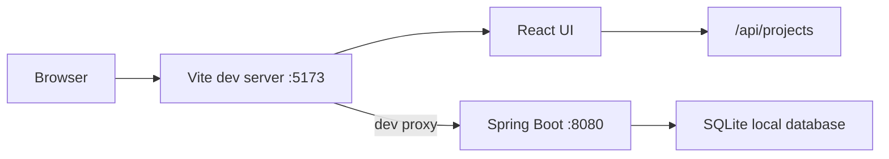
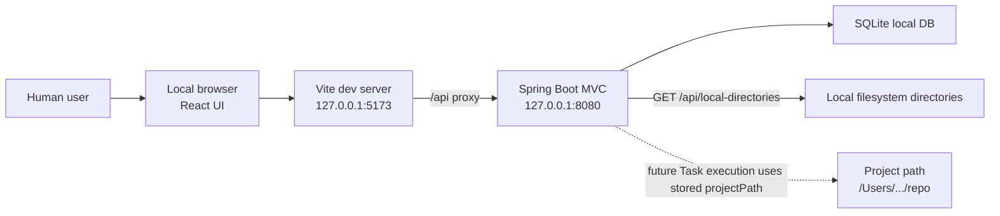
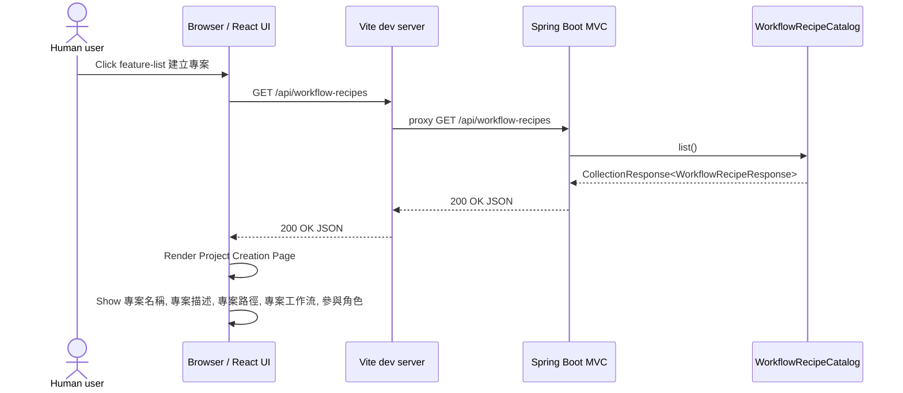
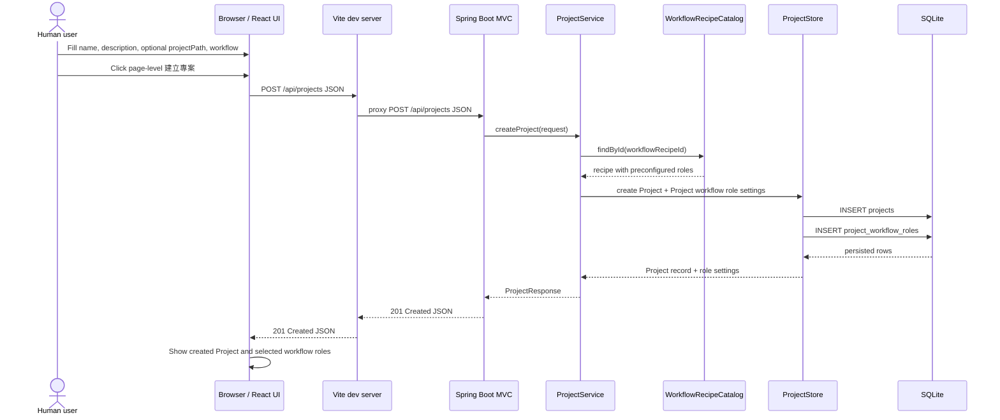
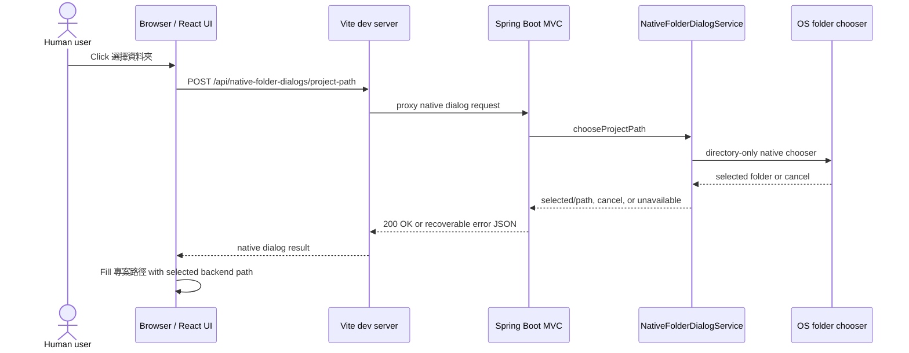

# Grimo Architecture

**Status:** Living architecture baseline through S013 implementation, with S014 target path-picker design
**Last updated:** 2026-06-13

## Current Architecture Snapshot

Repo 目前已有兩個可獨立啟動的 local development surface：

| Surface | Current state | Evidence |
| --- | --- | --- |
| `frontend/` | React + Vite UI，已有 Project/Task board 入口、Project creation 和 deterministic Playwright visual/full-stack checks | `frontend/package.json`、`frontend/src/features/*`、`frontend/e2e/*` |
| `backend/` | Spring Boot MVC backend，已有 Project、Task、Workflow Recipe、Task Workflow evidence REST/storage | `backend/build.gradle.kts`、`backend/src/main/java/io/github/samzhu/grimo/*`、`backend/src/test/java/io/github/samzhu/grimo/*` |
| `scripts/verify-release.sh` | release gate 會跑 frontend build、visual regression、backend Gradle tests、S001/S002/S003/S004 full-stack checks，並標出 S009 workflow evidence tests | `scripts/verify-release.sh`、`temp/verify-release.log` |

缺口：

- Ready Gate / Dispatch Window / Review Materials 尚未實作。
- Workflow runner 尚未實作；S009 只提供 Task Workflow copy、first Chat transition storage、summary projection 和 read-only detail API。
- Production packaging 尚未決定。

## Packaging And Development Target

S001 採用前後端分別啟動，方便開發環境測試：



開發期：

- Frontend: `npm --prefix frontend run dev`
- Backend: `cd backend && ./gradlew bootRun`
- API calls: frontend 使用相對路徑 `/api/...`，由 Vite `server.proxy` 轉到 backend。

未決：

- Production packaging 尚未決定，不在 S001 內解決。
- Spring Boot serve frontend build、desktop installer、container image 都保留給後續 spec。

## arc42 Runtime And Environment View — Project Creation

arc42 的 runtime view 用具體情境描述 building blocks 在執行時如何互動；deployment view 則補足需要知道的基礎設施與環境節點。S002 只需要描述 Project Creation 的開發期本機 runtime，不決定 production packaging。

### Environment Nodes



Runtime facts through S009 shipping:

- Grimo is executed locally; the browser is only the human operator UI.
- Frontend and backend are still started separately in development.
- S003 changes `POST /api/projects.workspacePath` from a required user-provided path into optional `projectPath` data. If the user does not provide an existing path, backend creates a Grimo-managed project path under `~/.grimo/projects/<projectId>`.
- `GET /api/local-directories` is the S002 local-directory browser endpoint; S003 does not use it in the Project Creation main flow.
- S003 no longer models `projectPathSource`, `backendPathReady`, or `projectDataPath`; `projectPath` is the only API path field.
- Browser-only handles are not backend-operable until a future native bridge or browser-mediated file flow exists, so S003 does not use `showDirectoryPicker()` as a projectPath source.
- S002 stores `workspacePath` as data only; S003 renames that API intent to `projectPath`. Directory browsing lists immediate child directories but does not read file contents, run shell commands, inspect the repo, or start agent execution.
- No Electron, Tauri, native desktop shell, or OS-level file chooser bridge is assumed in S003.
- S013 implemented a Swing-backed Native Folder Dialog Bridge for Project path selection. S014 supersedes that primary UX: the target Project Creation flow uses Grimo's in-app Project Path Folder Browser backed by `GET /api/local-directories`.
- S014 keeps `projectPath` as the only public path field. The folder browser fills the existing field; it does not add browser handles, source fields, DB-backed Project records, or native-dialog fallback behavior.
- Task creation is Project-owned. A Task cannot be created outside a Project and does not choose a skill.
- Creating a Task copies the Project workflow recipe into `task_workflows` / `task_workflow_steps`, but a BACKLOG Task has no active run yet.
- The first Chat action for a BACKLOG Task transitions it to DEFINING and creates one active `task_workflow_runs` row plus copied `task_workflow_run_steps`.
- Task board `workflowSummary` is a response projection from workflow evidence rows, not root columns on `tasks`.
- `GET /api/projects/{projectId}/tasks/{taskId}/workflow` is a read-only workflow detail API. Public API does not expose workflow evidence write endpoints.

### Runtime Scenario: Enter Project Creation Page



### Runtime Scenario: Submit Project Creation



### Current Runtime Scenario: Choose Project Path With Native Dialog Bridge



Runtime facts:

- S013 implementation uses Native Folder Dialog Bridge as the current Project Path picker. The user sees an OS folder chooser instead of a Grimo in-app folder browser.
- The bridge only returns path selection data. It does not read folder contents, execute shell commands, create Projects, write DB rows, or persist dialog selections.
- S014 target design supersedes this as the primary UX. Future Project Creation implementation should not call `POST /api/native-folder-dialogs/project-path` from the frontend, including as fallback.

### Target Runtime Scenario: Choose Project Path With Project Path Folder Browser

```mermaid
sequenceDiagram
  actor User as Human user
  participant Browser as Browser / React UI
  participant Vite as Vite dev server
  participant API as Spring Boot MVC
  participant LocalDirs as LocalDirectoryService
  participant Create as ProjectService

  User->>Browser: Click 選擇資料夾
  Browser->>Vite: GET /api/local-directories
  Vite->>API: proxy directory listing request
  API->>LocalDirs: listDirectories(null)
  LocalDirs->>LocalDirs: ensure ~/.grimo/projects exists
  LocalDirs-->>API: current path, parent path, child directories
  API-->>Vite: 200 OK JSON
  Vite-->>Browser: directory listing
  Browser->>Browser: Render 選擇 Project 資料夾 modal
  User->>Browser: Click 回家目錄 or 回 Grimo 預設位置
  Browser->>Vite: GET /api/local-directories?location=home or default
  Vite->>API: proxy shortcut listing request
  API->>LocalDirs: listDirectories(location)
  LocalDirs-->>API: shortcut current path, parent path, child directories
  API-->>Vite: 200 OK JSON
  Vite-->>Browser: shortcut directory listing
  User->>Browser: Enter child folder
  Browser->>Vite: GET /api/local-directories?path=<absolute child path>
  Vite->>API: proxy directory listing request
  API->>LocalDirs: listDirectories(path)
  LocalDirs-->>API: next current path, parent path, child directories
  API-->>Vite: 200 OK JSON
  Vite-->>Browser: next directory listing
  User->>Browser: Click 使用此資料夾
  Browser->>Browser: Fill 專案路徑 with selected backend path
  User->>Browser: Click page-level 建立專案
  Browser->>Vite: POST /api/projects JSON with projectPath
  Vite->>API: proxy create Project request
  API->>Create: createProject(request)
```

Target runtime facts:

- `GET /api/local-directories` without `path` starts at `~/.grimo/projects/`, creates that root if missing, and lists local filesystem child directories only.
- `GET /api/local-directories?location=home` lists `user.home`; `location=default` lists `~/.grimo/projects/`; `path` and `location` together are rejected as ambiguous.
- `~/.grimo/projects/` is a browsing start point and Grimo-managed container, not a selectable Project Path. If the user wants Grimo-managed storage, the user leaves `projectPath` blank and `POST /api/projects` creates `~/.grimo/projects/<projectId>`.
- Folder browser errors stay inside the Grimo modal. Manual `projectPath` remains editable, but the frontend does not fall back to Swing, OS dialogs, or `POST /api/native-folder-dialogs/project-path`.

## Module Map

| Module | Responsibility | Rule |
| --- | --- | --- |
| `frontend/src/features/projects` | Project list、Project create form、current project selection UI | 不直接寫 fixture 作為真狀態；透過 frontend API client 呼叫 backend。 |
| `frontend/src/domain/project` | Project frontend type、request/response shape、workflow recipe labels | 對齊 backend API 欄位名稱。 |
| `frontend/src/shared/api` | Thin fetch client | 只處理 HTTP request/response 與 user-readable error，不放 domain rule。 |
| `backend/src/main/java/io/github/samzhu/grimo/project` | Project domain、repository、service、REST controller、local directory listing、S013 Native Folder Dialog Bridge | S014 target uses local directory listing as the Project Path picker; native dialog bridge is historical/current code, not future primary UX or fallback. Project 建立仍走 `POST /api/projects`。 |
| `backend/src/main/java/io/github/samzhu/grimo/task` | Task root API、Project-owned Task persistence、`TaskResponse.workflowSummary` projection boundary | Task create/list 不接受 `source`、`state`、`workflowSummary`、`step` 或 `score` 作為 root write 欄位。 |
| `backend/src/main/java/io/github/samzhu/grimo/workflow` | Task Workflow copy、first Chat transition、normalized workflow evidence、read-only workflow detail API | Workflow evidence 寫入只走 internal service/store；public API 只讀 detail。 |
| `backend/src/main/resources` | SQLite datasource、schema migration 設定 | 本地 DB path 必須可覆寫，測試不得碰使用者真資料。 |

## Framework Dependency Table

| Package | Version | Primary import / module | Verified |
| --- | --- | --- | --- |
| Java | 25 | Gradle toolchain `JavaLanguageVersion.of(25)` | build file |
| Spring Boot Gradle plugin | 4.0.6 | `org.springframework.boot` | build file + official docs |
| Spring dependency management plugin | 1.1.7 | `io.spring.dependency-management` | build file |
| Spring Web MVC | managed by Spring Boot 4.0.6 | `org.springframework.boot:spring-boot-starter-webmvc`, `org.springframework.web.bind.annotation.RestController` | official Spring Boot 4 migration / web docs |
| Spring Web MVC Test | managed by Spring Boot 4.0.6 | `org.springframework.boot:spring-boot-starter-webmvc-test`, `org.springframework.boot.webmvc.test.autoconfigure.WebMvcTest` | official Spring Boot 4 testing docs |
| Spring Validation | managed by Spring Boot 4.0.6 | `jakarta.validation.Valid`, `jakarta.validation.constraints.*` | official Spring MVC validation docs |
| Spring Data JDBC | managed by Spring Boot 4.0.6 | `org.springframework.boot:spring-boot-starter-data-jdbc`, `org.springframework.data.repository.CrudRepository` | official Spring Boot SQL docs + Spring Data Relational docs; SQLite requires custom dialect validation |
| Spring JDBC | managed by Spring Boot 4.0.6 | `org.springframework.jdbc.core.simple.JdbcClient`, `NamedParameterJdbcTemplate` | official Spring Boot SQL docs |
| SQLite JDBC | managed by Spring Boot; POC resolved `3.50.3.0` | `org.xerial:sqlite-jdbc` | ADR-001 POC |
| Hypersistence TSID | 2.1.4 | `io.hypersistence:hypersistence-tsid`, `io.hypersistence.tsid.TSID` | ADR-004 + Maven Central |
| AgentWorks BOM | 1.0.12 | `io.github.markpollack:agentworks-bom` | ADR-001 POC |
| React | 19.2.6 | `react` | `frontend/package.json` |
| React DOM | 19.2.6 | `react-dom` | `frontend/package.json` |
| TypeScript | 6.0.3 | `typescript` | `frontend/package.json` |
| Vite | 8.0.14 | `defineConfig` from `vite`; Node engine `^20.19.0 || >=22.12.0` | `frontend/package.json` + npm registry + official Vite docs |
| Playwright | 1.60.0 | `@playwright/test` | `frontend/package.json` |

## Key Architecture Decisions

### A001 — Frontend And Backend Run Separately During Development

Decision: S001 uses separate Vite and Spring Boot dev servers. Vite proxies `/api` to Spring Boot.

Reason:

- Matches the user-confirmed development need: independently start frontend and backend for fast testing.
- Keeps Vite HMR and existing Playwright visual gate intact.
- Avoids premature production packaging decisions.

### A002 — Project Is Backend-Owned

Decision: `Project` is created through backend API and stored in the local backend store. Frontend state reflects backend responses.

Reason:

- PRD says Project owns Task, workflow recipe and evidence.
- Local-first references say Grimo local store is the source of truth.
- A frontend-only project list would not prove the first full-stack capability.

### A002a — SQLite Persistence Should Avoid Premature ORM Coupling

Decision: S001 should target SQLite through Spring's JDBC stack. Spring Data JDBC repositories are desirable only if a POC confirms the required SQLite `JdbcDialect`; otherwise use Spring JDBC / `JdbcClient` for the first Project table.

Reason:

- ADR-001 accepted SQLite and Xerial JDBC for local-first persistence.
- Spring Data Relational 4.0 docs list direct Spring Data JDBC dialect support for DB2, H2, HSQLDB, MariaDB, Microsoft SQL Server, MySQL, Oracle and PostgreSQL; SQLite is not listed.
- The same docs state that unsupported databases need a `JdbcDialect` implementation, otherwise the application will not start.

### A002b — SQLite Schema Design Stays Relational

Decision: Grimo SQLite tables use normalized source-of-truth storage for product entities and workflow evidence. JSON / array fields are allowed for raw provider payloads, adapter metadata, import/export envelopes and rebuildable UI projections only.

Reason:

- Grimo local database is the product source of truth for Project, Task, workflow evidence and Review Materials.
- Workflow steps, quality scores and fix attempts have independent lifecycle and must be queryable, testable and constrained.
- SQLite supports JSON functions, but JSON is not a separate storage type and should not replace relational modeling for core data.
- Detailed rules live in `docs/grimo/references/sqlite-data-modeling.md`.

### A003 — Workflow Recipe Selection Is Project-Level

Decision: S001 exposes workflow selection while creating Project; Task creation does not select workflow.

Reason:

- PRD and glossary define `Workflow Recipe` as Project-level.
- `Task` inherits Project workflow; this prevents recipe chips from leaking into Task labels.

### A004 — Project Path Is A Single Optional Backend Path

Decision: S003 changes Project Creation's path contract to a single optional `projectPath`. If the user leaves it blank, backend creates a Grimo-managed `projectPath` under `~/.grimo/projects/<projectId>`. If the user enters an existing local repo/path, backend validates and stores that path.

Reason:

- The user confirmed that selecting a project path is unrelated to whether a Project can be created; if no path is selected, Grimo creates a managed Project path under `~/.grimo`.
- The user clarified that `projectPath` means the repo / codebase path; `projectPathSource` and `projectDataPath` add unclear product meaning in MVP.
- Browser File System Access returns a `FileSystemDirectoryHandle`, not a backend absolute path. Grimo must not pretend a browser-selected handle is a server-operable `projectPath`.
- Manual path validation preserves the option to bind an existing repo/path for future Task / agent execution without requiring a framework change or desktop shell in S003.

S013 extension:

- Native Folder Dialog Bridge is the local-only exception that can produce a backend-operable absolute path without changing `POST /api/projects`.
- The bridge returns only selected/cancel/error data; it does not read file contents, execute shell commands, create Projects, or write dialog selections to storage.
- Headless or remote backends must return a recoverable error and keep Manual Project Path editable.
- See `docs/grimo/adr/ADR-005-project-path-folder-browser.md`.

S014 target update:

- Project Path Folder Browser replaces Native Folder Dialog Bridge as the Project Creation primary UX.
- The frontend uses `GET /api/local-directories` for modal browsing and does not call the native dialog endpoint as fallback.
- `~/.grimo/projects/` is only the default browsing root and Grimo-managed container; selecting a folder means choosing a concrete user-preferred repo/codebase path.

## API Shape Baseline

S001 introduces:

```http
GET /api/workflow-recipes
GET /api/projects
POST /api/projects
```

`POST /api/projects` creates a Project and returns the created row. Through S002 the path field was `workspacePath`; S003 changes the intended contract to a single `projectPath` field. `Project Home` remains internal and is not exposed as `projectDataPath`.

Through S009 the backend production API also includes:

```http
GET /api/projects/{projectId}/tasks
POST /api/projects/{projectId}/tasks
GET /api/projects/{projectId}/tasks/{taskId}/workflow
```

`TaskResponse.workflowSummary` is response-only projection data. It is rebuilt from workflow evidence tables and must not be stored as root Task state. Workflow evidence has no public create/update/delete endpoint in S009.

### REST Response Envelope Standard

Grimo API 使用明確 DTO 作為 response contract，不直接回傳 persistence row / entity，也不直接序列化 Spring Data `PageImpl`。

使用者結果優先說法：

- 使用者只是要看到完整小清單時，例如 Project Creation Page 的 workflow 下拉選單或 Project list，API 回不分頁清單。
- 使用者需要翻頁、排序或看總數時，例如未來 Task list，API 回分頁清單。

#### Non-Paged Collection

用於小型、完整、無 page/size/sort 控制的 collection，例如 `GET /api/workflow-recipes` 和 `GET /api/projects`。

```java
record CollectionResponse<T>(
    List<T> content
) {}
```

JSON shape:

```json
{
  "content": [
    {
      "id": "web-service-development",
      "name": "Web 服務開發"
    },
    {
      "id": "research",
      "name": "研究工作流"
    }
  ]
}
```

規則：

- `content` 永遠存在；沒有資料時回 `content: []`。
- 不放 `page` metadata，避免讓使用者以為清單可分頁。
- 不用 Spring HATEOAS `CollectionModel`、HAL、`_links`。
- BDD 驗證使用 `response.content[*]`，例如 `response.content[*].id`。

#### Paged Collection

用於使用者會翻頁、改 page size、排序，或 UI 需要 total count 的 collection，例如未來 Task list。

```java
record PageResponse<T>(
    List<T> content,
    PageMetadata page
) {}

record PageMetadata(
    int size,
    long totalElements,
    int totalPages,
    int number
) {}
```

JSON shape:

```json
{
  "content": [
    {
      "id": "task_001",
      "title": "建立 Project"
    }
  ],
  "page": {
    "size": 20,
    "totalElements": 43,
    "totalPages": 3,
    "number": 0
  }
}
```

規則：

- 分頁 endpoint 使用 query parameters `page`, `size`, `sort`，語意對齊 Spring Data Web `Pageable`：`page` 從 0 開始，`size` 是每頁筆數，`sort` 表示排序欄位與方向。
- Controller 可以接 Spring Data `Pageable`，service / repository 可以使用 Spring Data `Page<T>`，但 response 必須轉成 Grimo-owned `PageResponse<T>` 或等價 DTO；不要直接回傳 `PageImpl`。
- `page` 永遠存在；沒有資料時仍回 `content: []`，且 `page.totalElements = 0`。
- 暫不啟用 Spring HATEOAS / HAL；需要 `_links` 或 hypermedia navigation 時另開 ADR。

Decision source:

- ADR-002 records the non-paged collection envelope, paged response shape and no-HATEOAS decision.
- Spring Data Commons documents `PagedModel` as a stable wrapper for `Page` and warns against directly serializing `PageImpl`.
- Spring Data REST collection resources add pagination links and metadata only when the repository has paging capabilities.

## QA Baseline

S001 must extend verification beyond frontend-only checks:

- backend unit/API tests run through Gradle.
- frontend build and Playwright tests continue through npm.
- full-stack Project creation needs a browser test that exercises real Vite -> backend API wiring.

The canonical strategy lives in `docs/grimo/qa-strategy.md`.
