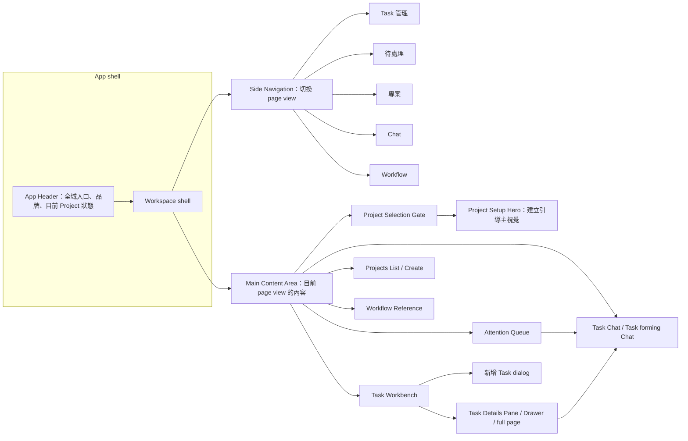

# 前端設計脈絡

這份文件保存 Grimo 前端 UI/UX 決策、頁面層級理由、browser comment 處理結果，以及 visual gate 證據。

## 1. 目的

Grimo 的前端設計工作需要留下可延續的脈絡。當需求、browser comment、UI 文案、響應式行為、版面選擇或 visual regression evidence 出現時，把穩定決策記在這裡，後續 UI 工作才不用從聊天紀錄重新推理。

## 2. 全域設計原則

- **決策：** 第一輪 redesign 保留目前的淺色系。
  **原因：** 使用者明確希望先吸收資訊架構、狀態語義、quality score、evidence 和文案；dark / cyan / glow 放到之後的 Arcane theme proposal。
  **證據：** `docs/grimo/design/ui-ux-redesign-brief.md`、`docs/grimo/design/DESIGN.md`、2026-05-28 使用者方向。
  **狀態：** 有效

- **決策：** 把 `docs/grimo/design/DESIGN.md` 視為外部設計師提案，分三輪吸收。
  **原因：** 該文件描述 dark Arcane workbench 方向，但使用者已明確分階段採用，以降低 churn 並保留可審查性。
  **證據：** 2026-05-28 使用者方向。
  **狀態：** 有效

  第一輪：只吸收資訊架構、狀態語義、quality score、evidence model 和文案；保留目前淺色 theme。

  第二輪：建立可切換的 `Arcane theme proposal` 或 screenshot mock 供討論；不取代預設 app theme。

  第三輪：品牌方向確認後，再更新 `docs/grimo/design/tokens.json` 和全站色彩 tokens。

- **決策：** 第一輪採用 premium utilitarian minimalism。
  **原因：** Grimo 是密集的本地工作台，不是 marketing page。UI 應該可讀、平面、淺色、evidence-first、克制，同時吸收設計師文件裡較完整的狀態語義。
  **證據：** `minimalist-ui` skill、`design-taste-frontend` audit discipline、2026-05-28 使用者方向。
  **狀態：** 有效

- **決策：** 前端設計文件使用 `docs/grimo/design/README.md` 作為索引，`AGENTS.md` / `CLAUDE.md` 只放短入口。
  **原因：** Agent 啟動檔應該短而穩定；完整設計理由、流程、token、prompt 和 evidence 應放在 design docs / active spec，避免重複後 drift。
  **證據：** Claude Code memory docs 建議 `CLAUDE.md` 放 project instructions 且保持 concise；`CLAUDE.md` 讀 `AGENTS.md` 時可用 import。
  **狀態：** 有效

- **決策：** 同一個 viewport 不放重複的主要 `新增 Task` CTA。
  **原因：** 重複的 `新增 Task` 按鈕會讓 command hierarchy 不清楚。
  **證據：** Browser comment 比較 Arcane mockup 中兩個 create buttons。
  **狀態：** 有效

- **決策：** 視覺變更完成前必須通過 visual gate。
  **原因：** Playwright snapshots 提供桌面版、平板、手機版的穩定證據；behavior assertions 補足 screenshots 看不到的互動語義。
  **證據：** `npm run build`、`npm run test:visual:update`、`npm run test:visual`。
  **狀態：** 有效

- **決策：** Page-flow 變更必須先有 Screen Flow Contract，再做 wireframe 或 implementation。
  **原因：** 2026-06-06 使用者回饋指出，如果 first-run、empty、loading、error、success、navigation、CTA 行為只在單頁內設計，前端頁面流程容易不一致。Screen Flow Contract 讓 PRD critical path、page state 和 verification evidence 在畫面設計前先對齊。
  **證據：** `docs/grimo/design/screen-flow-contract.md`、`docs/grimo/design/ui-ux-workflow.md`。
  **狀態：** 有效

## 3. 頁面脈絡

### App Shell / Project 啟動流程

**目的：** App 第一次載入時，必須先建立真實 Project context，才顯示 Task、待處理、Chat 等工作區。

**S011 Design Read：** 這是本地開發工作台的 first-run / no-context setup surface，不是 SaaS landing page。設計語言採 premium utilitarian minimalism：左對齊、短文案、平面淺色、少裝飾、單一主要行動；existing Projects 狀態把 Project card selection 當主要路徑，`建立 Project` 降為次要 action。

**討論用詞：**

- `App Header` 是 app chrome：放全域入口、品牌和目前 Project 狀態。它回答「我現在在哪個 Project context 裡」，不承擔 first-run 教學或主要建立流程。S011 target class 是 `.app-header`，legacy class 是 `.topbar`。
- `Side Navigation` 是主要頁面導覽，程式上是 `Navigation`。它只負責切換 page view，不是頁面內容本身；未固定時浮在主畫面上方，固定後才佔左側欄位。S011 target class 是 `.side-navigation`，legacy class 是 `.rail`。
- `Main Content Area` 是 App Header 下方的主要工作區。它承載目前頁面的主要內容，例如 Task Workbench、Project list、Chat，或第一次使用時的建立引導。S011 target class 是 `.main-content-area`，legacy class 是 `.main-surface`。
- `Project Selection Gate` 是 Main Content Area 裡的 no-active-Project 狀態頁。沒有 active Project 時，使用者應該在這裡建立或選擇 Project，而不是在 App Header 裡完成 onboarding。
- `Project Setup Hero`（Project 建立引導主視覺）是 `Project Selection Gate` 裡的大主視覺區塊。它承載 `建立第一個 Project` 這類 heading、說明文案和單一 primary action；它不是整個 gate，也不是 App Header。
- 第一次使用時的 `建立第一個 Project` 是 `Project Setup Hero` 的 first-run 文案變體：它可以使用主畫面最大可用區塊做引導，並保留單一主要操作。App Header 同時只顯示 `目前專案 / 尚未開啟 Project` 作為狀態。
- `Task Details Pane` 不是 menu item；它是 `Task 管理` 裡選到 Task 後打開的 nested surface。固定在右側時叫 pane，浮出覆蓋時叫 `Task Details Drawer`；完整頁面另稱 full Task detail page。
- `Chat` 是 page view，也是 Task 的完整討論入口。從 Task card、待處理卡片或 detail 進入 Chat 時，會帶著目前 selected Task；沒有 selected Task 時，Chat 是形成新 Task 的討論入口。

**命名來源：**

| Grimo 正式名 | 通用來源 | S011 target class / file | Legacy class |
| --- | --- | --- | --- |
| App Header | Carbon `Header`、Material `App bar` | `.app-header`, `App.tsx` | `.topbar` |
| Side Navigation | Carbon `Left panel` / `side-nav`、Microsoft `left navigation pane` | `.side-navigation`, `Navigation.tsx` | `.rail` |
| Main Content Area | Material `content area` / `content canvas`、Microsoft `content` | `.main-content-area`, `App.tsx` | `.main-surface` |
| Task Details Pane | Microsoft `details pane` / `list/details pattern` | `.task-details-pane`, `TaskDetail.tsx` | `.detail-pane` |

**整體畫面地圖：**



```text
┌────────────────────────────────────────────────────────────────────────┐
│ App Header                                                             │
│ [Menu] [Logo] Grimo              目前專案 尚未開啟 Project / Project 名稱 │
├────────────────────────────────────────────────────────────────────────┤
│ Workspace shell                                                        │
│                                                                        │
│  Side Navigation（按 Menu 後出現；pin 後固定在左側）                     │
│  ┌──────────────┐   Main Content Area                                  │
│  │ Task 管理     │   ┌──────────────────────────────────────────────┐    │
│  │ 待處理        │   │ 目前選到的 page view                         │    │
│  │ 專案          │   │                                              │    │
│  │ Chat          │   │ - 沒有 active Project 且進 Task/待處理/Chat： │    │
│  │ Workflow      │   │   顯示 Project Selection Gate                │    │
│  └──────────────┘   │ - 進專案：顯示 Project list / create          │    │
│                     │ - 進 Workflow：顯示 workflow reference        │    │
│                     │ - 有 active Project：顯示對應工作頁            │    │
│                     └──────────────────────────────────────────────┘    │
└────────────────────────────────────────────────────────────────────────┘
```

`Project Selection Gate` 內部的 first-run 版面：

```text
main.main-content-area
└─ section.project-selection-gate
   └─ Project Setup Hero（Project 建立引導主視覺）
      ├─ heading: 建立第一個 Project
      ├─ body: Project 會讓 Task 工作台有真實 repo / codebase context。
      └─ primary action: 建立 Project
```

**有無 active Project 的頁面行為：**

| 選單項目 | 有 active Project 時 | 沒有 active Project 時 |
| --- | --- | --- |
| `Task 管理` | 顯示 Task Workbench、待處理焦點、Kanban/list、Task Detail、`新增 Task`。 | 顯示 Project Selection Gate，引導建立或選擇 Project。 |
| `待處理` | 顯示 `REVIEW` / `BLOCKED` 人工處理 queue，可回到 Chat。 | 顯示 Project Selection Gate，避免看見沒有 Project context 的假 attention list。 |
| `專案` | 顯示 Project list / create，可建立、管理、切換 Project。 | 仍可進入 Project list / create，因為這是建立 Project context 的地方。 |
| `Chat` | 顯示目前 selected Task 的 Task Chat；沒有 selected Task 時，可作為形成新 Task 的討論入口。 | 顯示 Project Selection Gate，避免開啟沒有 Project context 的 generic blank Chat。 |
| `Workflow` | 顯示 workflow reference，說明 Project recipe steps 和 Task List State 的對應。 | 仍可顯示 workflow reference，但 App Header 保持 `尚未開啟 Project`，不暗示已有 Project context。 |

**頁面層級責任：**

| 層級 | 程式對應 | 負責什麼 | 不負責什麼 |
| --- | --- | --- | --- |
| App shell | `App.tsx`, `.app-shell` | 組合 App Header、workspace shell、全域 Project session。 | 不顯示具體 Task cards 或 Chat messages。 |
| App Header | `.app-header`, `ProjectSwitcher` | 顯示品牌、menu button、目前 Project 狀態與 Project switcher。 | 不做 first-run onboarding，不放主要頁面內容。 |
| Side Navigation | `Navigation`, `.side-navigation` | 切換 `tasks / blockers / projects / chat / workflow` page view。 | 不決定 Project 是否有效，不承載頁面內容。 |
| Main Content Area | `main.main-content-area` | 顯示目前 page view 的主要內容，或顯示 Project Selection Gate。 | 不放全域品牌或 app chrome。 |
| Project Selection Gate | `ProjectSelectionGate`, `.project-selection-gate` | 沒有可用 Project context 時，引導建立或選擇 Project。 | 不顯示 fixture tasks、不假裝已有 Project。 |
| Project Setup Hero | `ProjectSelectionGate` 內的 hero 區塊 | 在 gate 裡用最大主視覺區塊說明為什麼要建立 Project，並提供單一 primary action。 | 不負責 Project list、不負責 App Header 狀態、不承載後續 Task 工作台。 |
| Task Workbench | `TaskWorkbench` | 管理 Task list、focus tray、Task Detail、create dialog。 | 不保存完整 Chat history。 |
| Task Details Pane / Drawer | `TaskDetail`, `.task-details-pane` | 顯示 selected Task 的摘要、品質、evidence 和操作。 | 不取代 full Task detail page，也不取代 Chat。 |
| Chat | `AssistantChat` | 顯示 Task thread 或形成新 Task 的討論入口。 | 不取代 Task board，也不直接顯示所有 review evidence。 |

**目前版面決策：**

- 第一次使用且沒有任何 Project 時，`Project Selection Gate` 內顯示 `Project Setup Hero`；hero heading 是 `建立第一個 Project`，並只保留一個主要操作 `建立 Project`。
- 已有 Project 但沒有開啟中的 session 時，主工作區顯示 `選擇或建立 Project`；選擇 Project card 是主要操作，`建立 Project` 是次要操作。
- `lastActiveProjectId` 過期時，停在選擇門檻並顯示 `上次開啟的 Project 已不存在或無法載入，請選擇 Project。`；app 不可以偷偷改選另一個 Project。
- 有 active Project 時，App Header 的 Project context 是 Project Switcher。它列出 Projects，並提供 `新增 Project`、`管理 Projects`、`Close Project`。
- `Close Project` 是前端 session 指令：它寫入 `isClosed=true`，從 UI 清掉 active Project，但不刪除後端 Project 資料。
- Task 管理、待處理、Chat 都必須受 Project gate 控制。沒有 active Project 時，這些頁面顯示 Project Selection Gate，不顯示 fixture tasks、attention cards 或 generic blank Chat。
- 專案和 Workflow 是例外：沒有 active Project 時仍可開啟，因為專案頁負責建立 Project context，Workflow 頁負責說明可選 workflow recipe。

**響應式行為：**

- Selection Gate 和 Project Switcher 在 `1366x768`、`1440x900`、`390x844`、`820x1180` 都有固定 Playwright snapshots。
- App Header 保持既有 52px row height。Project path 太長時，在 switcher trigger 內截斷；在 Project card/menu row 裡必要時可換行。

**驗證：**

- `frontend/e2e/project-startup.ui.spec.ts` 覆蓋 bootstrap、restore、stale session、close、switch、no-context gating 和 startup visual snapshots。
- `frontend/e2e/project-startup.fullstack.spec.ts` 覆蓋透過真實 `/api` 串接的 create/select 流程。

**S011 current implementation contract：**

- Current DOM selectors 使用 `.app-header`、`.app-header-menu`、`.side-navigation`、`.main-content-area`、`.task-details-pane`；`.topbar`、`.rail`、`.main-surface`、`.detail-pane` 只允許出現在 deprecated mapping 或 historical evidence。
- Current design tokens 使用 `appHeader.height`、`sideNavigation.width`、`sideNavigation.control`、`taskDetailsDrawer.width`；`topbar.*`、`rail.*`、`detailDrawer.*` 只作為 deprecated references。
- `ProjectSetupHero` 是 `ProjectSelectionGate` 內的真實 DOM / feature-local component，selector 是 `.project-setup-hero`。
- First-run empty 使用 `建立第一個 Project` + primary `建立 Project`；existing Projects 使用 `選擇或建立 Project`，Project cards 是主要行動，`建立 Project` 是 secondary action。
- Project list 載入失敗使用 error hero：heading `無法載入 Project context`、button `重試`，不得沿用 first-run heading。
- S011 必須有自己的 `AC-S011-*` Playwright assertions；S010 startup tests 保留為 shipped regression，不拿來替代 S011 evidence。
- S011 hero 文案要短、可掃描、能說明資料出現後會有什麼；error hero 要用直接白話說明問題與 recovery，不得重用 first-run 文案。
- Mobile Project card 用單欄資訊排列，避免 repo path 在窄欄內被切成難讀碎片。

**2026-06-07 S011 implementation / evidence update：**

- **設計研究：** S011 對照 Carbon Empty States / Global Header、Microsoft NavigationView、Atlassian Designing Messages、Material Layout、Telerik Design Tokens 和 Claude Code memory docs 後，維持「Main Content Area 內的 Project Setup Hero」方案。
- **文件索引：** 新增 `docs/grimo/design/README.md` 作前端設計索引；`CLAUDE.md` 只 import `AGENTS.md` 並指向該索引；`AGENTS.md` 的 Workflow Artifacts 列出 frontend design docs。
- **程式/selector：** Current selectors 是 `.app-header`、`.app-header-menu`、`.side-navigation`、`.main-content-area`、`.task-details-pane`、`.project-setup-hero`。
- **視覺基準：** 更新 4 張 Project selection gate snapshots：`desktop-1366`、`desktop-1440`、`mobile-390`、`tablet-820`。變更原因是 first-run/existing Project gate 從小 section head 升級為 Main Content Area hero，且 mobile Project card 改單欄。
- **驗證：** `npm --prefix frontend run build` 通過；`npx playwright test project-startup.ui.spec.ts --update-snapshots=changed` 通過 21/21；`npm --prefix frontend run test:visual` 通過 40/40；`python3 scripts/visual-snapshot-summary.py --repo-root .` 顯示 changed snapshots 只有上述 4 張。

### Task 工作台（Task Workbench）

**目的：** 主要 Task 管理畫面，用來追蹤 Task state、找出需要人處理的工作，並開啟 Task detail / review 流程。

**目前版面決策：**

- 桌面版使用 `Focus + Board`：上方 attention tray 顯示 `REVIEW` 和 `BLOCKED` tasks；Kanban board 留在下方用來掃描 workflow state。
- Focus tray 可收合。使用者不一定想立刻處理待處理項目，所以 tray 可以縮成 summary row。
- Focus header 是單行：`待處理焦點` 後面接小型 `需要你處理` 狀態標籤。這個標籤不應該獨占一行。
- 桌面版上 search 和 `新增 Task` 保持在同一列 toolbar。手機版可以堆疊。
- Main navigation 預設以 overlay 開啟。只有使用者按 pin button 後，才改變 workbench layout。

**響應式行為：**

- 桌面版：focus tray 加水平 Kanban board。
- 平板/手機版 breakpoint：隱藏 board，改成 grouped task list。
- 手機版 list row 顯示 state、task id、title、labels、updated time、score 和 comments。Task source 不在 detail 之外顯示。
- Card labels 只能顯示使用者看得懂的分類，且必須來自 prototype 定義的 task label taxonomy。不要把 `source` 值如 `chat`，或 skill/workflow capability name 如 `task-forming`，放進 list-level label chips。
- Cards 和手機版 rows 可以顯示 Task Conversation Preview 線索，例如最近討論摘要、未解問題數、comment count 或 attachment count，但不能顯示完整 raw transcript。

**元件備註：**

- `.focus-strip`：給人類行動用的 attention tray，必須支援 expanded / collapsed states。
- `.focus-toggle`：控制 focus tray 收合/展開，visible labels 必須精確使用 `收合` 和 `展開`。
- `.board-grid`：只給桌面版 board 使用。不要把 Kanban columns 硬塞到手機版。
- `.mobile-task-list`：手機版和平板的 list surface。它依 board-facing state 分組，並包含 `BLOCKED`。
- Side Navigation 的 S011 target class 是 `.side-navigation`：unpinned main nav 是 overlay。只有 `.nav-pinned` 可以配置左側 column。

**未決問題：**

- 有 user preferences 後，focus collapse state 是否要跨 reload 保存。
- Attention tasks 是否要除了 `REVIEW` 和 `BLOCKED` 外也包含 `READY`，特別是在 user-started dispatch window 開啟時。

### Task 詳情（Task Detail）

**目的：** Drawer / full-page review surface，用來查看 task state、workflow step、quality、evidence、acceptance materials、gaps 和下一步操作。

**目前版面決策：**

- Detail 在使用者選取 task 前仍是 workbench 的次要畫面。
- Review actions 要等 state mutation 存在後，才變成真正的 approve/reject controls。
- 現階段 focus card actions 先導向 task detail，不假裝會改變 review state。
- Full-page detail 是 `REVIEW` 的工作畫面。第一個桌面版 viewport 必須看到 human gate summary、REVIEW tasks 的 approve/reject controls、review materials、evidence package、timeline、risk notes 和 linked work。
- Task source 只顯示在 task detail。不要升級到 board cards、手機版 rows、attention cards、search placeholder text 或 create-task copy。
- Task detail 是少數使用者可輸入的 surfaces 之一，另一個是 Chat。使用者看得到的文案要描述回到 `Chat` 繼續探索或規劃，不要說另一個 context-repair job。
- Detail headers 只顯示 task identity 和 Task List State。`Discuss` 等 Workflow recipe steps 留在 `Stage & Quality`，不要放到 header chips。
- Task detail 可以顯示 Task Conversation Preview 和 attachment summaries。完整 message history 和 attached files 透過 task `Chat` 或完整 detail evidence surfaces 開啟。

**響應式行為：**

- 桌面版可使用 drawer 或 full page。
- 手機版使用目前 CSS 的 bottom sheet style drawer behavior。

**未決問題：**

- 大量 evidence sets 要怎麼呈現：diff、logs、screenshots、risk notes、review findings、fix history。

### 待處理頁（Attention Page）

**目的：** 專門處理人類行動的 queue，包含 `REVIEW` approvals、`BLOCKED` recovery，以及需要更多討論或明確使用者決策的 definition gaps。

**目前版面決策：**

- 這個頁面不是第二個 Kanban board。它先摘要 action counts，再把 `REVIEW` 和 `BLOCKED` tasks 列成 priority queue。
- `REVIEW` 和 `BLOCKED` 共用主 queue，因為兩者都會卡住進度：`REVIEW` 卡住 `DONE`，`BLOCKED` 卡住 dispatcher 或 workflow recovery。Release evidence 若存在，會在 `DONE` task 內 review。
- Definition gaps 是右欄的次要 decision material，讓使用者可以掃描未完成 tasks，但不把它們混進 urgent queue。
- Attention cards 顯示真實 task labels，不顯示 recipe steps。`Prototype`、`Spec`、`Review` 等 recipe steps 屬於 Task detail / Workflow evidence，不是 list-level label chips。

**響應式行為：**

- 桌面版 使用 main queue 加右側 sidebar。
- 平板/手機版 將 summary cards、queue cards 和 sidebar panels 堆疊成單欄。

**元件備註：**

- `.attention-summary`：review、blocked、definition gaps 三個 compact counters。
- `.attention-task`：urgent queue 的 repeated task cards。
- `.attention-sidebar`：gap distribution、blocker summary、recent handling notes 的 secondary diagnostics。

### Projects 頁

**目的：** 使用者進入 Task work 前，用來建立 Project context 的入口畫面。

**目前版面決策：**

- First-run Project setup 必須先用 `docs/grimo/design/screen-flow-contract.md` 規劃，再改 app bootstrap 或 Project onboarding screens。
- Project management 從 list-first view 開始。使用者應先看到 existing Projects 或 empty state，再看到 create fields。
- `新增專案` 開啟獨立 create view，並提供 `返回列表`；create form 不永久顯示在 Project list 旁邊。
- Project Path 是簡單的 optional text field。使用者可以貼 `/Users/.../repo`；留空時，Grimo 在 `~/.grimo/projects/<projectId>` 下建立 default project path。
- Browser-native folder picking 不屬於 S003 create contract，因為 `showDirectoryPicker()` 回傳的是 browser handle，不是 backend 可操作的 absolute path。
- Manual path entry 是 S003 唯一綁定 existing repo/codebase path 的方式。
- Drag-and-drop folder import 不屬於 S003 main flow。它太隱晦，而且和 browser handles 一樣無法取得 absolute path。
- S003 create view 不應該在 form 下方顯示很長的 backend-generated directory browser。

**響應式行為：**

- 桌面版 和 手機版 使用同一套 list/create mode split。
- Create view 堆疊 form fields 和 workflow preview；project path input state 必須保持 compact，不要把 workflow roles 推到 fold 下方很遠。

**元件備註：**

- Manual project paths 顯示 validated local path。
- 沒有 user-selected path 的 Projects 顯示 generated `projectPath`，仍然是 valid Projects。
- UI 在 native bridge 能提供 backend-operable paths 前，不顯示 browser-selected folders 作為 Project paths。

### Workflow 頁

**目的：** 給產品使用者看的 reference view，用來說明 Project Workflow Recipe steps 如何對應 Task List State。

**目前版面決策：**

- Web development workflow 把 verification 保留在 `RUNNING` 裡，不把它做成一個 first-class Task List State。
- `RUNNING` 顯示 implementation 和 evidence work：`Dev / Auto-Review / Unit-test fe/be / Integration-test / E2E-test`。
- `REVIEW` 保持在 verification evidence 完成後的人類 approve/reject state。
- `DONE` 顯示 `Release` 作為 web development workflow 的 completion subflow；release evidence 留在 DONE task 裡，不成為另一個 board column。

**不要做：** 不要新增 `VERIFYING` board/list state，也不要把 human approval 標成 `Auto-Review`。

**驗證：** `npm run build`；backend `ProjectApiTests.exposesWebServiceDevelopmentRecipeDefinition`。

## 4. 元件決策

### Logo 標誌

- **決策：** 在 topbar brand mark 使用 `frontend/src/assets/grimo-logo.png`，外側角落透明，34px visual box 對齊 `.topbar-menu`。
- **原因：** 使用者提供 logo，要求移除背景，並要求大小和 menu button 一樣。
- **調整：** Logo image 可以稍微大於 34px brand box，但 桌面版 topbar row 必須維持 52px 高。
- **不要做：** 不要退回舊的 text-only `G` mark，不要加額外 `.brand-mark` border/background，也不要讓 logo 撐高 topbar row。
- **驗證：** `npm run build`、`npm run test:visual`。

### 建立 Task 按鈕

- **決策：** 每個 viewport 只保留一個 primary `新增 Task` button。
- **原因：** 重複的 primary actions 會造成 command hierarchy 不清楚。
- **不要做：** 不要在 focus tray 或 board mode controls 內新增同 scope 的第二個 create button。
- **驗證：** Browser comment 和 visual snapshots。

### 主導覽（Main Navigation）

- **決策：** Nav 在 pinned 前以 overlay 開啟。
- **原因：** 開啟 nav 不應該在一般瀏覽中一直改變 board layout。
- **不要做：** 不要只因為 `.nav-open` 就改變 grid columns。
- **驗證：** Playwright test `main navigation overlays until pinned`。

### 待處理焦點列（Focus Tray）

- **決策：** 支援 expanded 和 collapsed states。
- **原因：** 使用者有時只想知道有哪些待處理項目，不一定要立刻處理，所以需要可收合。
- **不要做：** 不要強迫 attention cards 永久佔用垂直空間。
- **驗證：** Playwright test `attention focus can collapse and expand`。

### Task 詳情全頁

- **決策：** Full-page `REVIEW` detail 以 human approval gate 作為主要內容，不只是 Acceptance 和 Evidence lists 的稀疏複製。
- **原因：** 使用者在這個頁面決定 approve/reject，所以第一屏要看到 compact review summary、decision actions、execution timeline、risk notes 和 linked work。
- **不要做：** 不要把 full-page detail 做成 drawer 的稀疏唯讀 duplicate。
- **驗證：** Playwright test `full page detail baseline` 斷言 `審查結論`、`Approve`、`Reject`；snapshot `task-detail-full-page-chromium-darwin.png`。

### Task 來源

- **決策：** Task `source` 只顯示在 task detail。
- **原因：** 2026-05-28 使用者回饋：task 從哪裡來，對 list-level triage 沒有幫助。Source 保留為 provenance metadata，但不應該和 state、gap、quality score、evidence 或 next action 競爭。
- **不要做：** 不要在 board cards、手機版 list rows、`待處理` 頁、search placeholder text 或 create-task explanatory copy 顯示 `source`。
- **驗證：** `npm run build`、`npm run test:visual`。

### Task 標籤

- **決策：** Board、手機版、focus、attention card chips 只顯示使用者看得懂的 task labels。
- **原因：** 2026-05-29 使用者回饋：`GRM-144` 上的 `chat task-forming` 不清楚，因為 `chat` 是 source，`task-forming` 是 skill/workflow capability，不是 label。
- **來源：** Label options 來自 `docs/grimo/ui/prototype/index.html` 的 `taskLabelPicker`：`bug`、`documentation`、`duplicate`、`enhancement`、`good first issue`、`help wanted`、`invalid`、`question`、`wontfix`、`frontend`、`backend`、`ci/cd`、`design`、`research`。
- **不要做：** 不要把 `source`、workflow recipe steps、skill names 或臨時 ad hoc labels 當成 card label chips。
- **驗證：** Playwright board baseline 斷言 `GRM-144` card 上沒有 `task-forming`；`task fixtures use prototype-defined labels` 斷言 fixture labels 全部在 prototype taxonomy 裡。

### Badge 語義

- **決策：** Task id、Task List State、task label 和 metric badges 必須有不同視覺處理。
- **原因：** 2026-05-29 使用者回饋：`GRM-144`、`BACKLOG`、`frontend` 看起來太像，不清楚哪個是 identity、state 或 label。
- **不要做：** 不要用同一種 neutral pill style 呈現 task id、state 和 labels。
- **實作：** `Badge` 支援 `kind="task-id"`、`kind="state"`、`kind="label"`、`kind="metric"`；board card labels 使用 `.badge.label`，detail headers 使用 `.badge.task-id` 和 `.badge.state`。
- **驗證：** Playwright 斷言 `GRM-144` card labels 使用 `.badge.label`，task detail headers 透過 `.badge.task-id` 和 `.badge.state` 顯示 task id/state。

### 回到 Chat 的路徑

- **決策：** 使用者看得到的 actions 應寫 `Chat` 或 `回到 Chat 繼續探索或規劃`，不要寫工程術語式的 context。
- **原因：** 2026-05-28 使用者回饋：context-filling language 是工程術語，不是產品動作。真正互動是回到 chat interface，繼續探索、規劃、釐清或 refine task。
- **不要做：** 不要呈現 `review-material` 或 `gap-view` 這類獨立 list-level actions。Attention cards 和 focus cards 應導向 `Chat` 進行討論和釐清。
- **輸入 surfaces：** 使用者可以輸入的地方是 Task detail 和 Chat。其他 surfaces 應導回其中一個，而不是暗示第三種 input workflow。
- **驗證：** `npm run build`；因為 task detail、attention page 和 workbench focus action copy 變更，visual snapshots 需要更新。

### Task 對話串與預覽

- **決策：** 每個 Task 都擁有 durable Task Conversation Thread。開啟 task `Chat` 時，顯示完整 task thread：歷史 user messages、agent replies、attached files、referenced files、external links、clarifications 和重要 system event summaries。
- **原因：** 使用者釐清每個 task 都應能開啟完整 conversation history 和 attachments；collapsed Chat 只顯示最近訊息和 key summary，類似 issue comments 附著在工作上。
- **Preview 規則：** Board cards、手機版 rows、attention cards、detail summaries 和 collapsed Chat 可顯示 Task Conversation Preview：recent messages、key summary、unresolved questions、comment count 和 attachment count。
- **不要做：** 不要從 task 開啟 blank generic chat，不要把 task attachments 藏在 provider transcripts 裡，不要在 list surfaces 顯示 raw transcripts，也不要把 attachments 當 labels/source chips。
- **輸入 surfaces：** Chat 是主要 conversation surface；Task detail 可以接受 structured task edits 或 review decisions。其他 list-level surfaces 應導回其中一個。
- **驗證：** 此次為 documentation-only decision；未來 UI implementation 應加入 Playwright assertions，確認 task `Chat` 連到 selected task，且 cards 顯示 preview metadata 而非完整 transcripts。

### Task 附件

- **決策：** Attachments 優先屬於 Task Conversation Thread 和 Task detail。當 attachments 成為 approval evidence 時，可以 promoted 或 linked 到 Review Materials。
- **原因：** Attachments 協助保存 context 和 discussion history，但 list-level triage 應專注在 state、labels、quality 和 next action。
- **不要做：** 不要把 attachments 顯示成 task labels、source metadata 或獨立 board chips。Detail/chat 之外只使用 attachment count 或 compact hints。
- **驗證：** 此次為 documentation-only decision。

### 待處理佇列

- **決策：** `待處理` 是 human-action queue，包含 count summary、priority task cards 和 diagnostic sidebar。
- **原因：** Plain BLOCKED-only list 會隱藏 `REVIEW` approvals，也無法說明是哪個 action 卡住進度。
- **不要做：** 不要複製完整 board，不要讓每個 task 權重相同，也不要新增獨立 list-level `審查材料` / `查看缺口` buttons。
- **驗證：** Playwright test `attention page baseline` 斷言 `優先處理`、不存在 `審查材料` / `查看缺口`，並顯示 `Chat`；snapshot `attention-page-chromium-darwin.png`。

## 5. Visual Gate 紀錄

### 2026-06-07 — S010 Project Startup Gate And Switcher

- **指令：** `npm --prefix frontend run test:visual:update`、`npm --prefix frontend run test:visual`、`npm --prefix frontend run test:fullstack`
- **結果：** 通過；visual gate 現在有 34 個 Playwright checks，包含 S010 Project startup、API failure retry 和 switcher screenshots。
- **截圖基準變更：** 新增 桌面版、手機版、平板 viewports 的 `project-selection-gate-*` 和 `project-switcher-*` snapshots；更新 Task Workbench snapshots，因為 topbar 現在顯示真實 Project context，不再使用舊 fixture fallback。
- **原因：** App first load 現在必須有真實 Project context。First-run / closed / stale sessions 顯示 Project gate，active sessions 恢復 matching Project，topbar current Project 成為 Project Switcher。

### 2026-05-28 — Task Workbench Round 1

- **指令：** `npm run build`、`npm run test:visual:update`、`npm run test:visual`
- **結果：** 通過
- **截圖基準變更：** 第一輪 redesign 期間，Task workbench 桌面版、平板、手機版、drawer、dialog snapshots 改變。
- **原因：** 新增 light-theme `Focus + Board`、手機版 grouped list、single-row toolbar、logo、overlay-until-pinned navigation 和 collapsible focus tray。

### 2026-05-28 — Task Detail Full Page Completion

- **指令：** `npm run build`、`npm run test:visual:update`、`npm run test:visual`、`npm run build`
- **結果：** 通過
- **截圖基準變更：** `frontend/e2e/task-workbench.visual.spec.ts-snapshots/task-detail-full-page-chromium-darwin.png`
- **原因：** Full-page `REVIEW` detail 現在包含 human gate decision area、approve/reject actions、review summary、execution timeline、risk notes 和 linked work。

### 2026-05-28 — Attention Page Completion

- **指令：** `npm run build`、`npm run test:visual:update`、`npm run test:visual`
- **結果：** 通過
- **截圖基準變更：** `frontend/e2e/task-workbench.visual.spec.ts-snapshots/attention-page-chromium-darwin.png`
- **原因：** `待處理` 現在顯示 human-action counts、`REVIEW`/`BLOCKED` priority queue、definition gaps、blocker summary 和 handling notes。

### 2026-05-28 — Source Metadata Demotion

- **指令：** `npm run build`、`npm run test:visual:update`、`npm run test:visual`、`npm run build`
- **結果：** 通過
- **截圖基準變更：** task workbench 桌面版/平板/手機版、task detail drawer、create task dialog 和 attention page snapshots。
- **原因：** 使用者指出 task source 在 list level 沒有幫助。Source 現在只顯示在 task detail；board、手機版 list、attention page、search placeholder 和 create-task copy 不再凸顯 source。
- **截圖摘要：** `python3 scripts/visual-snapshot-summary.py --repo-root .` 回報 8 個 changed baselines：1 個新增 attention page snapshot、7 個更新 workbench/detail/dialog snapshots，以及 `frontend/test-results/.last-run.json` 和 `frontend/playwright-report/index.html` 的 local evidence artifacts。

### 2026-05-28 — Chat Return Path Copy

- **指令：** `npm run build`、`npm run test:visual:update`、`npm run test:visual`、`python3 scripts/visual-snapshot-summary.py --repo-root .`
- **結果：** 通過；visual gate 現在有 12 個 Playwright checks，包含 `chat action returns to task-forming chat`。
- **截圖基準變更：** task workbench 桌面版/平板/手機版、task detail drawer、task detail full page 和 attention page snapshots。
- **原因：** 使用者釐清 list-level actions 應顯示 `Chat`，並回到 chat interface 繼續探索或規劃。產品上沒有獨立的 user-facing context-filling job；使用者輸入屬於 Task detail 或 Chat。
- **截圖摘要：** 目前 summary 回報 git status 裡有 8 個 changed baselines，以及 `frontend/test-results/.last-run.json` 和 `frontend/playwright-report/index.html` 的 local evidence artifacts。

### 2026-05-28 — Attention Actions Collapse To Chat

- **指令：** `npm run build`、`npm run test:visual:update`、`npm run test:visual`、`python3 scripts/visual-snapshot-summary.py --repo-root .`
- **結果：** 通過；`attention page baseline` 現在斷言沒有 `審查材料` 或 `查看缺口` buttons，並有可見的 `Chat` action。
- **截圖基準變更：** task workbench 桌面版/平板/手機版、task detail drawer、create task dialog 和 attention page snapshots。
- **原因：** 使用者釐清 `審查材料` 和 `查看缺口` 不應作為 list-level action buttons 出現。Focus 和 attention cards 現在導向 `Chat` 進行討論和釐清。
- **截圖摘要：** 目前 summary 回報 git status 裡有 8 個 changed baselines，以及 `frontend/test-results/.last-run.json` 和 `frontend/playwright-report/index.html` 的 local evidence artifacts。

### 2026-05-29 — Attention Cards Use Labels, Not Recipe Steps

- **指令：** `npm run build`、`npm run test:visual:update`、`npm run test:visual`、`python3 scripts/visual-snapshot-summary.py --repo-root .`
- **結果：** 通過；`attention page baseline` 現在斷言 attention task cards 上沒有 `Prototype`。
- **截圖基準變更：** `frontend/e2e/task-workbench.visual.spec.ts-snapshots/attention-page-chromium-darwin.png`
- **原因：** 使用者釐清 labels 已經定義，`Prototype` 作為 chip 看起來像 task label。Attention cards 現在 render `task.labels`；workflow recipe steps 保留在 Task detail / Workflow evidence。
- **截圖摘要：** 目前 summary 回報 1 個 changed baseline，以及 `frontend/test-results/.last-run.json` 和 `frontend/playwright-report/index.html` 的 local evidence artifacts。

### 2026-05-29 — Detail Header Separates State From Step

- **指令：** `npm run build`、`npm run test:visual:update`、`npm run test:visual`、`python3 scripts/visual-snapshot-summary.py --repo-root .`
- **結果：** 通過；detail visual tests 現在斷言 recipe steps 不在 detail header chip rows 裡。
- **截圖基準變更：** `frontend/e2e/task-workbench.visual.spec.ts-snapshots/task-detail-drawer-chromium-darwin.png`、`frontend/e2e/task-workbench.visual.spec.ts-snapshots/task-detail-full-page-chromium-darwin.png`
- **原因：** 使用者選到 `BACKLOG Discuss` 並指出設計語言混在一起。Detail headers 現在顯示 task id 和 Task List State；workflow recipe steps 保留在 `Stage & Quality`。
- **截圖摘要：** 目前 summary 回報 3 個 changed baselines，以及 `frontend/test-results/.last-run.json` 和 `frontend/playwright-report/index.html` 的 local evidence artifacts。

### 2026-05-29 — Card Chips Use User Labels Only

- **指令：** `npm run build`、`npm run test:visual`、`npm run test:visual:update`、`npm run test:visual`、`python3 scripts/visual-snapshot-summary.py --repo-root .`
- **結果：** 通過；board visual tests 現在斷言 `GRM-144` card 上沒有 `task-forming`。
- **截圖基準變更：** task workbench 桌面版/平板/手機版、task detail drawer、create task dialog、task detail full page 和 attention page snapshots。
- **原因：** 使用者詢問 `GRM-144` card 上的 `chat task-forming` 是什麼意思。`chat` 是 task source，`task-forming` 是 skill/workflow capability，兩者都不屬於 card label chips。Card fixtures 現在只使用 prototype-defined label taxonomy 裡的 labels；source 留在 task detail。
- **截圖摘要：** 目前 summary 回報 8 個 changed baselines，以及 `frontend/test-results/.last-run.json` 和 `frontend/playwright-report/index.html` 的 local evidence artifacts。

### 2026-05-29 — Mock Labels Follow Prototype Taxonomy

- **指令：** `npm run build`、`npm run test:visual`、`npm run test:visual:update`、`npm run test:visual`、`python3 scripts/visual-snapshot-summary.py --repo-root .`
- **結果：** 通過；visual gate 現在有 13 個 Playwright checks，包含 `task fixtures use prototype-defined labels`。
- **截圖基準變更：** task workbench 桌面版/平板/手機版、task detail drawer、create task dialog、task detail full page 和 attention page snapshots。
- **原因：** 使用者釐清 labels 已經定義，mock data 應使用那些定義，而不是臨時 invented examples。React task fixtures 現在使用 `frontend/src/domain/task/task-labels.ts`，來源是 prototype label picker；create-task label input 提供相同 options。
- **截圖摘要：** 目前 summary 回報 8 個 changed baselines，以及 `frontend/test-results/.last-run.json` 和 `frontend/playwright-report/index.html` 的 local evidence artifacts。

### 2026-05-29 — Badge Semantics Are Visually Distinct

- **指令：** `npm run build`、`npm run test:visual`、`npm run test:visual:update`、`npm run test:visual`、`python3 scripts/visual-snapshot-summary.py --repo-root .`
- **結果：** 通過；visual gate 維持 13/13，並包含 semantic badge assertions。
- **截圖基準變更：** task workbench 桌面版/平板/手機版、task detail drawer、create task dialog、task detail full page 和 attention page snapshots。
- **原因：** 使用者指出 labels、`GRM-144` 這類 task id 和 `BACKLOG` 這類 states 看起來太像。Task id badges 現在是 rectangular mono tokens，Task List State badges 使用 semantic state styling，task labels 使用較柔和的 category chips 和小 marker，metrics 使用 neutral compact style。
- **截圖摘要：** 目前 summary 回報 8 個 changed baselines，以及 `frontend/test-results/.last-run.json` 和 `frontend/playwright-report/index.html` 的 local evidence artifacts。

### 2026-05-29 — Logo Slightly Larger Without Topbar Growth

- **指令：** `npm run build`、`npm run test:visual`、`npm run test:visual:update`、`npm run test:visual`、`python3 scripts/visual-snapshot-summary.py --repo-root .`
- **結果：** 通過；visual gate 維持 13/13，且 桌面版 board tests 斷言 `.topbar` 高度維持 52px，同時 `.brand-mark img` 以 38px render。
- **截圖基準變更：** task workbench 桌面版/平板/手機版、task detail drawer、create task dialog、task detail full page 和 attention page snapshots。
- **原因：** Browser comment 要求 topbar logo 稍微大一點，但不要增加 row height。Brand box 維持 34px；image 以 38px render 並允許 visible overflow，所以 row 維持固定高度。
- **截圖摘要：** 目前 summary 回報 8 個 changed baselines，以及 `frontend/test-results/.last-run.json` 和 `frontend/playwright-report/index.html` 的 local evidence artifacts。

### 2026-05-28 — Topbar Logo Background And Size

- **指令：** `npm run build`、`npm run test:visual`（sandbox 因 `EPERM` 擋住 dev server）、`npm run test:visual:update`、`npm run test:visual`、`python3 scripts/visual-snapshot-summary.py --repo-root .`
- **結果：** 更新 intentional topbar logo snapshots 後通過；final visual gate 是 12/12 通過。
- **截圖基準變更：** task workbench 桌面版/平板/手機版、task detail drawer、create task dialog、task detail full page 和 attention page snapshots。
- **原因：** Browser comment 要求移除 logo 背景並對齊 menu-button size。Topbar logo 現在使用 transparent PNG，且 34px visual box 對齊 `.topbar-menu`。
- **截圖摘要：** 目前 summary 回報 git status 裡有 8 個 changed baselines，以及 `frontend/test-results/.last-run.json` 和 `frontend/playwright-report/index.html` 的 local evidence artifacts。

## 6. Browser Comment 收斂紀錄

### 2026-05-28 — Search Field Toolbar

- **回饋：** Search input 應和 `新增 Task` 在同一列。
- **決策：** 接受
- **結果：** 桌面版 `.toolbar` 不再換行；手機版 保持 stacked controls。
- **驗證：** `npm run build`、`npm run test:visual`。

### 2026-05-28 — 手機版 Task 版面

- **回饋：** 手機版 應該像 list，因為 board layout 很難呈現。
- **決策：** 接受
- **結果：** 手機版/平板使用 `.mobile-task-list`；桌面版保留 `.board-grid`。
- **驗證：** `npm run build`、`npm run test:visual`。

### 2026-05-28 — Main Navigation Pinning

- **回饋：** Main nav 除非 pinned，否則應該浮在 board 上方。
- **決策：** 接受
- **結果：** Unpinned nav 是 overlay；pinned nav 改變 layout。
- **驗證：** Playwright test `main navigation overlays until pinned`。

### 2026-05-28 — Focus Tray Collapse

- **回饋：** `待處理焦點` 需要 collapse/expand，因為使用者有時不想處理它。
- **決策：** 接受
- **結果：** Focus tray 有 `收合` 和 `展開` states。
- **驗證：** Playwright test `attention focus can collapse and expand`。

### 2026-05-28 — Focus Header Density

- **回饋：** `需要你處理` 應放在 `待處理焦點` 後面，不要佔兩行。
- **決策：** 接受
- **結果：** `需要你處理` 是小型 inline status tag。
- **驗證：** `npm run build`、`npm run test:visual`。

### 2026-05-28 — Topbar Logo Background And Size

- **回饋：** Logo 要移除背景，並對齊 menu button 大小。
- **決策：** 接受
- **結果：** `frontend/src/assets/grimo-logo.png` 現在外側角落透明；`.brand-mark` 和 `.brand-mark img` 是 34px，對齊 `.topbar-menu`。
- **驗證：** `npm run build`、`npm run test:visual`。
