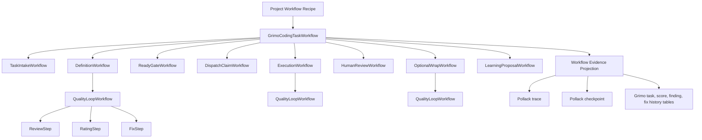
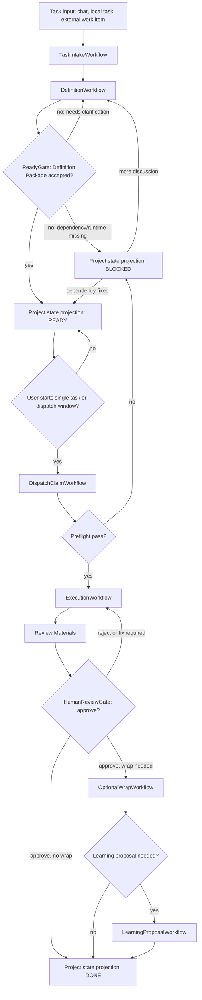
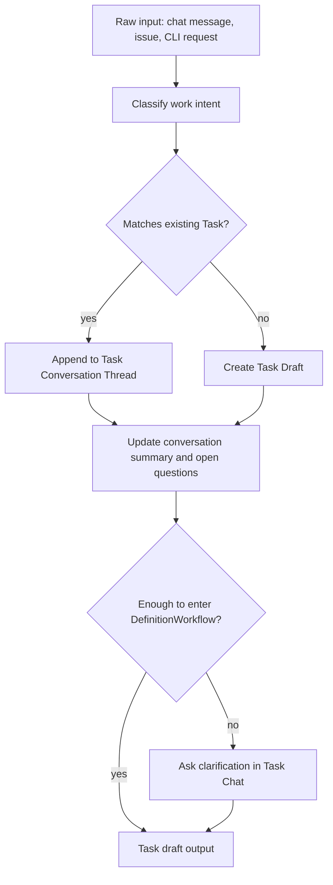
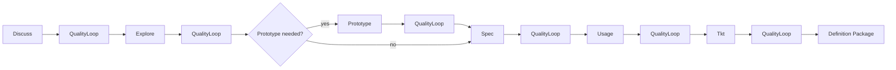
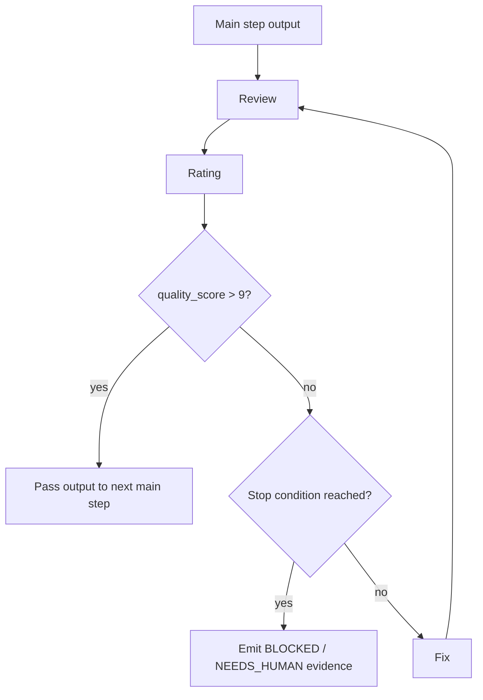
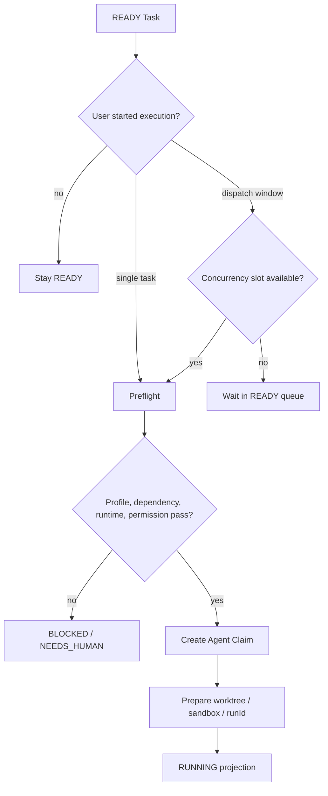
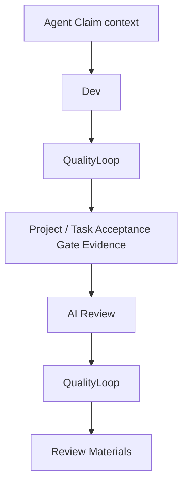
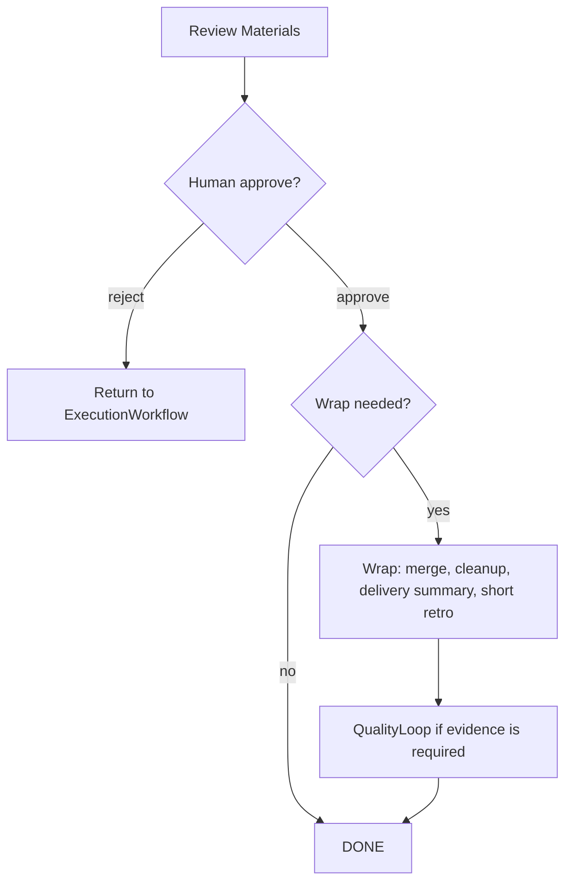
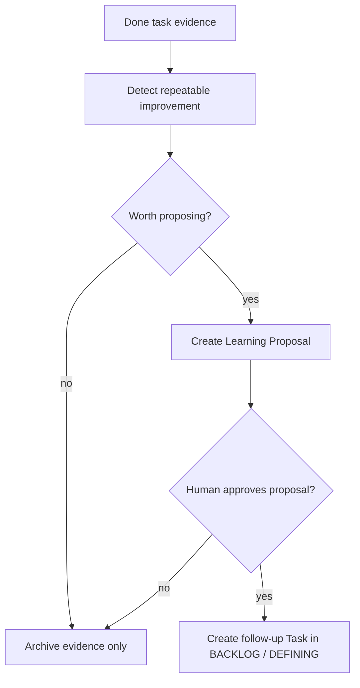
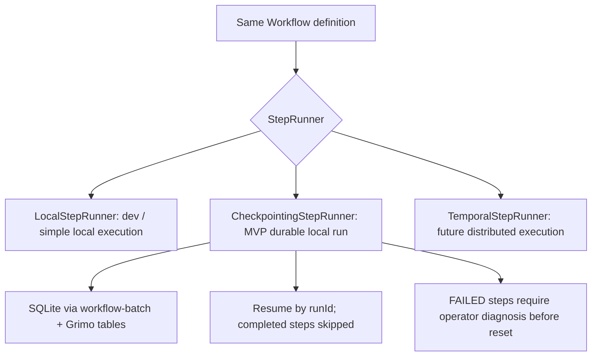

# Grimo Agent Workflow Definition

**Status:** Draft reference  
**Last verified:** 2026-05-31  
**Source:** Pollack AI Lab Agent Workflow

## Purpose

這份文件把 Grimo 的產品 workflow 整理成 Pollack AI Lab `Agent Workflow` 可表達的 workflow / sub-workflow 圖。

它不是 PRD 的替代品；PRD 定義產品承諾，這份文件定義工程上如何把那些承諾映射到 `Workflow`、`Step`、`Gate`、typed context、trace 和 checkpoint。

## Source Grounding

Pollack `Agent Workflow` 的關鍵定義：

- `Workflow` 由多個 `Step` 組成；每個 step 做一件事，可以是 deterministic function、single LLM call，或 agentic CLI session。
- `Gate` 評估 step output，將流程導向 pass / fail path。
- Context 透過 typed keys 在 steps 之間流動。
- Workflow definition 會編譯成 graph IR，definition 與 execution 分離；同一份 workflow 可由 `LocalStepRunner`、`CheckpointingStepRunner` 或 `TemporalStepRunner` 執行。
- 每個 step transition 可 trace；checkpoint runner 可用 `runId + stepName` 跳過已完成 step。
- `Workflow` 本身也實作 `Step`，所以 sub-workflow 可以放在 `.then()`、`.branch()`、`.onPass()`、`.onFail()`、`.parallel()` 等接受 step 的位置。

Sources:

- <https://lab.pollack.ai/projects/agent-workflow>
- <https://lab.pollack.ai/docs/agent-workflow/examples>
- <https://lab.pollack.ai/docs/agent-workflow/durability>

Code blocks labeled `Pollack shape` are design sketches, not compile-ready Java. They use Pollack DSL vocabulary to show graph shape and sub-workflow boundaries before implementation names and generic types are finalized.

## Assumptions

1. Grimo 的 board-facing state 仍維持 PRD 定義：`BACKLOG`、`DEFINING`、`READY`、`RUNNING`、`REVIEW`、`DONE`、`BLOCKED`。
2. Board state 不是 Pollack workflow step；它是產品狀態 projection。
3. MVP Project 預設使用 Coding Task Recipe。
4. Coding recipe 的主要 steps 是 `Discuss`、`Explore`、`Prototype`、`Spec`、`Usage`、`Tkt`、`Dev`、`Review`，`Wrap` 是 optional。
5. 每個主要 step 都包一個 `QualityLoop` sub-workflow，通過條件是 `quality_score > 9`。
6. 人類確認保留在產品 gate：`ReadyGate` 與 `HumanReviewGate`。
7. `CheckpointingStepRunner` 是 MVP local durability path；Temporal 是未來 scale-out path。

## Pollack Mapping

| Grimo concept | Pollack Agent Workflow concept | Notes |
| --- | --- | --- |
| Project Workflow Recipe | `Workflow` definition | Project 選定 recipe；Task 繼承 Project workflow。 |
| Task workflow run | `WorkflowExecutor` run with stable `runId` | `runId` 對應 Grimo task run / claim attempt。 |
| Recipe main step | `Step` or sub-workflow-as-step | `Discuss` 可以是 chat/research sub-workflow；`Dev` 可以是 agentic CLI step。 |
| Quality Loop | `Workflow` used as sub-workflow | `Review -> Rating -> Gate -> Fix` repeat until pass or stop condition。 |
| Ready Gate | `Gate` plus human decision state | Gate output 更新產品 state；失敗回 `DEFINING` 或 `BLOCKED`。 |
| Dispatcher preflight | deterministic `Step` + branch / gate | 檢查 profile、dependencies、runtime、permissions。 |
| Agent Claim | deterministic `Step` | 建立 claim、worktree/sandbox、execution context。 |
| AI Review | `Step` or review sub-workflow | 產生 Review Materials。 |
| Human Review | product gate projected from workflow output | approve -> `DONE` 或 optional `Wrap`；reject -> `RUNNING` fix path。 |
| Workflow Evidence | trace + Grimo evidence tables | Pollack trace 記 transition；Grimo 保存 definition、score、findings、fix history。 |
| Crash recovery | `CheckpointingStepRunner` | 已完成 step 用 checkpoint skip；FAILED step 需 operator decision 後 reset。 |

## Workflow Hierarchy



## Top-Level Workflow

這張圖是 Pollack workflow 角度；它不等於看板 state machine。看板 state 是每個 gate / step output 投影後的 UI 狀態。



## Sub-Workflow: Task Intake

Goal: 把入口內容轉成 Grimo Task draft，但不執行。



Pollack shape:

```java
Workflow.define("task-intake")
    .step(classifyWorkIntent)
    .branch(existingTaskFound)
        .then(appendToConversation)
        .otherwise(createTaskDraft)
    .then(updateConversationSummary)
    .gate(enoughForDefinitionGate)
        .onPass(emitTaskDraft)
        .onFail(askClarifyingQuestion)
    .end();
```

## Sub-Workflow: Definition

Goal: 形成可由人類確認的 Definition Package。每個主要 step 都包 `QualityLoopWorkflow`。



Pollack shape:

```java
Workflow.define("definition")
    .step(discuss)
    .then(qualityLoopDiscuss)
    .then(explore)
    .then(qualityLoopExplore)
    .branch(prototypeNeeded)
        .then(prototypeAndQualityLoop)
        .otherwise(skipPrototype)
    .then(spec)
    .then(qualityLoopSpec)
    .then(usage)
    .then(qualityLoopUsage)
    .then(tkt)
    .then(qualityLoopTkt)
    .then(buildDefinitionPackage);
```

## Sub-Workflow: Quality Loop

Goal: 對任一主要 step 的 output 做 review、rating、fix，直到 `quality_score > 9` 或達到明確停止條件。



Pollack shape:

```java
Workflow.define("quality-loop")
    .repeatUntilOutput(qualityPassedOrStopped)
        .step(review)
        .then(rating)
        .then(routeScoreToPassFixOrBlocked)
        .then(fixIfNeeded)
    .end();
```

Implementation note: Pollack examples show both `repeatUntilOutput` and `gate` primitives. Grimo should keep the rating parser deterministic where possible, and store raw review/rating/fix evidence in Grimo tables.

## Sub-Workflow: Dispatch Claim

Goal: READY 不等於自動執行；只有使用者啟動 dispatch window 或單一 Task 後，才進 preflight 與 claim。



Pollack shape:

```java
Workflow.define("dispatch-claim")
    .gate(userExecutionWindowGate)
        .onFail(stayReady)
        .onPass(checkCapacity)
    .then(preflight)
    .gate(preflightGate)
        .onPass(createAgentClaim)
        .onFail(markBlocked)
    .end();
```

## Sub-Workflow: Execution

Goal: 執行正式寫入工作，產生 Review Materials。



Pollack shape:

```java
Workflow.define("execution")
    .step(devAgentStep)
    .then(qualityLoop("dev"))
    .then(collectAcceptanceEvidence)
    .then(aiReview)
    .then(qualityLoop("ai-review"))
    .then(buildReviewMaterials);
```

## Sub-Workflow: Human Review And Optional Wrap

Goal: 人類 approve / reject 是產品 gate；Wrap 只在 approve 後且需要收尾時執行。



Pollack shape:

```java
Workflow.define("human-review-wrap")
    .gate(humanApprovalGate)
        .onFail(returnToExecution)
        .onPass(decideWrap)
    .branch(wrapNeeded)
        .then(wrapAndQualityLoop)
        .otherwise(markDone);
```

## Sub-Workflow: Learning Proposal

Goal: 從任務 evidence 提出 skill / recipe 改善，但不自動套用。



Pollack shape:

```java
Workflow.define("learning-proposal")
    .step(detectRepeatableImprovement)
    .gate(proposalWorthItGate)
        .onFail(archiveEvidenceOnly)
        .onPass(createLearningProposal)
    .end();
```

## Context Keys

Minimum typed context keys for the MVP definition:

| Context key | Type | Producer | Consumer |
| --- | --- | --- | --- |
| `project_id` | `ProjectId` | Task intake | all steps |
| `task_id` | `TaskId` | Task intake | all steps |
| `task_state` | `TaskState` | gates / projection steps | UI projection |
| `workflow_recipe_id` | `WorkflowRecipeId` | Project settings | workflow executor |
| `run_id` | `String` | dispatch claim | checkpoint / trace |
| `agent_profile_id` | `AgentProfileId` | ready gate / dispatcher | dispatch / execution |
| `definition_package` | `DefinitionPackage` | definition workflow | ready gate / review |
| `quality_score` | `QualityScore` | rating step | quality gate |
| `review_findings` | `ReviewFindings` | review step | fix / materials |
| `fix_history` | `FixHistory` | fix step | review / materials |
| `acceptance_evidence` | `AcceptanceEvidence` | execution workflow | human review |
| `review_materials` | `ReviewMaterials` | AI review | human review |
| `wrap_evidence` | `WrapEvidence` | DONE task evidence | done / learning / follow-up task |

## Execution Runner Decision



MVP decision: use `CheckpointingStepRunner` for Task execution runs that need durability. Keep `LocalStepRunner` for short deterministic operations where replay is cheap. Do not design MVP around Temporal.

## Open Design Questions

1. How long should a `QualityLoopWorkflow` run before emitting `BLOCKED / NEEDS_HUMAN`?
2. Should `Discuss` be one interactive sub-workflow instance, or multiple resumable chat turns under the same step checkpoint?
3. Should `ReadyGate` be represented as a paused workflow state, a separate workflow run, or a deterministic projection waiting for human input?
4. Which workflow evidence belongs in Pollack trace only, and which must be duplicated into Grimo domain tables for user-facing review?
5. How should external Codex / Claude Code workers map their own session IDs to Grimo `run_id` and `Agent Claim`?
