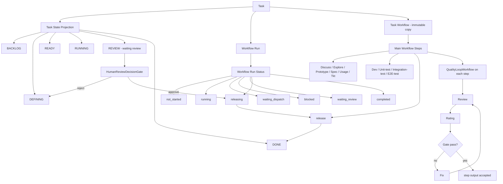
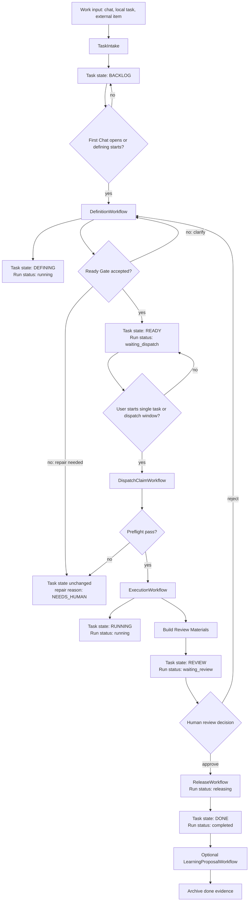
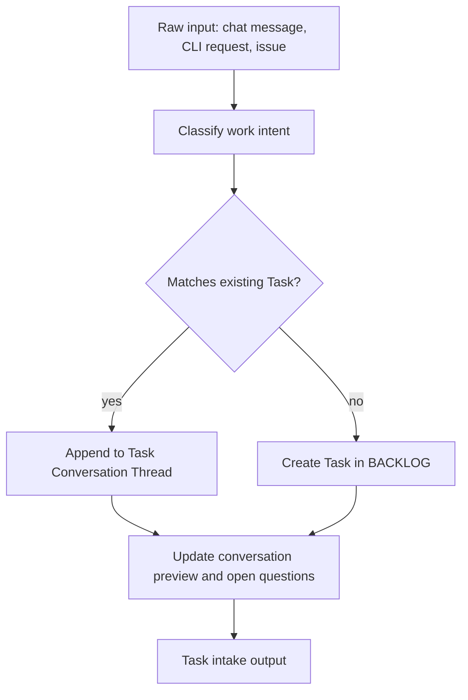
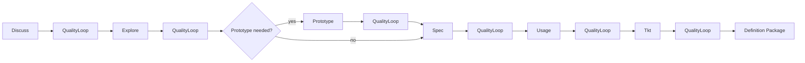
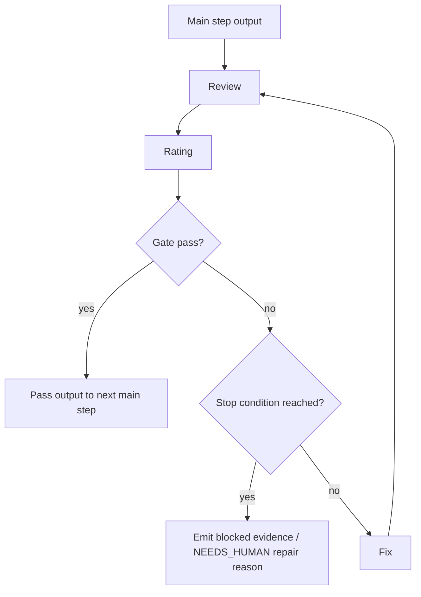
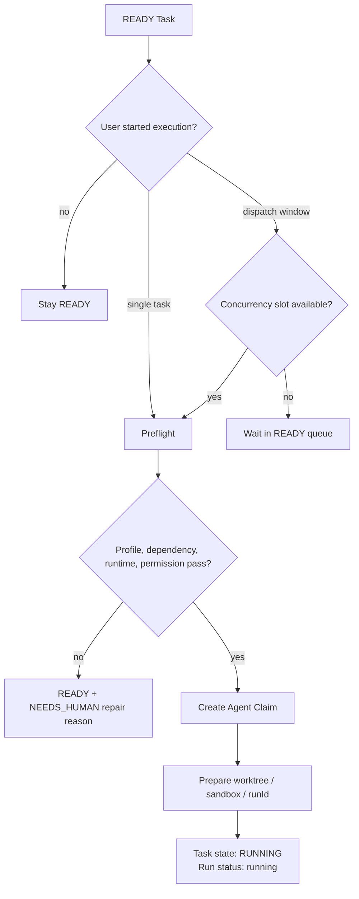
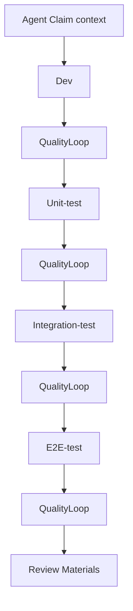
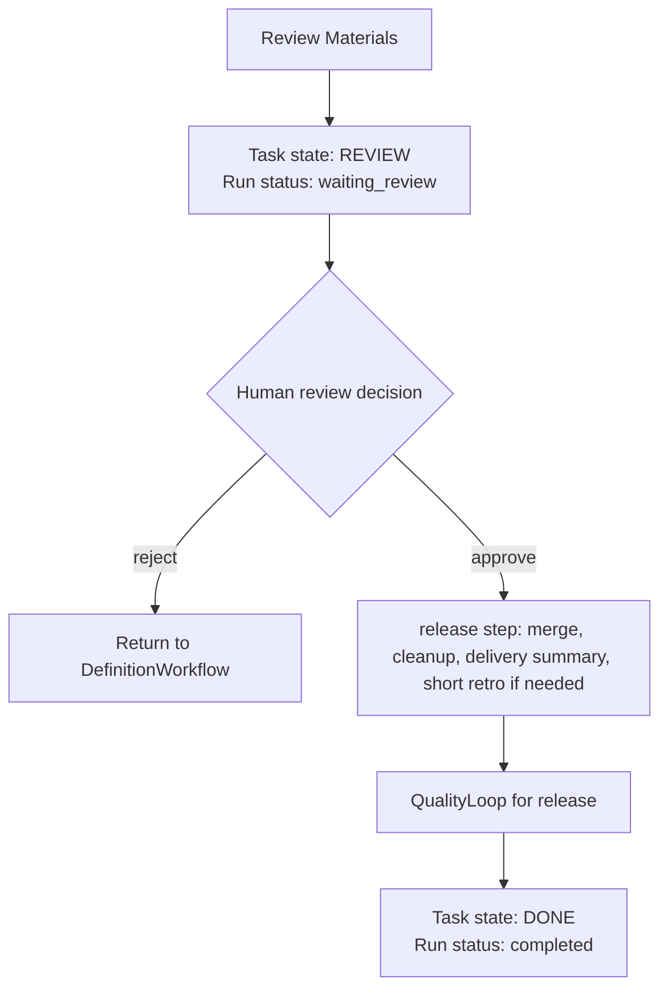
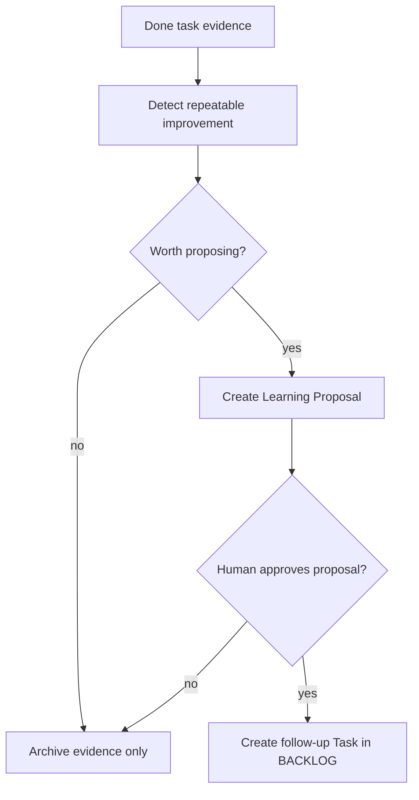
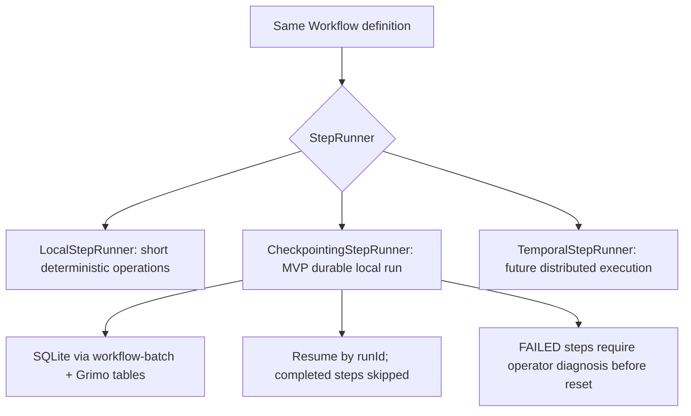

# Grimo Agent Workflow Definition

**Status:** Draft reference
**Last verified:** 2026-06-14
**Source:** Pollack AI Lab Agent Workflow

## Purpose

這份文件把 Grimo 的 Task workflow model 映射成 Pollack AI Lab `Agent Workflow` 可以表達的 workflow / step / gate / sub-workflow 形狀。

它不是 PRD 的替代品。PRD 定義產品承諾；這份文件只定義工程上如何把 Task State、Workflow Run Status、Workflow Step、Quality Loop、trace 和 checkpoint 對齊。

## Source Grounding

Pollack `Agent Workflow` 的關鍵定義：

- `Workflow` 由多個 `Step` 組成；每個 step 做一件事，可以是 deterministic function、single LLM call，或 agentic CLI session。
- `Gate` 評估 step output，將流程導向 pass / fail path。
- Context 透過 typed keys 在 steps 之間流動。
- Workflow definition 會編譯成 graph IR，definition 與 execution 分離；同一份 workflow 可由 `LocalStepRunner`、`CheckpointingStepRunner` 或 `TemporalStepRunner` 執行。
- 每個 step transition 可 trace；checkpoint runner 可用 `runId + stepName` 跳過已完成 step。
- `Workflow` 本身也實作 `Step`，所以 sub-workflow 可以放在 `.then()`、`.branch()`、`.onPass()`、`.onFail()`、`.parallel()` 等接受 step 的位置。

Sources:

- <https://lab.pollack.ai/projects/agent-workflow>
- <https://lab.pollack.ai/docs/agent-workflow/examples>
- <https://lab.pollack.ai/docs/agent-workflow/durability>

Code blocks labeled `Pollack shape` are design sketches, not compile-ready Java. They use Pollack DSL vocabulary to show graph shape and sub-workflow boundaries before implementation names and generic types are finalized.

## Canonical Model

Grimo 的 Task workflow 有四層，不能混成同一個欄位：

| Layer | Answers | Canonical examples |
| --- | --- | --- |
| Task State | 使用者在 board/list 上看到這件 Task 在哪裡 | `BACKLOG`, `DEFINING`, `READY`, `RUNNING`, `REVIEW`, `DONE` |
| Workflow Run Status | 這次 workflow execution 自己現在在做什麼 | `not_started`, `running`, `waiting_dispatch`, `blocked`, `waiting_review`, `releasing`, `completed` |
| Workflow Step | Task 目前跑到哪個主要專業節點 | `Discuss`, `Explore`, `Dev`, `E2E-test`, `release` |
| Step Sub-workflow | 單一 step 的品質循環做到哪裡 | `Review -> Rating -> Gate -> Fix` |

Key rules:

1. Task State is not a Pollack step. It is a product projection.
2. Workflow Run Status is not Task State. It describes execution lifecycle inside a Task.
3. `REVIEW` is a Task State where the user reviews completed Review Materials.
4. Quality Loop `Review` is an inner step that checks one Workflow Step output.
5. `release` is a Workflow Step/action after the user approves in `REVIEW`; it is not a Task State.
6. `DONE` is reached only after `release` completes.
7. Reject from `REVIEW` returns the Task to `DEFINING`, not `RUNNING`.
8. `NEEDS_HUMAN` is a repair reason on a Task State or Workflow Run Status, not a seventh board state.

## Pollack Mapping

| Grimo concept | Pollack Agent Workflow concept | Notes |
| --- | --- | --- |
| Project Workflow Recipe | `Workflow` definition | Project 選定 recipe；Task 建立時複製成 Task Workflow。 |
| Task Workflow | copied workflow definition / metadata | Immutable Task-owned copy; not active execution evidence. |
| Workflow Run | `WorkflowExecutor` run with stable `runId` | One execution attempt for a Task Workflow. |
| Workflow Run Status | run lifecycle state / projection | `not_started`, `running`, `waiting_dispatch`, `blocked`, `waiting_review`, `releasing`, `completed`; not board-facing Task State. |
| Workflow Step | `Step` or sub-workflow-as-step | `Discuss` can be interactive; `Dev` can be agentic CLI; `release` is the final step after approval. |
| Quality Loop | `Workflow` used as sub-workflow | `Review -> Rating -> Gate -> Fix` repeats until pass or stop condition. |
| Ready Gate | `Gate` plus human decision state | Moves Task to `READY` only after Definition Package is accepted. |
| Dispatcher preflight | deterministic `Step` + gate | Checks profile, dependencies, runtime, permissions, and dispatch window. |
| Agent Claim | deterministic `Step` | Creates claim, worktree/sandbox, execution context, and `runId`. |
| Review Materials | deterministic aggregation step | Built after `RUNNING` evidence is complete and before Task enters `REVIEW`. |
| Human Review Decision | product gate after Review Materials | Approve starts `release`; reject returns to `DEFINING`. |
| Release | final Workflow Step/action | Runs after approve; completion moves Task to `DONE`. |
| Workflow Evidence | trace + Grimo evidence tables | Pollack trace records transitions; Grimo tables preserve user-facing evidence. |
| Crash recovery | `CheckpointingStepRunner` | Completed steps can be skipped; failed steps require explicit recovery decision. |

## Task Workflow Shape



## Top-Level Workflow

這張圖是 Pollack workflow 角度；它不等於看板 state machine。Task State 和 Workflow Run Status 是 workflow / gate output 的產品投影。



## Sub-Workflow: Task Intake

Goal: 把入口內容保存成 Project-owned Task 或附加到既有 Task，不啟動正式 execution。



Pollack shape:

```java
Workflow.define("task-intake")
    .step(classifyWorkIntent)
    .branch(existingTaskFound)
        .then(appendToConversation)
        .otherwise(createBacklogTask)
    .then(updateConversationPreview)
    .then(emitTaskIntakeOutput);
```

## Sub-Workflow: Definition

Goal: 形成可由人類確認的 Definition Package。每個主要 step 都包 `QualityLoopWorkflow`。



Pollack shape:

```java
Workflow.define("definition")
    .step(discuss)
    .then(qualityLoop("discuss"))
    .then(explore)
    .then(qualityLoop("explore"))
    .branch(prototypeNeeded)
        .then(prototype)
        .then(qualityLoop("prototype"))
        .otherwise(skipPrototype)
    .then(spec)
    .then(qualityLoop("spec"))
    .then(usage)
    .then(qualityLoop("usage"))
    .then(tkt)
    .then(qualityLoop("tkt"))
    .then(buildDefinitionPackage);
```

## Sub-Workflow: Quality Loop

Goal: 對任一主要 step 的 output 做 review、rating、gate、fix，直到 Gate 通過或達到明確停止條件。



Pollack shape:

```java
Workflow.define("quality-loop")
    .repeatUntilOutput(qualityPassedOrStopped)
        .step(review)
        .then(rating)
        .then(routeGateResult)
        .then(fixIfNeeded)
    .end();
```

Implementation note: Pollack examples show both `repeatUntilOutput` and `gate` primitives. Grimo should keep the rating parser deterministic where possible, and store raw review/rating/fix evidence in Grimo tables when it affects user-facing Review Materials or recovery.

## Sub-Workflow: Dispatch Claim

Goal: `READY` 不等於自動執行；只有使用者啟動 dispatch window 或單一 Task 後，才進 preflight 與 claim。



Pollack shape:

```java
Workflow.define("dispatch-claim")
    .gate(userExecutionWindowGate)
        .onFail(stayReady)
        .onPass(checkCapacity)
    .then(preflight)
    .gate(preflightGate)
        .onPass(createAgentClaim)
        .onFail(markNeedsHuman)
    .end();
```

## Sub-Workflow: Execution

Goal: 在 `RUNNING` 裡完成 Dev、Unit-test、Integration-test 和 E2E-test evidence，並建立 Review Materials。



Pollack shape:

```java
Workflow.define("execution")
    .step(devAgentStep)
    .then(qualityLoop("dev"))
    .then(runUnitTests)
    .then(qualityLoop("unit-test"))
    .then(runIntegrationTests)
    .then(qualityLoop("integration-test"))
    .then(runE2eTests)
    .then(qualityLoop("e2e-test"))
    .then(buildReviewMaterials);
```

## Gate: Human Review Decision And Release

Goal: 人類在 `REVIEW` 檢視 Review Materials 後決定 approve / reject。Approve 後才執行 `release`；release 完成後才進 `DONE`。



Pollack shape:

```java
Workflow.define("review-release")
    .gate(humanReviewDecisionGate)
        .onFail(returnToDefinition)
        .onPass(release)
    .then(qualityLoop("release"))
    .then(markDone);
```

## Sub-Workflow: Learning Proposal

Goal: 從 Done task evidence 提出 skill / recipe 改善，但不自動套用。



Pollack shape:

```java
Workflow.define("learning-proposal")
    .step(detectRepeatableImprovement)
    .gate(proposalWorthItGate)
        .onFail(archiveEvidenceOnly)
        .onPass(createLearningProposal)
    .end();
```

## Context Keys

Minimum typed context keys for the MVP definition:

| Context key | Type | Producer | Consumer |
| --- | --- | --- | --- |
| `project_id` | `ProjectId` | task intake | all steps |
| `task_id` | `TaskId` | task intake | all steps |
| `task_state` | `TaskState` | gates / projection steps | UI projection |
| `workflow_run_status` | `WorkflowRunStatus` | workflow executor / gates | task detail, recovery, dispatch |
| `workflow_recipe_id` | `WorkflowRecipeId` | Project settings | workflow executor |
| `run_id` | `String` | dispatch claim | checkpoint / trace |
| `agent_profile_id` | `AgentProfileId` | ready gate / dispatcher | dispatch / execution |
| `definition_package` | `DefinitionPackage` | definition workflow | ready gate / review |
| `current_step` | `WorkflowStepKey` | workflow executor | task detail / workflowSummary |
| `quality_score` | `QualityScore` | rating step | quality gate |
| `review_findings` | `ReviewFindings` | Quality Loop review step | fix / materials |
| `fix_history` | `FixHistory` | Quality Loop fix step | review / materials |
| `acceptance_evidence` | `AcceptanceEvidence` | execution workflow | human review |
| `review_materials` | `ReviewMaterials` | execution workflow | human review |
| `human_review_decision` | `APPROVE` / `REJECT` | human review gate | release / redefine path |
| `release_evidence` | `ReleaseEvidence` | release workflow | done / learning / follow-up task |

## Execution Runner Decision



MVP decision: use `CheckpointingStepRunner` for Task execution runs that need durability. Keep `LocalStepRunner` for short deterministic operations where replay is cheap. Do not design MVP around Temporal.

## Open Design Questions

1. How long should a `QualityLoopWorkflow` run before emitting blocked evidence or a `NEEDS_HUMAN` repair reason?
2. Should `Discuss` be one interactive sub-workflow instance, or multiple resumable chat turns under the same step checkpoint?
3. Which `Workflow Run Status` values are persisted source-of-truth rows, and which are derived UI projections?
4. Which workflow evidence belongs in Pollack trace only, and which must be duplicated into Grimo domain tables for user-facing review?
5. How should external Codex / Claude Code workers map their own session IDs to Grimo `run_id` and `Agent Claim`?
