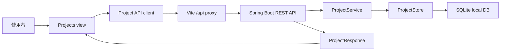

# S001: Project Onboarding With Workflow Selection

> 規格：S001 | 大小：M(12) | 狀態：✅ local verification PASS  
> 日期：2026-05-31  
> 對應：PRD §0.1, §0.6, §2, §4 P15 / ADR-001 / spec-roadmap row S001

---

## 1. 目標

讓使用者能在 Grimo 建立第一個 Project，選擇 Project-level Workflow Recipe，並透過真正的 frontend -> backend API 串接看到 Project 被建立。

這是第一個 full-stack vertical slice：前端仍用 Vite dev server，後端用 Spring Boot dev server，開發環境由 Vite `/api` proxy 串接。此 spec 不建立 Task、不啟動 agent、不實作 Ready Gate；它只完成 Project context 這個所有後續 Task 工作的入口。

相依狀態：

| 相依 | 類型 | 狀態 | 對 S001 的影響 |
| --- | --- | --- | --- |
| PRD | Product direction | exists | Project 是 Task 與 workflow 的歸屬單位。 |
| ADR-001 | Architecture decision | accepted | SQLite 是 local-first MVP persistence path。 |
| `docs/grimo/architecture.md` | Project planning baseline | created for S001 | 記錄前後端分開啟動與 module map。 |
| `docs/grimo/specs/spec-roadmap.md` | Roadmap | created for S001 | S001 是第一個 active spec。 |

## 2. 研究與設計

### 2.1 查到的事實

| 來源 | 查到什麼 | 對設計的影響 |
| --- | --- | --- |
| `docs/grimo/PRD.md` | Project 決定 workflow 和品質基準；Task 繼承 Project workflow。 | Project create form 必須包含 workflow recipe；Task create 不處理 workflow 選擇。 |
| `docs/grimo/glossary.md` | Project 是本機 repo/codebase；Workflow Recipe 是 Project-level。 | Domain 名稱使用 `Project` 與 `WorkflowRecipe`，避免把 recipe 當 Task label。 |
| `docs/grimo/adr/ADR-001-pollack-workflow-sqlite-poc.md` | SQLite + Xerial JDBC 已被接受為 local-first MVP path；JPA + SQLite dialect 只在 Pollack workflow-batch POC 被驗證。 | S001 使用 backend-owned local persistence，不做 frontend-only state；Project table 不必跟 Pollack POC 一樣使用 JPA。 |
| `docs/grimo/references/grimo-agent-workflow-definition.md` | Project Workflow Recipe 映射到 Pollack `Workflow` definition，但 board state 是 product projection。 | S001 只保存 recipe identity，不執行 workflow graph。 |
| `docs/grimo/ui/prototype/index.html` | Prototype Projects view 已有 name、description、folder、workflow select 與新增後設為目前專案的行為。 | UI 沿用 prototype form shape，新增 API loading/error/success state。 |
| `frontend/src/features/projects/Projects.tsx` | 目前 Projects view 是 fixture-only panel，沒有 backend API。 | S001 要把它改成可載入、送出、顯示 backend data。 |
| `backend/build.gradle.kts` | Backend 目前只有 `spring-boot-starter` production dependency；JPA/SQLite 在 test scope。 | S001 需要新增 production web/persistence dependencies。 |
| Spring Boot 4 migration / web docs | Spring Boot 4 將 Spring MVC starter/test module 明確拆到 `spring-boot-starter-webmvc` 與 `spring-boot-starter-webmvc-test`；reference web page 仍提到泛用 web starter。 | S001 使用 Spring Boot 4 的 Web MVC-specific starter/test module，避免沿用舊 import path。 |
| Spring Framework validation docs | Spring MVC 支援 `@Valid` request body validation。 | `CreateProjectRequest` 用 Bean Validation 做基本必填/長度檢查。 |
| Spring Boot SQL docs | Spring Boot 4 會在 `spring-boot-starter-jdbc` 或 `spring-boot-starter-data-jpa` 上自動帶 HikariCP；`spring-boot-starter-data-jdbc` 可 auto-configure Spring Data JDBC repositories。 | S001 可以走 Spring JDBC / Spring Data JDBC stack，不必先導入 JPA。 |
| Spring Data Relational docs | Spring Data JDBC direct dialect support 清單沒有 SQLite；文件說 unsupported database 會讓 app 無法啟動，必須提供自己的 `JdbcDialect` 或 provider。 | 若採 Spring Data JDBC repositories + SQLite，S001 必須先 POC custom dialect；否則改用 Spring JDBC / `JdbcClient` 直接寫 SQL。 |
| Vite server options docs | Vite `server.proxy` 可以將符合規則的 request 轉發，不再被 Vite transform。 | Frontend API 使用 relative `/api/projects`，dev proxy 到 Spring Boot。 |
| Playwright webServer docs | Playwright config 可啟動一個或多個 dev server，並可設定 `reuseExistingServer`。 | S001 full-stack test 可同時啟動 Vite 與 backend。 |
| React `<form>` docs | React 19 支援以 `<form>` 組成互動提交流程。 | S001 用原生 form submit + local state 管理 pending/error，不加 form library。 |
| npm registry latest metadata | `react@19.2.6`, `vite@8.0.14`, `@vitejs/plugin-react@6.0.2`, `@playwright/test@1.60.0` 都是目前 registry latest；Vite / plugin-react 要求 Node `^20.19.0 || >=22.12.0`。 | 既有 frontend pins 可保留；本機 `node v26.1.0` 符合 Vite engine。 |

Research citations:

- Spring Boot Web: <https://docs.spring.io/spring-boot/reference/web/index.html>
- Spring Boot 4 migration guide: <https://github.com/spring-projects/spring-boot/wiki/Spring-Boot-4.0-Migration-Guide>
- Spring Boot WebMvcTest: <https://docs.spring.io/spring-boot/api/java/org/springframework/boot/webmvc/test/autoconfigure/WebMvcTest.html>
- Spring MVC validation: <https://docs.spring.io/spring-framework/reference/web/webmvc/mvc-controller/ann-validation.html>
- Spring Boot SQL databases: <https://docs.spring.io/spring-boot/reference/data/sql.html>
- Spring Data JDBC getting started / dialects: <https://docs.spring.io/spring-data/relational/reference/jdbc/getting-started.html>
- Vite server proxy: <https://vite.dev/config/server-options>
- Playwright web server: <https://playwright.dev/docs/test-webserver>
- React form: <https://react.dev/reference/react-dom/components/form>
- npm registry latest metadata: <https://registry.npmjs.org/vite/latest>, <https://registry.npmjs.org/react/latest>, <https://registry.npmjs.org/@playwright/test/latest>, <https://registry.npmjs.org/@vitejs/plugin-react/latest>

### 2.2 架構設計

S001 採用 user-confirmed development topology：



Domain model：

| Concept | Behavior-bearing fields | Display-only fields |
| --- | --- | --- |
| `Project` | `id`, `folderPath`, `workflowRecipeId`, `status` | `name`, `description`, `workflowRecipeName` |
| `WorkflowRecipe` | `id` | `name`, `description`, `category` |

Behavior rules：

1. `folderPath` 是 Project 的 local repo/codebase binding，S001 中同一路徑不可重複建立。
2. `workflowRecipeId` 必須存在於 backend 支援的 recipe catalog。
3. S001 不檢查資料夾是否真的存在，也不啟動 runtime capability preflight；這留給後續 Project readiness spec。
4. `WorkflowRecipe` 分類只影響 UI 顯示，不改變 S001 的 create behavior。

低保真 UI sketch：

```text
Projects view
┌────────────────────────────────────────────────────────────────┐
│ 專案管理                                  [本地優先] [本機資料夾] │
├───────────────────────────────┬────────────────────────────────┤
│ Project list                  │ 新增專案                       │
│ ┌───────────────────────────┐ │ 名稱                           │
│ │ grimo/frontend            │ │ [grimo/web________________]    │
│ │ /frontend                 │ │ 描述                           │
│ │ 工作流: 開發工作流         │ │ [本機 AI 開發工作台________]    │
│ │ 狀態: active              │ │ 專案資料夾                     │
│ └───────────────────────────┘ │ [/Users/.../grimoAPP_______]   │
│ ┌───────────────────────────┐ │ 專案工作流                     │
│ │ newly-created project     │ │ [開發工作流          v]        │
│ └───────────────────────────┘ │                                │
│                               │ [新增專案]                     │
│                               │ error/success message          │
└───────────────────────────────┴────────────────────────────────┘

Loading:
- project list shows "載入專案中..."
- submit button disabled with "建立中..."

Failure:
- validation error stays in form area
- existing project list is not overwritten

This is not final pixel design and not a new design system.
```

### 2.3 做法比較

| 做法 | 採用 | 理由 |
| --- | --- | --- |
| A: Vite dev server + Spring Boot backend + `/api` proxy + SQLite persistence through Spring JDBC stack | yes | 使用者已確認前後端分別啟動；SQLite 符合 local-first；Spring JDBC stack 比 JPA 更貼近本地檔案 DB 與 simple Project table。 |
| B: Frontend local state / fixture only | no | 開發最快，但不能證明 backend API、persistence、Vite proxy 或 full-stack test。 |
| C: Spring Boot serve built frontend | no | 適合 packaging spec，不適合目前 Vite POC 與快速 UI iteration。 |
| D: In-memory backend repository first | no | 可降低 DB 成本，但和 ADR-001 / local-first Project source of truth 不一致；重啟後資料消失會削弱第一功能價值。 |
| E: Spring Data JPA + Hibernate SQLite dialect | no for S001 | Pollack workflow-batch POC 已驗證可用，但對 Project CRUD 來說 ORM 成本較高，也會把 S001 綁到 Hibernate dialect。 |
| F: Spring Data JDBC repository + custom SQLite `JdbcDialect` | POC-required | 符合「Spring Data JDBC + SQLite」方向，但官方文件未 direct support SQLite；要先證明 custom dialect 能讓 app 啟動、CRUD round-trip、duplicate constraint 都正常。 |

Chosen approach:

- Backend owns Project and recipe catalog.
- Frontend uses backend API for list/create.
- Vite dev proxy connects frontend and backend in local dev.
- S001 adds the first full-stack Playwright path.
- Persistence target is SQLite via Spring JDBC stack. Prefer Spring Data JDBC only after POC validates SQLite dialect support; otherwise use `JdbcClient` / `NamedParameterJdbcTemplate` for S001.

### 2.4 Task 邊界提示

| Task 候選 | Class / file | 來源 | 正向情境 | 反向情境 | POC |
| --- | --- | --- | --- | --- | --- |
| T00 Persistence POC | `poc/S001/*` or focused test class | Spring Data Relational docs + ADR-001 | Spring Data JDBC + SQLite can start and persist Project through repository with custom dialect | app fails fast without unsupported dialect, or CRUD/constraint behavior is unreliable | required if using Spring Data JDBC repositories |
| T01 Backend dependencies/config | `backend/build.gradle.kts`, `application.yaml` | architecture + ADR-001 | Spring Boot can start web + SQLite with temporary test DB | no production code depends on test-scoped persistence dependency | not required after T00 decision |
| T02 Project API | `project/*Controller`, `ProjectService`, `ProjectStore` | PRD Project + local-first | `POST /api/projects` returns created project and `GET /api/projects` lists it | invalid request returns 400; duplicate `folderPath` returns 409 | not required |
| T03 Frontend Projects API wiring | `Projects.tsx`, `project` domain/client files, `vite.config.ts` | prototype Projects view | form submit creates Project through `/api/projects` and selects it | failed request shows error and preserves existing list | not required |
| T04 Full-stack verification | `frontend/e2e/project-onboarding.fullstack.spec.ts`, `playwright.config.ts`, `scripts/verify-release.sh` | QA strategy + Playwright docs | Playwright creates Project through real browser/API path | test fails if backend is down or UI uses fixtures only | not required |

## 3. 驗收條件（SBE）

驗證命令：

執行：`scripts/verify-release.sh`

通過條件：所有帶 `S001` AC id 的 backend、frontend、full-stack tests 都是綠燈；full-stack test 必須使用 real `/api` wiring，不可 mock Project create response。

BDD / acceptance confirmation status:

- 已確認：前端與後端分別啟動，方便開發環境測試。
- 待使用者確認：duplicate `folderPath` 是否應回 `409 Conflict`、S001 是否需要立即持久化到 SQLite。

| AC | 優先級 | 驗證方式 | 標題 |
| --- | --- | --- | --- |
| AC-S001-1 | 必做 | Test | Backend exposes workflow recipe catalog |
| AC-S001-2 | 必做 | Test | Backend creates and lists Project |
| AC-S001-3 | 必做 | Test | Backend rejects invalid or duplicate Project create |
| AC-S001-4 | 必做 | Test + Demonstration | Frontend creates Project through real `/api` call |
| AC-S001-5 | 必做 | Test | Vite proxy connects frontend `/api` to Spring Boot backend |
| AC-S001-6 | 必做 | Inspection + Test | Release gate includes backend and full-stack verification |

**AC-S001-1: Backend exposes workflow recipe catalog**

- Given（前提）backend starts with the S001 default recipe catalog
- When（動作）a client sends `GET /api/workflow-recipes`
- Then（結果）response is `200 OK`
- And（而且）body contains an item with `id="coding"` and `name="開發工作流"`
- And（而且）body may include research/content recipes for display, but S001 create behavior is identical for every valid recipe id

**AC-S001-2: Backend creates and lists Project**

- Given（前提）no Project exists with `folderPath="/Users/samzhu/workspace/github-samzhu/grimoAPP"`
- When（動作）a client sends `POST /api/projects` with `name="grimoAPP"`, that `folderPath`, `description="本機 AI 開發工作台"`, and `workflowRecipeId="coding"`
- Then（結果）response is `201 Created`
- And（而且）body contains non-empty `id`, `name="grimoAPP"`, `folderPath`, `workflowRecipeId="coding"`, `workflowRecipeName="開發工作流"`, and `status="ACTIVE"`
- And（而且）a following `GET /api/projects` includes the created Project

**AC-S001-3: Backend rejects invalid or duplicate Project create**

- Given（前提）a Project already exists with `folderPath="/Users/samzhu/workspace/github-samzhu/grimoAPP"`
- When（動作）a client sends `POST /api/projects` with the same `folderPath`
- Then（結果）response is `409 Conflict`
- And（而且）the existing Project remains unchanged
- And（而且）when `name`, `folderPath`, or `workflowRecipeId` is blank or unknown, response is `400 Bad Request` with a user-readable error body

**AC-S001-4: Frontend creates Project through real `/api` call**

- Given（前提）the user opens the Projects view in the Vite app and backend has no Project named `grimoAPP`
- When（動作）the user fills `名稱`, `描述`, `專案資料夾`, selects `開發工作流`, and clicks `新增專案`
- Then（結果）the button shows a pending state while the request is in flight
- And（而且）after success, the new Project appears in the Project list
- And（而且）the topbar current project context shows the created Project name and folder
- And（而且）the form clears only after a successful backend response

**AC-S001-5: Vite proxy connects frontend `/api` to Spring Boot backend**

- Given（前提）Playwright starts or reuses both Vite and Spring Boot dev servers
- When（動作）the browser submits the Projects form
- Then（結果）the request URL observed by the browser is `/api/projects`
- And（而且）the response data comes from Spring Boot, proven by a follow-up `GET /api/projects` returning the created Project
- And（而且）the test fails if backend is unavailable

**AC-S001-6: Release gate includes backend and full-stack verification**

- Given（前提）S001 implementation is complete
- When（動作）`scripts/verify-release.sh` runs
- Then（結果）the log at `temp/verify-release.log` contains sections for frontend build, frontend visual regression, backend tests, and S001 full-stack Project onboarding
- And（而且）the script exits non-zero if any CRITICAL command fails

### 非功能需求檢查

| 分類 | 對應驗收 | 說明 |
| --- | --- | --- |
| Performance | AC-S001-2 | Backend API tests should assert Project list/create completes within 500ms against temporary SQLite with <= 20 projects. |
| Security | AC-S001-3 | User input is validated; S001 does not execute `folderPath`, shell commands, or provider credentials. Spring Security remains permit-all for MVP development. |
| Reliability | AC-S001-2, AC-S001-3 | Duplicate create must not overwrite existing Project; invalid workflow id must not create partial rows. |
| Usability | AC-S001-4 | User sees pending, success, and error states in the form area. |
| Maintainability | AC-S001-6 | Canonical verification script records backend/full-stack evidence; API request/response records avoid exposing persistence row / entity directly. |

## 4. 介面與 API 設計

### Backend API

```http
GET /api/workflow-recipes
```

Response:

```json
[
  {
    "id": "coding",
    "name": "開發工作流",
    "description": "Discuss / Explore / Prototype / Spec / Usage / Tkt / Dev / Auto-Review / Unit-test fe/be / Integration-test / E2E-test / Release",
    "category": "development"
  }
]
```

```http
GET /api/projects
```

Response:

```json
[
  {
    "id": "prj_01",
    "name": "grimoAPP",
    "description": "本機 AI 開發工作台",
    "folderPath": "/Users/samzhu/workspace/github-samzhu/grimoAPP",
    "workflowRecipeId": "coding",
    "workflowRecipeName": "開發工作流",
    "status": "ACTIVE",
    "createdAt": "2026-05-31T10:00:00Z",
    "updatedAt": "2026-05-31T10:00:00Z"
  }
]
```

```http
POST /api/projects
Content-Type: application/json
```

Request:

```json
{
  "name": "grimoAPP",
  "description": "本機 AI 開發工作台",
  "folderPath": "/Users/samzhu/workspace/github-samzhu/grimoAPP",
  "workflowRecipeId": "coding"
}
```

Status behavior:

| Case | Status | Body |
| --- | --- | --- |
| Created | `201 Created` | `ProjectResponse` |
| Missing required field | `400 Bad Request` | `{ "error": "請填寫專案名稱與對應資料夾" }` or field-specific message |
| Unknown workflow recipe | `400 Bad Request` | `{ "error": "未知的專案工作流" }` |
| Duplicate folder path | `409 Conflict` | `{ "error": "這個資料夾已綁定到既有專案" }` |

### Backend Types

```java
record CreateProjectRequest(
    String name,
    String description,
    String folderPath,
    String workflowRecipeId
) {}

record ProjectResponse(
    String id,
    String name,
    String description,
    String folderPath,
    String workflowRecipeId,
    String workflowRecipeName,
    String status,
    Instant createdAt,
    Instant updatedAt
) {}

record WorkflowRecipeResponse(
    String id,
    String name,
    String description,
    String category
) {}
```

Implementation notes:

- Add validation annotations in implementation (`@NotBlank`, `@Size`) rather than relying on frontend only.
- API returns records, not persistence rows/entities.
- `WorkflowRecipe` catalog can be a static backend catalog in S001; Pollack workflow graph execution is out of scope.
- If T00 proves Spring Data JDBC + SQLite with a custom `JdbcDialect`, `ProjectStore` may be a Spring Data JDBC repository. If not, implement `ProjectStore` with Spring JDBC / `JdbcClient` and explicit SQL.

### Frontend Types

```ts
export type WorkflowRecipe = {
  id: string;
  name: string;
  description: string;
  category: string;
};

export type Project = {
  id: string;
  name: string;
  description: string;
  folderPath: string;
  workflowRecipeId: string;
  workflowRecipeName: string;
  status: "ACTIVE" | "NEEDS_CHECK";
  createdAt: string;
  updatedAt: string;
};

export type CreateProjectInput = {
  name: string;
  description: string;
  folderPath: string;
  workflowRecipeId: string;
};
```

Frontend rules:

- Use `fetch("/api/projects")`, not hardcoded `http://localhost:8080`.
- Existing list stays visible during create failure.
- Do not add new UI library or form library for S001.

### Vite Proxy

```ts
server: {
  proxy: {
    "/api": "http://127.0.0.1:8080"
  }
}
```

### Playwright Full-Stack Test Shape

S001 should either extend `frontend/playwright.config.ts` or add a dedicated full-stack config that starts:

- frontend: `npm run dev -- --port 5173`
- backend: `./gradlew bootRun` from `backend/`

Use temporary backend datasource config for tests so Playwright does not write to the user's real Grimo database.

## 5. 檔案規劃

| 檔案 | 動作 | 說明 |
| --- | --- | --- |
| `backend/build.gradle.kts` | modify | Add production `spring-boot-starter-webmvc`, `spring-boot-starter-validation`, `spring-boot-starter-data-jdbc` or `spring-boot-starter-jdbc`, SQLite runtime dependencies, and test `spring-boot-starter-webmvc-test` as needed. |
| `backend/src/main/resources/application.yaml` | modify | Add local SQLite datasource defaults with test override support. |
| `backend/src/main/java/io/github/samzhu/grimo/project/ProjectRecord.java` | new if needed | Project persistence row / aggregate for JDBC mapping. |
| `backend/src/main/java/io/github/samzhu/grimo/project/ProjectStore.java` | new | Project persistence port; implemented by Spring Data JDBC repository only if T00 passes, otherwise by Spring JDBC / `JdbcClient`. |
| `backend/src/main/java/io/github/samzhu/grimo/project/ProjectService.java` | new | Project create/list business rules. |
| `backend/src/main/java/io/github/samzhu/grimo/project/ProjectController.java` | new | `/api/projects` and `/api/workflow-recipes`. |
| `backend/src/test/java/io/github/samzhu/grimo/project/ProjectControllerTests.java` | new | AC-S001-1/2/3 API tests using Spring Boot 4 `org.springframework.boot.webmvc.test.autoconfigure.WebMvcTest`. |
| `backend/src/test/java/io/github/samzhu/grimo/project/ProjectServiceTests.java` | new | Duplicate and validation behavior with temporary DB. |
| `frontend/vite.config.ts` | modify | Add `/api` proxy to Spring Boot dev server. |
| `frontend/src/domain/project/project-types.ts` | new | Frontend Project and WorkflowRecipe types. |
| `frontend/src/features/projects/project-api.ts` | new | Feature-local API client for list/create/recipes. |
| `frontend/src/features/projects/Projects.tsx` | modify | Load projects/recipes, submit create form, render pending/error/success/current project. |
| `frontend/e2e/project-onboarding.fullstack.spec.ts` | new | AC-S001-4/5 browser test against real `/api` path. |
| `frontend/e2e/task-workbench.visual.spec.ts` | modify if needed | Keep existing visual baselines stable if Projects view screenshot coverage is added. |
| `frontend/playwright.config.ts` | modify | Add full-stack webServer setup or project-specific config. |
| `scripts/verify-release.sh` | modify | Include backend tests and S001 full-stack verification. |
| `docs/grimo/qa-strategy.md` | modify | Keep registry aligned with backend/full-stack checks. |
| `docs/grimo/specs/spec-roadmap.md` | modify | Keep S001 status up to date. |

---

<!-- Sections 6-7 added by /planning-tasks after implementation -->

## 6. Task 規劃

POC：not required — Spring Data JDBC repository + SQLite direct support 已由官方 Spring Data Relational docs 判定不是 direct support；S001 不自建 `JdbcDialect`，改用 `spring-boot-starter-jdbc` + Spring JDBC `JdbcClient` / explicit SQL 完成 Project persistence。這保留 Spring JDBC stack 與 SQLite 方向，同時避免第一個功能卡在 repository dialect SPI。

| # | Task | AC | 狀態 |
| --- | --- | --- | --- |
| T01 | Backend Project API with SQLite persistence | AC-S001-1, AC-S001-2, AC-S001-3 | PASS |
| T02 | Frontend Projects view uses backend API | AC-S001-4 | PASS |
| T03 | Full-stack verification and release gate | AC-S001-5, AC-S001-6 | PASS |

執行順序：T01 → T02 → T03

### POC Findings

- Verified decision: Spring Data JDBC repositories require a supported dialect; SQLite is not listed in Spring Data Relational 4.0 direct dialect support.
- Correct S001 usage pattern: add `spring-boot-starter-jdbc` for Spring JDBC infrastructure, use Xerial SQLite JDBC as runtime driver, and implement Project persistence with explicit SQL through Spring JDBC APIs.
- Deferred: custom SQLite `JdbcDialect` for Spring Data JDBC repositories can be reconsidered after S001 if repository mapping becomes valuable enough to justify the SPI work.

## 7. Implementation Results

Local implementation result: PASS on 2026-05-31.

| Check | Evidence |
| --- | --- |
| Backend Project API | `backend/gradlew -p backend test --tests '*ProjectApiTests'` passed after RED verified SQLite is unsupported as a direct Spring Data JDBC repository dialect. |
| Frontend compile/build | `npm --prefix frontend run build` passed. |
| Full release gate | `scripts/verify-release.sh` exited 0 and wrote `temp/verify-release.log`. |
| Browser/API wiring | `frontend/e2e/project-onboarding.fullstack.spec.ts` passed by creating a Project in the browser, then reading the same Project through `/api/projects`. |

Implemented files:

- Backend Project API and SQLite persistence: `backend/src/main/java/io/github/samzhu/grimo/project/*`, `backend/src/main/resources/schema.sql`, `backend/src/main/resources/application.yaml`, `backend/build.gradle.kts`.
- Frontend Project API wiring: `frontend/src/features/projects/Projects.tsx`, `frontend/src/features/projects/project-api.ts`, `frontend/src/domain/project/project-types.ts`, `frontend/src/App.tsx`, `frontend/vite.config.ts`.
- Verification: `frontend/playwright.fullstack.config.ts`, `frontend/e2e/project-onboarding.fullstack.spec.ts`, `scripts/verify-release.sh`.

Follow-up:

- Run `$verifying-quality S001` as the independent QA review before `$shipping-release S001`.
- Spring Data JDBC repository support for SQLite remains deferred until a custom `JdbcDialect` POC is worth the added SPI work.
