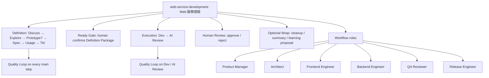
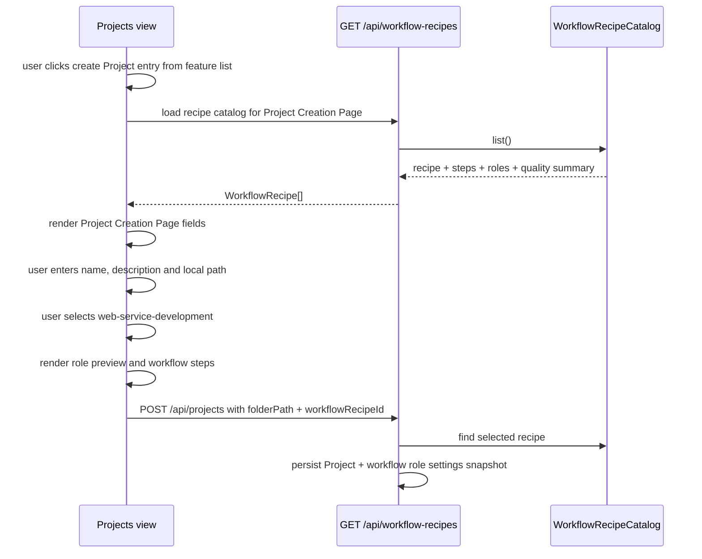

# S002: Workflow Recipe Role Defaults During Project Creation

> 規格：S002 | 大小：S(10) | 狀態：🟡 BDD confirmation in progress  
> 日期：2026-05-31  
> 最後更新：2026-06-01  
> 對應：PRD §0.5, §2, §4 P3/P4/P15 / `docs/grimo/references/grimo-agent-workflow-definition.md` / spec-roadmap row S002

---

## 1. 目標

使用者從功能列表按「建立專案」進入 Project Creation Page；頁面顯示專案名稱、專案描述、專案路徑、工作流下拉選單，以及隨工作流切換的角色列表。所有欄位選好後，使用者才按頁面上的「建立專案」submit action，Grimo 保存 workflow 和該 workflow 預先設定好的角色基本設定。

S001 已經完成 Project create + workflow recipe selection，但 recipe catalog 只有 `id/name/description/category`，Project 也只保存 `workflowRecipeId`。S002 把第一個具體 workflow 定義為 `web-service-development` workflow recipe，並在 Project Creation Page 顯示它的 roles、主要 steps 和 Quality Loop 摘要；建立 Project 時，backend 會從 selected workflow snapshot 出 Project role settings。

相依狀態：

| 相依 | 類型 | 狀態 | 對 S002 的影響 |
| --- | --- | --- | --- |
| S001 | Code-level | local verification PASS | S002 修改 S001 的 `/api/workflow-recipes` response shape、Project create persistence 和 Projects view；implementation 必須基於 S001 code。 |
| PRD P3/P4/P15 | Product decision | exists | Agent Profile 是薄角色；Workflow Recipe 是 Project-level；Project Creation Page 先選 workflow，再進 Task workbench。 |
| Workflow reference | Design reference | exists | 已定義 Coding Task Recipe 的 main steps、Quality Loop 和 Pollack mapping。 |

Spec overlap scan：

- S001 overlaps on the same Project creation flow, but S001 only proves workflow recipe selection and Project persistence. S002 adds role metadata and first concrete recipe definition; it does not supersede S001.
- Existing backlog S002 was Task creation. Because role visibility belongs before Task creation, roadmap shifts Task creation to S003.

## 2. 研究與設計

### 2.1 查到的事實

| 來源 | 查到什麼 | 對設計的影響 |
| --- | --- | --- |
| `docs/grimo/PRD.md` §0.5, §2, P3, P4 | MVP 預設 Coding Task Recipe；Project 層級選 Workflow Recipe；Agent Profile 是薄角色入口，不是厚 AI coworker。 | S002 的角色清單應是 workflow recipe metadata，先用於顯示和後續 assignment，不要建 persona/inbox。 |
| `docs/grimo/references/grimo-agent-workflow-definition.md` | Grimo Coding Task Workflow 包含 TaskIntake、Definition、ReadyGate、DispatchClaim、Execution、HumanReview、Wrap、LearningProposal；Definition steps 是 Discuss / Explore / Prototype / Spec / Usage / Tkt，Execution steps 是 Dev / AI Review。 | `web-service-development` recipe 必須至少列出 main steps、Quality Loop summary 和角色負責區段。 |
| Pollack Agent Workflow overview: https://lab.pollack.ai/projects/agent-workflow | Workflow 由 steps 組成，quality gates 評估 output；typed context 串起 steps；workflow definition 與 execution runtime 分離。 | 角色清單不等於 runtime execution；可先由 Grimo catalog 暴露 definition metadata，之後再映射到 Pollack `Workflow` execution。 |
| Pollack DSL examples: https://lab.pollack.ai/docs/agent-workflow/examples | DSL 支援 sequential pipeline、branch、repeat-until、gate、parallel、supervisor 和 sub-workflow composition；`Workflow` 可作為 nested step。 | Coding workflow 可表達成 steps + Quality Loop sub-workflow；UI 應顯示 workflow steps，而不是把角色誤當 board state。 |
| `docs/grimo/architecture.md` arc42 Runtime And Environment View — Project Creation | S002 runtime is local Browser + Vite dev server + local Spring Boot backend + SQLite; Project is backend-owned and `folderPath` arrives through JSON. | `POST /api/projects.folderPath` is the authoritative Project workspace binding. Once Spring Boot receives the JSON path, later Grimo backend features can operate that local workspace. |
| MDN `showDirectoryPicker()`: https://developer.mozilla.org/docs/Web/API/Window/showDirectoryPicker | Browser directory picker displays a directory picker, requires user activation, and returns a `FileSystemDirectoryHandle`. | Browser picker is not the source of `POST /api/projects.folderPath` in the current Spring Boot backend-owned workspace model. |
| MDN `FileSystemDirectoryHandle`: https://developer.mozilla.org/en-US/docs/Web/API/FileSystemDirectoryHandle | `resolve()` returns path components relative to another directory handle; the browser handle is not a portable backend absolute path. | If the UI needs a browse experience for backend workspace paths, use a backend local-directory API; do not assume browser JS can expose absolute paths. |
| `backend/src/main/java/io/github/samzhu/grimo/project/WorkflowRecipeCatalog.java` | 目前 catalog 是 static list，`coding/research/content` 只有文字描述。 | S002 可延伸 static catalog，不需要新增 DB table 或 migration。 |
| `frontend/src/features/projects/Projects.tsx` | 目前 Projects view 一載入就呼叫 `listWorkflowRecipes()`，且常駐顯示「新增專案」表單；select 旁沒有 preview。 | S002 必須把建立入口改成 Project Creation Page flow，並在 select 下方加 selected recipe 的 roles/steps preview。 |

### 2.2 架構設計

S002 定義第一個具體 workflow recipe：



Recommended `web-service-development` role set:

| Role ID | UI name | 主要責任 | 對應 workflow sections | Persisted as Project role setting |
| --- | --- | --- | --- | --- |
| `product-manager` | Product Manager | 釐清目標、MVP、成功條件與使用者價值 | Discuss, Usage, Ready Gate | yes |
| `architect` | Architect | 架構、資料流、品質基準與 spec design | Explore, Prototype, Spec, Project Planning | yes |
| `frontend-engineer` | Frontend Engineer | 前端 UI、互動、可及性與 browser evidence | Prototype, Dev | yes |
| `backend-engineer` | Backend Engineer | API、DB、workflow integration 與 service behavior | Explore, Spec, Dev | yes |
| `qa-reviewer` | QA Reviewer | 驗收策略、測試覆蓋、Review Materials | Usage, Tkt, AI Review, Human Review | yes |
| `release-engineer` | Release Engineer | release gate、CI/CD、packaging、cleanup/wrap | Tkt, Dev, Wrap | yes |

Data flow:



設計規則：

1. `folderPath` 是 Project 的本機工作目錄 binding；建立 Project 前必填，且 duplicate path 仍沿用 S001 的 `409 Conflict`。
2. `WorkflowRecipeResponse.roles` 是 Project Creation Page display metadata，也是 Project create 時 role settings 的來源。
3. S002 不讓使用者勾選/移除角色；backend 依 selected workflow 將全部 preconfigured roles snapshot 到 Project role settings。
4. `projects.workflow_recipe_id` 仍保存 selected workflow identity；role basics 另存到 `project_workflow_roles`，避免把多角色資料塞進 `projects` row。
5. `research/content` recipe 可以保留，但若沒有正式定義，UI 顯示「角色尚未定義」而不是 fake roles；若 `roles=[]`，Project create 不建立 role settings rows。
6. 角色是薄 Agent Profile defaults：name、description、primary steps、enabled default；不是厚 persona。

Project path runtime clarification:

- Grimo runs locally; the web page is an operator UI for the local Spring Boot backend.
- `POST /api/projects` sends JSON. The `folderPath` field is the value Spring Boot stores in SQLite and later uses to operate the Project workspace.
- The backend does not need a desktop bridge to operate the workspace after it receives `folderPath`.
- Open BDD decision: how the Project Creation Page obtains that path string. The two consistent choices are (A) user enters/pastes a local path string in S002, or (B) S002 adds a backend local-directory browsing API before `POST /api/projects`.

User-confirmed behavior on 2026-05-31:

- 使用者在功能列表按「建立專案」時進入 Project Creation Page，並讀取 workflow 清單。
- Project Creation Page 顯示專案名稱、專案描述、專案路徑、工作流下拉選單和隨工作流切換的角色列表。
- Project Creation Page 上的「建立專案」submit action 才是真正建立 Project 的動作。
- Workflow 清單其中一個選項是「Web 服務開發」。
- 「Web 服務開發」內可看到 workflow steps 和參與角色。
- 選工作流時只列出該 workflow 預先設定好的角色。
- 角色不由使用者在 Project Creation Page 勾選、移除或覆寫。
- 建立 Project 之後，除了保存 workflow，也要保存該 workflow 的角色基本設定。
- 建立 Project 前要先選定本機工作目錄所在資料夾。
- S002 不把角色塞進 `projects` table；role settings 使用 child table 保存。後續 Ready Gate / Dispatcher spec 再處理 Task-level assignment。

### 2.3 做法比較

| 做法 | 採用 | 理由 |
| --- | --- | --- |
| A: Use REST collection `GET /api/workflow-recipes` to include `steps`, `roles`, `qualityGateSummary` | yes | 「建立專案」流程需要讀 workflow 清單；collection item 直接帶 preview metadata，不新增 action-style endpoint。 |
| B: Add `GET /api/workflow-recipes/{id}` details endpoint | no for S002 | 未來大型 recipe editor 可能需要，但 S002 只有 1 個 concrete recipe 和小型 preview；多一個 endpoint 增加測試面。 |
| C: Hardcode role preview in frontend only | no | 會讓 backend recipe catalog 和 UI 認知分裂；Task / Ready Gate 後續無法重用同一份 metadata。 |
| D: Persist all preconfigured workflow roles as Project role settings | yes | 使用者確認 Project 建立後除了 workflow，也要保存 roles 的基本設定；roles 由 workflow 預設，不由使用者挑選。 |
| E: Let user select/remove roles during Project Creation Page | no | 使用者已確認角色都是 workflow 預先設定；勾選會把 S002 擴成 role assignment/editor。 |
| F: Use browser `showDirectoryPicker()` as backend `folderPath` source | no | Browser handle is not a backend absolute workspace path; Grimo backend needs JSON `folderPath` to operate the local workspace. |

推薦：A + D。S002 先把 `WorkflowRecipe` 從「選項」提升成「可被 UI 檢視的 recipe definition metadata」，建立 Project 時由 backend snapshot roles basics；但不啟動 Pollack workflow execution，也不讓使用者編輯角色。

Confirmed approach: A + D. Role list is read-only workflow metadata because these roles are preconfigured by the selected workflow, and backend persists those default role settings for the created Project.

### 2.4 Low-Fidelity UI Sketches

這是 layout contract，不是 final pixels、不是新 design system、也不是加入裝飾。

```text
Feature list / Projects view
┌──────────────────────────────────────────────┐
│ [建立專案]  ← entry action, not submit       │
└──────────────────────────────────────────────┘

Project Creation Page after clicking entry action
┌──────────────────────────────────────────────┐
│ 專案名稱                                     │
│ [grimoAPP                                  ] │
│ 專案描述                                     │
│ [本機 AI 開發工作台                        ] │
│ 專案路徑                                     │
│ [/Users/samzhu/.../grimoAPP              ] │
│ [選擇資料夾] ← pending path-source decision │
│ 專案工作流                                   │
│ [Web 服務開發                            v] │
│                                              │
│ Workflow preview                            │
│ Discuss → Explore → Prototype? → Spec → ... │
│ Quality Loop: Review → Rating → Fix, > 9    │
│                                              │
│ 參與角色                                     │
│ [Product Manager] [Architect] [Frontend]    │
│ [Backend] [QA Reviewer] [Release Engineer]  │
│                                              │
│ [建立專案]  ← submit action, POST /projects │
└──────────────────────────────────────────────┘
```

Responsive behavior:

- Desktop: the feature list `建立專案` action navigates to or renders the Project Creation Page; preview sits below the workflow select inside that page.
- Mobile/tablet: role chips wrap to multiple rows; long role descriptions stay in compact text below the chip or tooltip/modal only if implementation needs it.
- Empty state: recipe with no roles shows `這個工作流尚未定義角色` and still allows Project create if `workflowRecipeId` is valid.
- Folder path state: submit button is disabled until `folderPath` has a non-blank local path string.
- Path-source state: S002 must confirm whether `folderPath` comes from path text input only or from a backend local-directory browsing API.

### 2.5 Task 邊界提示

| Task 候選 | Class / file | 來源 | 正向情境 | 反向情境 | POC |
| --- | --- | --- | --- | --- | --- |
| T01 Backend recipe definition metadata | `WorkflowRecipeCatalog`, `WorkflowRecipeResponse`, new role/step records | PRD P3/P4 + workflow reference | `GET /api/workflow-recipes` returns `web-service-development.roles[0].id="product-manager"` and step list | Unknown recipe still rejects Project create | not required |
| T02 Backend Project role settings persistence | `schema.sql`, `ProjectStore`, `ProjectService`, `ProjectResponse` | user-confirmed S002 behavior | `POST /api/projects` stores Project row plus six `project_workflow_roles` rows | recipe with `roles=[]` stores zero role rows | not required |
| T03 Frontend Project Creation Page + workflow preview | `project-types.ts`, `Projects.tsx`, CSS | UI sketch | feature list `建立專案` enters Project Creation Page; selecting `Web 服務開發` displays six roles and Quality Loop summary | no folder path keeps submit unavailable or returns user-readable validation | not required |
| T04 Verification update | `ProjectApiTests`, full-stack spec, `verify-release.sh` if needed | QA strategy | release gate proves backend response shape, role persistence and browser role preview | visual/full-stack test fails if UI regresses to label-only workflow select | not required |

Open task split note:

- If the path-source decision chooses backend local-directory browsing, add a separate task before T03 for the browse API and its browser test. Do not hide it inside frontend form work.

## 3. 驗收條件（SBE）

驗證命令：

執行：`scripts/verify-release.sh`

通過條件：所有帶 `AC-S002-*` id 的 backend/API/frontend/full-stack tests 都是綠燈，且 release gate 仍包含 S001 full-stack Project onboarding。

BDD confirmation:

- Confirmed by user on 2026-05-31: workflow roles are preconfigured by the workflow and should only be listed during workflow selection.
- Confirmed by user on 2026-05-31: creating a Project must first select a local working directory folder.
- Confirmed by user on 2026-05-31: creating a Project stores both the selected workflow and that workflow's role basic settings.
- Confirmed by user on 2026-05-31: feature list `建立專案` enters a Project Creation Page; the page-level `建立專案` submit action is the actual Project creation.
- Confirmed by user on 2026-06-01: Grimo backend runs locally; when Spring Boot receives JSON `folderPath`, it can operate that Project workspace in later specs.
- Unconfirmed: whether S002 obtains `folderPath` through text input/paste only, or adds a backend local-directory browsing API.
- Out of scope for S002: selecting/removing roles, editing role settings during Project Creation Page, Task-level role assignment, or executing the Pollack workflow graph.

| AC | 優先級 | 驗證方式 | 標題 |
| --- | --- | --- | --- |
| AC-S002-1 | 必做 | Test | REST workflow collection exposes Web service development roles |
| AC-S002-2 | 必做 | Test | REST workflow collection exposes Web service development steps and Quality Loop summary |
| AC-S002-3 | 必做 | Test + Demonstration | Project Creation Page loads workflows and shows selected workflow roles |
| AC-S002-4 | 必做 | Test | Recipes without roles show explicit empty state, not fake roles |
| AC-S002-5 | 必做 | Test + Demonstration | Project creation requires local working directory |
| AC-S002-6 | 必做 | Test | Project creation persists workflow and role basic settings |

**AC-S002-1: REST workflow collection exposes Web service development roles**

- Given（前提）backend starts with the default workflow recipe catalog
- When（動作）a client sends REST collection request `GET /api/workflow-recipes`
- Then（結果）response is `200 OK`
- And（而且）the response body is a JSON array of workflow recipe resources
- And（而且）one resource has `id="web-service-development"` and `name="Web 服務開發"`
- And（而且）that resource contains `roles` with exactly these ids in display order: `product-manager`, `architect`, `frontend-engineer`, `backend-engineer`, `qa-reviewer`, `release-engineer`
- And（而且）each role contains non-empty `name`, `description`, and `primarySteps`

**AC-S002-2: REST workflow collection exposes Web service development steps and Quality Loop summary**

- Given（前提）backend starts with the default workflow recipe catalog
- When（動作）a client sends REST collection request `GET /api/workflow-recipes`
- Then（結果）the `web-service-development` resource contains `steps` including `Discuss`, `Explore`, `Spec`, `Usage`, `Tkt`, `Dev`, and `Review`
- And（而且）the `web-service-development` resource contains a `qualityGateSummary` mentioning `Review`, `Rating`, `Fix`, and `quality_score > 9`

**AC-S002-3: Project Creation Page loads workflows and shows selected workflow roles**

- Given（前提）the user is on the feature list / Projects view
- When（動作）the user clicks the entry action `建立專案`
- Then（結果）the frontend sends `GET /api/workflow-recipes`
- And（而且）the user lands on or sees the Project Creation Page
- And（而且）the page shows `專案名稱`, `專案描述`, `專案路徑`, and `專案工作流`
- And（而且）the workflow select includes `Web 服務開發`
- When（動作）the user selects `Web 服務開發` in `專案工作流`
- Then（結果）the Project Creation Page shows `參與角色`
- And（而且）the visible role list includes `Product Manager`, `Architect`, `Frontend Engineer`, `Backend Engineer`, `QA Reviewer`, and `Release Engineer`
- And（而且）the same page still shows the final `建立專案` submit button

**AC-S002-4: Recipes without roles show explicit empty state, not fake roles**

- Given（前提）`/api/workflow-recipes` returns a valid recipe with `roles=[]`
- When（動作）the user selects that recipe in `專案工作流`
- Then（結果）the Project Creation Page shows `這個工作流尚未定義角色`
- And（而且）it does not display any `Web 服務開發` role names for that recipe

**AC-S002-5: Project creation requires local working directory**

- Given（前提）the user opened the Project Creation Page
- When（動作）the user has not provided `專案路徑`
- Then（結果）the final `建立專案` submit action is unavailable or returns `400 Bad Request` with user-readable folder-path error
- And（而且）no Project row or Project role settings rows are created
- When（動作）the user provides `/Users/samzhu/workspace/github-samzhu/grimoAPP` as the local working directory path
- Then（結果）the form can submit that value as `folderPath`

**AC-S002-6: Project creation persists workflow and role basic settings**

- Given（前提）the user selected `Web 服務開發` and the UI displays its preconfigured role preview
- And（而且）the user provided Project Path `/Users/samzhu/workspace/github-samzhu/grimoAPP`
- When（動作）the user submits Project create through `POST /api/projects`
- Then（結果）response is `201 Created`
- And（而且）the response body contains `workflowRecipeId="web-service-development"` and `workflowRecipeName="Web 服務開發"`
- And（而且）the response body contains `workflowRoles` with the six preconfigured role ids from `Web 服務開發`
- And（而且）the database contains one Project row and six `project_workflow_roles` rows for that Project

### 非功能需求檢查

| 分類 | 對應驗收 | 說明 |
| --- | --- | --- |
| Performance | AC-S002-1, AC-S002-3 | Recipe catalog is static metadata; backend response should stay small enough for the Project Creation Page load path. |
| Security | AC-S002-5, AC-S002-6 | `folderPath` is stored as data only; S002 does not execute shell commands, inspect files, or run provider credentials. |
| Reliability | AC-S002-4, AC-S002-6 | Missing roles have explicit UI state; Project create snapshots workflow roles transactionally with the Project row. |
| Usability | AC-S002-3, AC-S002-4 | User can see what roles belong to the selected workflow before creating the Project. |
| Maintainability | AC-S002-1, AC-S002-2, AC-S002-6 | First concrete workflow definition lives in backend catalog; Project role settings use a child table so future Ready Gate / Dispatcher specs can reuse them. |

## 4. 介面與 API 設計

### Backend API

S002 keeps the API resource-oriented:

| User action | REST API | Meaning |
| --- | --- | --- |
| Click feature list `建立專案` to enter Project Creation Page and load workflow choices | `GET /api/workflow-recipes` | Read workflow recipe collection. |
| Submit provided Project Path, selected workflow and Project fields from Project Creation Page | `POST /api/projects` | Create a Project resource and snapshot workflow role settings. |

No action-style endpoints such as `/api/load-workflows` or `/api/create-project` are added.

`GET /api/workflow-recipes` extends the existing collection response:

```json
[
  {
    "id": "web-service-development",
    "name": "Web 服務開發",
    "description": "Discuss / Explore / Prototype / Spec / Usage / Tkt / Dev / Review for web services",
    "category": "development",
    "steps": [
      { "id": "discuss", "name": "Discuss", "phase": "DEFINING" },
      { "id": "explore", "name": "Explore", "phase": "DEFINING" },
      { "id": "prototype", "name": "Prototype", "phase": "DEFINING", "optional": true },
      { "id": "spec", "name": "Spec", "phase": "DEFINING" },
      { "id": "usage", "name": "Usage", "phase": "DEFINING" },
      { "id": "tkt", "name": "Tkt", "phase": "DEFINING" },
      { "id": "dev", "name": "Dev", "phase": "RUNNING" },
      { "id": "review", "name": "Review", "phase": "REVIEW" },
      { "id": "wrap", "name": "Wrap", "phase": "DONE", "optional": true }
    ],
    "roles": [
      {
        "id": "product-manager",
        "name": "Product Manager",
        "description": "釐清產品目標、MVP、使用情境與 acceptance。",
        "primarySteps": ["Discuss", "Usage", "Ready Gate"]
      }
    ],
    "qualityGateSummary": "Each main step runs Review → Rating → Fix until quality_score > 9 or a stop condition emits BLOCKED / NEEDS_HUMAN."
  }
]
```

`POST /api/projects` keeps the request resource-oriented. The client submits the provided Project Path and selected workflow identity; it does not submit roles because roles come from the workflow definition:

```json
{
  "name": "grimoAPP",
  "description": "本機 AI 開發工作台",
  "folderPath": "/Users/samzhu/workspace/github-samzhu/grimoAPP",
  "workflowRecipeId": "web-service-development"
}
```

Response extends `ProjectResponse` with the role settings snapshot:

```json
{
  "id": "prj_01",
  "name": "grimoAPP",
  "description": "本機 AI 開發工作台",
  "folderPath": "/Users/samzhu/workspace/github-samzhu/grimoAPP",
  "workflowRecipeId": "web-service-development",
  "workflowRecipeName": "Web 服務開發",
  "status": "ACTIVE",
  "createdAt": "2026-05-31T10:00:00Z",
  "updatedAt": "2026-05-31T10:00:00Z",
  "workflowRoles": [
    {
      "id": "product-manager",
      "name": "Product Manager",
      "description": "釐清產品目標、MVP、使用情境與 acceptance。",
      "primarySteps": ["Discuss", "Usage", "Ready Gate"],
      "enabled": true
    }
  ]
}
```

SQLite shape:

```sql
CREATE TABLE project_workflow_roles (
  project_id TEXT NOT NULL,
  role_id TEXT NOT NULL,
  name TEXT NOT NULL,
  description TEXT NOT NULL,
  primary_steps TEXT NOT NULL,
  enabled INTEGER NOT NULL DEFAULT 1,
  created_at TEXT NOT NULL,
  updated_at TEXT NOT NULL,
  PRIMARY KEY (project_id, role_id),
  FOREIGN KEY (project_id) REFERENCES projects(id)
);
```

`primary_steps` stores a compact JSON array string in S002. A normalized role-step child table is deferred until runtime assignment needs querying by step.

Backend records:

```java
record WorkflowRecipeResponse(
    String id,
    String name,
    String description,
    String category,
    List<WorkflowStepResponse> steps,
    List<WorkflowRoleResponse> roles,
    String qualityGateSummary
) {}

record WorkflowStepResponse(
    String id,
    String name,
    String phase,
    boolean optional
) {}

record WorkflowRoleResponse(
    String id,
    String name,
    String description,
    List<String> primarySteps
) {}

record ProjectWorkflowRoleResponse(
    String id,
    String name,
    String description,
    List<String> primarySteps,
    boolean enabled
) {}
```

Compatibility rule:

- `POST /api/projects` request shape does not change in S002; the selected `workflowRecipeId` value can be `web-service-development`.
- `ProjectResponse` adds `workflowRoles` so the UI and future Ready Gate specs can read Project role settings.
- Frontend must tolerate `roles=[]` and `steps=[]` because non-coding recipes may remain placeholder metadata.

### Frontend Types

```ts
export type WorkflowStep = {
  id: string;
  name: string;
  phase: "DEFINING" | "READY" | "RUNNING" | "REVIEW" | "DONE" | "BLOCKED";
  optional: boolean;
};

export type WorkflowRole = {
  id: string;
  name: string;
  description: string;
  primarySteps: string[];
};

export type WorkflowRecipe = {
  id: string;
  name: string;
  description: string;
  category: string;
  steps: WorkflowStep[];
  roles: WorkflowRole[];
  qualityGateSummary: string;
};

export type ProjectWorkflowRole = WorkflowRole & {
  enabled: boolean;
};
```

UI behavior:

- The selected recipe is derived from `form.workflowRecipeId`.
- Preview updates immediately when select value changes.
- Role preview is read-only; no checkboxes, removable chips, or role picker in S002.
- Workflow recipes are loaded when the user clicks the feature list `建立專案` entry action and enters the Project Creation Page.
- If no recipes load, preview should show loading/error state rather than hardcoded role names.
- The local working directory field is required before final submit. Browser `showDirectoryPicker()` is not used as the backend `folderPath` source.
- Open decision before task planning: either S002 uses path input/paste only, or it adds a backend local-directory browsing API.

## 5. 檔案規劃

| 檔案 | 動作 | 說明 |
| --- | --- | --- |
| `backend/src/main/java/io/github/samzhu/grimo/project/WorkflowRecipeResponse.java` | modify | Add steps, roles and quality summary fields. |
| `backend/src/main/java/io/github/samzhu/grimo/project/WorkflowStepResponse.java` | new | API record for workflow steps shown in Project Creation Page. |
| `backend/src/main/java/io/github/samzhu/grimo/project/WorkflowRoleResponse.java` | new | API record for thin Agent Profile role metadata shown in Project Creation Page. |
| `backend/src/main/java/io/github/samzhu/grimo/project/ProjectWorkflowRoleResponse.java` | new | API record for role settings persisted on the created Project. |
| `backend/src/main/java/io/github/samzhu/grimo/project/WorkflowRecipeCatalog.java` | modify | Define the first concrete `web-service-development` workflow recipe and placeholder empty-role recipes for later domains. |
| `backend/src/main/resources/schema.sql` | modify | Add `project_workflow_roles` child table. |
| `backend/src/main/java/io/github/samzhu/grimo/project/ProjectStore.java` | modify | Persist Project and Project role settings in one create operation. |
| `backend/src/main/java/io/github/samzhu/grimo/project/ProjectService.java` | modify | Derive Project role settings from selected workflow recipe. |
| `backend/src/main/java/io/github/samzhu/grimo/project/ProjectResponse.java` | modify | Include `workflowRoles` in Project response. |
| `backend/src/test/java/io/github/samzhu/grimo/project/ProjectApiTests.java` | modify | Add AC-S002-1/2 backend assertions. |
| `frontend/src/domain/project/project-types.ts` | modify | Add `WorkflowStep` and `WorkflowRole` types. |
| `frontend/src/features/projects/Projects.tsx` | modify | Require local work directory before submit; load workflows from create action; render selected workflow steps, Quality Loop summary and role preview under the workflow select. |
| `frontend/src/styles.css` | modify | Add compact preview / chip styles without changing global design language. |
| `frontend/e2e/project-onboarding.fullstack.spec.ts` | modify | Assert browser displays S002 workflow roles on Project Creation Page and Project create still succeeds. |
| `docs/grimo/specs/spec-roadmap.md` | modify | Add S002 and shift old backlog spec ids. |
| `docs/grimo/glossary.md` | modify | Clarify Project Creation Page and workflow role preview language. |

---

<!-- Sections 6-7 added by /planning-tasks after implementation -->
