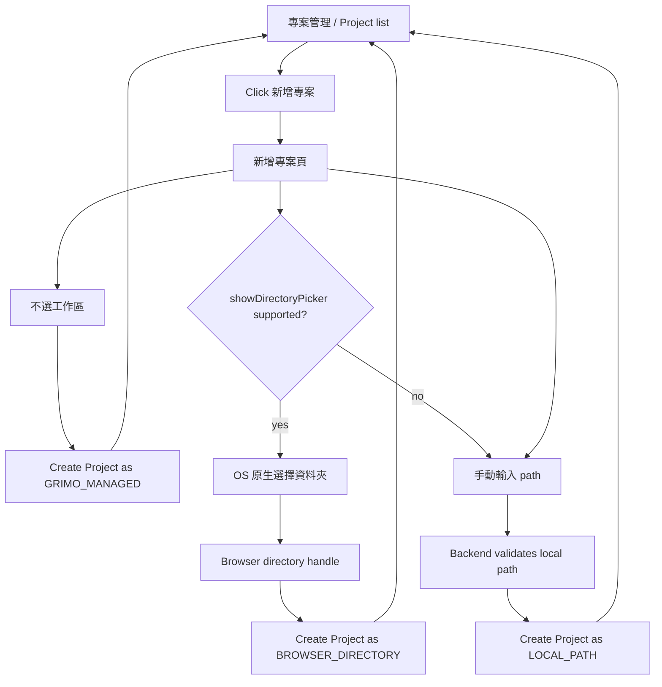

# S003: Project Management List And Browser-Native Workspace Picker

> 規格：S003 | 大小：M(13) | 狀態：⏳ Design
> 日期：2026-06-01
> 對應：PRD §0.1, §2 Primary Product Flow / S001 / S002 / spec-roadmap row S003

---

## 1. 目標

讓使用者進入「專案管理」時先看到乾淨的 Project list，需要新增時才進入「新增專案」頁；未選工作路徑時，Grimo 會在 `~/.grimo/projects/<projectId>` 建立預設 workspace。

S001/S002 已經完成 Project create 的 full-stack vertical slice，但目前 Project list 和 create form 同時擠在同一個畫面，且「選擇資料夾」會在表單下方展開後端列出的本機資料夾清單。S003 要把這個入口整理成兩個明確畫面：

1. `專案管理`：一進來只看 Project list、empty state 和 `新增專案` action。
2. `新增專案`：填寫 Project 基本資料、選 Workflow Recipe；Project Workspace 可選，沒有選時使用 Grimo-managed workspace。

Project Workspace 選擇不決定能不能建立 Project。使用者若沒有指定工作路徑，backend 會建立並保存 `~/.grimo/projects/<projectId>` 作為 Project 的預設 workspace。使用者若要改綁到既有資料夾，選擇策略採已確認的優先序：

1. 主方案：`showDirectoryPicker()`，按 `選擇資料夾` 開 OS 原生資料夾視窗。
2. fallback：手動輸入 path + 後端驗證；用於瀏覽器不支援，或使用者要讓 backend / agent 操作 repo。

拖曳資料夾不放進 S003 主流程。它可以讀 browser directory handle，但互動太隱性，也同樣不能提供 backend absolute path；先記為未來匯入輔助，不列入本 spec 驗收。

相依狀態：

| 相依 | 類型 | 狀態 | 對 S003 的影響 |
| --- | --- | --- | --- |
| S001 | Code-level | local verification PASS | 既有 Project create/list API 與 Vite `/api` proxy 是 S003 的起點。 |
| S002 | Code-level | shipped / archived | Workflow Recipe roles、`CollectionResponse<T>`、`workspacePath` 命名和 Project role snapshot 已存在。 |
| PRD Primary Product Flow | Product direction | exists | 使用者先建立或選擇 Project，之後才進 Task Management Interface。 |
| `docs/grimo/architecture.md` | Architecture baseline | exists | 目前仍記錄 backend local-directory browsing；S003 會改成 browser-first picker，手動 path 才進 backend validation。 |

Spec overlap scan：

- S001/S002 已完成 Project 建立與 workflow roles；S003 不重做 workflow role catalog，也不新增 Task。
- roadmap 原本的 S003 是 Task creation through backend API；因使用者明確要求新增 Spec 3 做 Project UI / workspace picker，舊 Task creation spec 順延到 S004。

## 2. 研究與設計

### 2.1 查到的事實

| 來源 | 使用者結果 | 技術線索 |
| --- | --- | --- |
| `docs/grimo/PRD.md` §0.1, §2 | 使用者進 Task 工作台前要先建立或選擇 Project。 | Project list 是 primary product flow 的前置入口，不應被大型建立表單佔滿。 |
| `frontend/src/features/projects/Projects.tsx` | 目前畫面同時顯示 Project list 與 create form placeholder；按 `建立專案` 後右側展開完整表單。 | S003 要把 view state 拆成 `list` / `create`，避免第一屏資訊過載。 |
| `backend/src/main/java/io/github/samzhu/grimo/project/LocalDirectoryService.java` | 現有 picker 會由 backend 列本機資料夾，畫面容易變成很長的 directory list。 | S003 主流程不再使用 backend `ls` 式 picker；保留手動 path validation 即可。 |
| 使用者確認 2026-06-01 | 選工作路徑跟可不可以建立 Project 無關；沒選時就在家目錄下 `~/.grimo` 建立 Project。 | Project create 的必要條件是 Project name + workflow；workspace 預設為 Grimo-managed local directory。 |
| VS Code multi-root workspace docs — https://code.visualstudio.com/docs/editing/workspaces/multi-root-workspaces | 除非建立 multi-root workspace，workspace 通常就是 project 的單一 root folder；multi-root workspace 以 `.code-workspace` 保存 folders。 | Grimo MVP 先採單一 Project root；未來 multi-repo 再延伸成多 workspace roots。 |
| IntelliJ IDEA workspace docs — https://www.jetbrains.com/help/idea/workspaces.html | Workspace 可以包含多個 projects，且 workspace 不改變原 project 的配置或位置。 | Grimo 的 Project 是產品管理單位；Workspace 是檔案/執行位置，不應反過來定義 Project 是否存在。 |
| Git worktree docs — https://git-scm.com/docs/git-worktree.html | Git worktree 是連到同一 repository 的 working tree，並有額外 metadata 區分各 working tree。 | 未來 agent execution 可在 Project workspace 內建立任務 worktree；S003 只定義 Project 預設 workspace，不先做 task worktree。 |
| MDN `showDirectoryPicker()` — https://developer.mozilla.org/en-US/docs/Web/API/Window/showDirectoryPicker | 使用者按按鈕可以開 OS 原生資料夾選擇視窗。 | 主方案使用 `window.showDirectoryPicker({ id: "project-workspace", mode: "read" })`。 |
| WICG File System Access — https://wicg.github.io/file-system-access/ | 使用者授權後，瀏覽器取得 `FileSystemDirectoryHandle`。 | Browser handle 可由前端保存 / 重新請求權限，但不能 JSON 序列化給 backend。 |
| WHATWG File System Standard — https://fs.spec.whatwg.org/ | File system API 的 exposed object 是 handle / entry，不是任意網站可取得的 absolute local path。 | S003 不能宣稱 browser-native picker 會產生 backend `workspacePath`。 |
| MDN Secure Contexts — https://developer.mozilla.org/en-US/docs/Web/Security/Secure_Contexts | `localhost` / `127.0.0.1` 是可被視為 trustworthy 的本機來源。 | 目前 `127.0.0.1:5173` POC 可作為 `showDirectoryPicker()` 開發目標。 |
| MDN `HTMLInputElement.webkitdirectory` — https://developer.mozilla.org/en-US/docs/Web/API/HTMLInputElement/webkitdirectory | `<input webkitdirectory>` 主要提供 `FileList` 和相對路徑。 | 它比較像資料夾上傳/讀取，不適合作為 Project Workspace 的主要選擇方案。 |
| Chrome File System Access API — https://developer.chrome.com/docs/capabilities/web-apis/file-system-access | Chromium 系瀏覽器支援 File System Access，但跨瀏覽器仍需 fallback。 | S003 需要 feature detection；不支援時顯示手動 path fallback。 |

### 2.2 架構設計

S003 將 `Project Workspace` 從「建立 Project 的必填使用者輸入路徑」調整成「Project 的檔案系統工作區」。Project 建立時一定會有 workspace；沒選工作路徑時由 Grimo 建立 `~/.grimo/projects/<projectId>`。

概念定義：

| 概念 | Grimo 用途 | 白話定義 |
| --- | --- | --- |
| `Project` | Task、Workflow Recipe、角色設定、品質基準、Review Materials 的歸屬單位 | 使用者在 Grimo 裡管理的一個產品/工作上下文，不等於某個資料夾本身。 |
| `Project Workspace` | agent / backend / browser 要讀寫檔案時使用的工作目錄或資料夾 reference | Project 的檔案系統工作區；可以是 Grimo 幫你建的預設資料夾，也可以是使用者選的既有 repo。 |
| `Task Worktree` | 未來單一 Task 執行時的隔離工作目錄 | S003 不做；後續 Dispatch / agent spec 才會把 Task execution 跟 Git worktree 或 sandbox 綁起來。 |

| Workspace source | 使用者如何選 | backend 能不能直接跑 agent/git | 建立 Project 時保存什麼 |
| --- | --- | --- | --- |
| `GRIMO_MANAGED` | 不選工作區，Grimo 自動建立 | yes | `workspaceSource=GRIMO_MANAGED`, `workspacePath=~/.grimo/projects/<projectId>`, `backendWorkspaceReady=true` |
| `BROWSER_DIRECTORY` | `showDirectoryPicker()` OS 原生資料夾視窗 | no | `workspaceSource`, `workspaceDisplayName`, optional `browserWorkspaceKey`；browser handle 保存在前端 IndexedDB |
| `LOCAL_PATH` | 手動輸入 `/Users/...` 後由 backend 驗證 | yes, if valid/readable | `workspaceSource`, `workspacePath`, `workspaceDisplayName` |

使用者流程：



Project list 的使用者結果：

- 一進「專案管理」只看到 Project list，不看到新增表單。
- 沒有 Project 時顯示 empty state 和一個 `新增專案` action。
- 有 Project 時顯示 name、workspace display、workflow、status。
- Browser workspace Project 要顯示「已選擇 browser workspace」，但不能假裝 backend path 已可用。
- Grimo-managed Project 顯示 `~/.grimo/projects/<projectId>` 或簡短的「Grimo 預設工作區」。

新增專案頁的使用者結果：

- Header 有 `返回列表`。
- `選擇資料夾` 是 primary action；支援時開 OS 原生 picker。
- 選完後欄位顯示 `已選擇：<directory.name>`。
- 沒有選 workspace 時，`建立專案` 仍可按；建立後使用 Grimo 預設工作區。
- 若瀏覽器不支援，或使用者需要 backend / agent 操作 repo，使用手動 path fallback。
- S003 不在畫面下方展開 backend directory list。

低保真 UI sketch：

```text
專案管理
┌────────────────────────────────────────────────────┐
│ 專案管理                              [新增專案]   │
│ 管理本機 repo / codebase。                         │
├────────────────────────────────────────────────────┤
│ Project list                                       │
│                                                    │
│ 尚未建立專案                                       │
│ [新增專案]                                         │
└────────────────────────────────────────────────────┘

新增專案
┌────────────────────────────────────────────────────┐
│ [返回列表] 新增專案                                │
├────────────────────────────────────────────────────┤
│ 專案名稱                                           │
│ [grimoAPP                                      ]   │
│ 專案描述                                           │
│ [本機 AI 開發工作台                            ]   │
│                                                    │
│ 專案工作區（選填，未選會使用 Grimo 預設工作區）      │
│ [選擇資料夾]                                       │
│ 已選擇：grimoAPP                                   │
│ 或                                                 │
│ 手動輸入 path                                      │
│ [/Users/samzhu/workspace/github-samzhu/grimoAPP]   │
│                                                    │
│ 專案工作流                                         │
│ [Web 服務開發                                  v]  │
│ 參與角色                                           │
│ Product Manager / Architect / Frontend / Backend   │
│                                                    │
│ [建立專案]                                         │
└────────────────────────────────────────────────────┘
```

這張草圖只約定資訊架構和互動順序，不是 final pixels、不新增 design system，也不授權加入無關裝飾。

### 2.3 做法比較

| 做法 | 採用 | 理由 |
| --- | --- | --- |
| A: Project list 和新增專案拆成兩個 view state | yes | 使用者一進專案管理先看列表，畫面比 list + form 雙欄更簡潔。 |
| B: 保留同頁雙欄 list + form | no | 目前截圖顯示第一屏資訊過多，且 directory list 會壓縮主要內容。 |
| C: `showDirectoryPicker()` 作為主選擇資料夾方案 | yes | 使用者按 `選擇資料夾` 後看到 OS 原生 picker，最符合直覺。 |
| D: 拖曳資料夾到頁面 | no for S003 | 互動隱性，且仍不能提供 backend absolute path；先留 future option。 |
| E: `<input type="file" webkitdirectory>` | no | 它適合讀取/上傳資料夾內容，不適合作為 Project Workspace identity。 |
| F: 手動輸入 path + 後端驗證 | fallback | 瀏覽器不支援或使用者需要 backend/agent 操作 repo 時才需要；不是建立 Project 的必要條件。 |
| G: 後端 `GET /api/local-directories` directory browser | no for main flow | 可取得 backend path，但畫面會變成網頁內檔案瀏覽器，不符合這次簡化方向。 |

Chosen approach：

- UI：`Projects` feature 使用 `list` / `create` view state。
- Project create gating：`name` 與 `workflowRecipeId` 是建立 Project 必填；workspace 未選時自動建立 Grimo-managed workspace。
- Browser API：以 feature detection 檢查 `window.showDirectoryPicker`。
- Browser workspace：前端將 `FileSystemDirectoryHandle` 存在 IndexedDB；backend 只保存 opaque reference 和 display name，不把它當 backend path。
- Manual workspace：使用者輸入 path 後，backend 驗證 local path 是否存在、是否為 directory、是否可讀；通過後 Project 標示為 `LOCAL_PATH`。
- Agent readiness：`GRIMO_MANAGED` 與 `LOCAL_PATH` 可標示 backend workspace ready；`BROWSER_DIRECTORY` Project 不在 S003 啟動 agent execution。

### 2.4 Task 邊界提示

| Task 候選 | Class / file | 來源 | 使用者成功結果 | 失敗時要保護的結果 | POC |
| --- | --- | --- | --- | --- | --- |
| T01 Frontend Project list/create navigation | `frontend/src/features/projects/Projects.tsx`, `frontend/src/styles.css` | user UI request + sketch | 使用者一進 `專案管理` 只看到列表，按 `新增專案` 才進建立頁。 | 不可在 list view 顯示完整 create form；返回列表不可清掉已存在 project list。 | not required |
| T02 Browser workspace picker | `Projects.tsx`, `frontend/src/vite-env.d.ts`, maybe `frontend/src/features/projects/browser-workspace-store.ts` | MDN/WICG File System Access | 支援時按 `選擇資料夾` 開原生 picker，選完顯示資料夾名稱。 | 使用者取消 picker 只是不綁 workspace，不影響 Project create；不支援時不可壞掉。 | required for IndexedDB handle persistence |
| T03 Manual path fallback validation | backend project package + frontend project API | fallback decision | 使用者輸入 `/Users/...` 後，backend 驗證並把 Project 標成 backend-ready。 | 無效 path 不可被保存成 backend-ready workspace；使用者仍可清空 path 後用 Grimo-managed workspace 建立 Project。 | not required |
| T04 Project workspace source contract | `CreateProjectRequest`, `ProjectResponse`, `ProjectRecord`, `ProjectStore`, `schema.sql`, frontend project types | workspace source design | Project list 看得出 Grimo-managed workspace、browser workspace 或 local path workspace。 | Browser handle project 不可被誤標成 backend-ready；Grimo-managed path 必須位於 `~/.grimo/projects/<projectId>`。 | required if generated path / migration is risky |
| T05 Full-stack / browser verification | `frontend/e2e/project-onboarding.fullstack.spec.ts`, `scripts/verify-release.sh`, visual snapshots | QA strategy | Playwright 驗證 list/create 分頁、mocked native picker、manual path fallback，release gate 收斂 backend/full-stack/visual checks。 | 無法自動開 OS picker 時，要用 mock + manual evidence，不可假裝完全自動化；layout diff 必須有 intentional snapshot evidence。 | not required |

## 3. BDD Contract

驗證命令：

執行：`./scripts/verify-release.sh`

通過條件：所有帶 `@spec:S003` 的 scenario 都有對應 test evidence；自動化無法真正操作 OS native picker 的部分，必須用 mocked `showDirectoryPicker` automated test 加一個 Edge/Chromium manual-ready check。

BDD 確認狀態：

- 已由使用者確認：主方案是 `showDirectoryPicker()`；fallback 是手動輸入 path + 後端驗證。
- 已由使用者確認：拖曳資料夾不放進 S003 主流程。
- 已由使用者確認：選工作路徑跟可不可以建立 Project 無關；沒選時建立 Grimo-managed workspace。
- 待使用者確認：以下「驗收方式規劃」是否足夠作為 S003 pass/fail 標準。

AC 覆蓋矩陣：

| AC | 使用者結果 | Contract / 可觀察輸出 | Layer | State |
| --- | --- | --- | --- | --- |
| AC-S003-1 | 使用者進專案管理先看到 Project list，不被新增表單干擾。 | `專案管理` view 顯示 list/empty state + `新增專案`，不顯示 create form fields | frontend | planned |
| AC-S003-2 | 使用者按 `新增專案` 後進入新增頁，能返回列表。 | create view 顯示 `返回列表`、Project fields、workflow preview | frontend | planned |
| AC-S003-3 | 使用者不選 workspace 也能建立 Project。 | `POST /api/projects` 建立 `workspaceSource="GRIMO_MANAGED"`，`workspacePath` 位於 `~/.grimo/projects/<projectId>` | backend, frontend, fullstack | planned |
| AC-S003-4 | 支援的瀏覽器中，使用者按 `選擇資料夾` 會走原生資料夾選擇。 | `window.showDirectoryPicker({ id, mode: "read" })` 被呼叫；選完顯示 directory name | frontend, manual | planned |
| AC-S003-5 | 使用者手動輸入有效 path 後，可以把 Project 標成 backend-ready。 | valid path 建立/更新 `LOCAL_PATH` workspace，`backendWorkspaceReady=true` | backend, frontend, fullstack | planned |
| AC-S003-6 | 無效手動 path 不會被保存成 backend-ready workspace。 | invalid path 回 user-readable error，Project 不保存該 path；使用者仍可不綁 workspace 建立 Project | backend, frontend, fullstack | planned |
| AC-S003-7 | Browser-only workspace 不會被誤認成 backend 可執行 workspace。 | Project response/list 顯示 `workspaceSource="BROWSER_DIRECTORY"` 且 backend readiness false | backend, frontend | planned |
| AC-S003-8 | S003 不再在新增頁展開後端 `ls` 資料夾清單。 | UI 不呼叫 `/api/local-directories` 作為主 picker；看不到 `.directory-browser` 長列表 | frontend, fullstack | planned |

### 驗收方式規劃

S003 的 release pass/fail 以 `./scripts/verify-release.sh` 為總入口；如果 script 尚未包含某一層檢查，實作 task 必須先把該檢查接進 release gate，不能用臨時 per-spec script 取代。

| 驗收層 | 覆蓋 AC | Pass evidence | Pass threshold |
| --- | --- | --- | --- |
| Backend API / persistence | AC-S003-3, AC-S003-5, AC-S003-6, AC-S003-7 | `backend/src/test/java/io/github/samzhu/grimo/project/ProjectApiTests.java`，由 `./gradlew test` 執行 | `POST /api/projects` 對 `GRIMO_MANAGED`, `LOCAL_PATH`, `BROWSER_DIRECTORY` 都回正確 status/body；invalid path 不保存；SQLite rows 對應 response。 |
| Frontend full-stack interaction | AC-S003-1, AC-S003-2, AC-S003-3, AC-S003-5, AC-S003-6, AC-S003-8 | `frontend/e2e/project-onboarding.fullstack.spec.ts`，由 `npm run test:fullstack` 執行，並被 `./scripts/verify-release.sh` 收斂 | Browser 從專案列表進新增頁；不選 workspace 可建立；manual path 有效/無效路徑行為符合 UI 與 API；主流程不打 `/api/local-directories`。 |
| Browser-native picker automated check | AC-S003-4, AC-S003-7 | Playwright 在頁面注入 mocked `window.showDirectoryPicker`，assert function 被呼叫、UI 顯示 `已選擇：grimoAPP`、request 不含 fabricated absolute path | mock test 綠燈；取消 picker 時 UI 留在新增頁且 workspace 維持未綁定。 |
| Browser-native picker manual check | AC-S003-4 | Edge 或 Chromium 開 `http://127.0.0.1:5173/`，人工點 `新增專案` → `選擇資料夾`，保存截圖或文字 evidence 到 S003 §7 | 真的看到 OS 原生資料夾視窗；選取後頁面顯示資料夾名稱。若 CI/headless 不能開 OS picker，manual evidence 仍必須存在。 |
| Visual / layout regression | AC-S003-1, AC-S003-2, AC-S003-8 | `npm run test:visual`，由 `./scripts/verify-release.sh` 執行；必要時更新 intentional snapshots | Desktop `1366x768`, `1440x900` 必須顯示 list/create split；若 S003 改 responsive layout，補 `390x844`, `820x1180`。 |
| POC evidence | AC-S003-4 | `/planning-tasks` T02 先驗證 `FileSystemDirectoryHandle` 能否存入 IndexedDB 並重新取出檢查 permission | POC pass 才承諾 browser handle 可恢復；POC fail 則降級為單次選取 display name，不承諾 reload 後可恢復 handle。 |

驗收時不能只看「畫面可以按」。每個 workspace source 都要有可觀察證據：

| Workspace source | 必驗 response shape | 必驗 UI |
| --- | --- | --- |
| `GRIMO_MANAGED` | `workspaceSource="GRIMO_MANAGED"`, `workspacePath` under `~/.grimo/projects/<projectId>`, `backendWorkspaceReady=true` | Project list 顯示「Grimo 預設工作區」或該 managed path。 |
| `BROWSER_DIRECTORY` | `workspaceSource="BROWSER_DIRECTORY"`, `workspacePath=null`, `backendWorkspaceReady=false`, no fake absolute path | 新增頁顯示 `已選擇：<folder name>`；list 不把它標成 backend-ready。 |
| `LOCAL_PATH` | `workspaceSource="LOCAL_PATH"`, `workspacePath=<validated path>`, `backendWorkspaceReady=true` | Project list 顯示已驗證 path，且 invalid path error 留在新增頁。 |

Feature: Project 管理與 browser-first workspace 選擇

### Rule: 專案管理先顯示列表，新增專案另成一個清楚流程

使用者結果：
使用者一進 `專案管理` 時，只需要掃描現有 Project 或看 empty state。新增 Project 是一個明確 action，不把完整表單常駐在第一屏。

Contract：
`Projects` feature 有 `viewMode = "list" | "create"`。`list` 模式顯示 Project list、empty state、`新增專案`；`create` 模式顯示 `返回列表`、Project form、workflow preview。Project list 仍從 `GET /api/projects` 的 `CollectionResponse<ProjectResponse>.content[]` 讀取。

```gherkin
@spec:S003
@ac:AC-S003-1
@layer:frontend
@state:planned
Scenario: 使用者進入專案管理時先看到 Project list
  Given（前提） 使用者打開 Grimo 並切到 "專案"
  When（動作） Project list 載入完成
  Then（結果） 使用者看到 "Project list" 與現有 Project 或 "尚未建立專案"
  And（而且） 使用者看到一個 "新增專案" action
  And（而且） 使用者尚未看到 "專案名稱", "專案描述", "專案工作區" 建立表單欄位
  # 技術證據：Projects view 初始 viewMode=list；create form fields 不在 DOM 或不可見
```

驗證綁定（Verification Bindings）：

- frontend/fullstack: `frontend/e2e/project-onboarding.fullstack.spec.ts`
- command: `./scripts/verify-release.sh`

```gherkin
@spec:S003
@ac:AC-S003-2
@layer:frontend
@state:planned
Scenario: 使用者按新增專案後進入建立頁，並可以回到列表
  Given（前提） 使用者位於 "專案管理" list view
  When（動作） 使用者按 "新增專案"
  Then（結果） 使用者看到 "新增專案" 頁面
  And（而且） 頁面顯示 "返回列表", "專案名稱", "專案描述", "專案工作區" 與 "專案工作流"
  When（動作） 使用者按 "返回列表"
  Then（結果） 使用者回到 "專案管理" list view
  And（而且） 已載入的 Project list 沒有被清空
  # 技術證據：viewMode 在 list/create 間切換；project list state 保留
```

驗證綁定（Verification Bindings）：

- frontend/fullstack: `frontend/e2e/project-onboarding.fullstack.spec.ts`
- command: `./scripts/verify-release.sh`

### Rule: 未選工作路徑時建立 Grimo-managed workspace

使用者結果：
使用者只要填好 Project 名稱並選好工作流，就能建立 Project。若沒有選工作路徑，Grimo 會在使用者家目錄下建立預設工作區，讓 Project 仍有可保存檔案與後續 evidence 的地方。

Contract：
Project create request 可以不帶 workspace。成功後 backend 產生 Project id，建立 `~/.grimo/projects/<projectId>`，並讓 `ProjectResponse` 回 `workspaceSource="GRIMO_MANAGED"`、`workspacePath=<managed path>`、`backendWorkspaceReady=true`。

```json
{
  "id": "01226N0640J7Q",
  "name": "grimoAPP",
  "workspaceSource": "GRIMO_MANAGED",
  "workspaceDisplayName": "Grimo 預設工作區",
  "workspacePath": "/Users/samzhu/.grimo/projects/01226N0640J7Q",
  "backendWorkspaceReady": true,
  "workflowRecipeId": "web-service-development",
  "workflowRoles": []
}
```

```gherkin
@spec:S003
@ac:AC-S003-3
@layer:backend,frontend,fullstack
@api:POST /api/projects
@state:planned
Scenario: 使用者不選工作路徑時，Grimo 在 ~/.grimo 建立預設 workspace
  Given（前提） 使用者位於 "新增專案" 頁
  And（而且） 使用者已填寫 "專案名稱" 並選擇 "Web 服務開發"
  And（而且） 使用者沒有選 Project Workspace
  When（動作） 使用者按 "建立專案"
  Then（結果） Project 建立成功並回到 Project list
  And（而且） Project list 顯示 "Grimo 預設工作區" 或該 managed path
  And（而且） API response 內有 workspaceSource "GRIMO_MANAGED" 與 backendWorkspaceReady true
  And（而且） workspacePath 位於 "~/.grimo/projects/<projectId>"
  # 技術證據：POST /api/projects 回 201；workspacePath 位於 user.home/.grimo/projects/{id}；backendWorkspaceReady=true；測試使用 temporary user.home
```

驗證綁定（Verification Bindings）：

- backend: `backend/src/test/java/io/github/samzhu/grimo/project/ProjectApiTests.java`
- frontend/fullstack: `frontend/e2e/project-onboarding.fullstack.spec.ts`
- command: `./scripts/verify-release.sh`

### Rule: 支援時優先使用 browser-native folder picker

使用者結果：
使用者按 `選擇資料夾` 會看到 OS 原生資料夾選擇視窗。選完後，新增專案頁顯示資料夾名稱，例如 `已選擇：grimoAPP`。使用者取消選擇時，頁面留在新增專案頁，不會自動綁 workspace。

Contract：
前端以 feature detection 判斷 `typeof window.showDirectoryPicker === "function"`。支援時呼叫：

```ts
const handle = await window.showDirectoryPicker({
  id: "project-workspace",
  mode: "read",
});
```

前端只使用 `handle.name` 作為 display name，並把 handle 存入 browser-owned storage；不把 handle 當 JSON 送給 backend，也不宣稱已取得 absolute path。

```gherkin
@spec:S003
@ac:AC-S003-4
@layer:frontend,manual
@state:planned
Scenario: 支援 File System Access 的瀏覽器用原生視窗選 Project Workspace
  Given（前提） 使用者使用支援 showDirectoryPicker 的 Edge 或 Chromium
  And（而且） 使用者位於 "新增專案" 頁
  When（動作） 使用者按 "選擇資料夾"
  Then（結果） 瀏覽器開啟 OS 原生資料夾選擇視窗
  When（動作） 使用者選擇名為 "grimoAPP" 的資料夾
  Then（結果） 新增專案頁顯示 "已選擇：grimoAPP"
  And（而且） Project create request 不包含假的 absolute path
  # 技術證據：Playwright mock 驗證 showDirectoryPicker 被呼叫；manual evidence 驗證 Edge 真實 OS picker 可開啟
```

驗證綁定（Verification Bindings）：

- frontend: `frontend/e2e/project-onboarding.fullstack.spec.ts` with mocked `window.showDirectoryPicker`
- manual: Edge/Chromium on `http://127.0.0.1:5173/`
- command: `./scripts/verify-release.sh` plus manual note

### Rule: 手動 path fallback 只決定 backend workspace readiness

使用者結果：
當瀏覽器不支援原生 picker，或使用者明確需要 backend/agent 操作既有 repo 時，使用者可以輸入 `/Users/...` path。有效 path 會讓 Project 改用該 existing local path；無效 path 只代表外部 workspace 綁定失敗，使用者仍可清空 path 後用 Grimo 預設工作區建立 Project。

Contract：
Manual path flow 建立或更新 Project workspace 時送出 `workspaceSource="LOCAL_PATH"` 與 `workspacePath`。backend 驗證 path 存在、是 directory、可讀。成功後 `ProjectResponse` 回傳 `workspaceSource="LOCAL_PATH"`、`workspacePath` 和 `backendWorkspaceReady=true`。

```json
{
  "id": "01226N0640J7Q",
  "name": "grimoAPP",
  "workspaceSource": "LOCAL_PATH",
  "workspaceDisplayName": "grimoAPP",
  "workspacePath": "/Users/samzhu/workspace/github-samzhu/grimoAPP",
  "backendWorkspaceReady": true,
  "workflowRecipeId": "web-service-development",
  "workflowRoles": []
}
```

```gherkin
@spec:S003
@ac:AC-S003-5
@layer:backend,frontend,fullstack
@api:POST /api/projects
@state:planned
Scenario: 使用者手動輸入有效 path 後建立 backend-ready Project workspace
  Given（前提） 使用者位於 "新增專案" 頁
  And（而且） 本機存在可讀資料夾 "/Users/samzhu/workspace/github-samzhu/grimoAPP"
  When（動作） 使用者在手動 path 欄位輸入該路徑並建立 Project
  Then（結果） Project 建立成功並回到 Project list
  And（而且） Project list 顯示該 workspace display
  And（而且） API response 內有 workspaceSource "LOCAL_PATH" 與 backendWorkspaceReady true
  # 技術證據：POST /api/projects 回 201，body.workspacePath 是輸入 path，body.backendWorkspaceReady=true
```

驗證綁定（Verification Bindings）：

- backend: `backend/src/test/java/io/github/samzhu/grimo/project/ProjectApiTests.java`
- frontend/fullstack: `frontend/e2e/project-onboarding.fullstack.spec.ts`
- command: `./scripts/verify-release.sh`

```gherkin
@spec:S003
@ac:AC-S003-6
@layer:backend,frontend,fullstack
@api:POST /api/projects
@state:planned
Scenario: 無效手動 path 不會被保存成 Project workspace
  Given（前提） 使用者位於 "新增專案" 頁
  When（動作） 使用者輸入不存在或不可讀的 path 並建立 Project
  Then（結果） 使用者看到 "請選擇有效的本機資料夾"
  And（而且） 該 path 不會被保存成 Project workspacePath
  And（而且） 使用者仍可以清空 path 後用 Grimo 預設工作區建立 Project
  # 技術證據：POST /api/projects 若包含 invalid LOCAL_PATH workspace 會回 400；不含 workspace 的 POST /api/projects 會建立 GRIMO_MANAGED workspace
```

驗證綁定（Verification Bindings）：

- backend: `backend/src/test/java/io/github/samzhu/grimo/project/ProjectApiTests.java`
- frontend/fullstack: `frontend/e2e/project-onboarding.fullstack.spec.ts`
- command: `./scripts/verify-release.sh`

### Rule: Browser workspace 不假裝是 backend-ready workspace

使用者結果：
使用者用原生 picker 建立的 Project 可以出現在 Project list，但畫面不能暗示 backend agent 已經能操作這個 repo。只有手動 path 驗證過的 Project 才是 backend-ready。

Contract：
Browser-native flow 建立 Project 時送出 `workspaceSource="BROWSER_DIRECTORY"`、`workspaceDisplayName` 和 opaque `browserWorkspaceKey`。backend 不保存 `workspacePath`；`backendWorkspaceReady=false`。

```json
{
  "id": "01226N0640J7Q",
  "name": "grimoAPP",
  "workspaceSource": "BROWSER_DIRECTORY",
  "workspaceDisplayName": "grimoAPP",
  "workspacePath": null,
  "backendWorkspaceReady": false,
  "workflowRecipeId": "web-service-development",
  "workflowRoles": []
}
```

```gherkin
@spec:S003
@ac:AC-S003-7
@layer:backend,frontend
@api:POST /api/projects
@state:planned
Scenario: Browser-native workspace Project 不會被標成 backend-ready
  Given（前提） 使用者已透過 showDirectoryPicker 選擇 "grimoAPP"
  When（動作） 使用者建立 Project
  Then（結果） Project list 顯示 "grimoAPP" workspace
  And（而且） Project response 的 workspaceSource 是 "BROWSER_DIRECTORY"
  And（而且） Project response 的 backendWorkspaceReady 是 false
  And（而且） response 不包含假的 workspacePath
  # 技術證據：API 保存 browser workspace source，但不保存 fabricated absolute path
```

驗證綁定（Verification Bindings）：

- backend: `backend/src/test/java/io/github/samzhu/grimo/project/ProjectApiTests.java`
- frontend/fullstack: `frontend/e2e/project-onboarding.fullstack.spec.ts`
- command: `./scripts/verify-release.sh`

### Rule: 新增專案頁不再展開後端資料夾瀏覽器

使用者結果：
新增專案頁保持簡潔。使用者不會在表單下方看到一長串由 backend `ls` 出來的 hidden folders；如果原生 picker 不可用，就改用手動 path fallback。

Contract：
S003 主流程不呼叫 `GET /api/local-directories`，也不渲染 `.directory-browser`。若 implementation 仍保留 endpoint 給相容性，前端 Project Creation Page 不使用它作為主要 picker。

```gherkin
@spec:S003
@ac:AC-S003-8
@layer:frontend,fullstack
@api:GET /api/local-directories
@state:planned
Scenario: 新增專案頁不再顯示後端 directory browser
  Given（前提） 使用者位於 "新增專案" 頁
  When（動作） 使用者查看 "專案工作區" 區塊
  Then（結果） 使用者只看到 "選擇資料夾" 和手動 path fallback
  And（而且） 頁面不顯示 "上層", "選取此資料夾" 或 child directory rows
  And（而且） 主要 picker 不發出 GET /api/local-directories request
  # 技術證據：Playwright network assertion + DOM assertion
```

驗證綁定（Verification Bindings）：

- frontend/fullstack: `frontend/e2e/project-onboarding.fullstack.spec.ts`
- command: `./scripts/verify-release.sh`

### 非功能需求檢查

| 分類 | 對應驗收 | 說明 |
| --- | --- | --- |
| Performance | AC-S003-1, AC-S003-8 | Project list first paint 不等待 workflow recipes；新增頁不載入 backend directory list，避免大量 DOM rows。 |
| Security | AC-S003-4, AC-S003-5, AC-S003-7 | Browser handle 不被序列化或偽造成 path；manual path 只驗證 directory，不執行 shell。Spring Security 仍 permit-all。 |
| Reliability | AC-S003-3, AC-S003-6, AC-S003-7 | Project create 不依賴使用者選 path；預設 managed path 可建立；無效 path 不保存；browser workspace 不標成 backend-ready。 |
| Usability | AC-S003-1, AC-S003-2, AC-S003-3, AC-S003-4, AC-S003-8 | list/create 分離；支援時用 OS native picker；不選 workspace 也能建立 Grimo-managed Project；不支援時有手動 fallback。 |
| Maintainability | AC-S003-7 | `workspaceSource` 明確表達 Project workspace 的來源，避免 nullable `workspacePath` 被誤用。 |

### AC well-formedness check

| AC | Singular | Unambiguous | Implementation-free Then | Verifiable | Bounded |
| --- | --- | --- | --- | --- | --- |
| AC-S003-1 | yes | yes | yes | yes | yes |
| AC-S003-2 | yes | yes | yes | yes | yes |
| AC-S003-3 | yes | yes | yes | yes | yes |
| AC-S003-4 | yes | yes | yes | yes | yes |
| AC-S003-5 | yes | yes | yes | yes | yes |
| AC-S003-6 | yes | yes | yes | yes | yes |
| AC-S003-7 | yes | yes | yes | yes | yes |
| AC-S003-8 | yes | yes | yes | yes | yes |

## 4. 介面與 API 設計

### Frontend types

```ts
type WorkspaceSelection =
  | {
      source: "GRIMO_MANAGED";
      displayName: "Grimo 預設工作區";
      backendWorkspaceReady: true;
    }
  | {
      source: "BROWSER_DIRECTORY";
      displayName: string;
      browserWorkspaceKey: string;
      backendWorkspaceReady: false;
    }
  | {
      source: "LOCAL_PATH";
      displayName: string;
      workspacePath: string;
      backendWorkspaceReady: true;
    };

type CreateProjectInput = {
  name: string;
  description: string;
  workflowRecipeId: string;
  workspace?: WorkspaceSelection;
};
```

### Browser picker wrapper

```ts
type DirectoryPicker = {
  isSupported(): boolean;
  pickProjectWorkspace(): Promise<{
    handle: FileSystemDirectoryHandle;
    displayName: string;
  } | null>;
};
```

`pickProjectWorkspace()` 回 `null` 表示使用者取消，不是錯誤；UI 留在新增頁。

### Backend request / response

```java
record CreateProjectRequest(
    @NotBlank String name,
    String description,
    @NotBlank String workflowRecipeId,
    WorkspaceSource workspaceSource,
    String workspaceDisplayName,
    String workspacePath,
    String browserWorkspaceKey
) {}

enum WorkspaceSource {
    GRIMO_MANAGED,
    BROWSER_DIRECTORY,
    LOCAL_PATH
}

record ProjectResponse(
    String id,
    String name,
    String description,
    WorkspaceSource workspaceSource,
    String workspaceDisplayName,
    String workspacePath,
    boolean backendWorkspaceReady,
    String workflowRecipeId,
    String workflowRecipeName,
    ProjectStatus status,
    Instant createdAt,
    Instant updatedAt,
    List<ProjectWorkflowRoleResponse> workflowRoles
) {}
```

Validation rules：

| Rule | Behavior |
| --- | --- |
| `workspaceSource` blank / `GRIMO_MANAGED` | Project can be created；backend creates `~/.grimo/projects/<projectId>`；`workspacePath` points to that directory；`backendWorkspaceReady=true`。 |
| `workspaceSource=LOCAL_PATH` | `workspacePath` required；backend validates exists + directory + readable；`backendWorkspaceReady=true`。 |
| `workspaceSource=BROWSER_DIRECTORY` | `workspaceDisplayName` and `browserWorkspaceKey` required；`workspacePath` must be null/blank；`backendWorkspaceReady=false`。 |
| duplicate local path | `LOCAL_PATH` duplicate `workspacePath` returns `409 Conflict`。 |
| duplicate browser key | same browser profile should not create duplicate pending browser workspace for the same `browserWorkspaceKey`。 |

### IndexedDB handle storage

S003 需要一個很小的 frontend-local store 保存 browser directory handle。這不是 backend source of truth；它只是讓同一個 browser profile 之後可以重新請求 permission。

```ts
type BrowserWorkspaceRecord = {
  key: string;
  displayName: string;
  handle: FileSystemDirectoryHandle;
  createdAt: string;
};
```

POC 要驗證 `FileSystemDirectoryHandle` 可存入 IndexedDB，且重新讀出後可以呼叫 permission API。若 POC 失敗，S003 仍可保留 native picker 當單次建立體驗，但不能承諾重開頁面後可恢復 browser handle。

## 5. 檔案規劃

| 檔案 | 動作 | 說明 |
| --- | --- | --- |
| `docs/grimo/specs/spec-roadmap.md` | modify | S003 改成 Project management list + browser workspace picker；原 Task creation backlog 順延。 |
| `docs/grimo/glossary.md` | modify | 更新 Project Workspace / Browser Workspace Picker 語言。 |
| `docs/grimo/design/frontend-design-context.md` | modify | 新增 Projects page UI 決策脈絡。 |
| `docs/grimo/architecture.md` | modify | 記錄 Project Workspace 不再只等於 backend path；manual path 才是 backend-ready。 |
| `frontend/src/features/projects/Projects.tsx` | modify | 拆 list/create view state；移除主流程 directory browser。 |
| `frontend/src/features/projects/project-api.ts` | modify | 更新 create project request shape；保留 list workflow/projects collection client。 |
| `frontend/src/domain/project/project-types.ts` | modify | 加 `workspaceSource`, `workspaceDisplayName`, `backendWorkspaceReady`；預設 workspace source 是 `GRIMO_MANAGED`。 |
| `frontend/src/features/projects/browser-workspace-store.ts` | new | IndexedDB 保存 browser directory handle。 |
| `frontend/src/vite-env.d.ts` | modify | 補 File System Access API typing if TypeScript DOM lib 不完整。 |
| `frontend/src/styles.css` | modify | Project list/create layout 與 workspace picker states。 |
| `backend/src/main/java/io/github/samzhu/grimo/project/*` | modify | Request/response/store/schema 支援 optional workspace source 與 manual path validation。 |
| `backend/src/test/java/io/github/samzhu/grimo/project/ProjectApiTests.java` | modify | 驗證 `GRIMO_MANAGED` / `LOCAL_PATH` / `BROWSER_DIRECTORY` contract。 |
| `frontend/e2e/project-onboarding.fullstack.spec.ts` | modify | 驗證 list/create split、mocked native picker、manual path fallback、不再用 `/api/local-directories` 主流程。 |
| `scripts/verify-release.sh` | modify if needed | 確保 S003 backend tests、full-stack tests、visual tests 都被 release gate 執行。 |
| `frontend/e2e/*visual*` snapshots | modify if needed | Project list/create split 屬於 layout change，intentional visual diff 要更新 snapshot 並重跑 visual gate。 |

---

<!-- Sections 6-7 added by /planning-tasks after implementation -->
