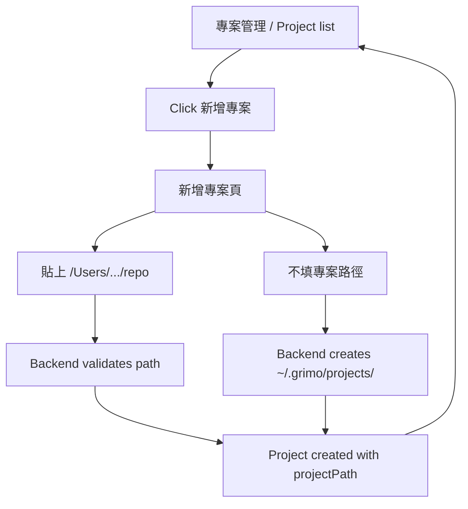

# S003: Project Management List And Project Path Contract

> 規格：S003 | 大小：M(13) | 狀態：✅ Local release PASS
> 日期：2026-06-01
> 對應：PRD §0.1, §2 Primary Product Flow / S001 / S002 / spec-roadmap row S003

---

## 1. 目標

讓使用者進入「專案管理」時先看到 Project list；新增 Project 時只需要填基本資料，`projectPath` 可選，沒填就由 Grimo 建立預設路徑。

S001/S002 已完成 Project create 的 full-stack vertical slice，但目前 Project list 和 create form 同時擠在同一個畫面，且「選擇資料夾」會在表單下方展開後端列出的本機資料夾清單。S003 要把入口整理成兩個明確畫面：

1. `專案管理`：一進來只看 Project list、empty state 和 `新增專案` action。
2. `新增專案`：填寫 Project 基本資料、Project Path（選填）、Workflow Recipe；按 `建立專案` 才送出。

`projectPath` 的語意收斂為「backend 可操作的 repo / codebase 路徑」。它不是 browser handle，也不是 Grimo 內部資料目錄。使用者不填 `projectPath` 時，backend 建立 `~/.grimo/projects/<projectId>` 作為預設 `projectPath`；使用者填 `/Users/...` 時，backend 驗證它存在、是資料夾、可讀，才保存。

S003 不再用 `projectPathSource` / `projectPathDisplayName` / `backendPathReady`。這些欄位只有在同一個 Project 同時支援 backend path、browser handle、managed path 三種 identity 時才有價值；目前會讓模型比需求更複雜。

`Project Home` 是 Grimo 內部資料位置，可由 `projectId` 推導，用來保存 future evidence / metadata；它不進 S003 API，也不叫 `projectDataPath`。

相依狀態：

| 相依 | 類型 | 狀態 | 對 S003 的影響 |
| --- | --- | --- | --- |
| S001 | Code-level | local verification PASS | 既有 Project create/list API 與 Vite `/api` proxy 是 S003 的起點。 |
| S002 | Code-level | shipped / archived | Workflow Recipe roles、`CollectionResponse<T>` 和 Project role snapshot 已存在；S003 只調整 Project UI 與 path contract。 |
| PRD Primary Product Flow | Product direction | exists | 使用者先建立或選擇 Project，之後才進 Task Management Interface。 |
| `docs/grimo/architecture.md` | Architecture baseline | exists | S003 更新 S002 的 `workspacePath` 語意，改成簡化的 `projectPath`。 |

Spec overlap scan：

- S001/S002 已完成 Project 建立與 workflow roles；S003 不重做 workflow role catalog，也不新增 Task。
- roadmap 原本的 S003 是 Task creation through backend API；因使用者明確要求新增 Spec 3 做 Project UI / Project path，舊 Task creation spec 順延到 S004。

## 2. 研究與設計

### 2.1 查到的事實

| 來源 | 使用者結果 | 技術線索 |
| --- | --- | --- |
| `docs/grimo/PRD.md` §0.1, §2 | 使用者進 Task 工作台前要先建立或選擇 Project。 | Project list 是 primary product flow 的前置入口，不應被大型建立表單佔滿。 |
| `frontend/src/features/projects/Projects.tsx` | 目前畫面同時顯示 Project list 與 create form placeholder；按 `建立專案` 後右側展開完整表單。 | S003 要把 view state 拆成 `list` / `create`，避免第一屏資訊過載。 |
| `backend/src/main/java/io/github/samzhu/grimo/project/LocalDirectoryService.java` | 現有 picker 會由 backend 列本機資料夾，畫面容易變成很長的 directory list。 | S003 主流程不再使用 backend `ls` 式 picker；保留 manual path validation 即可。 |
| 使用者確認 2026-06-01 | 選專案路徑跟可不可以建立 Project 無關；沒選時就在家目錄下 `~/.grimo` 建立 Project。 | Project create 的必要條件是 Project name + workflow；`projectPath` 未填時由 backend 產生。 |
| 使用者確認 2026-06-01 | `projectPath` 就是指到 repo；`projectPathSource` 和 `projectDataPath` 用途不清楚。 | S003 不引入 `projectPathSource` / `projectDataPath`；Project Home 作為內部 derived path，不進 API。 |
| VS Code multi-root workspace docs — https://code.visualstudio.com/docs/editing/workspaces/multi-root-workspaces | 外部工具可能把 workspace 當成單一 root folder 或 multi-root 設定檔。 | Grimo MVP 不採 `workspace` 當產品/API 主詞；先用一個 Project 對一個 `projectPath`。 |
| Git worktree docs — https://git-scm.com/docs/git-worktree.html | Git worktree 是連到同一 repository 的 working tree，並有額外 metadata 區分各 working tree。 | `Task Worktree` 是 future execution isolation，不是 S003 的 Project path。 |
| MDN `showDirectoryPicker()` — https://developer.mozilla.org/en-US/docs/Web/API/Window/showDirectoryPicker | 使用者可用 OS 原生視窗選資料夾。 | Browser 得到的是 `FileSystemDirectoryHandle`，不是 backend absolute path；S003 不把它當 `projectPath` source。 |
| WHATWG File System Standard — https://fs.spec.whatwg.org/ | File system API exposed object 是 handle / entry。 | Browser handle 不能 JSON 序列化成 backend 可操作 path。 |

### 2.2 架構設計

S003 的 Project path model 保持單一欄位：

| 概念 | Grimo 用途 | 白話定義 |
| --- | --- | --- |
| `Project` | Task、Workflow Recipe、角色設定、品質基準、Review Materials 的歸屬單位 | 使用者在 Grimo 裡管理的一個本機 repo / codebase。 |
| `projectPath` | backend / agent 未來要定位 repo/codebase 時使用的路徑 | 一個 backend 可驗證、可保存、可操作的本機資料夾。 |
| `Project Home` | Grimo 內部資料位置 | 由 `projectId` 推導，不出現在 S003 API；未來保存 evidence / metadata。 |
| `Task Worktree` | 未來單一 Task 執行時的隔離工作目錄 | S003 不做；後續 Dispatch / agent spec 才會定義。 |

Project create 規則：

| 使用者輸入 | Backend 行為 | API response |
| --- | --- | --- |
| `projectPath` blank / omitted | 建立 `~/.grimo/projects/<projectId>` | `projectPath="<user.home>/.grimo/projects/<projectId>"` |
| `projectPath="/Users/.../repo"` 且有效 | 驗證存在、是 directory、可讀，保存 normalized absolute path | `projectPath="/Users/.../repo"` |
| `projectPath="/bad/path"` 或不可讀 | 拒絕建立 Project | `400 Bad Request` + user-readable error |
| duplicate `projectPath` | 拒絕建立第二個 Project | `409 Conflict` |

使用者流程：



Project list 的使用者結果：

- 一進「專案管理」只看到 Project list，不看到新增表單。
- 沒有 Project 時顯示 empty state 和一個 `新增專案` action。
- 有 Project 時顯示 name、projectPath、workflow、status。

新增專案頁的使用者結果：

- Header 有 `返回列表`。
- `專案路徑` 是選填文字欄位，placeholder 使用 `/Users/.../repo`。
- 欄位旁的說明是「未填會使用 Grimo 預設路徑」。
- S003 不在畫面下方展開 backend directory list。
- S003 不用 `showDirectoryPicker()` 建立 `projectPath`。它可以在未來 desktop/native bridge spec 重新評估。

低保真 UI sketch：

```text
專案管理
┌────────────────────────────────────────────────────┐
│ 專案管理                              [新增專案]   │
│ 管理本機 repo / codebase。                         │
├────────────────────────────────────────────────────┤
│ Project list                                       │
│                                                    │
│ 尚未建立專案                                       │
│ [新增專案]                                         │
└────────────────────────────────────────────────────┘

新增專案
┌────────────────────────────────────────────────────┐
│ [返回列表] 新增專案                                │
├────────────────────────────────────────────────────┤
│ 專案名稱                                           │
│ [grimoAPP                                      ]   │
│ 專案描述                                           │
│ [本機 AI 開發工作台                            ]   │
│                                                    │
│ 專案路徑（選填）                                   │
│ [/Users/samzhu/workspace/github-samzhu/grimoAPP]   │
│ 未填會使用 Grimo 預設路徑                          │
│                                                    │
│ 專案工作流                                         │
│ [Web 服務開發                                  v]  │
│ 參與角色                                           │
│ Product Manager / Architect / Frontend / Backend   │
│                                                    │
│ [建立專案]                                         │
└────────────────────────────────────────────────────┘
```

這張草圖只約定資訊架構和互動順序，不是 final pixels、不新增 design system，也不授權加入無關裝飾。

### 2.3 做法比較

| 做法 | 採用 | 理由 |
| --- | --- | --- |
| A: Project list 和新增專案拆成兩個 view state | yes | 使用者一進專案管理先看列表，畫面比 list + form 雙欄更簡潔。 |
| B: 保留同頁雙欄 list + form | no | 目前截圖顯示第一屏資訊過多，且 directory list 會壓縮主要內容。 |
| C: 單一 `projectPath?: string` contract | yes | 符合使用者語意：「projectPath 就是 repo」。欄位少，BDD 好驗證。 |
| D: `projectPathSource` + `backendPathReady` | no | 只有 browser handle 也成為 Project path source 時才需要；目前會增加無用分支。 |
| E: `showDirectoryPicker()` 作為 `projectPath` source | no for S003 | Browser 得到 handle，不是 backend absolute path；不能讓 backend/agent 操作 repo。 |
| F: 手動輸入 path + 後端驗證 | yes | 這是 browser-only web app 在沒有 native bridge 時，取得 backend 可操作 repo path 的最直接方式。 |
| G: 後端 `GET /api/local-directories` directory browser | no for main flow | 可取得 backend path，但畫面會變成網頁內檔案瀏覽器，不符合這次簡化方向。 |

Chosen approach：

- UI：`Projects` feature 使用 `list` / `create` view state。
- Project create gating：`name` 與 `workflowRecipeId` 是必填；`projectPath` 選填。
- Default path：`projectPath` blank 時，backend 建立 `~/.grimo/projects/<projectId>`。
- Manual path：`projectPath` 非 blank 時，backend 驗證 path 存在、是 directory、可讀，保存 normalized absolute path。
- Project Home：內部 derived path，不進 `CreateProjectRequest` 或 `ProjectResponse`。
- Browser native picker：S003 不使用 `showDirectoryPicker()` 產生 `projectPath`。

### 2.4 Task 邊界提示

| Task 候選 | Class / file | 來源 | 使用者成功結果 | 失敗時要保護的結果 | POC |
| --- | --- | --- | --- | --- | --- |
| T01 Frontend Project list/create navigation | `frontend/src/features/projects/Projects.tsx`, `frontend/src/styles.css` | user UI request + sketch | 使用者一進 `專案管理` 只看到列表，按 `新增專案` 才進建立頁。 | 不可在 list view 顯示完整 create form；返回列表不可清掉已存在 project list。 | not required |
| T02 Simplified projectPath API contract | `CreateProjectRequest`, `ProjectResponse`, `ProjectRecord`, `ProjectStore`, `schema.sql`, frontend project types | user terminology correction | API 只保存 `projectPath`，不回 `projectPathSource` / `backendPathReady` / `projectDataPath`。 | 不可把 browser handle 或 display-only name 保存成 repo path。 | not required |
| T03 Default projectPath creation | backend project package | user confirmed no-path create | 使用者不填專案路徑也能建立 Project，list 顯示 generated path。 | 不能因為 path blank 留下半套 Project；測試不能寫到真 `~/.grimo`。 | not required |
| T04 Manual path validation | backend project package + frontend project API | fallback decision | 使用者輸入 `/Users/...` 後，backend 驗證並保存該 path。 | 無效 path 或 duplicate path 不可被保存。 | not required |
| T05 Full-stack / visual verification | `frontend/e2e/project-onboarding.fullstack.spec.ts`, `scripts/verify-release.sh`, visual snapshots | QA strategy | Playwright 驗證 list/create 分頁、no-path create、valid/invalid manual path、不再用 `/api/local-directories` 主流程。 | layout diff 必須有 intentional snapshot evidence。 | not required |

## 3. BDD Contract

驗證命令：

執行：`./scripts/verify-release.sh`

通過條件：所有帶 `@spec:S003` 的 scenario 都有對應 test evidence；backend tests 不寫入使用者真實 `~/.grimo`，必須用 temporary `user.home` 或可覆寫的 project home base。

BDD 確認狀態：

- 已由使用者確認：`projectPath` 就是 repo / codebase path。
- 已由使用者確認：不需要 `projectPathSource`；`projectDataPath` 不進 API。
- 已由使用者確認：選專案路徑跟可不可以建立 Project 無關；沒選時建立 Grimo-managed project path。
- 待使用者確認：以下「驗收方式規劃」是否足夠作為 S003 pass/fail 標準。

AC 覆蓋矩陣：

| AC | 使用者結果 | Contract / 可觀察輸出 | Layer | State |
| --- | --- | --- | --- | --- |
| AC-S003-1 | 使用者進專案管理先看到 Project list，不被新增表單干擾。 | `專案管理` view 顯示 list/empty state + `新增專案`，不顯示 create form fields | frontend | verified |
| AC-S003-2 | 使用者按 `新增專案` 後進入新增頁，能返回列表。 | create view 顯示 `返回列表`、Project fields、workflow preview | frontend | verified |
| AC-S003-3 | 使用者不選專案路徑也能建立 Project。 | `POST /api/projects` 不帶 `projectPath` 時建立 Project，response 只有 `projectPath=<generated path>`，沒有 source/readiness/data path 欄位 | backend, frontend, fullstack | verified |
| AC-S003-4 | 使用者手動輸入有效 path 後，Project 使用該 repo/codebase path。 | `POST /api/projects.projectPath` 保存 normalized absolute path | backend, frontend, fullstack | verified |
| AC-S003-5 | 無效手動 path 不會建立 Project。 | invalid path 回 `400 Bad Request` + user-readable error，DB 不新增 Project | backend, frontend, fullstack | verified |
| AC-S003-6 | 同一個 repo/codebase path 不會被建立成兩個 Project。 | duplicate normalized `projectPath` 回 `409 Conflict`，DB 仍只有原 Project | backend, frontend | verified |
| AC-S003-7 | 新增頁不再展開後端資料夾瀏覽器，也不把 browser handle 當 projectPath。 | UI 不呼叫 `/api/local-directories`；create request 不含 `projectPathSource` / `browserProjectPathKey` | frontend, fullstack | verified |

### 驗收方式規劃

S003 的 release pass/fail 以 `./scripts/verify-release.sh` 為總入口；如果 script 尚未包含某一層檢查，實作 task 必須先把該檢查接進 release gate。

| 驗收層 | 覆蓋 AC | Pass evidence | Pass threshold |
| --- | --- | --- | --- |
| Backend API / persistence | AC-S003-3, AC-S003-4, AC-S003-5, AC-S003-6 | `backend/src/test/java/io/github/samzhu/grimo/project/ProjectApiTests.java`，由 `./gradlew test` 執行 | no-path create、valid path、invalid path、duplicate path 都有 status/body/DB row assertion；response 不含 removed fields。 |
| Frontend full-stack interaction | AC-S003-1, AC-S003-2, AC-S003-3, AC-S003-4, AC-S003-5, AC-S003-7 | `frontend/e2e/project-onboarding.fullstack.spec.ts`，由 `npm run test:fullstack` 執行，並被 `./scripts/verify-release.sh` 收斂 | Browser 從專案列表進新增頁；不選 projectPath 可建立；manual path 有效/無效行為符合 UI 與 API；主流程不打 `/api/local-directories`。 |
| Visual / layout regression | AC-S003-1, AC-S003-2, AC-S003-7 | `npm run test:visual`，由 `./scripts/verify-release.sh` 執行；必要時更新 intentional snapshots | Desktop `1366x768`, `1440x900` 必須顯示 list/create split；若 S003 改 responsive layout，補 `390x844`, `820x1180`。 |
| Contract inspection | AC-S003-3, AC-S003-7 | Backend/frontend type assertions or API JSON assertions | `ProjectResponse` 不含 `projectPathSource`, `projectPathDisplayName`, `backendPathReady`, `projectDataPath`, `browserProjectPathKey`。 |

Feature: Project 管理與簡化 projectPath

### Rule: 專案管理先顯示列表，新增專案另成一個清楚流程

使用者結果：
使用者一進 `專案管理` 時，只需要掃描現有 Project 或看 empty state。新增 Project 是一個明確 action，不把完整表單常駐在第一屏。

Contract：
`Projects` feature 有 `viewMode = "list" | "create"`。`list` 模式顯示 Project list、empty state、`新增專案`；`create` 模式顯示 `返回列表`、Project form、workflow preview。Project list 仍從 `GET /api/projects` 的 `CollectionResponse<ProjectResponse>.content[]` 讀取。

```gherkin
@spec:S003
@ac:AC-S003-1
@layer:frontend
@state:verified
Scenario: 使用者進入專案管理時先看到 Project list
  Given（前提） 使用者打開 Grimo 並切到 "專案"
  When（動作） Project list 載入完成
  Then（結果） 使用者看到 "Project list" 與現有 Project 或 "尚未建立專案"
  And（而且） 使用者看到一個 "新增專案" action
  And（而且） 使用者尚未看到 "專案名稱", "專案描述", "專案路徑" 建立表單欄位
  # 技術證據：Projects view 初始 viewMode=list；create form fields 不在 DOM 或不可見
```

驗證綁定（Verification Bindings）：

- frontend/fullstack: `frontend/e2e/project-onboarding.fullstack.spec.ts`
- command: `./scripts/verify-release.sh`

```gherkin
@spec:S003
@ac:AC-S003-2
@layer:frontend
@state:verified
Scenario: 使用者按新增專案後進入建立頁，並可以回到列表
  Given（前提） 使用者位於 "專案管理" list view
  When（動作） 使用者按 "新增專案"
  Then（結果） 使用者看到 "新增專案" 頁面
  And（而且） 頁面顯示 "返回列表", "專案名稱", "專案描述", "專案路徑" 與 "專案工作流"
  When（動作） 使用者按 "返回列表"
  Then（結果） 使用者回到 "專案管理" list view
  And（而且） 已載入的 Project list 沒有被清空
  # 技術證據：viewMode 在 list/create 間切換；project list state 保留
```

驗證綁定（Verification Bindings）：

- frontend/fullstack: `frontend/e2e/project-onboarding.fullstack.spec.ts`
- command: `./scripts/verify-release.sh`

### Rule: 未選專案路徑時建立預設 projectPath

使用者結果：
使用者只要填好 Project 名稱並選好工作流，就能建立 Project。若沒有填專案路徑，Grimo 會在使用者家目錄下建立預設 projectPath，Project list 會顯示該 path。

Contract：
`POST /api/projects` request 可以省略 `projectPath` 或送 blank。成功後 backend 產生 Project id，建立 `~/.grimo/projects/<projectId>`，並讓 `ProjectResponse` 只回 `projectPath=<managed path>`。Response 不回 `projectPathSource`、`backendPathReady` 或 `projectDataPath`。

```json
{
  "id": "01226N0640J7Q",
  "name": "grimoAPP",
  "description": "本機 AI 開發工作台",
  "projectPath": "/Users/samzhu/.grimo/projects/01226N0640J7Q",
  "workflowRecipeId": "web-service-development",
  "workflowRecipeName": "Web 服務開發",
  "status": "ACTIVE",
  "workflowRoles": []
}
```

```gherkin
@spec:S003
@ac:AC-S003-3
@layer:backend,frontend,fullstack
@api:POST /api/projects
@state:verified
Scenario: 使用者不填專案路徑時，Grimo 建立預設 projectPath
  Given（前提） 使用者位於 "新增專案" 頁
  And（而且） 使用者已填寫 "專案名稱" 並選擇 "Web 服務開發"
  And（而且） 使用者沒有填 "專案路徑"
  When（動作） 使用者按 "建立專案"
  Then（結果） Project 建立成功並回到 Project list
  And（而且） Project list 顯示 generated projectPath
  And（而且） API response 內有 projectPath 位於 "~/.grimo/projects/<projectId>"
  And（而且） API response 不包含 projectPathSource, backendPathReady, projectDataPath
  # 技術證據：POST /api/projects 回 201；projectPath 位於 temporary user.home/.grimo/projects/{id}；DB 有一筆 projects row
```

驗證綁定（Verification Bindings）：

- backend: `backend/src/test/java/io/github/samzhu/grimo/project/ProjectApiTests.java`
- frontend/fullstack: `frontend/e2e/project-onboarding.fullstack.spec.ts`
- command: `./scripts/verify-release.sh`

### Rule: 手動 projectPath 代表 repo/codebase path

使用者結果：
使用者貼上 `/Users/.../repo` 後建立 Project，Project list 顯示同一個 repo/codebase path。這代表後續 backend / agent 可用這個 path 找到專案。

Contract：
Manual path flow 送出 `projectPath` 字串。backend 驗證 path 存在、是 directory、可讀，保存 normalized absolute path。

```json
{
  "name": "grimoAPP",
  "description": "本機 AI 開發工作台",
  "projectPath": "/Users/samzhu/workspace/github-samzhu/grimoAPP",
  "workflowRecipeId": "web-service-development"
}
```

```gherkin
@spec:S003
@ac:AC-S003-4
@layer:backend,frontend,fullstack
@api:POST /api/projects
@state:verified
Scenario: 使用者手動輸入有效 repo path 後建立 Project
  Given（前提） 使用者位於 "新增專案" 頁
  And（而且） 本機存在可讀資料夾 "/Users/samzhu/workspace/github-samzhu/grimoAPP"
  When（動作） 使用者在 "專案路徑" 欄位輸入該路徑並建立 Project
  Then（結果） Project 建立成功並回到 Project list
  And（而且） Project list 顯示 "/Users/samzhu/workspace/github-samzhu/grimoAPP"
  And（而且） API response 的 projectPath 是 normalized absolute path
  And（而且） API response 不包含 projectPathSource, backendPathReady, projectDataPath
  # 技術證據：POST /api/projects 回 201，body.projectPath 是輸入 path 的 normalized absolute form
```

驗證綁定（Verification Bindings）：

- backend: `backend/src/test/java/io/github/samzhu/grimo/project/ProjectApiTests.java`
- frontend/fullstack: `frontend/e2e/project-onboarding.fullstack.spec.ts`
- command: `./scripts/verify-release.sh`

```gherkin
@spec:S003
@ac:AC-S003-5
@layer:backend,frontend,fullstack
@api:POST /api/projects
@state:verified
Scenario: 無效 projectPath 不會建立 Project
  Given（前提） 使用者位於 "新增專案" 頁
  When（動作） 使用者輸入不存在或不可讀的 projectPath 並建立 Project
  Then（結果） 使用者看到 "請輸入有效的本機資料夾路徑"
  And（而且） API 回 400 Bad Request
  And（而且） DB 不新增該 Project
  And（而且） 使用者仍可以清空 projectPath 後用 Grimo 預設路徑建立 Project
  # 技術證據：POST /api/projects invalid projectPath 回 400；projects table row count 不變
```

驗證綁定（Verification Bindings）：

- backend: `backend/src/test/java/io/github/samzhu/grimo/project/ProjectApiTests.java`
- frontend/fullstack: `frontend/e2e/project-onboarding.fullstack.spec.ts`
- command: `./scripts/verify-release.sh`

```gherkin
@spec:S003
@ac:AC-S003-6
@layer:backend,frontend
@api:POST /api/projects
@state:verified
Scenario: 重複 projectPath 不會建立第二個 Project
  Given（前提） 已存在 Project 使用 projectPath "/Users/samzhu/workspace/github-samzhu/grimoAPP"
  When（動作） 使用者用同一個 normalized projectPath 建立另一個 Project
  Then（結果） API 回 409 Conflict
  And（而且） response 顯示 "這個專案路徑已經建立過 Project"
  And（而且） DB 仍只有一筆使用該 projectPath 的 Project
  # 技術證據：unique normalized projectPath assertion；duplicate request 不新增 Project / roles rows
```

驗證綁定（Verification Bindings）：

- backend: `backend/src/test/java/io/github/samzhu/grimo/project/ProjectApiTests.java`
- command: `./scripts/verify-release.sh`

### Rule: 新增專案頁不再展開資料夾 picker

使用者結果：
新增專案頁保持簡潔。使用者不會在表單下方看到一長串由 backend `ls` 出來的 hidden folders；也不會看到一個其實不能填入 backend path 的 browser-native folder picker。

Contract：
S003 主流程不呼叫 `GET /api/local-directories`，不渲染 `.directory-browser`，也不送 `projectPathSource` / `browserProjectPathKey`。若 implementation 仍保留 endpoint 給相容性，前端 Project Creation Page 不使用它。

```gherkin
@spec:S003
@ac:AC-S003-7
@layer:frontend,fullstack
@api:GET /api/local-directories
@state:verified
Scenario: 新增專案頁只顯示 projectPath 文字欄位
  Given（前提） 使用者位於 "新增專案" 頁
  When（動作） 使用者查看 "專案路徑" 區塊
  Then（結果） 使用者只看到 projectPath 文字欄位和 "未填會使用 Grimo 預設路徑"
  And（而且） 頁面不顯示 "上層", "選取此資料夾" 或 child directory rows
  And（而且） 主要流程不發出 GET /api/local-directories request
  And（而且） POST /api/projects request 不包含 projectPathSource 或 browserProjectPathKey
  # 技術證據：Playwright network assertion + DOM assertion + request body assertion
```

驗證綁定（Verification Bindings）：

- frontend/fullstack: `frontend/e2e/project-onboarding.fullstack.spec.ts`
- command: `./scripts/verify-release.sh`

### 非功能需求檢查

| 分類 | 對應驗收 | 說明 |
| --- | --- | --- |
| Performance | AC-S003-1, AC-S003-7 | Project list first paint 不等待 workflow recipes；新增頁不載入 backend directory list，避免大量 DOM rows。 |
| Security | AC-S003-4, AC-S003-5 | Manual path 只驗證 directory，不執行 shell、不讀 file contents。Spring Security 仍 permit-all。 |
| Reliability | AC-S003-3, AC-S003-5, AC-S003-6 | Project create 不依賴使用者選 path；預設 path 可建立；無效或重複 path 不保存。 |
| Usability | AC-S003-1, AC-S003-2, AC-S003-3, AC-S003-7 | list/create 分離；不選 projectPath 也能建立 Project；錯誤訊息是使用者看得懂的中文。 |
| Maintainability | AC-S003-3, AC-S003-7 | API 欄位只保留 `projectPath`；移除 source/readiness/data path 分支，避免 nullable state matrix。 |

### AC well-formedness check

| AC | Singular | Unambiguous | Implementation-free Then | Verifiable | Bounded |
| --- | --- | --- | --- | --- | --- |
| AC-S003-1 | yes | yes | yes | yes | yes |
| AC-S003-2 | yes | yes | yes | yes | yes |
| AC-S003-3 | yes | yes | yes | yes | yes |
| AC-S003-4 | yes | yes | yes | yes | yes |
| AC-S003-5 | yes | yes | yes | yes | yes |
| AC-S003-6 | yes | yes | yes | yes | yes |
| AC-S003-7 | yes | yes | yes | yes | yes |

## 4. 介面與 API 設計

### Frontend types

```ts
type CreateProjectInput = {
  name: string;
  description: string;
  workflowRecipeId: string;
  projectPath?: string;
};

type Project = {
  id: string;
  name: string;
  description: string;
  projectPath: string;
  workflowRecipeId: string;
  workflowRecipeName: string;
  status: "ACTIVE" | "ARCHIVED";
  createdAt: string;
  updatedAt: string;
  workflowRoles: ProjectWorkflowRole[];
};
```

Frontend 不需要 `ProjectPathSelection` union，不需要 IndexedDB handle store，不需要 File System Access API typing。

### Backend request / response

```java
record CreateProjectRequest(
    @NotBlank String name,
    String description,
    String projectPath,
    @NotBlank String workflowRecipeId
) {}

record ProjectResponse(
    String id,
    String name,
    String description,
    String projectPath,
    String workflowRecipeId,
    String workflowRecipeName,
    ProjectStatus status,
    Instant createdAt,
    Instant updatedAt,
    List<ProjectWorkflowRoleResponse> workflowRoles
) {}
```

Validation rules：

| Rule | Behavior |
| --- | --- |
| `projectPath` blank / omitted | Project can be created；backend creates `~/.grimo/projects/<projectId>`；response `projectPath` points to that directory。 |
| `projectPath` nonblank | backend normalizes to absolute path and validates exists + directory + readable。 |
| invalid `projectPath` | `400 Bad Request`；no Project row / role rows inserted。 |
| duplicate normalized `projectPath` | `409 Conflict`；no duplicate Project row / role rows inserted。 |
| removed fields | `projectPathSource`, `projectPathDisplayName`, `backendPathReady`, `projectDataPath`, `browserProjectPathKey` are not accepted as behavior-bearing fields in S003。 |

### Internal path note

`Project Home` may exist internally as:

```text
~/.grimo/projects/<projectId>/
```

S003 treats it as a derived storage location, not an API field. If a user does not provide `projectPath`, the generated default `projectPath` can be the same directory. If a user provides an external repo path, Grimo may still use Project Home later for evidence/metadata, but that is not exposed as `projectDataPath`.

## 5. 檔案規劃

| 檔案 | 動作 | 說明 |
| --- | --- | --- |
| `docs/grimo/specs/spec-roadmap.md` | modify | S003 改成 Project management list + simple projectPath contract；原 Task creation backlog 順延。 |
| `docs/grimo/glossary.md` | modify | 更新 Project Path / Project Home 語言，移除 browser directory reference 作為 Project Path。 |
| `docs/grimo/design/frontend-design-context.md` | modify | 新增 Projects page UI 決策脈絡。 |
| `docs/grimo/architecture.md` | modify | 記錄 Project API 只暴露 `projectPath`；Project Home 是內部 derived path。 |
| `frontend/src/features/projects/Projects.tsx` | modify | 拆 list/create view state；移除主流程 directory browser；專案路徑改成選填 text input。 |
| `frontend/src/features/projects/project-api.ts` | modify | 更新 create project request shape；保留 list workflow/projects collection client。 |
| `frontend/src/domain/project/project-types.ts` | modify | 只保留 `projectPath: string`，移除 source/readiness/display fields。 |
| `frontend/src/styles.css` | modify | Project list/create layout 與 projectPath input states。 |
| `backend/src/main/java/io/github/samzhu/grimo/project/*` | modify | Request/response/store/schema 支援 optional projectPath、default path creation、manual path validation。 |
| `backend/src/test/java/io/github/samzhu/grimo/project/ProjectApiTests.java` | modify | 驗證 no-path default、valid path、invalid path、duplicate path、removed fields 不出現在 response。 |
| `frontend/e2e/project-onboarding.fullstack.spec.ts` | modify | 驗證 list/create split、no-path create、manual path validation、不再用 `/api/local-directories` 主流程。 |
| `scripts/verify-release.sh` | modify if needed | 確保 S003 backend tests、full-stack tests、visual tests 都被 release gate 執行。 |
| `frontend/e2e/*visual*` snapshots | modify if needed | Project list/create split 屬於 layout change，intentional visual diff 要更新 snapshot 並重跑 visual gate。 |

---

## 6. Task Plan

POC：not required。S003 使用既有 Spring MVC / SQLite / MockMvc / Playwright stack，不新增 dependency；`showDirectoryPicker()` 已從 S003 contract 移除，主流程只做 `projectPath` 文字輸入 + backend 驗證。

### 6.1 BDD layer split

| Layer | Task | 主要 AC | 測試檔 | 驗證命令 |
| --- | --- | --- | --- | --- |
| Backend BDD | [S003-T01 Backend Project Path API BDD](../tasks/2026-06-01-S003-T01-backend-project-path-bdd.md) | AC-S003-3, AC-S003-4, AC-S003-5, AC-S003-6, response removed fields | `backend/src/test/java/io/github/samzhu/grimo/project/ProjectApiTests.java` | `./backend/gradlew -p backend test --tests '*ProjectApiTests'` |
| Frontend BDD | [S003-T02 Frontend Project Management BDD](../tasks/2026-06-01-S003-T02-frontend-project-management-bdd.md) | AC-S003-1, AC-S003-2, AC-S003-7 | `frontend/e2e/project-management.ui.spec.ts` | `npm --prefix frontend run test:visual -- project-management.ui.spec.ts --grep "AC-S003"` |
| Full-stack E2E | [S003-T03 Full-Stack E2E Project Path Verification](../tasks/2026-06-01-S003-T03-fullstack-e2e-project-path.md) | AC-S003-1, AC-S003-2, AC-S003-3, AC-S003-4, AC-S003-5, AC-S003-7 | `frontend/e2e/project-onboarding.fullstack.spec.ts` | `npm --prefix frontend run test:fullstack` |

### 6.2 Execution order

1. S003-T01：先鎖定 backend API contract，讓 `projectPath` optional、generated path、manual path validation、duplicate path rejection 都有 MockMvc evidence。
2. S003-T02：再鎖定前端 list/create view 與 request body，確保使用者一進來只看到 Project list，新增頁不再展開 backend directory browser。
3. S003-T03：最後跑 full-stack E2E，確認 real backend + Vite + SQLite schema 串起來，並把 S003 驗收接進 release gate。

### 6.3 Manual planning result

`/planning-tasks` manual mode 到這裡停止，不開始實作。下一個可執行 task 是：

`docs/grimo/tasks/2026-06-01-S003-T01-backend-project-path-bdd.md`

## 7. Results

### Implementation Results

Local Release Verdict: PASS

| Item | Result | Evidence |
| --- | --- | --- |
| S003-T01 Backend BDD | PASS | `./gradlew test --tests '*ProjectApiTests'` in `backend/` passed; `ProjectApiTests` covers generated projectPath, manual path validation, invalid path rejection, duplicate normalized path rejection, and removed response fields. |
| S003-T02 Frontend BDD | PASS | `npm --prefix frontend run test:visual -- project-management.ui.spec.ts --grep "AC-S003"` passed; 3 tests verify list-first view, create view return, projectPath-only submit body, and no directory browser. |
| S003-T03 Full-stack E2E | PASS | `npm --prefix frontend run test:fullstack` passed; 4 tests verify real browser + Vite + Spring Boot + SQLite flow for list/create, blank projectPath, manual projectPath, invalid path, and no `/api/local-directories` main-flow request. |
| Release gate | PASS | `./scripts/verify-release.sh` passed and wrote evidence to `temp/verify-release.log`. Verdict line: `PASS: frontend build, deterministic visual regression, backend tests, and S001/S002/S003 full-stack Project onboarding completed. Webwright remains task-specific for prototype parity reviews.` |

### QA Review

| Layer | Result | Detail |
| --- | --- | --- |
| Automated tests | PASS | `./scripts/verify-release.sh` ran `npm run build`, `npm run test:visual`, backend `./gradlew test`, and `npm run test:fullstack`; all CRITICAL checks passed. |
| Coverage / Integration | PASS | S003 frontend-to-backend behavior is covered by real full-stack Playwright against Spring Boot and SQLite. No separate coverage target is configured in `qa-strategy.md`. |
| Manual verification | N-A | All S003 ACs are covered by automated backend/frontend/full-stack tests. |
| Testability gate | CLEAR | Every AC has executable evidence through `ProjectApiTests`, `project-management.ui.spec.ts`, or `project-onboarding.fullstack.spec.ts`. |

### AC Evidence

| AC | Status | Evidence |
| --- | --- | --- |
| AC-S003-1 | VERIFIED | `project-management.ui.spec.ts` and `project-onboarding.fullstack.spec.ts` show Project management starts in list view and hides create fields. |
| AC-S003-2 | VERIFIED | `project-management.ui.spec.ts` and `project-onboarding.fullstack.spec.ts` verify `新增專案` enters create view and `返回列表` returns to list. |
| AC-S003-3 | VERIFIED | `ProjectApiTests` and full-stack E2E verify blank/omitted `projectPath` creates a generated `.grimo/projects/<projectId>` path without removed fields. |
| AC-S003-4 | VERIFIED | `ProjectApiTests` and full-stack E2E verify valid manual paths are normalized/saved and shown in Project list/API responses. |
| AC-S003-5 | VERIFIED | `ProjectApiTests` and full-stack E2E verify invalid paths return `請輸入有效的本機資料夾路徑` and do not persist Project rows. |
| AC-S003-6 | VERIFIED | `ProjectApiTests` verifies duplicate normalized `projectPath` returns `409 Conflict` and leaves one Project row. |
| AC-S003-7 | VERIFIED | Frontend BDD and full-stack E2E verify no `選擇資料夾` button, no `.directory-browser`, no `/api/local-directories` request, and no source/browser-handle request fields. |

### Implementation Notes

- API surface now uses `projectPath`; the SQLite column remains `workspace_path` as an internal storage column.
- `frontend/playwright.fullstack.config.ts` sets `user.home` to repo-local `temp/grimo-fullstack-home` for full-stack generated path tests, so S003 verification does not write generated Projects to the user's real home.
- `LocalDirectoryController` remains for S001/S002 compatibility, but S003 Project creation does not call it.
- The `playwright-expert` standalone `e2e/` workspace was not used because this repo's QA strategy already defines the browser gate under `frontend/e2e/` and `scripts/verify-release.sh`; no separate root `e2e/` workspace exists.

### Final Size Re-score

| Dimension | Initial | Actual | Rationale |
| --- | ---: | ---: | --- |
| Tech risk | 2 | 2 | Used existing Spring MVC/JDBC and Playwright stack; no framework pivot. |
| Uncertainty | 2 | 2 | Product contract was already resolved before implementation; code changes matched the planned path. |
| Dependencies | 2 | 2 | Depended on S001/S002 Project API and workflow recipe behavior only. |
| Scope | 2 | 3 | Touched backend DTO/service/store/tests, frontend Projects UI/types/API, full-stack config, and release gate. |
| Testing | 2 | 3 | Required backend BDD, mocked frontend BDD, full-stack E2E, visual gate, and full release gate. |
| Reversibility | 1 | 1 | API rename is localized; DB column remains compatible as internal storage. |
| **Total** | **11 / S** | **13 / M** | Bucket shifts S→M because implementation spanned backend, frontend, full-stack test config, and release gate. |
