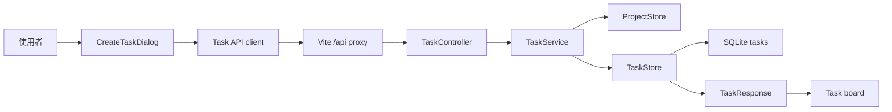

# S004: Task Creation Through Backend API

> 規格：S004 | 大小：M(14) | 狀態：⏳ Plan
> 日期：2026-06-02
> 對應：PRD §0.4, §6 MVP 範疇 4-6 / spec-roadmap row S004 / S001-S003 Project API baseline

---

## 1. 目標

讓使用者在已選 Project 底下建立一筆真正保存在 backend SQLite 的 manual Task。建立成功後，Task board 會在 `BACKLOG` 顯示這筆新 Task，而不是只關閉 fixture dialog。

S004 是 Task domain 的第一個 full-stack vertical slice。它只處理「手動新增 `BACKLOG` Task」：

- 使用者可填 `title`、`body`、`labels`。
- 系統自動設定 `source = manual`。
- 系統自動設定初始 `state = BACKLOG`。
- Task 在 MVP 繼承 Project 的 `workflowRecipeId`，不讓使用者在單筆 Task 選 workflow。
- 系統在建立 Task 時複製 Project Workflow Recipe 或 future workflow file，形成該 Task 的固定 Task Workflow。
- Task 建立後能透過 `GET /api/projects/{projectId}/tasks` 讀回。
- 使用者必須先選到真實 Project 才能建立 Task；沒有 Project owner 的孤兒 Task 不合法。

S004 不做 Ready Gate、不做 agent claim、不建立完整 Task Conversation Thread message table、不做 dependencies、assignment、dispatcher、Review Materials 或 Release evidence。S004 只建立 Task 和 Task Workflow；不啟動 active Workflow Run，也不寫 step evidence / Quality Loop attempt。Task comments 未來屬於同一條 Task Conversation Thread；看板只顯示 thread 的主要留言摘要或計數投影。這些留給 S005-S007。

相依狀態：

| 相依 | 類型 | 狀態 | 對 S004 的影響 |
| --- | --- | --- | --- |
| S001 | Code-level | ✅ local verification PASS | 已有 Spring MVC + SQLite + Vite proxy + full-stack Playwright pattern。 |
| S002 | Code-level | ✅ shipped | Project 會保存 workflow recipe role settings；Task 可繼承 Project workflow identity。 |
| S003 | Code-level | ✅ shipped | Project path contract 穩定為 `projectPath`；full-stack test 已用 temporary `user.home` 避免寫真資料。 |
| `docs/grimo/development-standards.md` | Process | exists | Task planning 必須有 BDD layer split、Verification Conditions、Generality Probe。 |
| `docs/grimo/qa-strategy.md` | QA gate | exists | S004 frontend-to-backend 行為必須有 backend API tests + Playwright full-stack interaction。 |

## 2. 研究與設計

### 2.1 查到的事實

| 來源 | 查到什麼 | 對設計的影響 |
| --- | --- | --- |
| `docs/grimo/PRD.md` §6 MVP 範疇 4 | 新增 Task 的可見表單欄位對齊 GitHub issue style：title、body、labels；source 由系統保存，manual 建立固定為 `manual`；status 由系統設定；workflow 由 Project 繼承。 | `CreateTaskRequest` 只接受 `title`, `body`, `labels`；不接受 `source`, `state`, `workflowRecipeId`。建立時複製 Project workflow 作為 Task Workflow。 |
| `docs/grimo/PRD.md` §0.4, §2 | Task 是 Project 底下的工作封包，包含 Definition Package、Workflow Evidence、Review Materials、Attachments 等未來資料。 | S004 先建立 `tasks` root table 和 Task Workflow；future evidence tables 用 `task_id`、`task_workflow_id` 或 `workflow_run_id` 掛上。 |
| `docs/grimo/glossary.md` | Task 是使用者想完成的一件工作；不是 Workflow Step、內部 phase 或 prompt message。 | Backend package 命名用 `task`，欄位避免把 `step` 當 board state。 |
| `frontend/src/features/task-create/CreateTaskDialog.tsx` | 現有 dialog 已有 title/body/labels/skill UI，但 submit 只 `preventDefault()` + `onClose()`。 | S004 改 submit 為 API call；移除 `建議 skill` submit surface，避免假裝完成 assignment/Ready Gate。 |
| `frontend/src/App.tsx` | Task board 目前直接使用 `task-fixtures.ts`，current Project 只存在於 App local state。 | S004 需要在 current Project 存在時載入 backend tasks；無 current Project 時可保留 read-only fixture/demo board，但不可建立 Task。 |
| `frontend/src/domain/task/task-types.ts` | 現有 frontend `Task` type 是 prototype-era consumer shape，仍有 root-level `skill`, `score`, `step`, `acceptance`, `gaps`, `evidence`, `comments`。 | S004 不讓 frontend type 反向決定 API；`TaskResponse` 以 PRD/domain data contract 為 source of truth。Frontend 需要改成 consume `workflowSummary`, `commentCount`, and workflow-generated projections；fixture-only UI fallback 不可污染 backend contract。 |
| `backend/src/main/java/io/github/samzhu/grimo/project/*` | Project API 使用 `Controller -> Service -> Store -> SQLite`，回 `CollectionResponse<T>`，ID 由 `ShortResourceIdGenerator` 產生。 | Task API 沿用同一模式，新 package `io.github.samzhu.grimo.task`，不先抽 generic repository。 |
| `backend/src/main/resources/schema.sql` | 目前只有 `projects` 與 `project_workflow_roles`，Project path 欄位仍是 internal `workspace_path`。 | S004 新增 `tasks` table，FK 到 `projects(id)`，不改 Project schema。 |
| `scripts/verify-release.sh` | Release gate 已跑 frontend build、visual regression、backend tests、full-stack Project onboarding。 | S004 必須把 Task full-stack test 接進 `npm run test:fullstack` 或 release script 的 full-stack gate。 |
| Spring Framework `@RequestBody` docs | `@RequestBody` 可配合 `@Valid` / `@Validated` 做 request body validation，validation error 預設導向 bad request 類錯誤。 | `CreateTaskRequest` 使用 Bean Validation 做 title/body/labels 基本限制，service 處理 Project existence 與 normalization。 |
| Spring Framework `JdbcClient` docs | `JdbcClient` 是 JDBC query/update 的 fluent facade，支援 named parameters，適合簡化 SQL CRUD。 | Task persistence 沿用 ProjectStore 的 Spring JDBC/JdbcClient pattern，不新增 ORM 或 Spring Data JDBC dialect。 |
| Spring Framework `ResponseEntity` docs | `ResponseEntity.created(URI)` 可回 201 Created 並設定 Location header。 | `POST /api/projects/{projectId}/tasks` 回 `201 Created` 和 `/api/projects/{projectId}/tasks/{taskId}`。 |
| SQLite foreign key docs | SQLite foreign key constraint 需要 application 在 runtime 啟用 `PRAGMA foreign_keys`；不能只寫 `FOREIGN KEY` DDL。 | S004/S009 implementation 必須設定每條 SQLite connection 啟用 FK enforcement，並測試 orphan insert 會失敗。 |
| `SqliteForeignKeyEnforcementPocTests` | 本 repo 的 Xerial SQLite JDBC POC 已證明 `PRAGMA foreign_keys = ON` 會擋 orphan Task row，`OFF` 會讓 orphan row 插入成功。 | S004 可採用 SQLite FK 保護 `tasks.project_id`，但 implementation 不能漏掉 connection-level pragma。 |

Research citations:

- Spring `@RequestBody`: <https://docs.spring.io/spring-framework/reference/web/webmvc/mvc-controller/ann-methods/requestbody.html>
- Spring MVC validation: <https://docs.spring.io/spring-framework/reference/web/webmvc/mvc-controller/ann-validation.html>
- Spring JDBC core / `JdbcClient`: <https://docs.spring.io/spring-framework/reference/data-access/jdbc/core.html>
- Spring `ResponseEntity`: <https://docs.spring.io/spring-framework/docs/6.2.9/javadoc-api/org/springframework/http/ResponseEntity.html>
- SQLite foreign key support: <https://www.sqlite.org/foreignkeys.html>
- SQLite `PRAGMA foreign_keys`: <https://www.sqlite.org/pragma.html#pragma_foreign_keys>

### 2.2 架構設計

S004 採用 full-stack Task creation：



Backend module boundary:

| Package | Responsibility | Rule |
| --- | --- | --- |
| `io.github.samzhu.grimo.task` | Task API、create/list rules、SQLite row mapping | 可讀 Project 是否存在，但不改 Project lifecycle。 |
| `io.github.samzhu.grimo.project` | Project and workflow recipe source of truth | S004 只重用 `ProjectStore` / Project record facts，不把 Task 放進 project package。 |

Task table:

| Column | Example | Source | Purpose |
| --- | --- | --- | --- |
| `id` | `01JZ9E3K7M2Q4` | `ShortResourceIdGenerator` | Stable Task id。 |
| `project_id` | `01JZ9DPROJECT1` | URL path | Project ownership and query scope。 |
| `title` | `補上 Task API` | request | Board card title。 |
| `body` | `建立 backend API 並接 CreateTaskDialog` | request | Initial definition context。 |
| `source` | `manual` | system | Provenance；S004 不讓 request override。 |
| `state` | `BACKLOG` | system | Manual Task starts as saved work in Backlog, before definition flow begins。 |
| `workflow_recipe_id` | `web-service-development` | Project row | Task inherits Project workflow。 |
| `labels` | `["backend","enhancement"]` | request normalized | Board labels。 |
| `created_at` / `updated_at` | ISO-8601 UTC | system clock | Sort and audit。 |

Response shape defines the Project-owned Task summary API contract. The Task board consumes this contract, but does not own it:

```json
{
  "id": "01JZ9E3K7M2Q4",
  "projectId": "01JZ9DPROJECT1",
  "title": "補上 Task API",
  "body": "建立 backend API 並接 CreateTaskDialog",
  "description": "建立 backend API 並接 CreateTaskDialog",
  "state": "BACKLOG",
  "source": "manual",
  "workflowRecipeId": "web-service-development",
  "workflowSummary": {
    "currentStep": null,
    "qualityScore": null
  },
  "updatedAt": "2026-06-02T09:00:00Z",
  "acceptance": [],
  "gaps": [],
  "evidence": [],
  "labels": ["backend", "enhancement"],
  "commentCount": 0
}
```

`commentCount` 是 Task card summary projection，不是 S004 的 editable field，也不是 `tasks` table column。S004 固定回 `0`；未來 Task Conversation Thread spec 應把 user / agent comments 都保存成同一條 thread 的 messages，看板再從 thread 查出 `commentCount` 或主要留言預覽。不要為 Task 另建一套脫離 thread 的 comments aggregate。

`workflowSummary` 是 Workflow Evidence 的 summary projection，不是 Task root identity，也不是單一 JSON 欄位。Workflow 是多個 step 組成的執行結構，未來應拆成正規化的 workflow step execution / Quality Loop 資料表，再由查詢聚合出目前 step 和最新 quality score。S004 只把 Task 放進 Backlog，還沒有進入 Discuss / Explore / Dev 等 workflow step，也沒有 Quality Loop result，所以 `currentStep` 和 `qualityScore` 固定為 `null`。

建立 Task 會複製 Task Workflow，但不初始化 active Workflow Run。`BACKLOG` 只代表這件工作已保存且流程版本已固定；Task Workflow 建立後不可被後續 Project recipe 或 workflow file 修改自動改寫。等使用者第一次打開這個 Task 的 `Chat`，才由 S009 的 internal transition 在同一個 transaction 內把 Task 轉成 `DEFINING`、建立 active run、複製 execution steps，並開始累積 evidence。

`acceptance`, `gaps`, `evidence` 是 workflow 逐步產生的 Task intelligence projection，不是手動建立 Task 表單的輸入。S004 只建立狀態為 `BACKLOG` 的 Task，所以三者固定回空陣列：`acceptance` 會在 `$planning-spec` / `$planning-tasks` 把 BDD、AC、欄位 contract 收斂後出現；`gaps` 會在 `$grill-with-docs` / `$planning-spec` / `$verifying-quality` 發現缺決策、缺欄位或缺測試能力時出現；`evidence` 會在 `$implementing-task` / `$verifying-quality` / `$shipping-release` 保存測試、E2E、log、screenshot 或 release gate 證據後出現。

UI sketch:

```text
Task board with selected Project
┌───────────────────────────────────────────────────────────────┐
│ 任務工作台                       [搜尋任務 / 關鍵字] [新增 Task] │
├───────────────────────────────────────────────────────────────┤
│ BACKLOG                                                      │
│ ┌───────────────────────────────────────────────────────────┐ │
│ │ 01JZ9E3K7M2Q4                                             │ │
│ │ 補上 Task API                                             │ │
│ │ [backend] [enhancement]                 updated just now  │ │
│ └───────────────────────────────────────────────────────────┘ │
└───────────────────────────────────────────────────────────────┘

新增 Task dialog
┌───────────────────────────────────────────────────────────────┐
│ 新增 Task                                            [close]  │
│ 先保存到 Backlog；啟動定義討論後再補 acceptance 與缺口。       │
├───────────────────────────────────────────────────────────────┤
│ 標題                                                        │
│ [補上 Task API____________________________________________]  │
│ 任務內容                                                    │
│ [建立 backend API 並接 CreateTaskDialog____________________] │
│ Labels                                                      │
│ [backend, enhancement_____________________________________]  │
│                                                             │
│ [建立 Task] [取消]                                          │
└───────────────────────────────────────────────────────────────┘

Failure:
- blank title shows user-readable error and keeps dialog open
- backend error does not add a card

This is not final pixel design and not a new design system.
```

### 2.3 做法比較

| 做法 | 採用 | 理由 |
| --- | --- | --- |
| A: Backend-only Task API | no | 能先鎖定 domain contract，但使用者仍看不到 Task creation 的真實結果；也無法證明 CreateTaskDialog 不只是 fixture close。 |
| B: Full-stack manual Task creation | yes | 符合 roadmap「through backend API」和使用者確認；能用 full-stack E2E 證明 frontend -> backend -> SQLite -> board 的真實資料流。 |
| C: Full Task Conversation Thread + attachments 一起做 | no | 會把 S004 擴大到 S005/S007，且需要 message/attachment/evidence table 設計。 |
| D: Task board 全面移除 fixture，首頁立刻要求 Project context | no for S004 | 會重寫 prototype visual baseline；S004 只在 current Project 存在時使用 backend tasks；無 Project 時 fixture/demo path 可保留為 read-only，但 `新增 Task` 不可建立資料。 |
| E: `POST /api/tasks` with `projectId` in body | no | Project 是 Task owner；URL nesting `POST /api/projects/{projectId}/tasks` 更能避免 Task 脫離 Project context。 |
| F: labels as comma-separated string in API | no | UI 可以用 comma input，但 API 應接 `labels[]`，避免 backend 和單一輸入框格式綁死。 |
| G: S004 同時建立 workflow execution evidence tables | no in S004; Task Workflow yes as paired S009 | Workflow 是多 step 結構，建立 Task 時要複製 immutable Task Workflow；但 S004 只建立狀態為 `BACKLOG` 的 Task，尚未啟動 active run 或 Quality Loop evidence。正式 Task Workflow / run / evidence table design 放進 paired spec S009，和 S004 一起規劃資料模型但分開實作。 |

Chosen approach:

- `POST /api/projects/{projectId}/tasks` creates manual Tasks in `BACKLOG`.
- `GET /api/projects/{projectId}/tasks` lists only that Project's Tasks.
- Creating a Task copies the Project workflow definition into a Task Workflow.
- Frontend parses the labels text box into `labels[]` and does not render or submit `skill`.
- Backend `TaskResponse` does not include `skill`; required skills come from the Project Workflow Recipe and later assignment/execution specs.
- Task board uses backend tasks only when a current Project exists.
- Create Task action is disabled or redirects to Project selection when `currentProject` is null; S004 never creates orphan Tasks.
- S004 updates full-stack Playwright and release gate evidence.

### 2.4 Task 邊界提示

| Task 候選 | Class / file | 來源 | 正向情境 | 反向情境 | POC |
| --- | --- | --- | --- | --- | --- |
| T00 SQLite FK enforcement POC | `backend/src/test/java/io/github/samzhu/grimo/poc/SqliteForeignKeyEnforcementPocTests.java` | SQLite docs + orphan Task risk | `PRAGMA foreign_keys=ON` rejects missing `project_id` parent | `PRAGMA foreign_keys=OFF` allows orphan row, proving DDL alone is not enough | done: `./gradlew test --tests '*SqliteForeignKeyEnforcementPocTests'` PASS |
| T01 Backend Task API BDD | `backend/src/main/java/io/github/samzhu/grimo/task/*`, `TaskApiTests` | PRD §6, Project API pattern | `POST /api/projects/{projectId}/tasks` persists manual Task and `GET` reads it back | blank title 400, unknown Project 404, no row persisted | not required |
| T02 Frontend Task API wiring | `frontend/src/features/task-create/CreateTaskDialog.tsx`, `frontend/src/features/task-board/TaskWorkbench.tsx`, `frontend/src/domain/task/*` | existing fixture UI | dialog submit calls backend, pending/error states visible, returned Task appears in BACKLOG, `建議 skill` no longer appears | backend error keeps dialog open and does not add card | not required |
| T03 Full-stack Task Creation Verification | `frontend/e2e/project-onboarding.fullstack.spec.ts` or new task full-stack spec, `scripts/verify-release.sh` | QA strategy | real browser creates Project, then Task through `/api/projects/{projectId}/tasks`, then reads it back | fixture-only UI or backend missing makes test fail | not required |

## 3. BDD Contract

驗證命令：

執行：`scripts/verify-release.sh`

通過條件：所有帶 `AC-S004-*` 的 backend、frontend、full-stack tests 都是綠燈；full-stack test 必須使用 real `/api` wiring，不可 mock Task create response。`@state:verified` 只能在 `$verifying-quality` 跑過命令並記錄 evidence 後標記。

BDD / acceptance confirmation status:

- 已確認：S004 採 B full-stack Task creation，但只做 manual Task creation with `state=BACKLOG`。
- 已確認：manual Task 建立後先進 `BACKLOG`；S005 才處理第一次打開 Task `Chat` 時的 `BACKLOG -> DEFINING` 入口。
- 已確認：建立 Task 會複製 Task Workflow，但不初始化 active Workflow Run；run/evidence 要等第一次打開 `BACKLOG` Task 的 `Chat` 時，由 S009 的 atomic transition 連同 `BACKLOG -> DEFINING` 一起開始。
- 已確認：Task root schema 和 Workflow Evidence schema 要一起規劃；S004 實作 Task root create/list，S009 正式設計 workflow step execution / Quality Loop tables 與 `workflowSummary` projection。
- 待使用者確認：API 是否用 nested Project path；無 current Project 時是否保留 fixture/demo board。

AC 覆蓋矩陣：

| AC | 使用者結果 | Contract / 可觀察輸出 | Layer | State |
| --- | --- | --- | --- | --- |
| AC-S004-1 | 使用者送出 manual Task 後，backend 建立一筆 Project-owned Task，狀態是 `BACKLOG`，並複製該 Task 的 Task Workflow，但不啟動 active run。 | `POST /api/projects/{projectId}/tasks` returns `201 Created` with `state=BACKLOG`, `source=manual`, inherited `workflowRecipeId`, `workflowSummary.currentStep/qualityScore = null`, Task Workflow copied, and no active workflow run initialized。 | backend, api | proposed |
| AC-S004-2 | 使用者回到 Task board 時，只看到目前 Project 的 Tasks，不混入其他 Project。 | `GET /api/projects/{projectId}/tasks` returns `CollectionResponse<TaskResponse>` sorted newest first, with nested `workflowSummary` per item。 | backend, api | proposed |
| AC-S004-3 | 使用者填錯資料時，系統不建立壞 Task，並回可理解錯誤。 | blank title `400`, unknown project `404`, SQLite row count unchanged。 | backend, api | proposed |
| AC-S004-4 | 使用者在已選 Project 內建立 Task 後，Task board 立即出現新卡片；未選 Project 時不能建立孤兒 Task。 | UI sends `labels[]`, no `source/state/workflowRecipeId/workflowSummary/acceptance/gaps/evidence/commentCount/skill`; returned Task card appears in `BACKLOG`; `currentProject = null` disables create or routes to Project selection。 | frontend, fullstack | proposed |
| AC-S004-5 | QA 能證明 Task creation 不是 fixture 假成功或 hardcoded response。 | Full-stack creates dynamic Project + dynamic Task; follow-up `GET` read-back contains the Task and labels。 | fullstack | proposed |
| AC-S004-6 | Release gate 會跑 S004 backend/full-stack checks。 | `temp/verify-release.log` includes S004 Task creation gate and fails on task API/test failure。 | docs, automation | proposed |

Feature: Manual Task creation

### Rule: Manual Task creation belongs to a Project

使用者結果：
使用者已經選好 Project 時，可以用 `新增 Task` 先把一件工作保存到 Backlog。這筆 Task 會歸屬在目前 Project，source 由系統標成 `manual`，狀態從 `BACKLOG` 開始，不會直接進 DEFINING、READY 或啟動 agent。

Contract：

```http
POST /api/projects/{projectId}/tasks
Content-Type: application/json
```

Request:

```json
{
  "title": "補上 Task API",
  "body": "建立 backend API 並接 CreateTaskDialog",
  "labels": ["backend", "enhancement"]
}
```

Response:

```http
201 Created
Location: /api/projects/01JZ9DPROJECT1/tasks/01JZ9E3K7M2Q4
```

```json
{
  "id": "01JZ9E3K7M2Q4",
  "projectId": "01JZ9DPROJECT1",
  "title": "補上 Task API",
  "body": "建立 backend API 並接 CreateTaskDialog",
  "description": "建立 backend API 並接 CreateTaskDialog",
  "state": "BACKLOG",
  "source": "manual",
  "workflowRecipeId": "web-service-development",
  "workflowSummary": {
    "currentStep": null,
    "qualityScore": null
  },
  "updatedAt": "2026-06-02T09:00:00Z",
  "acceptance": [],
  "gaps": [],
  "evidence": [],
  "labels": ["backend", "enhancement"],
  "commentCount": 0
}
```

```gherkin
@spec:S004
@ac:AC-S004-1
@layer:backend,api
@api:POST /api/projects/{projectId}/tasks
@state:proposed
Scenario: Manual Task creation persists a Project-owned BACKLOG Task
  Given a Project exists with workflowRecipeId "web-service-development"
  When the client creates a Task with title "補上 Task API", body "建立 backend API 並接 CreateTaskDialog", and labels ["backend", "enhancement"]
  Then the response is 201 Created
  And the response contains source "manual", state "BACKLOG", commentCount 0, and workflowRecipeId "web-service-development"
  And the response contains workflowSummary with currentStep null and qualityScore null
  And the response contains empty acceptance, gaps, and evidence arrays
  And SQLite contains one tasks row with the returned task id and project id
  And the Task has a copied Task Workflow
  And no active workflow run is initialized for the Task
  And the request cannot set source, state, workflowRecipeId, workflowSummary, acceptance, gaps, evidence, commentCount, or skill
  # 技術證據：MockMvc status/body assertion + tasks table row assertion
```

Generality expectation:

- Backend test must create at least two Tasks with different dynamic titles and labels.
- A hardcoded `source/manual/state/labels` response without a persisted row must fail read-back assertions.

驗證綁定（Verification Bindings）：

- backend: `backend/src/test/java/io/github/samzhu/grimo/task/TaskApiTests.java`
- command: `./backend/gradlew -p backend test --tests '*TaskApiTests'`

### Rule: Task list is Project-scoped

使用者結果：
使用者在某個 Project 裡看 Task board，只會看到該 Project 的 Tasks。另一個 Project 的 Task 不會混進目前 Project，避免使用者在錯 repo 裡派工。

Contract：

```http
GET /api/projects/{projectId}/tasks
```

Response:

```json
{
  "content": [
    {
      "id": "01JZ9E3K7M2Q4",
      "projectId": "01JZ9DPROJECT1",
      "title": "補上 Task API",
      "state": "BACKLOG",
      "source": "manual",
      "workflowSummary": {
        "currentStep": null,
        "qualityScore": null
      },
      "labels": ["backend", "enhancement"],
      "commentCount": 0
    },
    {
      "id": "01JZ9E3K8N3R5",
      "projectId": "01JZ9DPROJECT1",
      "title": "整理 Task API 驗收",
      "state": "BACKLOG",
      "source": "manual",
      "workflowSummary": {
        "currentStep": null,
        "qualityScore": null
      },
      "labels": [],
      "commentCount": 0
    }
  ]
}
```

```gherkin
@spec:S004
@ac:AC-S004-2
@layer:backend,api
@api:GET /api/projects/{projectId}/tasks
@state:proposed
Scenario: Task list returns only Tasks for the selected Project
  Given Project A has two Tasks
  And Project B has one Task
  When the client lists Tasks for Project A
  Then the response is 200 OK
  And the response is CollectionResponse<TaskResponse> with two content items
  And every content item has projectId for Project A
  And no Task from Project B appears
  # 技術證據：jsonPath("$.content", hasSize(2)) + SQL fixture for cross-project exclusion
```

Generality expectation:

- Test fixture must use two Project ids and dynamic Task titles.
- Sorting assertion must prove newest first, not just "contains task".

驗證綁定（Verification Bindings）：

- backend: `backend/src/test/java/io/github/samzhu/grimo/task/TaskApiTests.java`
- command: `./backend/gradlew -p backend test --tests '*TaskApiTests'`

### Rule: Invalid Task creation does not persist bad rows

使用者結果：
如果使用者沒有填標題，或 frontend 指到不存在的 Project，系統會回可理解錯誤，而且不會在 SQLite 留下半成品 Task。

Contract:

| Case | Request | Result |
| --- | --- | --- |
| Blank title | `{"title":"", "body":"...", "labels":[]}` | `400 Bad Request`, body `{"error":"請填寫 Task 標題"}` |
| Missing Project | `POST /api/projects/missing/tasks` | `404 Not Found`, body `{"error":"找不到 Project"}` |
| Client tries system/projection override | body includes `state`, `source`, `workflowRecipeId`, `workflowSummary`, `acceptance`, `gaps`, `evidence`, `commentCount` | fields ignored because DTO does not expose them |

```gherkin
@spec:S004
@ac:AC-S004-3
@layer:backend,api
@api:POST /api/projects/{projectId}/tasks
@state:proposed
Scenario: Invalid Task create returns user-readable error without persistence
  Given a Project exists
  When the client creates a Task with a blank title
  Then the response is 400 Bad Request with error "請填寫 Task 標題"
  And SQLite has no Task row for that Project and body
  When the client creates a Task under an unknown Project id
  Then the response is 404 Not Found with error "找不到 Project"
  # 技術證據：error body assertion + tasks row count stays unchanged
```

驗證綁定（Verification Bindings）：

- backend: `backend/src/test/java/io/github/samzhu/grimo/task/TaskApiTests.java`
- command: `./backend/gradlew -p backend test --tests '*TaskApiTests'`

### Rule: Create Task dialog uses the real backend API

使用者結果：
使用者在 Task board 點 `新增 Task`、填資料、按 `建立 Task` 後，modal 不只是關閉；新 Task 會出現在 `BACKLOG` 欄，而且重新從 API 讀回時仍存在。

Contract:

Frontend request body:

```json
{
  "title": "補上 Task API",
  "body": "建立 backend API 並接 CreateTaskDialog",
  "labels": ["backend", "enhancement"]
}
```

Forbidden request fields:

```json
{
  "source": "manual",
  "state": "READY",
  "workflowRecipeId": "coding",
  "workflowSummary": {
    "currentStep": "client-injected-step",
    "qualityScore": 10
  },
  "acceptance": ["只要建立就算完成"],
  "gaps": ["假裝有缺口"],
  "evidence": ["fake evidence"],
  "commentCount": 99,
  "skill": "backend-engineer"
}
```

```gherkin
@spec:S004
@ac:AC-S004-4
@layer:frontend,fullstack
@api:POST /api/projects/{projectId}/tasks
@state:proposed
Scenario: User creates a manual Task from the Task board
  Given the user has selected a Project
  And the Task board is using backend Tasks for that Project
  When the user opens "新增 Task", fills title/body/labels, and clicks "建立 Task"
  Then the submit button shows a pending state while the request is in flight
  And the dialog closes only after a successful backend response
  And the new Task card appears in the BACKLOG column with the submitted title and labels
  And the dialog does not render "建議 skill"
  And the frontend request body does not include source, state, workflowRecipeId, workflowSummary, acceptance, gaps, evidence, commentCount, or skill
  # 技術證據：Playwright captures POST body and verifies DOM card from backend response

Scenario: User cannot create a Task before selecting a Project
  Given no current Project is selected
  When the user views the Task board
  Then "新增 Task" is disabled or routes the user to Project selection
  And the frontend does not call POST /api/projects/{projectId}/tasks
  And no Task card is added to the board
  # 技術證據：Playwright asserts no task POST happens without currentProject
```

驗證綁定（Verification Bindings）：

- frontend/fullstack: `frontend/e2e/project-onboarding.fullstack.spec.ts` or `frontend/e2e/task-creation.fullstack.spec.ts`
- command: `npm --prefix frontend run test:fullstack`

### Rule: Full-stack evidence proves this is not fixture success

使用者結果：
QA 能確認新 Task 不是 UI fixture 或 canned response。測試會用動態 Project 和動態 Task title，並透過 follow-up API read-back 驗證資料真的進 SQLite。

```gherkin
@spec:S004
@ac:AC-S004-5
@layer:fullstack
@api:GET /api/projects/{projectId}/tasks
@state:proposed
Scenario: Task create survives read-back through the real API
  Given Playwright creates a Project with a dynamic name through the real Project API
  When the browser creates a Task with a dynamic title that is not present in frontend fixtures
  Then a follow-up GET /api/projects/{projectId}/tasks contains that Task
  And the Task id matches the backend TSID pattern
  And no fixture-only Task id such as "GRM-144" is required for the assertion
  # 技術證據：dynamic title + API read-back + DOM assertion
```

Generality expectation:

- Full-stack test must use a timestamp or random suffix not present in source fixtures.
- `$verifying-quality` should search production code for the dynamic fixture prefix if generality is questioned.

驗證綁定（Verification Bindings）：

- frontend/fullstack: `frontend/e2e/task-creation.fullstack.spec.ts`
- command: `npm --prefix frontend run test:fullstack`

### Rule: Release gate includes S004

使用者結果：
出貨前的單一 release gate 會真的跑 S004 的 backend 和 full-stack Task creation checks。未接 release gate 的 Task API 不能 ship。

```gherkin
@spec:S004
@ac:AC-S004-6
@layer:docs,automation
@state:proposed
Scenario: Release verification runs Task creation checks
  Given S004 implementation is complete
  When scripts/verify-release.sh runs
  Then temp/verify-release.log includes backend tests covering AC-S004
  And the full-stack section includes S004 Task creation evidence
  And the script exits non-zero if Task API tests fail
```

驗證綁定（Verification Bindings）：

- automation: `scripts/verify-release.sh`
- backend: `backend/src/test/java/io/github/samzhu/grimo/task/TaskApiTests.java`
- fullstack: `frontend/e2e/task-creation.fullstack.spec.ts`
- command: `scripts/verify-release.sh`

### 非功能需求檢查

| 分類 | 對應驗收 | 說明 |
| --- | --- | --- |
| Performance | N/A | S004 是本機 MVP Task create/list，沒有明確 p95 / QPS target；若 Task list pagination 成為需求，另開 spec 導入 `PageResponse<T>`。 |
| Security | AC-S004-3 | S004 接 user input；title/body/labels 要限制長度並避免 request 設定 source/state/workflow。MVP security 仍 permit-all。 |
| Reliability | AC-S004-2, AC-S004-5 | Project-scoped read-back 和 SQLite row assertion 證明資料不混 Project、不是 fixture 假成功。 |
| Usability | AC-S004-3, AC-S004-4 | blank title / backend error 要顯示 user-readable error，成功才關 dialog。 |
| Maintainability | AC-S004-6 | Task API tests 和 full-stack gate 必須接 release pipeline；Task package 遵守 Project API 的近距離 package pattern。 |

## 4. 介面與 API 設計

Backend API:

```java
@RestController
@RequestMapping("/api/projects/{projectId}/tasks")
class TaskController {
    @GetMapping
    CollectionResponse<TaskResponse> listTasks(@PathVariable String projectId);

    @PostMapping
    ResponseEntity<TaskResponse> createTask(
            @PathVariable String projectId,
            @Valid @RequestBody CreateTaskRequest request
    );
}
```

Request DTO:

```java
record CreateTaskRequest(
        @NotBlank String title,
        String body,
        List<String> labels
) {}
```

Normalization rules:

| Field | Rule | Reason |
| --- | --- | --- |
| `title` | trim, required, max 140 chars | Board card title must stay scannable。 |
| `body` | trim nullable to `""`, max 8000 chars | Initial definition context, not full conversation table。 |
| `labels` | trim, drop blank, dedupe preserving order, max 10 labels, each max 40 chars | UI datalist is helper only; backend avoids storing empty/noisy labels。 |
| `source` | always `manual` | PRD says source is system provenance, not user form field。 |
| `state` | always `BACKLOG` | Manual Task is saved work that has not entered definition flow or READY。 |
| `workflowRecipeId` | copy from Project | Task inherits Project workflow。 |
| `workflowSummary.currentStep` | response-only `null` | Workflow Evidence projection; S004 has not entered a workflow step yet, so Task root `state=BACKLOG` is the only progress signal。 |
| `workflowSummary.qualityScore` | response-only `null` | Quality Loop projection; S004 has not run review/rating/fix yet, so the system must not invent a score。 |
| `acceptance` | response-only `[]` | Workflow output; S004 has not run planning/spec/task BDD yet, so no acceptance criteria are known。 |
| `gaps` | response-only `[]` | Workflow output; S004 has not run grilling/planning/QA discovery yet, so the system must not invent missing decisions。 |
| `evidence` | response-only `[]` | Workflow output; S004 has not run implementation, verification, E2E, or release gates yet, so there is no proof to show。 |
| `commentCount` | response-only `0` | Board projection from the future Task Conversation Thread; not stored on `tasks`, not a separate comments aggregate, and not accepted in request。 |

Response DTO:

```java
record TaskResponse(
        String id,
        String projectId,
        String title,
        String body,
        String description,
        String state,
        String source,
        String workflowRecipeId,
        WorkflowSummaryResponse workflowSummary,
        Instant createdAt,
        String updatedAt,
        List<String> acceptance,
        List<String> gaps,
        List<String> evidence,
        List<String> labels,
        int commentCount
) {}

record WorkflowSummaryResponse(
        String currentStep,
        Double qualityScore
) {}
```

Storage:

```sql
CREATE TABLE IF NOT EXISTS tasks (
    id TEXT PRIMARY KEY,
    project_id TEXT NOT NULL,
    title TEXT NOT NULL,
    body TEXT NOT NULL DEFAULT '',
    source TEXT NOT NULL,
    state TEXT NOT NULL,
    workflow_recipe_id TEXT NOT NULL,
    labels TEXT NOT NULL DEFAULT '[]',
    created_at TEXT NOT NULL,
    updated_at TEXT NOT NULL,
    FOREIGN KEY (project_id) REFERENCES projects(id)
);

CREATE INDEX IF NOT EXISTS idx_tasks_project_updated
ON tasks(project_id, updated_at DESC);
```

`tasks.project_id` 是 Task ownership 的資料結構邊界。每筆 Task 必須掛在一個 Project 底下；backend create path 只接受 `POST /api/projects/{projectId}/tasks`，service 先確認 Project 存在才 insert，SQLite 用 `project_id TEXT NOT NULL` + `FOREIGN KEY (project_id) REFERENCES projects(id)` 防止 orphan row。Frontend 沒有 `currentProject` 時不可呼叫 create API。

SQLite FK enforcement 是 connection-level 設定，不是只靠 DDL。S004 implementation 必須讓 Grimo 的 SQLite datasource 每條 connection 都啟用 `PRAGMA foreign_keys=ON`，並保留 backend test 證明 orphan `tasks.project_id` insert 失敗。`SqliteForeignKeyEnforcementPocTests` 已用 temporary database 證明 Xerial SQLite JDBC 可行，且 `foreign_keys=OFF` 時 orphan row 會被接受。

`tasks` 不存 `comments` 或 `comment_count`。留言內容未來應進正規化的 Task Conversation Thread message table，和完整討論 thread 混在一起；看板只取主要 comments 的 projection，例如 `commentCount` 或未來的 `primaryCommentPreview`。S004 只回 `commentCount: 0` 讓 Task card 可以顯示 summary，同時避免提前把留言模型壓成 Task root 欄位或獨立 comments aggregate。

`tasks` 不存 `step`、`score` 或 `workflowSummary` JSON。建立 Task 時會複製 Task Workflow，但 active step、quality score、fix history 仍屬於 Workflow Evidence / Quality Loop 的下一層資料，未來由 execution rows 投影成 `workflowSummary`。S004 只回 `workflowSummary.currentStep: null` 和 `workflowSummary.qualityScore: null`，也不初始化 active Workflow Run；即使 Task Workflow 裡已經有第一個 planned step，也不能把它投影成 `currentStep`，避免把 Backlog Task 假裝成已進入 workflow 或已被評分。

The formal workflow table design is split into paired spec S009 (`Workflow evidence schema and summary projection`). S004 keeps the boundary note here only to protect the data model while S004 is implemented. Exact Task Workflow storage is an S009 design decision:

MVP `workflowRecipeId` 是目前 Project selected recipe 的 API 欄位；S009 的 Task Workflow storage 會用 `source_type` / `source_ref` / optional `source_hash` 保存更通用的 workflow definition 來源，讓未來 workflow file 不需要重命名核心 evidence schema。Task Workflow 一旦建立就是 Task-owned immutable copy；當下複製出的 workflow rows 就是版本本體，不依賴 hash。若未來要讓舊 Task 改用新版 workflow，必須另開明確 migration / rebase 行為，而不是 update 既有 rows。

| Storage concept | Purpose | Example fields |
| --- | --- | --- |
| Task Workflow | 保存建立 Task 當下複製出的 immutable workflow step metadata。 | `task_id`, `step_key`, `step_label`, `task_state`, `step_order` |
| Workflow Run / Execution Steps | 保存第一次 Chat 進 `DEFINING` 後的 active execution state。 | `task_id`, `task_workflow_id`, `step_key`, `state`, `started_at`, `completed_at` |
| Workflow Quality Runs | 保存某個 execution step 的 review / rating / fix 品質循環結果。 | `workflow_run_step_id`, `attempt`, `quality_score`, `review_summary`, `created_at` |

`workflowSummary.currentStep` 應從 active execution step 中目前 active / latest step 推得；`workflowSummary.qualityScore` 應從該 step 最新的 quality run 推得。S004 不假資料；S009 要把 Task Workflow storage、run state、排序、current step selection、quality score projection 和 BDD 驗收正式化。

`tasks` 也不存 `acceptance`, `gaps`, `evidence`。這三者未來應由 Definition Package、gap tracking、verification / review evidence 等正規化資料產生 projection；S004 只回空陣列，避免手動建立 Task 時假裝已完成定義、發現缺口或產生驗證證據。

Frontend API:

```ts
export type CreateTaskInput = {
  title: string;
  body: string;
  labels: string[];
};

export async function listTasks(projectId: string): Promise<Task[]>;
export async function createTask(projectId: string, input: CreateTaskInput): Promise<Task>;
```

Frontend state rule:

- `App` keeps `currentProject`.
- When `currentProject` exists, Task board loads backend tasks for that project.
- When `currentProject` is null, Task board may keep existing fixture tasks for read-only visual/demo baseline until a later Project selection shell spec removes that fallback.
- When `currentProject` is null, Create Task is disabled or routes to Project selection and must not call the Task create API.

## 5. 檔案規劃

| 檔案 | 動作 | 說明 |
| --- | --- | --- |
| `docs/grimo/specs/spec-roadmap.md` | modify | S004 status changes to `⏳ Plan` after task planning. |
| `backend/src/test/java/io/github/samzhu/grimo/poc/SqliteForeignKeyEnforcementPocTests.java` | existing POC | Confirms Xerial SQLite JDBC can enforce FK ownership with `PRAGMA foreign_keys=ON` and shows why DDL alone is insufficient. |
| `backend/src/main/resources/schema.sql` | modify | Add `tasks` table and project/updated index. |
| `backend/src/main/java/io/github/samzhu/grimo/project/ProjectStore.java` | modify | Add `findById(String projectId)` so TaskService can inherit Project workflow and reject missing Project. |
| `backend/src/main/java/io/github/samzhu/grimo/task/CreateTaskRequest.java` | new | Request body for manual Task creation. |
| `backend/src/main/java/io/github/samzhu/grimo/task/TaskRecord.java` | new | SQLite row shape. |
| `backend/src/main/java/io/github/samzhu/grimo/task/TaskResponse.java` | new | Domain/API Task summary response; frontend Task board adapts to this contract. |
| `backend/src/main/java/io/github/samzhu/grimo/task/TaskStore.java` | new | JdbcClient-backed insert/list behavior. |
| `backend/src/main/java/io/github/samzhu/grimo/task/TaskService.java` | new | Project existence, field normalization, state/source/workflow defaults. |
| `backend/src/main/java/io/github/samzhu/grimo/task/TaskController.java` | new | `GET` and `POST` under `/api/projects/{projectId}/tasks`. |
| `backend/src/main/java/io/github/samzhu/grimo/task/TaskErrorHandler.java` | new or merge with existing advice | User-readable task errors for missing Project / invalid task payload. |
| `backend/src/main/java/io/github/samzhu/grimo/project/ShortResourceIdGenerator.java` | modify | Make `newId()` public/package-usable outside project package, or move generator to shared package. |
| `backend/src/test/java/io/github/samzhu/grimo/task/TaskApiTests.java` | new | Backend BDD for AC-S004-1/2/3 and generality probes. |
| `frontend/src/domain/task/task-types.ts` | modify | Add `projectId`, `body`, `workflowRecipeId`, created/updated shape if needed; move root-level `score` / `step` to nested `workflowSummary`; rename card summary from ambiguous `comments` to `commentCount` if the UI still needs a count. |
| `frontend/src/features/task-board/task-api.ts` | new | Thin frontend API client for list/create Tasks. |
| `frontend/src/features/task-create/CreateTaskDialog.tsx` | modify | Submit through API, pending/error state, parse labels to array. |
| `frontend/src/features/task-board/TaskWorkbench.tsx` | modify | Accept create handler/current Project loading state; show returned backend Task. |
| `frontend/src/App.tsx` | modify | Load backend tasks when `currentProject` exists; preserve fixture fallback when no Project is selected. |
| `frontend/e2e/task-creation.fullstack.spec.ts` | new | Full-stack browser/API read-back test for S004. |
| `frontend/playwright.fullstack.config.ts` | modify if needed | Ensure new full-stack spec runs under existing test:fullstack command. |
| `scripts/verify-release.sh` | modify | Update full-stack section/verdict wording to include S004 Task creation. |

---

## 6. Task Plan

### Planning Notes

S004 和 S009 一起規劃，因為「建立 Task」必須同時建立 Task-owned workflow copy；但 S004 不啟動 workflow run，也不寫 execution evidence。實作順序固定為：

1. S004 建立 Project-owned `BACKLOG` Task、Task Workflow copy、Task create/list API。
2. S004 接 frontend 和 full-stack create/read-back。
3. S009 在 S004 的 Task root 與 workflow copy 上，加入 first Chat transition、run/evidence tables、summary projection 和 detail API。

POC evidence：`backend/src/test/java/io/github/samzhu/grimo/poc/SqliteForeignKeyEnforcementPocTests.java` 已通過 `./gradlew test --tests '*SqliteForeignKeyEnforcementPocTests'`，證明 Xerial SQLite JDBC 在 `PRAGMA foreign_keys=ON` 時會擋 orphan Task / evidence row。

### Task Breakdown

| Task | Scope | AC | Test File(s) | Verification |
| --- | --- | --- | --- | --- |
| `S004-T01 Backend Task API and Workflow Copy` | `tasks` table、Task create/list API、Project ownership、Task Workflow copy、no active run | AC-S004-1, AC-S004-2, AC-S004-3 | `backend/src/test/java/io/github/samzhu/grimo/task/TaskApiTests.java` | `./gradlew test --tests '*TaskApiTests'` in `backend/` |
| `S004-T02 Frontend Task API Wiring` | remove draft/skill submit surface, require current Project, call `/api/projects/{projectId}/tasks`, show returned BACKLOG card | AC-S004-4 | `frontend/e2e/task-management.ui.spec.ts`, existing visual specs | `npm run build` and `npm run test:visual` in `frontend/` |
| `S004-T03 Full-stack Task Creation Evidence` | browser creates Project + Task through real API and verifies follow-up GET read-back | AC-S004-4, AC-S004-5 | `frontend/e2e/task-creation.fullstack.spec.ts` | `npm run test:fullstack -- task-creation.fullstack.spec.ts` in `frontend/` |
| `S004-T04 Release Gate Task Creation` | release script/log names S004 Task creation and runs backend/full-stack checks | AC-S004-6 | `scripts/verify-release.sh` | `scripts/verify-release.sh` |

### Next Task

Start with `docs/grimo/tasks/2026-06-04-S004-T01-backend-task-api-and-workflow-copy.md`.

---

<!-- Section 7 added by /planning-tasks after implementation -->
