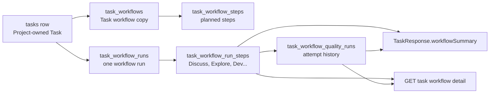

# S009: Workflow step evidence schema and summary projection

> 規格：S009 | 大小：M(13) | 狀態：⏳ Plan
> 日期：2026-06-03
> 最後更新：2026-06-03
> 對應：PRD §0.4, §0.5, §2, §4 P6/P7/P15, §6 AC4 / S004 `workflowSummary` projection boundary / `docs/grimo/glossary.md`

---

## 1. 目標

使用者在 Task board 上只需要快速知道「這件工作現在跑到哪個 workflow step、目前品質分數是多少」；進 Task detail 時，才需要看到每個 step 的 output、review findings、quality score 和 fix history。S009 要把這些 Workflow Evidence 存成正規化資料，不把 `step`、`score` 或整包 `workflowSummary` 塞回 `tasks` root row。

技術上，S009 新增 Task 底下的 workflow copy、execution evidence storage 和 read model：

- `task_workflows`：Task 建立時從 Project Workflow Recipe 或 workflow file 複製出的固定 workflow 副本。
- `task_workflow_steps`：該 Task workflow 副本底下的 planned steps。
- `task_workflow_runs`：一個 Task 的一次 workflow 執行脈絡。
- `task_workflow_run_steps`：該 run 底下的多個 ordered execution steps。
- `task_workflow_quality_runs`：每個 run step 的 sub-Review -> sub-Rating -> sub-Fix 嘗試紀錄。
- `TaskResponse.workflowSummary`：從上述表查出的 board projection。
- `GET /api/projects/{projectId}/tasks/{taskId}/workflow`：Task detail 讀取完整 step evidence 的 read-only API。

S009 不實作完整 workflow runner、agent execution、Ready Gate、Dispatch Window、REVIEW gate 或 Release。這些後續 spec 可以透過 S009 的 backend internal service 寫入 evidence，但 S009 不開 public evidence write API，避免在 MVP permit-all 階段讓 client 任意偽造 workflow history。

Assumptions:

- S004 會先建立 `tasks` root table、Task Workflow、`GET /api/projects/{projectId}/tasks` / `POST /api/projects/{projectId}/tasks`；S009 依賴 S004 的 Task root API、workflow copy 與 `workflowSummary` response field。
- S004 建立的 `BACKLOG` Task 有 Task Workflow，但沒有 active workflow run；S009 的 first Chat transition 必須在同一個 transaction 內完成 `BACKLOG -> DEFINING`、active run creation、execution step copy 和 opening step activation。
- Project-level `WorkflowRecipeCatalog.steps[]` 或 future workflow file 是 workflow step order 的來源；S009 會把 selected workflow definition 的 step metadata 複製到 Task-owned immutable workflow copy，避免日後 recipe wording 或檔案內容改動時污染舊 Task。
- `qualityScore` 是 JSON number，允許小數；通過條件沿用 PRD 的 `quality_score > 9`。
- `acceptance`、`gaps`、`evidence` 仍是未來 Definition Package / gap tracking / verification evidence 的 projection，不屬於 S009 的 request field。

相依狀態：

| 相依 | 類型 | 狀態 | 對 S009 的影響 |
| --- | --- | --- | --- |
| S001/S002 | Code-level | shipped | Project 和 Workflow Recipe 已存在；S009 先把 selected `workflowRecipeId` 視為 `source_type=RECIPE` / `source_ref=web-service-development` 來源，再複製成 Task Workflow。 |
| S004 | Code-level | planned | S009 需要 `tasks` table、Task API package、`TaskResponse.workflowSummary`；implementation 必須等 S004 root Task API 完成後才能動工。 |
| S005/S006/S007 | Downstream | backlog | Task-forming chat、Ready/Dispatch、Review flow 都會寫入或讀取 S009 evidence；S009 要先固定欄位與 projection。 |

Spec overlap scan:

- S004 只建立狀態為 `BACKLOG` 的 manual Task、Project-scoped Task list，以及 Task Workflow；S009 接手 S004 留下的 workflow copy、run、evidence 與 `workflowSummary` 正規化設計，沒有重疊超過 50%。
- S005 會建立或推進 defining Task，但不應自行發明 step evidence schema；S005 應使用 S009 internal service。
- S006/S007 會改 workflow state transition 和 review outcome，但不應改寫 S009 的 storage contract，除非另開 migration spec。

## 2. 研究與設計

### 2.1 查到的事實

| 來源 | 使用者結果 | 技術線索 |
| --- | --- | --- |
| `docs/grimo/PRD.md` §0.4, §2, §6 AC4 | 使用者要能在 Task detail 看到每個 workflow step 的 output、review findings、quality score、fix history 和 worker log。 | Evidence 必須可持久化、可回放，不應只是 transient UI state。 |
| `docs/grimo/glossary.md` | Task State Machine 是 board/list 的外層狀態；Workflow Step 和 Quality Loop 是 Task detail evidence。 | `Discuss`, `Explore`, `Dev` 不是 board column；`workflowSummary` 只是 board projection。 |
| S004 spec | `tasks` 不存 `step`、`score`、`workflowSummary` JSON；建立 `BACKLOG` Task 時會複製 Task Workflow，但 `workflowSummary.currentStep/qualityScore` 為 `null`。 | S009 必須設計 workflow copy、run、quality evidence source tables 和 projection query，不能讓 S004 實作固定假資料。 |
| `backend/src/main/resources/schema.sql` | 目前只有 `projects` 和 `project_workflow_roles`；Task root table 由 S004 新增。 | S009 只 append schema，不改 Project storage。 |
| `backend/src/main/java/io/github/samzhu/grimo/project/WorkflowRecipeCatalog.java` | `web-service-development` recipe 已有 step key、label、Task State metadata；未來 workflow definition 也可能來自檔案。 | 建立 Task 時複製 `step_key`, `step_label`, `task_state`, `step_order` 到 `task_workflow_steps`；第一次 Chat 進 `DEFINING` 時再啟動 run/evidence。 |
| Spring Framework JDBC docs | `JdbcClient` 提供 named/positional parameter 的 fluent JDBC API。 | 延續 ProjectStore pattern；S009 不引入 Spring Data JDBC repository 或 ORM。 |
| SQLite foreign key docs | SQLite foreign key 可用來維持 parent-child 關聯，但 application 必須在 runtime 啟用 `PRAGMA foreign_keys` 才會 enforce。 | Workflow run -> step -> quality run 用 FK；implementation 必須啟用 connection-level FK enforcement，測試要用 temporary database 驗證不寫使用者真資料。 |
| SQLite CREATE INDEX docs | `UNIQUE INDEX` 可拒絕 duplicate key。 | 用 unique index 保證同一 run 內 step key/order 不重複、同一 step 的 attempt 不重複。 |
| `SqliteForeignKeyEnforcementPocTests` | Xerial SQLite JDBC POC 已證明 `PRAGMA foreign_keys=ON` 會擋 orphan child row；`OFF` 會讓 orphan row 插入成功。 | S009 可以用 FK 保護 workflow run/step/quality run ownership，但 release tests 必須證明 Grimo datasource 真的啟用 FK enforcement。 |

### 2.2 選項比較

| 選項 | 做法 | 使用者會看到什麼 | 成本/風險 | 結論 |
| --- | --- | --- | --- | --- |
| A. 把 `currentStep` / `qualityScore` 存在 `tasks` | `tasks` 加 `step`, `score` 或 `workflow_summary` JSON | 看板可以顯示值，但 detail 無法可靠回放每次 review/fix | 違反 S004 邊界；step history 會被覆蓋；很容易被硬編碼成固定值 | no |
| B. 正規化 run/step/quality run，Task list 查 projection | 新增三張 evidence 表；Task list join 出 summary；detail API 讀完整 steps | 看板掃描目前 step；detail 可看每個 step 和嘗試紀錄 | schema/API 較 A 多，但符合 PRD evidence 與後續 workflow specs | yes |
| C. 只存 external evidence files，不建 DB step tables | 把 JSON/log 存檔，DB 只留 path | 可以留 raw evidence，但看板和 detail 每次要 parse files | 查詢/排序/Project isolation 難驗證；BDD 很難防 fixture 成功 | no |

Chosen approach: B。

原因是使用者的產品結果分成兩層：看板只要 summary，Task detail 要完整 evidence。正規化 tables 讓 summary 可以被查詢驗證，也保留 step/quality attempt 的歷史。External evidence file 之後仍可由 `output_ref` 或 future attachment table 掛上，但不作為 S009 的唯一 source of truth。

### 2.3 Research Citations

- Spring Framework JDBC Core: `JdbcClient` 是 Spring 6.1+ 的 unified JDBC query/update API，能沿用目前 ProjectStore 的 fluent SQL pattern。Source: https://docs.spring.io/spring-framework/reference/data-access/jdbc/core.html
- SQLite Foreign Key Support: child table 可以透過 `REFERENCES` 維持 parent-child 關聯；SQLite application 仍需在 runtime 啟用 `PRAGMA foreign_keys`；S009 的 run/step/quality run 會用 FK 表達 ownership。Source: https://www.sqlite.org/foreignkeys.html
- SQLite `PRAGMA foreign_keys`: FK enforcement 是 connection-level 開關；S009 implementation 必須讓 Grimo datasource 每條 connection 都啟用它。Source: https://www.sqlite.org/pragma.html#pragma_foreign_keys
- SQLite CREATE INDEX: `UNIQUE INDEX` 會拒絕 duplicate index entries；S009 用 unique index 保證 step key/order 和 quality attempt 不重複。Source: https://www.sqlite.org/lang_createindex.html

### 2.4 使用者結果與資料流



使用者看 Task board 時，API 只回：

```json
"workflowSummary": {
  "currentStep": "Discuss",
  "qualityScore": 8.5
}
```

使用者進 Task detail 時，API 才回完整 steps：

```json
{
  "taskId": "01JZ9E3K7M2Q4",
  "projectId": "01JZ9DPROJECT1",
  "workflowRunId": "01JZ9RUN00001",
  "workflowSource": {
    "type": "RECIPE",
    "ref": "web-service-development",
    "hash": null
  },
  "steps": [
    {
      "stepKey": "discuss",
      "stepLabel": "Discuss",
      "taskState": "DEFINING",
      "stepOrder": 10,
      "state": "ACTIVE",
      "startedAt": "2026-06-03T02:00:00Z",
      "completedAt": null,
      "qualitySummary": {
        "latestAttempt": 2,
        "latestScore": 8.5,
        "passed": false,
        "latestReviewSummary": "Acceptance criteria still miss field-level examples.",
        "latestFixSummary": "Added request/response examples and per-field rationale.",
        "updatedAt": "2026-06-03T02:08:00Z"
      }
    },
    {
      "stepKey": "explore",
      "stepLabel": "Explore",
      "taskState": "DEFINING",
      "stepOrder": 20,
      "state": "PENDING",
      "startedAt": null,
      "completedAt": null,
      "qualitySummary": null
    }
  ]
}
```

Current step selection:

1. 只看該 Task 目前 active workflow run；若沒有 active run，`currentStep = null` 且 `qualityScore = null`。
2. 不可從 Task Workflow 的第一個 planned step 推出 `currentStep`，因為 workflow copy 不是 active execution。
3. 若有 `BLOCKED` step，選最小 `step_order` 的 blocked step，讓使用者先看到卡住點。
4. 否則若有 `ACTIVE` step，選最小 `step_order` 的 active step。
5. 否則若 run 還有 `PENDING` step，選最小 `step_order` 的 pending step，表示下一個要跑的 step。
6. 若全部 `PASSED` / `SKIPPED`，`currentStep = null`，`qualityScore = null`；完成後要看每步分數請進 detail。
7. `qualityScore` 取 selected step 最新 `task_workflow_quality_runs.attempt` 的 `quality_score`；沒有 quality run 時為 `null`。

### 2.5 State and boundary rules

| 概念 | 放哪裡 | 不放哪裡 | 原因 |
| --- | --- | --- | --- |
| Task outer state | `tasks.state` | workflow step row | Board/list 用 `BACKLOG/DEFINING/READY/RUNNING/REVIEW/DONE/BLOCKED` 掃描使用者進度。 |
| Task ownership | `tasks.project_id` | workflow evidence tables | Task 是 Project ownership anchor；workflow evidence 透過 Task 回查 Project，避免 duplicated project ownership。 |
| Task Workflow | `task_workflows` + `task_workflow_steps` | active run/evidence rows | 建立 Task 時固定 immutable workflow 副本；不是 execution evidence，也不跟著 live definition 變動。 |
| `BACKLOG` Task | `tasks` + Task Workflow | active `task_workflow_runs` | `BACKLOG` 代表工作已保存且 workflow 已複製，但 execution 尚未啟動；不能預先製造 pending evidence。 |
| Workflow run | `task_workflow_runs` | `tasks.workflowSummary` JSON | 一個 Task 可能未來有 rerun/history；run 是 evidence owner。 |
| Workflow run step | `task_workflow_run_steps` | `tasks.step` | Step 是 run 底下多筆 ordered evidence，不是 Task root identity。 |
| Quality score | `task_workflow_quality_runs.quality_score` | `tasks.score` | Score 屬於某個 step 的某次 Review/Rating/Fix attempt。 |
| Board summary | API query projection | DB root column | 看板只需要 current projection，不應覆蓋 evidence history。 |
| Step output/review/fix | `task_workflow_quality_runs` attempt row | raw chat transcript only | 每次 attempt 要可讀回、可測試、可追溯。 |
| Comments | future Task Conversation Thread | S009 tables | 對話紀錄和 workflow evidence 可以互相引用，但不是同一個 aggregate。 |

## 3. BDD Contract

Feature: Workflow Step Evidence

### Acceptance Criteria

| AC | 使用者結果 | 可觀察證據 | Layer | 狀態 |
| --- | --- | --- | --- | --- |
| AC-S009-1 | 建立 Task 時先保存 immutable Task Workflow；使用者第一次打開 `BACKLOG` Task 的 `Chat` 後，Task 以單一 transition 進入 workflow，系統保存一個 active run，且不允許孤兒 workflow evidence。 | S004-created `BACKLOG` Task 有 `task_workflows` / `task_workflow_steps` rows，但沒有 active workflow run；第一次 Chat 入口後同一個 transaction 內完成 Task `DEFINING`、`task_workflow_runs` / `task_workflow_run_steps` rows、step key/order 來自 Task Workflow；orphan copy/run/run-step/quality row insert 在 FK enforcement 下失敗。 | backend | proposed |
| AC-S009-2 | Task board 顯示目前 workflow step 和最新 quality score，不靠 root fake fields。 | `GET /api/projects/{projectId}/tasks` 回 `workflowSummary.currentStep/qualityScore`；`tasks` row 沒有 `step/score/workflow_summary` columns。 | backend, api | proposed |
| AC-S009-3 | Task detail 可以讀到每個 step 的 Quality Loop 嘗試紀錄。 | `GET /api/projects/{projectId}/tasks/{taskId}/workflow` 回 ordered `steps[]` 和 nested `qualitySummary`。 | backend, api | proposed |
| AC-S009-4 | Project isolation 防止別的 Project 讀到 workflow evidence。 | 用 Project A URL 讀 Project B Task workflow 回 404；Task list 不混入其他 Project 的 summary。 | backend, api | proposed |
| AC-S009-5 | Evidence 寫入不是 public client contract。 | 沒有 public `POST/PUT /workflow` endpoint；backend tests 透過 internal service/fixture 寫入，再從 API 讀回。 | backend, security | proposed |
| AC-S009-6 | Release gate 會跑 S009 backend evidence tests。 | `scripts/verify-release.sh` 執行 backend tests；log 可回查 S009 AC。 | automation | proposed |

### Rule: Task creation copies ordered workflow steps before workflow starts

使用者結果：
建立 Task 時，Grimo 會先把 Project 選定的 workflow definition 複製成這張 Task 自己的 immutable workflow copy。等使用者第一次打開 `Chat` 讓 Task 進入 `DEFINING` 後，Task detail 才開始顯示這次執行中的 steps。這個入口必須是單一 transaction，避免使用者看到 Task 已是 `DEFINING` 但沒有 workflow run，或 run 已建立但 Task 仍停在 `BACKLOG`。就算未來 recipe 文字、順序或 workflow file 調整，舊 Task 仍保留建立當下的 workflow copy；若要改用新版 workflow，必須另開 explicit migration / rebase。

Internal command example:

```java
taskWorkflowService.copyFromProjectWorkflow(taskId);
taskWorkflowTransitionService.openChatForBacklogTask(taskId);
```

DB rows:

```json
{
  "task_workflow_runs": {
    "id": "01JZ9RUN00001",
    "task_id": "01JZ9E3K7M2Q4",
    "task_workflow_id": "01JZ9WFLOW001",
    "state": "ACTIVE"
  },
  "task_workflow_run_steps": [
    {
      "workflow_run_id": "01JZ9RUN00001",
      "step_key": "discuss",
      "step_label": "Discuss",
      "task_state": "DEFINING",
      "step_order": 10,
      "state": "ACTIVE"
    },
    {
      "workflow_run_id": "01JZ9RUN00001",
      "step_key": "explore",
      "step_label": "Explore",
      "task_state": "DEFINING",
      "step_order": 20,
      "state": "PENDING"
    }
  ]
}
```

```gherkin
@spec:S009
@ac:AC-S009-1
@layer:backend
@state:proposed
Scenario: Starting workflow evidence from copied ordered workflow steps
  Given a BACKLOG Task exists under a Project with workflow source type "RECIPE" and ref "web-service-development"
  And SQLite contains one task_workflows row for the Task
  And SQLite contains immutable ordered task_workflow_steps rows copied from the selected Project workflow
  And source_hash may be null because copied task_workflow_steps define the workflow version
  And the Task has no active workflow run
  When the user opens Chat for that BACKLOG Task for the first time
  And the backend handles the first Chat transition in one transaction
  Then SQLite contains one active task_workflow_runs row for the Task
  And the Task state is DEFINING
  And SQLite contains ordered task_workflow_run_steps rows copied from the Task Workflow
  And later workflow definition changes do not modify the copied task_workflow_steps rows
  And "discuss" is ACTIVE while the next recipe step is PENDING
  And a second ACTIVE workflow run cannot be initialized for the same Task
  And no step/order data is written into the tasks root row
```

Verification Bindings:

- backend: `backend/src/test/java/io/github/samzhu/grimo/workflow/WorkflowEvidenceStoreTests.java`
- command: `./gradlew test --tests '*WorkflowEvidenceStoreTests'` in `backend/`

Generality expectation:

- Test must initialize at least two Tasks from the same recipe and assert each gets its own run id.
- Test must include a non-`discuss` step start, such as `dev`, to catch code that only hardcodes the first step.

### Rule: Task list projects workflow summary from evidence tables

使用者結果：
Task board 可以顯示「Discuss / 8.5」或「Dev / 10」這種 summary，但這個值來自 workflow evidence，不是寫死在 Task root row。

Contract:

```http
GET /api/projects/{projectId}/tasks
```

Response:

```json
{
  "content": [
    {
      "id": "01JZ9E3K7M2Q4",
      "projectId": "01JZ9DPROJECT1",
      "title": "整理 Task API 驗收",
      "state": "DEFINING",
      "workflowSummary": {
        "currentStep": "Discuss",
        "qualityScore": 8.5
      }
    },
    {
      "id": "01JZ9E3K8N3R5",
      "projectId": "01JZ9DPROJECT1",
      "title": "補上 backend implementation",
      "state": "RUNNING",
      "workflowSummary": {
        "currentStep": "Dev",
        "qualityScore": 10
      }
    }
  ]
}
```

Field contract:

| 欄位 | 型別/格式 | 規則 | 來源 | 設計理由 | BDD 要驗什麼 |
| --- | --- | --- | --- | --- | --- |
| `workflowSummary` | object | response-only, never accepted in request | query projection | Board 要掃描進度，但不應污染 root identity。 | response exists; create/update request cannot set it。 |
| `workflowSummary.currentStep` | string or null | active/blocked/pending selection rule；Task 尚未開始 workflow 時為 null | `task_workflow_run_steps` | 使用者快速知道目前卡在哪個內部 step。 | two different Tasks return different currentStep from stored rows。 |
| `workflowSummary.qualityScore` | number or null | selected step latest attempt score；無 attempt 時 null | `task_workflow_quality_runs` | 使用者快速判斷目前 output 是否過品質門檻。 | latest attempt wins; score is not hardcoded to 10。 |

```gherkin
@spec:S009
@ac:AC-S009-2
@layer:backend,api
@api:GET /api/projects/{projectId}/tasks
@state:proposed
Scenario: Task list summary is projected from workflow evidence
  Given Project A has one Task with ACTIVE Discuss and latest quality score 8.5
  And Project A has another Task with ACTIVE Dev and latest quality score 10
  When the client lists Tasks for Project A
  Then each Task response contains workflowSummary from its own workflow evidence rows
  And the Discuss Task has currentStep "Discuss" and qualityScore 8.5
  And the Dev Task has currentStep "Dev" and qualityScore 10
  And SQLite tasks rows do not contain step, score, or workflow_summary columns
```

Verification Bindings:

- backend: `backend/src/test/java/io/github/samzhu/grimo/task/TaskApiTests.java`
- backend: `backend/src/test/java/io/github/samzhu/grimo/workflow/WorkflowSummaryProjectionTests.java`
- command: `./gradlew test --tests '*TaskApiTests' --tests '*WorkflowSummaryProjectionTests'` in `backend/`

Generality expectation:

- Test data must use two step labels and two different scores.
- Test must update attempt 1 -> attempt 2 and assert the summary uses attempt 2.

### Rule: Task workflow detail exposes ordered step evidence

使用者結果：
使用者打開 Task detail 時，可以看到每個 step 現在是 pending、active、passed 還是 blocked，以及最近一次 Quality Loop 結果。這讓人能判斷 agent 是真的跑過流程，還是只有看板卡片變綠。

Contract:

```http
GET /api/projects/{projectId}/tasks/{taskId}/workflow
```

Response:

```json
{
  "taskId": "01JZ9E3K7M2Q4",
  "projectId": "01JZ9DPROJECT1",
  "workflowRunId": "01JZ9RUN00001",
  "workflowSource": {
    "type": "RECIPE",
    "ref": "web-service-development",
    "hash": null
  },
  "steps": [
    {
      "stepKey": "discuss",
      "stepLabel": "Discuss",
      "taskState": "DEFINING",
      "stepOrder": 10,
      "state": "ACTIVE",
      "startedAt": "2026-06-03T02:00:00Z",
      "completedAt": null,
      "qualitySummary": {
        "latestAttempt": 2,
        "latestScore": 8.5,
        "passed": false,
        "latestReviewSummary": "Acceptance criteria still miss field-level examples.",
        "latestFixSummary": "Added request/response examples and per-field rationale.",
        "updatedAt": "2026-06-03T02:08:00Z"
      }
    }
  ]
}
```

Field contract:

| 欄位 | 型別/格式 | 規則 | 來源 | 設計理由 | BDD 要驗什麼 |
| --- | --- | --- | --- | --- | --- |
| `taskId` | TSID string | path Task id | URL + Task row | Detail 要明確屬於哪件 Task。 | unknown Task 404；cross-project 404。 |
| `projectId` | TSID string | path Project id | URL + Task row | 防止讀到其他 Project evidence。 | Project A URL 不可讀 Project B Task。 |
| `workflowRunId` | TSID string or null | Task 尚未開始 workflow 時可為 null | `task_workflow_runs` | 把一次 workflow execution 作為 evidence owner。 | Backlog Task returns null run and empty steps。 |
| `workflowSource` | object | `type`, `ref`, optional `hash` | `task_workflows` | 使用者知道 Task Workflow 最初從哪個 definition 複製；真正版本以已複製的 `task_workflow_steps` 為準。 | matches Task Workflow source; hash may be null even for file source。 |
| `steps[]` | array | ordered by `stepOrder ASC` | `task_workflow_run_steps` | Detail 要能回放 step sequence。 | response order matches DB order。 |
| `steps[].stepKey` | kebab/string | unique within run | Task Workflow | machine-stable step identity。 | duplicate step key rejected。 |
| `steps[].stepLabel` | string | copied display label | Task Workflow | 使用者看到可讀名稱。 | label is from Task Workflow, not recomputed from current fixture during read。 |
| `steps[].taskState` | enum string | `DEFINING/RUNNING/REVIEW/...` | Task Workflow | 讓 detail 知道 step 屬於哪個 outer state。 | `Dev` maps to `RUNNING`。 |
| `steps[].state` | enum string | `PENDING/ACTIVE/PASSED/BLOCKED/SKIPPED` | workflow evidence service | 使用者知道 step 進度。 | blocked step appears before active in summary selection。 |
| `qualitySummary` | object or null | latest attempt only | `task_workflow_quality_runs` | Detail summary 先顯示最新 loop result；完整 history 可由後續 spec 擴充。 | latest attempt selected; no attempt returns null。 |

```gherkin
@spec:S009
@ac:AC-S009-3
@layer:backend,api
@api:GET /api/projects/{projectId}/tasks/{taskId}/workflow
@state:proposed
Scenario: Task workflow detail returns ordered step evidence and latest quality result
  Given a Task has an active workflow run
  And Discuss has two quality attempts with scores 7 and 8.5
  When the client reads the Task workflow detail
  Then the response is 200 OK
  And steps are ordered by stepOrder
  And Discuss qualitySummary uses attempt 2 and latestScore 8.5
  And a step without quality attempts has qualitySummary null
```

Verification Bindings:

- backend: `backend/src/test/java/io/github/samzhu/grimo/workflow/WorkflowEvidenceApiTests.java`
- command: `./gradlew test --tests '*WorkflowEvidenceApiTests'` in `backend/`

### Rule: Workflow evidence is Project-scoped and not client-written

使用者結果：
即使 MVP 尚未做登入授權，frontend 或外部 client 也不能用 public API 偽造「已通過 Review / Rating / Fix」的證據。API 只能讀 evidence；寫入由 backend workflow service 給後續 runner 使用。

Forbidden public endpoints:

```http
POST /api/projects/{projectId}/tasks/{taskId}/workflow
PUT /api/projects/{projectId}/tasks/{taskId}/workflow
POST /api/projects/{projectId}/tasks/{taskId}/workflow/quality-runs
```

```gherkin
@spec:S009
@ac:AC-S009-4
@layer:backend,api
@api:GET /api/projects/{projectId}/tasks/{taskId}/workflow
@state:proposed
Scenario: Workflow evidence cannot be read across Project boundaries
  Given Project A has Task A with workflow evidence
  And Project B exists
  When the client requests GET /api/projects/{projectBId}/tasks/{taskAId}/workflow
  Then the response is 404 Not Found
  And no evidence row is returned

@spec:S009
@ac:AC-S009-5
@layer:backend,api
@state:proposed
Scenario: Workflow evidence write operations are backend-internal only
  Given S009 implementation exposes the workflow detail read endpoint
  When the client attempts to POST or PUT workflow evidence under /api/projects/{projectId}/tasks/{taskId}/workflow
  Then there is no matching public controller method
  And backend tests write fixture evidence through WorkflowEvidenceService or WorkflowEvidenceStore only
```

Verification Bindings:

- backend: `backend/src/test/java/io/github/samzhu/grimo/workflow/WorkflowEvidenceApiTests.java`
- backend static check: `rg -n "@(PostMapping|PutMapping|PatchMapping).*workflow|/workflow" backend/src/main/java/io/github/samzhu/grimo`
- command: `./gradlew test --tests '*WorkflowEvidenceApiTests'` in `backend/`

### Rule: Release verification includes workflow evidence tests

```gherkin
@spec:S009
@ac:AC-S009-6
@layer:automation
@state:proposed
Scenario: Release gate runs workflow evidence backend tests
  Given S009 implementation is complete
  When scripts/verify-release.sh runs
  Then temp/verify-release.log includes backend tests covering AC-S009
  And the script exits non-zero if workflow evidence API or projection tests fail
```

Verification Bindings:

- automation: `scripts/verify-release.sh`
- backend: `backend/src/test/java/io/github/samzhu/grimo/workflow/*Tests.java`
- command: `scripts/verify-release.sh`

### 非功能需求檢查

| 分類 | 對應驗收 | 說明 |
| --- | --- | --- |
| Performance | AC-S009-2, AC-S009-3 | 本機 MVP 預期 small list；仍需加 `(task_id)`、`(workflow_run_id, step_order)`、`(workflow_run_step_id, attempt DESC)` index，避免 Task board 每張卡做 N+1 scan。 |
| Security | AC-S009-4, AC-S009-5 | MVP permit-all 下不開 public evidence write API；Project path isolation 由 nested URL + Task ownership 查詢保護。 |
| Reliability | AC-S009-1, AC-S009-2 | SQLite FK/unique indexes + persisted read-back 防止 orphan quality runs、duplicate attempts 和 hardcoded projection；FK tests 必須證明 `PRAGMA foreign_keys=ON` 已在 Grimo datasource 生效。 |
| Usability | AC-S009-2, AC-S009-3 | Board summary 保持短；detail API 保留完整 step evidence，避免把內部流程塞滿看板。 |
| Maintainability | AC-S009-6 | Workflow evidence package、BDD tests、release gate 讓後續 S005/S006/S007 可重用同一 schema。 |

## 4. 介面與 API 設計

### Backend package

```text
backend/src/main/java/io/github/samzhu/grimo/workflow
```

S009 使用 `workflow` package，因為它不是 Project 建立，也不是 Task root CRUD；它是 Task 底下的 Workflow Evidence aggregate。Task API package 只在 response mapping 時呼叫 projection service。

### Java interfaces

```java
@Service
class TaskWorkflowTransitionService {
    WorkflowRunResponse openChatForBacklogTask(String taskId);
}

@Service
class WorkflowEvidenceService {
    WorkflowStepResponse startStep(String taskId, String stepKey);

    WorkflowQualityRunResponse recordQualityRun(
            String taskId,
            String stepKey,
            RecordWorkflowQualityRunCommand command
    );

    Optional<WorkflowSummaryResponse> summarizeTask(String taskId);

    Optional<TaskWorkflowDetailResponse> findWorkflowDetail(String projectId, String taskId);
}
```

```java
record RecordWorkflowQualityRunCommand(
        int attempt,
        String outputSummary,
        String outputRef,
        String reviewSummary,
        Double qualityScore,
        String fixSummary
) {}
```

Internal write rules:

| Rule | Behavior |
| --- | --- |
| `copyFromProjectWorkflow` | Creates an immutable Task Workflow when the Task is created; copies workflow step key/label/taskState/order without creating active evidence。 |
| Task Workflow immutability | Existing `task_workflows` / `task_workflow_steps` rows are not updated by later recipe or workflow file edits; copied rows are the workflow version, and changing a Task's workflow requires future migration/rebase behavior。 |
| `openChatForBacklogTask` | Runs in one transaction; moves the Task from `BACKLOG` to `DEFINING`, creates one active run, copies steps from Task Workflow, sets execution steps `PENDING`, and marks the opening step `ACTIVE`。 |
| `initializeRun` | Internal helper used by `openChatForBacklogTask`; not callable as a separate product transition because it would allow half-created workflow state。 |
| active run guard | If the Task already has an `ACTIVE` run, service rejects a second active run; future rerun support must first complete or cancel the current run。 |
| `startStep` | Marks selected step `ACTIVE`, fills `started_at`, and leaves other pending steps untouched；transition validation remains future S006/S007 work。 |
| `recordQualityRun` | Inserts immutable attempt row; duplicate `(workflow_run_step_id, attempt)` fails。 |
| `summarizeTask` | Read-only projection for Task list; no write side effects。 |
| `findWorkflowDetail` | Verifies Project owns Task before returning detail。 |

### REST API

```java
@RestController
@RequestMapping("/api/projects/{projectId}/tasks/{taskId}/workflow")
class WorkflowEvidenceController {
    @GetMapping
    TaskWorkflowDetailResponse getWorkflow(
            @PathVariable String projectId,
            @PathVariable String taskId
    );
}
```

No public write endpoint in S009.

Response DTO:

```java
record TaskWorkflowDetailResponse(
        String taskId,
        String projectId,
        String workflowRunId,
        WorkflowSourceResponse workflowSource,
        List<WorkflowStepEvidenceResponse> steps
) {}

record WorkflowSourceResponse(
        String type,
        String ref,
        String hash
) {}

record WorkflowStepEvidenceResponse(
        String stepKey,
        String stepLabel,
        String taskState,
        int stepOrder,
        String state,
        Instant startedAt,
        Instant completedAt,
        WorkflowQualitySummaryResponse qualitySummary
) {}

record WorkflowQualitySummaryResponse(
        int latestAttempt,
        Double latestScore,
        boolean passed,
        String latestReviewSummary,
        String latestFixSummary,
        Instant updatedAt
) {}
```

### Storage

Storage contract rule: every table in this section includes a SQL comment block that names the product purpose, owner, boundary, and sample data below. Future edits must keep the comments and sample rows in sync with the schema.

Task Workflow uses dedicated immutable copy tables. `BACKLOG` Tasks have `task_workflows` and planned `task_workflow_steps` rows, but no `task_workflow_runs` row until first Chat moves the Task into `DEFINING`.

```sql
-- table: task_workflows
-- 用途: 保存 Task 建立當下複製出的 immutable workflow copy，讓後續執行不受 Project recipe 或 workflow file 修改影響。
-- owner: tasks.id。每個 Task 在 S004 建立時取得一份 workflow copy。
-- 不存: active execution state、quality score attempt details、Task outer state。
CREATE TABLE IF NOT EXISTS task_workflows (
    id TEXT PRIMARY KEY,
    task_id TEXT NOT NULL UNIQUE,
    source_type TEXT NOT NULL CHECK (source_type IN ('RECIPE', 'FILE')),
    source_ref TEXT NOT NULL,
    source_hash TEXT,
    created_at TEXT NOT NULL,
    updated_at TEXT NOT NULL,
    FOREIGN KEY (task_id) REFERENCES tasks(id)
);

-- table: task_workflow_steps
-- 用途: 保存 Task Workflow 底下的 immutable ordered step metadata，例如 Discuss、Explore、Dev。
-- owner: task_workflows.id。step label / task_state 來自建立 Task 當下的 Project workflow definition。
-- 不存: active execution state、Quality Loop attempt details、chat comments。
CREATE TABLE IF NOT EXISTS task_workflow_steps (
    id TEXT PRIMARY KEY,
    task_workflow_id TEXT NOT NULL,
    step_key TEXT NOT NULL,
    step_label TEXT NOT NULL,
    task_state TEXT NOT NULL,
    step_order INTEGER NOT NULL,
    created_at TEXT NOT NULL,
    updated_at TEXT NOT NULL,
    FOREIGN KEY (task_workflow_id) REFERENCES task_workflows(id)
);

CREATE UNIQUE INDEX IF NOT EXISTS idx_task_workflow_steps_key
ON task_workflow_steps(task_workflow_id, step_key);

CREATE UNIQUE INDEX IF NOT EXISTS idx_task_workflow_steps_order
ON task_workflow_steps(task_workflow_id, step_order);

-- table: task_workflow_runs
-- 用途: 保存一個 Task 的一次 workflow execution context，讓舊 evidence 可回放。
-- owner: tasks.id。Project ownership 必須透過 tasks.project_id 驗證，不由本表重複存 project_id。
-- 不存: board/list 的 Task outer state、currentStep projection、quality score attempt details。
CREATE TABLE IF NOT EXISTS task_workflow_runs (
    id TEXT PRIMARY KEY,
    task_id TEXT NOT NULL,
    task_workflow_id TEXT NOT NULL,
    state TEXT NOT NULL CHECK (state IN ('ACTIVE', 'PASSED', 'BLOCKED', 'CANCELLED')),
    started_at TEXT NOT NULL,
    completed_at TEXT,
    created_at TEXT NOT NULL,
    updated_at TEXT NOT NULL,
    FOREIGN KEY (task_id) REFERENCES tasks(id),
    FOREIGN KEY (task_workflow_id) REFERENCES task_workflows(id)
);

CREATE INDEX IF NOT EXISTS idx_task_workflow_runs_task
ON task_workflow_runs(task_id, updated_at DESC);

CREATE INDEX IF NOT EXISTS idx_task_workflow_runs_task_state
ON task_workflow_runs(task_id, state, updated_at DESC);

-- table: task_workflow_run_steps
-- 用途: 保存 workflow run 底下的 ordered execution steps，例如 Discuss、Explore、Dev。
-- owner: task_workflow_runs.id。step label / task_state 來自 Task Workflow，讀取時不重新從 catalog 或 workflow file 推算。
-- 不存: Quality Loop attempt details、chat comments、Review Materials artifact body。
CREATE TABLE IF NOT EXISTS task_workflow_run_steps (
    id TEXT PRIMARY KEY,
    workflow_run_id TEXT NOT NULL,
    step_key TEXT NOT NULL,
    step_label TEXT NOT NULL,
    task_state TEXT NOT NULL,
    step_order INTEGER NOT NULL,
    state TEXT NOT NULL CHECK (state IN ('PENDING', 'ACTIVE', 'PASSED', 'BLOCKED', 'SKIPPED')),
    started_at TEXT,
    completed_at TEXT,
    created_at TEXT NOT NULL,
    updated_at TEXT NOT NULL,
    FOREIGN KEY (workflow_run_id) REFERENCES task_workflow_runs(id)
);

CREATE UNIQUE INDEX IF NOT EXISTS idx_task_workflow_run_steps_run_key
ON task_workflow_run_steps(workflow_run_id, step_key);

CREATE UNIQUE INDEX IF NOT EXISTS idx_task_workflow_run_steps_run_order
ON task_workflow_run_steps(workflow_run_id, step_order);

CREATE INDEX IF NOT EXISTS idx_task_workflow_run_steps_run_state_order
ON task_workflow_run_steps(workflow_run_id, state, step_order);

-- table: task_workflow_quality_runs
-- 用途: 保存某個 workflow run step 的 sub-Review -> sub-Rating -> sub-Fix 嘗試紀錄。
-- owner: task_workflow_run_steps.id。每個 attempt 是 immutable evidence row。
-- 不存: 大型 artifact 內容、完整 Task Conversation Thread、final Review Materials bundle。
CREATE TABLE IF NOT EXISTS task_workflow_quality_runs (
    id TEXT PRIMARY KEY,
    workflow_run_step_id TEXT NOT NULL,
    attempt INTEGER NOT NULL,
    output_summary TEXT NOT NULL DEFAULT '',
    output_ref TEXT,
    review_summary TEXT NOT NULL DEFAULT '',
    quality_score REAL,
    fix_summary TEXT NOT NULL DEFAULT '',
    created_at TEXT NOT NULL,
    updated_at TEXT NOT NULL,
    FOREIGN KEY (workflow_run_step_id) REFERENCES task_workflow_run_steps(id)
);

CREATE UNIQUE INDEX IF NOT EXISTS idx_task_workflow_quality_runs_step_attempt
ON task_workflow_quality_runs(workflow_run_step_id, attempt);

CREATE INDEX IF NOT EXISTS idx_task_workflow_quality_runs_step_latest
ON task_workflow_quality_runs(workflow_run_step_id, attempt DESC);
```

Schema field rationale:

| Table | Field | 型別/格式 | 規則 | 設計理由 |
| --- | --- | --- | --- | --- |
| `task_workflows` | `task_id` | TEXT FK unique | required | 每個 Task 建立時只有一份 immutable workflow copy。 |
| `task_workflows` | `source_type` | enum string | `RECIPE/FILE` | 回放 Task 時知道 copy 來自內建 recipe 或檔案。 |
| `task_workflows` | `source_ref` | string | recipe id or file path/ref | 保存 workflow definition 來源，不把 schema 鎖死在 recipe-only；不作為 workflow copy 的版本本體。 |
| `task_workflows` | `source_hash` | string nullable | optional diagnostics | hash 只是輔助診斷；即使 `source_type=FILE` 也可為 null，因為當下複製出的 `task_workflow_steps` 才是 source of truth。 |
| `task_workflow_steps` | `step_key` / `step_label` / `task_state` / `step_order` | immutable copy metadata | copied from Project workflow at Task create time | 固定 Task 建立當下的 workflow step 版本，後續 definition 變更不可自動改寫。 |
| `task_workflow_runs` | `task_id` | TEXT FK | required | Evidence belongs to a Task; Project ownership is verified through the Task's `project_id`。 |
| `task_workflow_runs` | `task_workflow_id` | TEXT FK | required | Active run must execute from a Task Workflow, not from live Project recipe。 |
| `task_workflow_runs` | `state` | enum string | `ACTIVE/PASSED/BLOCKED/CANCELLED` | 表示整次 workflow run 狀態，不等同 board state。 |
| `task_workflow_run_steps` | `step_key` | string | unique per run | Machine-stable identity；e.g. `discuss`, `dev`。 |
| `task_workflow_run_steps` | `step_label` | string | copied from Task Workflow | UI display label，不依賴日後 recipe 或 workflow file 改名。 |
| `task_workflow_run_steps` | `task_state` | enum string | copied from Task Workflow | step 執行時對應外層 Task state。 |
| `task_workflow_run_steps` | `step_order` | integer | 10, 20, 30... | 方便 future insert step，不必重排所有 rows。 |
| `task_workflow_run_steps` | `state` | enum string | `PENDING/ACTIVE/PASSED/BLOCKED/SKIPPED` | Detail 顯示 step progress。 |
| `task_workflow_quality_runs` | `attempt` | integer | starts at 1, unique per step | 保存 Review/Rating/Fix history。 |
| `task_workflow_quality_runs` | `output_summary` | text | required default empty | 該 attempt 被 review 的 step output 摘要。 |
| `task_workflow_quality_runs` | `output_ref` | text nullable | future local path / attachment ref | 大型 artifact 不直接塞 DB。 |
| `task_workflow_quality_runs` | `review_summary` | text | required default empty | Review findings。 |
| `task_workflow_quality_runs` | `quality_score` | REAL nullable | 0-10 by service validation, pass if >9 | Rating result；nullable 表示尚未 rating。 |
| `task_workflow_quality_runs` | `fix_summary` | text | required default empty | Fix history 摘要。 |

Storage sample data:

Context row from S004 `tasks` table:

| `id` | `project_id` | `title` | `state` | `workflow_recipe_id` |
| --- | --- | --- | --- | --- |
| `01JZ9E3K7M2Q4` | `01JZ9DPROJECT1` | `整理 Task API 驗收` | `DEFINING` | `web-service-development` |

`task_workflows`:

| `id` | `task_id` | `source_type` | `source_ref` | `source_hash` |
| --- | --- | --- | --- | --- |
| `01JZ9WFLOW001` | `01JZ9E3K7M2Q4` | `RECIPE` | `web-service-development` | `null` |

`task_workflow_steps`:

| `id` | `task_workflow_id` | `step_key` | `step_label` | `task_state` | `step_order` |
| --- | --- | --- | --- | --- | ---: |
| `01JZ9WSTEP001` | `01JZ9WFLOW001` | `discuss` | `Discuss` | `DEFINING` | 10 |
| `01JZ9WSTEP002` | `01JZ9WFLOW001` | `explore` | `Explore` | `DEFINING` | 20 |
| `01JZ9WSTEP007` | `01JZ9WFLOW001` | `dev` | `Dev` | `RUNNING` | 70 |

`task_workflow_runs`:

| `id` | `task_id` | `task_workflow_id` | `state` | `started_at` | `completed_at` |
| --- | --- | --- | --- | --- | --- |
| `01JZ9RUN00001` | `01JZ9E3K7M2Q4` | `01JZ9WFLOW001` | `ACTIVE` | `2026-06-03T02:00:00Z` | `null` |

`task_workflow_run_steps`:

| `id` | `workflow_run_id` | `step_key` | `step_label` | `task_state` | `step_order` | `state` |
| --- | --- | --- | --- | --- | ---: | --- |
| `01JZ9STEP0001` | `01JZ9RUN00001` | `discuss` | `Discuss` | `DEFINING` | 10 | `ACTIVE` |
| `01JZ9STEP0002` | `01JZ9RUN00001` | `explore` | `Explore` | `DEFINING` | 20 | `PENDING` |
| `01JZ9STEP0007` | `01JZ9RUN00001` | `dev` | `Dev` | `RUNNING` | 70 | `PENDING` |

`task_workflow_quality_runs`:

| `id` | `workflow_run_step_id` | `attempt` | `output_summary` | `review_summary` | `quality_score` | `fix_summary` |
| --- | --- | ---: | --- | --- | ---: | --- |
| `01JZ9QRUN0001` | `01JZ9STEP0001` | 1 | `初版 Task API 驗收條件` | `缺少欄位層級範例與反向案例` | 7.0 | `補 request/response shape` |
| `01JZ9QRUN0002` | `01JZ9STEP0001` | 2 | `補完欄位 contract 的驗收條件` | `仍需說明 commentCount 與 thread 邊界` | 8.5 | `補 projection boundary` |

BDD read-back expectation:

- `GET /api/projects/01JZ9DPROJECT1/tasks` should project `workflowSummary.currentStep = "Discuss"` and `workflowSummary.qualityScore = 8.5` from the active run/evidence rows, not from workflow copy rows alone.
- `GET /api/projects/01JZ9DPROJECT1/tasks/01JZ9E3K7M2Q4/workflow` should return three ordered active execution steps copied from the Task Workflow; `Discuss.qualitySummary.latestAttempt = 2`, `Explore.qualitySummary = null`, and `Dev.taskState = "RUNNING"`。
- A hardcoded summary that always returns `Discuss` or `10` must fail because this sample contains multiple step labels and non-10 scores.

Task list projection query rule:

- `TaskStore` or `TaskQueryService` should fetch Task rows and workflow summaries in one project-scoped query or a batched second query, not one SQL query per Task.
- Projection must read only rows owned by Tasks in the requested Project.
- If a Task has no active workflow run, return `workflowSummary.currentStep = null` and `workflowSummary.qualityScore = null` to preserve S004 Backlog behavior; do not use workflow copy rows as planned current progress.

Frontend contract:

```ts
export type WorkflowSummary = {
  currentStep: string | null;
  qualityScore: number | null;
};

export type WorkflowSource = {
  type: "RECIPE" | "FILE";
  ref: string;
  hash: string | null;
};

export type WorkflowQualitySummary = {
  latestAttempt: number;
  latestScore: number | null;
  passed: boolean;
  latestReviewSummary: string;
  latestFixSummary: string;
  updatedAt: string;
};

export type WorkflowStepEvidence = {
  stepKey: string;
  stepLabel: string;
  taskState: TaskState;
  stepOrder: number;
  state: "PENDING" | "ACTIVE" | "PASSED" | "BLOCKED" | "SKIPPED";
  startedAt: string | null;
  completedAt: string | null;
  qualitySummary: WorkflowQualitySummary | null;
};

export type TaskWorkflowDetail = {
  taskId: string;
  projectId: string;
  workflowRunId: string | null;
  workflowSource: WorkflowSource;
  steps: WorkflowStepEvidence[];
};
```

S009 不要求新增 visible UI screen。若 implementation 順手調整 frontend type，必須保持現有 Task board layout 不變；後續要顯示 step detail panel 時另開 UI spec 或併入 S006/S007。

## 5. 檔案規劃

| 檔案 | 動作 | 說明 |
| --- | --- | --- |
| `docs/grimo/specs/spec-roadmap.md` | modify | Move S009 to `⏳ Plan` after task planning. |
| `backend/src/test/java/io/github/samzhu/grimo/poc/SqliteForeignKeyEnforcementPocTests.java` | existing POC | Confirms Xerial SQLite JDBC can enforce FK ownership with `PRAGMA foreign_keys=ON`; S009 backend tests must keep the guarantee at Grimo datasource level. |
| `backend/src/main/resources/schema.sql` | modify | Add `task_workflows`, `task_workflow_steps`, `task_workflow_runs`, `task_workflow_run_steps`, `task_workflow_quality_runs` tables and indexes。 |
| `backend/src/main/java/io/github/samzhu/grimo/workflow/TaskWorkflowService.java` | new | Copies Project workflow definition into a Task-owned immutable workflow copy during Task creation。 |
| `backend/src/main/java/io/github/samzhu/grimo/workflow/TaskWorkflowTransitionService.java` | new | Handles first Chat transition atomically: Task `BACKLOG -> DEFINING`, active run creation, execution step copy, and opening step activation。 |
| `backend/src/main/java/io/github/samzhu/grimo/workflow/WorkflowEvidenceService.java` | new | Internal write/read orchestration for active workflow evidence。 |
| `backend/src/main/java/io/github/samzhu/grimo/workflow/WorkflowEvidenceStore.java` | new | JdbcClient-backed workflow copy, run, evidence persistence and projection queries。 |
| `backend/src/main/java/io/github/samzhu/grimo/workflow/TaskWorkflowRecord.java` | new | DB row shape for Task Workflow。 |
| `backend/src/main/java/io/github/samzhu/grimo/workflow/TaskWorkflowStepRecord.java` | new | DB row shape for copied workflow step metadata。 |
| `backend/src/main/java/io/github/samzhu/grimo/workflow/WorkflowRunRecord.java` | new | DB row shape for workflow run。 |
| `backend/src/main/java/io/github/samzhu/grimo/workflow/WorkflowRunStepRecord.java` | new | DB row shape for workflow run step。 |
| `backend/src/main/java/io/github/samzhu/grimo/workflow/WorkflowQualityRunRecord.java` | new | DB row shape for quality attempt。 |
| `backend/src/main/java/io/github/samzhu/grimo/workflow/TaskWorkflowDetailResponse.java` | new | Detail API response DTO。 |
| `backend/src/main/java/io/github/samzhu/grimo/workflow/WorkflowEvidenceController.java` | new | Read-only `GET /api/projects/{projectId}/tasks/{taskId}/workflow`。 |
| `backend/src/main/java/io/github/samzhu/grimo/task/TaskResponse.java` | modify | Ensure `workflowSummary` is populated by projection service when workflow rows exist。 |
| `backend/src/main/java/io/github/samzhu/grimo/task/TaskStore.java` | modify | Use batched summary projection or delegate to `WorkflowEvidenceStore` without N+1 query。 |
| `backend/src/test/java/io/github/samzhu/grimo/workflow/WorkflowEvidenceStoreTests.java` | new | AC-S009-1 schema/store BDD。 |
| `backend/src/test/java/io/github/samzhu/grimo/workflow/WorkflowSummaryProjectionTests.java` | new | AC-S009-2 projection and generality BDD。 |
| `backend/src/test/java/io/github/samzhu/grimo/workflow/WorkflowEvidenceApiTests.java` | new | AC-S009-3/4/5 detail API and no-public-write BDD。 |
| `frontend/src/domain/task/task-types.ts` | modify if S004 already changed it | Replace root `score/step` consumer shape with nested `workflowSummary` and add workflow detail types if frontend reads the endpoint。 |
| `frontend/src/features/task-board/task-api.ts` | modify if exists | Add optional `getTaskWorkflowDetail(projectId, taskId)` client only if needed by downstream UI。 |
| `scripts/verify-release.sh` | verify/modify | Confirm backend tests are part of CRITICAL release gate and log S009 test names。 |

## 6. Task Plan

### Planning Notes

S009 depends on S004-T01 because workflow run/evidence rows need a real `tasks` parent and a Task Workflow copy to execute. S009 does not add a visible workflow detail screen; it only adds backend storage, transition service, summary projection and read-only detail API. If a later UI spec wants to render workflow detail, it must consume the API without adding public evidence write endpoints.

POC evidence：`backend/src/test/java/io/github/samzhu/grimo/poc/SqliteForeignKeyEnforcementPocTests.java` 已通過 `./gradlew test --tests '*SqliteForeignKeyEnforcementPocTests'`，所以 S009 implementation 可以依賴 SQLite FK + Grimo datasource PRAGMA test 來防止 orphan workflow run/step/quality row。

### Task Breakdown

| Task | Scope | AC | Test File(s) | Verification |
| --- | --- | --- | --- | --- |
| `S009-T01 Workflow Run Storage and First Chat Transition` | run/evidence schema、FK/unique constraints、`BACKLOG -> DEFINING` atomic transition、one active run | AC-S009-1 | `backend/src/test/java/io/github/samzhu/grimo/workflow/WorkflowEvidenceStoreTests.java` | `./gradlew test --tests '*WorkflowEvidenceStoreTests'` in `backend/` |
| `S009-T02 Workflow Summary Projection` | `TaskResponse.workflowSummary` comes from active run/evidence, not Task root or workflow copy rows | AC-S009-2 | `backend/src/test/java/io/github/samzhu/grimo/workflow/WorkflowSummaryProjectionTests.java`, `backend/src/test/java/io/github/samzhu/grimo/task/TaskApiTests.java` | `./gradlew test --tests '*WorkflowSummaryProjectionTests' --tests '*TaskApiTests'` in `backend/` |
| `S009-T03 Workflow Detail Read API Boundary` | read-only `GET /workflow`, ordered step evidence, quality attempts, project isolation, no public evidence write | AC-S009-3, AC-S009-4, AC-S009-5 | `backend/src/test/java/io/github/samzhu/grimo/workflow/WorkflowEvidenceApiTests.java` | `./gradlew test --tests '*WorkflowEvidenceApiTests'` in `backend/` |
| `S009-T04 Release Gate Workflow Evidence` | release script/log makes S009 backend evidence tests traceable through the critical gate | AC-S009-6 | `scripts/verify-release.sh` | `scripts/verify-release.sh` |

### Next Task

After S004-T01 passes, continue with `docs/grimo/tasks/2026-06-04-S009-T01-workflow-run-storage-and-first-chat-transition.md`.

Full-stack E2E is not required in S009 because this spec does not add a visible UI workflow screen. The S004 full-stack test proves browser-to-backend Task creation; S009 is verified through backend/API read-back.

---

<!-- Section 7 added by /planning-tasks after implementation -->
