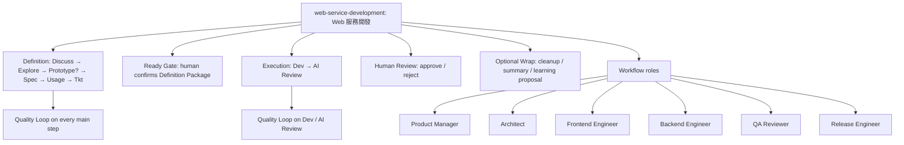
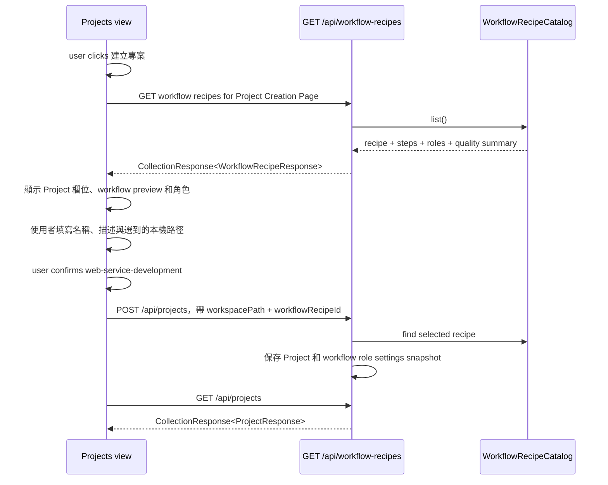

# S002: 建立專案時預覽並保存工作流角色（Workflow Role Defaults）

> 規格：S002 | 大小：S(10) | 狀態：✅ QA PASS — ready for `/shipping-release S002`
> 日期：2026-05-31
> 最後更新：2026-06-01
> 對應：PRD §0.5, §2, §4 P3/P4/P15 / ADR-002 / ADR-004 / `docs/grimo/references/grimo-agent-workflow-definition.md` / spec-roadmap row S002

---

## 1. 目標

建立專案前，使用者可以先確認這個專案要綁定哪個本機 Project Workspace、要使用哪個工作流，以及這個工作流會自動帶出哪些團隊角色。使用者不需要自己手動新增角色；選好工作流後，Grimo 會把該工作流預設的角色一起保存到 Project。

技術上，使用者按「建立專案」後，前端才讀取 Workflow Recipe 清單（`GET /api/workflow-recipes`）。Workflow Recipe 是可套用到 Project 的工作流模板，不是正在執行中的 workflow run。這個 API 用輕量 `CollectionResponse<WorkflowRecipeResponse>` 回傳，也就是 `{ "content": [...] }`；每個 workflow recipe item 裡會包含自己的 `roles[]`、`steps[]` 和 `qualityLoopSummary`，所以建立頁面可以先顯示角色與工作流摘要。使用者送出建立 Project 後，後端會保存 `workflowRecipeId`，並把該 workflow recipe 的角色基本設定 snapshot 到 `project_workflow_roles`。

2026-06-01 contract revision：S002 原本 local verification 已通過 raw array response；現在 `GET /api/workflow-recipes` 與 `GET /api/projects` 都已改用 API collection envelope 作為目標 contract，implementation、測試與 release gate 已通過。此決策記錄在 ADR-002。

2026-06-01 workspace naming revision：S001 曾使用 `folderPath` 描述 Project 的本機路徑；S002 目標 contract 改為 `workspacePath`，DB column 改為 `workspace_path`。原因是使用者選的不是任意資料夾，而是後續 Task / agent 要操作的 Project Workspace。

2026-06-01 step contract revision：S002 先不在 `steps[]` 設計 `optional` 欄位。使用者目前只需要在建立 Project 前看懂主要 workflow steps；哪些 step 可略過、何時進 Wrap、branch / skip 條件，留到 runtime workflow spec 再定義。

2026-06-01 id contract revision：Project id 改用 ADR-004 的 TSID canonical string，也就是 13 個 Crockford base32 uppercase 字元，例如 `01226N0640J7Q`。S002 API examples 不再使用 `prj_01`、`prj_<uuid>` 或 24 hex，因為 REST path 和 DTO context 已經能表達 resource type。

S001 已經讓使用者可以建立 Project 並選 workflow，但當時工作流只是一個下拉選項，還不能讓使用者看懂「這個工作流會帶哪些角色」。S002 補上第一個具體工作流 `web-service-development`，讓 Project Creation Page 變成真正的建立頁，而不是只有一個簡單表單。

相依狀態：

| 相依 | 類型 | 狀態 | 對 S002 的影響 |
| --- | --- | --- | --- |
| S001 | Code-level | local verification PASS | S002 延伸既有建立 Project 流程，讓使用者不只選 workflow，還能看到並保存該 workflow 的角色。技術上會修改 `/api/workflow-recipes` response shape、Project persistence 和 Projects view。 |
| PRD P3/P4/P15 | Product decision | exists | Project 決定工作流和品質基準；角色是薄 Agent Profile，不是厚 AI coworker；使用者先建立 Project，再進 Task workbench。 |
| Workflow reference | Design reference | exists | 已定義 Coding Task Recipe 的主要步驟、Quality Loop 和 Pollack mapping；S002 把這些資訊用使用者可讀的方式顯示在建立頁。 |

Spec overlap scan：

- S001 和 S002 都在建立 Project 流程上，但 S001 只證明「可以建立 Project 並保存 workflow id」。S002 補上「建立前看得到角色，建立後保存角色設定」。
- 原本 backlog 的 S002 是 Task creation；因為使用者要先建立 Project 並確認工作流角色，Task creation 往後移到 S003。

## 2. 研究與設計

### 2.1 查到的事實

| 來源 | 使用者結果 | 技術線索 |
| --- | --- | --- |
| `docs/grimo/PRD.md` §0.5, §2, P3, P4 | 使用者建立 Project 時應該先選工作流，之後 Task 才能依 Project 的工作流與品質基準運作。 | 角色清單放在 workflow recipe metadata，不做 persona/inbox，也不讓使用者在 S002 編輯角色。 |
| `docs/grimo/references/grimo-agent-workflow-definition.md` | 使用者選到「Web 服務開發」時，應該看得懂這個工作流會經過哪些主要階段，以及哪些角色會參與。 | `web-service-development` recipe 需要提供 main steps、Quality Loop summary 和 roles。 |
| Pollack Agent Workflow overview: https://lab.pollack.ai/projects/agent-workflow | 使用者看到的是工作流定義，不代表系統已經開始執行 agent workflow。 | Workflow definition 和 execution runtime 分離；S002 只顯示 definition metadata。 |
| Pollack DSL examples: https://lab.pollack.ai/docs/agent-workflow/examples | 未來工作流可以有分支、循環、gate 和 sub-workflow；S002 先讓使用者看懂第一個 web 開發工作流。 | Coding workflow 可先用 steps + Quality Loop summary 表示，之後再映射到 Pollack `Workflow`。 |
| `docs/grimo/architecture.md` arc42 Runtime And Environment View — Project Creation | Grimo 在本機執行；使用者在網頁上操作，但 Project Workspace 最後由本機 backend 保存與使用。 | `POST /api/projects.workspacePath` 是 Project Workspace binding；後端收到 JSON path 後，後續功能才能操作本機 workspace。 |
| MDN `showDirectoryPicker()`: https://developer.mozilla.org/docs/Web/API/Window/showDirectoryPicker | 瀏覽器可以讓使用者選資料夾，但拿到的是 browser handle，不是後端可直接保存的本機路徑。 | Browser `showDirectoryPicker()` 不作為 S002 的 `workspacePath` 來源。 |
| MDN `FileSystemDirectoryHandle`: https://developer.mozilla.org/en-US/docs/Web/API/FileSystemDirectoryHandle | Browser handle 不能穩定代表 Spring Boot 要操作的絕對路徑。 | S002 用 Spring Boot local-directory browsing API 回傳後端可保存的 absolute path。 |
| `backend/src/main/java/io/github/samzhu/grimo/project/WorkflowRecipeCatalog.java` | 現有 Workflow Recipe 清單可以直接延伸，使用者不用等後台管理介面才能看到第一個具體工作流。 | 用 static catalog 加上 `web-service-development`、`roles[]`、`steps[]`、`qualityLoopSummary`。 |
| `frontend/src/features/projects/Projects.tsx` | 目前使用者一進 Projects view 就看到常駐表單，不像「先進入建立頁再確認內容」的流程。 | 改成按「建立專案」才載入 Workflow Recipe 清單，並在 select 下方顯示 roles / steps preview。 |
| Spring Data Commons `PagedModel`: https://docs.spring.io/spring-data/rest/reference/data-commons/repositories/core-extensions.html#core.web.page | 使用者目前只是讀取小型 Workflow Recipe 清單，沒有 page/size/totalElements 這類分頁資訊。 | 不用 `PagedModel`，因為它包的是 Spring Data `Page`；S002 用自定義 `CollectionResponse<T>`。 |
| Spring HATEOAS `CollectionModel`: https://docs.spring.io/spring-hateoas/docs/current/api/org/springframework/hateoas/CollectionModel.html | 使用者目前不需要 `_links`、HAL 或 hypermedia navigation，只需要穩定的清單外層。 | 先不用 HATEOAS；避免為了 collection wrapper 引入 hypermedia 語意與 dependency。 |
| MongoDB BSON ObjectId: https://www.mongodb.com/docs/manual/reference/bson-types/#objectid | 使用者和開發者需要短、穩定、可放 URL/log 的 resource id；Mongo ObjectId 是 12 bytes / 24 hex chars，並帶約略建立時間。 | S002 曾採用同形狀 24 hex，但使用者改選更短且有維護中 Java library 的 TSID；Mongo-style contract 由 ADR-004 supersede。 |
| Hypersistence TSID README: https://github.com/vladmihalcea/hypersistence-tsid | 使用者要的短 ID 可以用 13 字元字串表示，URL safe、沒有 hyphens，且可依產生時間排序。 | Backend 以 `io.hypersistence.tsid.TSID.Factory.getTsid().toString()` 產生 Project id。 |
| Maven Central `io.hypersistence:hypersistence-tsid`: https://central.sonatype.com/artifact/io.hypersistence/hypersistence-tsid | 使用者確認 MIT OK；套件可用於 Grimo backend。 | 使用 `implementation("io.hypersistence:hypersistence-tsid:2.1.4")`，版本記錄在 architecture dependency table。 |
| Hypersistence TSID license: https://github.com/vladmihalcea/hypersistence-tsid/blob/master/LICENSE | 授權是 MIT License，可用於商業/開源專案，保留 license notice 即可。 | S002 不需要自寫 TSID 演算法；用 library 可降低 generator bug 風險。 |

### 2.2 使用者結果與架構設計

使用者在建立 Project 前，可以先看見「Web 服務開發」這個工作流會怎麼協助軟體開發：它有哪些主要階段、每個階段如何進品質循環、以及預設會有哪些角色參與。技術上，S002 會把這些資訊定義在第一個具體 workflow recipe：`web-service-development`。



`web-service-development` 會帶出的角色：

| Role ID | UI name | 使用者看到的角色價值 | 對應 workflow sections | 建立 Project 後是否保存 |
| --- | --- | --- | --- | --- |
| `product-manager` | Product Manager | 釐清目標、MVP、成功條件與使用者價值 | Discuss, Usage, Ready Gate | yes |
| `architect` | Architect | 架構、資料流、品質基準與 spec design | Explore, Prototype, Spec, Project Planning | yes |
| `frontend-engineer` | Frontend Engineer | 前端 UI、互動、可及性與 browser evidence | Prototype, Dev | yes |
| `backend-engineer` | Backend Engineer | API、DB、workflow integration 與 service behavior | Explore, Spec, Dev | yes |
| `qa-reviewer` | QA Reviewer | 驗收策略、測試覆蓋、Review Materials | Usage, Tkt, AI Review, Human Review | yes |
| `release-engineer` | Release Engineer | release gate、CI/CD、packaging、cleanup/wrap | Tkt, Dev, Wrap | yes |

Task State Machine 與 Workflow Step 呈現策略：

使用者只需要先看懂一件事：Task board 顯示外層 Task State Machine，Task detail 顯示狀態底下的 State Workflow 和內部 workflow evidence。每個 Workflow Step 都有自己的 Step Sub-workflow；目前最重要的 Step Sub-workflow 是 Review / Rating / Fix 的 Quality Loop。只有 `quality_score > 9`，該 step 的 output 才能推進到下一個 step。以 Discuss 為例，使用者透過 Task Chat Thread 把問題談清楚，形成 Discuss output；Discuss output 通過自己的 Quality Loop 後，Task 才能進 Explore。

這份 spec 用一張總覽圖當正式模型，避免同一段流程被多張圖重複描述：

```mermaid
flowchart LR
  Backlog["BACKLOG<br/>待整理"] -->|啟動| Defining["DEFINING<br/>工作定義中"]
  Defining -->|任務已釐清| Ready["READY<br/>可排程"]
  Ready -->|已分配進行| Running["RUNNING<br/>Agent 執行"]
  Running -->|已完成待檢視| ReviewState["REVIEW<br/>等人類審查"]
  ReviewState -->|人類已確認完成| Done["DONE<br/>原 Task 完成"]
  ReviewState -->|reject / needs fix| Running

  Defining -. "展開內部進度" .-> DefiningWorkflow
  Running -. "展開內部進度" .-> RunningWorkflow

  subgraph DefiningWorkflow["DEFINING 底下的 workflow"]
    direction LR
    ChatThread["Task Chat Thread"] --> Discuss["Discuss"]
    Discuss --> Explore["Explore"]
    Explore --> Prototype["Prototype"]
    Prototype --> Spec["Spec"]
    Spec --> Usage["Usage"]
    Usage --> Tkt["Tkt"]
  end

  subgraph RunningWorkflow["RUNNING 底下的 workflow"]
    direction LR
    Dev["Dev"] -->|AI 自動審查| AutoReview["Auto Review"]
  end

  Discuss -. "has sub-workflow" .-> SubWorkflow
  Explore -. "has sub-workflow" .-> SubWorkflow
  Prototype -. "has sub-workflow" .-> SubWorkflow
  Spec -. "has sub-workflow" .-> SubWorkflow
  Usage -. "has sub-workflow" .-> SubWorkflow
  Tkt -. "has sub-workflow" .-> SubWorkflow
  Dev -. "has sub-workflow" .-> SubWorkflow
  AutoReview -. "has sub-workflow" .-> SubWorkflow

  subgraph SubWorkflow["每個 step 的子 workflow：Quality Loop"]
    direction TB
    SubOutput["Step output"] --> SubReview["Review"]
    SubReview --> SubRating["Rating"]
    SubRating --> SubGate{"quality_score > 9?"}
    SubGate -->|否| SubFix["Fix"]
    SubFix --> SubReview
    SubGate -->|是| SubPass["進下一個 step"]
  end

  Tkt -->|Definition Package accepted| Ready
  AutoReview -->|Review Materials ready| ReviewState

  Done --> Wrap["Wrap evidence<br/>DONE task 裡檢視"]
  Wrap --> Keep["沒有新方向<br/>只保留 evidence"]
  Wrap --> Followup["有優化方向<br/>新 Task 回 BACKLOG<br/>sourceTaskId = done task id"]
  Followup --> Backlog

  Defining --> Blocked["BLOCKED<br/>需要人介入"]
  Ready --> Blocked
  Running --> Blocked
  ReviewState --> Blocked
  Blocked --> Defining
  Blocked --> Ready
  Blocked --> Running
  Blocked --> ReviewState
```



圖的閱讀順序是：先看 Task board 上的外層 Task State Machine，再看該 Task State 底下有哪些 State Workflow / Workflow Step，最後看每個 step 如何用 Step Sub-workflow，也就是 Quality Loop，產生可信 evidence。

| Workflow step | 使用者在看板上看到的 Task State | 白話說明 |
| --- | --- | --- |
| Discuss, Explore, Prototype, Spec, Usage, Tkt | `DEFINING` | 使用者和 Grimo 還在把需求、方案、驗收條件整理成可執行工作，所以 Task 還沒進入可派工狀態。 |
| Ready Gate | `READY` | 人類確認 Definition Package 後，Task 變成可排程；但還不會自動執行，仍要等 Dispatch Window 或手動開始。 |
| Dev, AI Review | `RUNNING` | Agent 已開始工作，正在產出實作、測試與 AI review evidence；此時還不是等人類審查。 |
| Human Review | `REVIEW` | AI review、測試與 Review Materials 已準備好，Task 等人類 approve / reject。 |
| Human approves Review Materials | `DONE` | 使用者已接受結果，原 Task 完成；Wrap evidence 可在 DONE task 裡檢視，但不是新的看板狀態。 |
| Wrap evidence has improvement proposal | New Task in `BACKLOG` | 若收尾 evidence 產生新的優化方向，Grimo 會建立新的 follow-up Task，並保存來源 Task 關聯，讓後續討論看得出從哪個結論延伸。 |
| Any step cannot continue | `BLOCKED` | 任一步驟缺決策、環境、權限或依賴時，Task 停在 BLOCKED，讓人知道要介入。 |

設計邊界：

- `WorkflowRecipeResponse.steps[]` 是 Project Creation Page 的 preview metadata，讓使用者知道這個 recipe 大概怎麼推進。
- `steps[].taskState` 表示這個 step 執行時，Task 在 board/list 上對應的外層狀態。
- `Task State Machine` 是 Task board/list 上的外層狀態機，跨開發、研究、內容等 workflow 共用。
- `State Workflow` 是某個 Task State 底下的工作規則；DEFINING / RUNNING 會展開成 Workflow Steps，READY / REVIEW / DONE 則偏向 queue、gate、review point 或 evidence holder。
- `Workflow step` 不直接變成 board column；細節頁可以顯示目前 step、Quality Loop、worker log 和 evidence。
- 每個 `Workflow step` 都有自己的 Step Sub-workflow；S002 目前定義的 Step Sub-workflow 是 Quality Loop。這個 loop 的結果是 Task detail evidence，不是新的 Task board state。
- `Wrap evidence` 是 DONE task 的可檢視證據，不是讓原 Task 從 DONE 再跑一個 board state；只有產生新優化方向時，才開新的 follow-up Task 到 BACKLOG。
- `qualityLoopSummary` 只用在 Project Creation Page 的 workflow preview，讓使用者知道這個 recipe 的每個主要 step 都會先經過 Review / Rating / Fix；它不是 runtime gate config，不用來判斷通過或失敗。
- S002 只保存 Project 選了哪個 Workflow Recipe 和角色設定，不建立 Task，也不執行 step-to-state runtime transition。

使用者流程與技術資料流：



設計規則：

1. 使用者必須先選定 Project Workspace，Project 才能建立。技術上，`workspacePath` 是 Project 的 workspace binding；空值不能送出，duplicate path 沿用 S001 的 `409 Conflict`。
2. 使用者在建立前看到的角色，必須和建立後保存的角色一致。技術上，`WorkflowRecipeResponse.roles` 同時是 UI preview metadata，也是 Project create 時 role settings 的來源。
3. 使用者不需要在 S002 手動挑角色。技術上，backend 會依 selected Workflow Recipe 將全部 preconfigured roles snapshot 到 Project role settings。
4. Project 仍保存使用者選了哪個 workflow。技術上，`projects.workflow_recipe_id` 保存 selected Workflow Recipe identity；角色基本設定另存 `project_workflow_roles`。
5. 若某個 workflow 還沒有正式角色定義，使用者要看到明確空狀態，而不是假角色。技術上，`roles=[]` 時 UI 顯示 `這個工作流尚未定義角色`，Project create 不建立 role settings rows。
6. 角色只是建立 Project 時的薄角色設定，幫後續 Ready Gate / Dispatcher 使用；不是厚 persona，也不是獨立 inbox。

Project Workspace 執行環境說明：

- Grimo 在使用者本機執行；網頁只是比較好操作的人機介面。
- 使用者選好資料夾後，Grimo 會把該路徑當成 Project Workspace。技術上，`POST /api/projects` 用 JSON 送出 `workspacePath`，Spring Boot 保存到 SQLite。
- 後端拿到 `workspacePath` 後，後續功能可以直接操作該本機 workspace，不需要 desktop bridge。
- S002 的「選擇資料夾」由 Spring Boot 提供資料夾瀏覽 API；使用者在 UI 選到資料夾後，前端把該 absolute path 填入 `workspacePath` 再送 `POST /api/projects`。

使用者已確認的行為（2026-05-31）：

- 使用者在功能列表按「建立專案」時進入 Project Creation Page，並讀取 Workflow Recipe 清單。
- Project Creation Page 顯示專案名稱、專案描述、專案工作區、工作流下拉選單和隨工作流切換的角色列表。
- Project Creation Page 上的「建立專案」submit action 才是真正建立 Project 的動作。
- Project Creation Page 的「選擇資料夾」會直接瀏覽本機資料夾，選好後填入 `專案工作區`。
- Workflow Recipe 清單其中一個選項是「Web 服務開發」。
- 「Web 服務開發」內可看到 workflow steps 和參與角色。
- 選工作流時只列出該 Workflow Recipe 預先設定好的角色。
- 角色不由使用者在 Project Creation Page 勾選、移除或覆寫。
- 建立 Project 之後，除了保存 selected workflow recipe，也要保存該 Workflow Recipe 的角色基本設定。
- 建立 Project 前要先選定 Project Workspace 所在資料夾。
- S002 不把角色塞進 `projects` table；role settings 使用 child table 保存。後續 Ready Gate / Dispatcher spec 再處理 Task-level assignment。

### 2.3 做法比較

| 做法 | 採用 | 理由 |
| --- | --- | --- |
| A: Use REST collection `GET /api/workflow-recipes` to include `steps`, `roles`, `qualityLoopSummary` | yes | 使用者一進建立頁就能看到工作流與角色摘要。技術上，collection item 直接帶 preview metadata，不新增 action-style endpoint。 |
| B: Add `GET /api/workflow-recipes/{id}` details endpoint | no for S002 | 使用者目前只需要小型 preview；S002 只有第一個具體 recipe，新增 details endpoint 會增加測試面。 |
| C: Hardcode role preview in frontend only | no | 使用者看到的角色必須和後端保存的角色一致；前端 hardcode 會讓 UI 和 backend catalog 分裂。 |
| D: Persist all preconfigured workflow roles as Project role settings | yes | 使用者建立 Project 後，不需要再手動建立角色；Grimo 會把 selected Workflow Recipe 的預設角色一起保存。 |
| E: Let user select/remove roles during Project Creation Page | no | 使用者已確認角色由 workflow 預先設定；勾選角色會把 S002 擴成 role editor。 |
| F: Use browser `showDirectoryPicker()` as backend `workspacePath` source | no | 使用者選資料夾後，後端需要可保存、可操作的 Project Workspace 路徑；browser handle 不是 backend absolute path。 |
| G: Add Spring Boot local-directory browsing API for `選擇資料夾` | yes | 使用者可以在網頁上選本機資料夾；技術上由本機 Spring Boot 列資料夾並回傳 absolute path。 |

推薦：A + D + G。使用者建立 Project 前可以先看懂工作流和角色，建立後 Grimo 會保存這些預設角色；同時使用者可以直接在網頁選本機資料夾。技術上，這由 `GET /api/workflow-recipes`、`POST /api/projects` 和 `GET /api/local-directories` 串起來。

已確認做法：A + D + G。使用者在建立 Project 前先看懂工作流與角色，建立時不用手動新增角色，建立後 Grimo 會保存 selected Workflow Recipe 的預設角色。技術上，角色清單是 read-only recipe metadata；backend 會在 `POST /api/projects` 時保存 default role settings；資料夾選擇由本機 backend directory browsing 提供。

### 2.4 Low-Fidelity UI Sketches（低保真畫面草圖）

這張草圖只約定使用者會看到哪些資訊與操作順序，不約定 final pixels、不新增 design system，也不加入裝飾。

```text
功能列表 / Projects view
┌──────────────────────────────────────────────┐
│ [建立專案]  ← entry action, not submit       │
└──────────────────────────────────────────────┘

按下入口後的 Project Creation Page
┌──────────────────────────────────────────────┐
│ 專案名稱                                     │
│ [grimoAPP                                  ] │
│ 專案描述                                     │
│ [本機 AI 開發工作台                        ] │
│ 專案工作區                                   │
│ [/Users/samzhu/.../grimoAPP              ] │
│ [選擇資料夾]                               │
│   Folder picker                             │
│   目前位置: /Users/samzhu/workspace        │
│   [github-samzhu/] [Downloads/] [Desktop/] │
│   [選取此資料夾]                            │
│ 專案工作流                                   │
│ [Web 服務開發                            v] │
│                                              │
│ 工作流預覽                                   │
│ Discuss → Explore → Prototype? → Spec → ... │
│ Quality Loop: Review → Rating → Fix, > 9    │
│                                              │
│ 參與角色                                     │
│ [Product Manager] [Architect] [Frontend]    │
│ [Backend] [QA Reviewer] [Release Engineer]  │
│                                              │
│ [建立專案]  ← submit action, POST /projects │
└──────────────────────────────────────────────┘
```

響應式與狀態行為：

- Desktop：使用者在功能列表按 `建立專案` 後，會進入或看到 Project Creation Page；workflow preview 放在 workflow select 下方，讓使用者先確認角色再建立。
- Mobile/tablet：角色 chips 可以換行；如果描述太長，先用緊湊文字呈現，實作需要時才用 tooltip/modal。
- Empty state：沒有角色的 workflow 顯示 `這個工作流尚未定義角色`；只要 `workflowRecipeId` 合法，仍可以建立 Project。
- Workspace state：使用者還沒選 `workspacePath` 前，submit button 不可用。
- Path-source state：使用者點 `選擇資料夾` 會開啟由 Spring Boot 支援的 local-directory picker；選定資料夾後，該 absolute local path 會寫入 `workspacePath`。

### 2.5 Task 邊界提示

| Task 候選 | Class / file | 來源 | 使用者成功結果 | 失敗時要保護的結果 | POC |
| --- | --- | --- | --- | --- | --- |
| T01 Backend workflow recipe collection contract | `CollectionResponse`, `ProjectController`, `WorkflowRecipeResponse`, `WorkflowRecipeCatalog` | ADR-002 + PRD P3/P4 + workflow reference | 使用者選工作流前，就能從 `GET /api/workflow-recipes.content[]` 看到多個 recipes、每個 recipe 的角色與步驟。 | API 不能再回 raw array；`qualityLoopSummary` 不能被舊 `qualityGateSummary` 混淆。 | not required |
| T02 Backend Project workspace / role snapshot / TSID contract | `ShortResourceIdGenerator`, `CreateProjectRequest`, `ProjectResponse`, `ProjectStore`, `ProjectService`, `schema.sql`, `build.gradle.kts` | ADR-002 + ADR-004 + user-confirmed S002 behavior | 使用者建立 Project 後，API 回 13 碼 TSID、`workspacePath`、selected workflow 和 role settings；Project list 也從 `content[]` 讀回。 | 沒選 Project Workspace 不可留下半套 Project；`roles=[]` workflow 不可補假角色；ID 不可再用 `prj_` prefix 或 24 hex。 | not required |
| T03 Frontend Project Creation Page contract update | `project-types.ts`, `project-api.ts`, `Projects.tsx`, `App.tsx`, CSS | UI sketch + ADR-002 | 使用者從功能列表按 `建立專案` 進入建立頁，選 Project Workspace、看 workflow roles / Quality Loop summary，並用 `workspacePath` 建立 Project。 | 前端不能再假設 API 回 raw array，不能顯示 `專案路徑` / `folderPath`，也不能殘留上一個 workflow 的角色。 | not required |
| T04 Full-stack Project Creation verification | `project-onboarding.fullstack.spec.ts` | QA strategy | Browser 證明使用者可以選 workspace、看角色、建立 Project，且 API 確實用 `content[]`、`workspacePath`、13 碼 TSID。 | 若 backend/frontend 各自通過但串不起來，full-stack test 必須失敗。 | not required |
| T05 Release gate and spec result consolidation | S002 spec, task files, `./scripts/verify-release.sh` | planning-tasks Phase 4 | release gate 通過後，S002 §7 記錄目前 contract results，AC 才能標回 verified。 | 不可只引用 historical raw array evidence 當作目前 contract 已完成。 | not required |

## 3. BDD Contract

驗證命令：`./scripts/verify-release.sh`

通過條件：所有 `@ac:AC-S002-*` scenario 都是 `@state:verified`，且 release gate 包含 S001/S002 full-stack Project onboarding。

目前狀態：T01-T05 全部 PASS。`GET /api/workflow-recipes` 與 `GET /api/projects` 都使用 `CollectionResponse<T>`；Project create/list 使用 `workspacePath`；Project id 使用 ADR-004 的 13 碼 TSID；`./scripts/verify-release.sh` 已通過。

BDD 決策紀錄：

- 使用者在建立 Project 前只需要確認 Workflow Recipe 會帶哪些角色，不需要手動新增、勾選或移除角色。技術上，角色由 recipe metadata 預先設定。
- 使用者建立 Project 前必須先選 Project Workspace。技術上，`workspacePath` 是後續 Grimo 操作 Project workspace 的 binding。
- 使用者建立 Project 後，Grimo 要同時保存 selected Workflow Recipe 和該 recipe 的角色基本設定。技術上，角色保存到 `project_workflow_roles`。
- 使用者在功能列表按 `建立專案` 是進入 Project Creation Page；頁面內的 `建立專案` submit action 才是真正建立 Project。
- Grimo backend 跑在本機；當 Spring Boot 收到 JSON `workspacePath`，後續 spec 可以直接操作該 Project workspace。
- S002 直接實作 `選擇資料夾`；技術上用 backend local-directory browsing，讓 UI 在建立 Project 前選到 local directory path。
- 已確認：workflow recipe collection 先不用 HATEOAS / HAL / Spring Data `PagedModel`；不分頁清單使用 `CollectionResponse<T>`。
- 已確認：S002 會一併修正 `GET /api/projects`，讓 Project list 也回 `CollectionResponse<ProjectResponse>`，避免同一個 Project Creation flow 裡同時存在兩種 collection 格式。
- 實作已確認：local-directory browsing 使用 `GET /api/local-directories?path=<absolute-path>`；省略 `path` 時從 backend user 的 home directory 開始。
- S002 不處理角色選取/移除、Project Creation Page 內編輯角色設定、Task-level role assignment，或實際執行 Pollack workflow graph。

AC 覆蓋矩陣：

| AC | 使用者結果 | Contract / 可觀察輸出 | Layer | State |
| --- | --- | --- | --- | --- |
| AC-S002-1 | 使用者選 Project workflow 前，可以先看到多個 Workflow Recipe 選項，而且每個 recipe 都有自己的角色清單。 | `GET /api/workflow-recipes` 回 `CollectionResponse.content[]`，每個 item 有 `roles[]` | backend, api | verified |
| AC-S002-2 | 使用者建立前可以理解 Web 服務開發 recipe 會怎麼推進品質。 | `response.content[?id=web-service-development]` 有 `steps[]` 與 `qualityLoopSummary` | backend, api | verified |
| AC-S002-3 | 使用者進入建立頁後，可以確認選到的 Workflow Recipe 角色。 | Project Creation Page 從 `response.content[]` 載入 workflow recipe choices 並顯示 selected roles | frontend, fullstack | verified |
| AC-S002-4 | 使用者可以在建立頁選到後端可保存的 Project Workspace。 | 使用者透過 backend directory browsing 選本機 workspace 資料夾 | backend, frontend, fullstack | verified |
| AC-S002-5 | 使用者選到無效資料夾時，會看到可理解錯誤，而不是壞掉的 picker。 | 無效本機路徑會回 user-readable error | backend, api | verified |
| AC-S002-6 | 使用者不會看到假角色或上一個 Workflow Recipe 的角色殘留。 | `response.content[?id=research].roles=[]` 時 UI 顯示明確 empty state | frontend, fullstack | verified |
| AC-S002-7 | 使用者沒有選 Project Workspace 時，不能建立半套 Project。 | 缺少 Project Workspace 會阻止建立 | backend, frontend, fullstack | verified |
| AC-S002-8 | 使用者建立 Project 後，selected workflow recipe 與角色設定都已保存。 | 建立 Project 會保存 `workflowRecipeId` 與 roles | backend, fullstack | verified |
| AC-S002-9 | 使用者建立 Project 後，專案列表仍能用一致格式讀到新 Project。 | `GET /api/projects` 回 `CollectionResponse<ProjectResponse>`，新 Project 位於 `content[]` | backend, frontend, fullstack | verified |
| AC-S002-10 | 使用者建立 Project 後，API 回傳短而穩定的 Project ID，方便放在 URL、log 和 evidence。 | `ProjectResponse.id` 符合 ADR-004：13 個 Crockford base32 uppercase chars | backend, api | verified |

Feature: 建立專案時預覽並保存工作流角色

### Rule: 使用者可以先看到工作流會帶哪些角色與步驟

使用者結果：
建立 Project 前，使用者會先拿到多個 Workflow Recipe 選項。每個 recipe 都自己帶 `roles[]`，所以使用者切換工作流時看到的是該 recipe 的角色，不會把 Web 服務開發的角色套到研究或內容工作流上。

Contract：
`GET /api/workflow-recipes` 回 `200 OK` 和 `CollectionResponse<WorkflowRecipeResponse>`。`content` 是 Workflow Recipe 清單；每個 recipe item 內含 `steps[]`、`roles[]` 和 `qualityLoopSummary`。沒有角色的 recipe 用 `roles: []` 表示，不補假資料。

```json
{
  "content": [
    {
      "id": "web-service-development",
      "name": "Web 服務開發",
      "roles": [
        {
          "id": "product-manager",
          "name": "Product Manager",
          "description": "釐清產品目標、MVP、使用情境與 acceptance。",
          "primarySteps": ["Discuss", "Usage", "Ready Gate"]
        }
      ],
      "steps": [
        { "id": "discuss", "name": "Discuss", "taskState": "DEFINING" },
        { "id": "dev", "name": "Dev", "taskState": "RUNNING" }
      ],
      "qualityLoopSummary": "Review → Rating → Fix until quality_score > 9"
    },
    {
      "id": "research",
      "name": "研究工作流",
      "roles": [],
      "steps": [],
      "qualityLoopSummary": ""
    }
  ]
}
```

```gherkin
@spec:S002
@ac:AC-S002-1
@layer:backend,api
@api:GET /api/workflow-recipes
@state:verified
Scenario: 使用者建立 Project 前，可以先看到多個 Workflow Recipe 以及各自會帶出的角色
  Given（前提） Grimo 已經有預設 workflow recipe catalog
  When（動作） Project Creation Page 讀取 workflow recipe collection
  Then（結果） 使用者可以在 response.content 看到多個 Workflow Recipe 選項，例如 "Web 服務開發", "研究工作流" 與 "內容工作流"
  And（而且） response.content 裡每個 recipe item 都有自己的 roles[] 欄位
  And（而且） 使用者選擇 "Web 服務開發" 時，可以看到它會帶出 "Product Manager", "Architect", "Frontend Engineer", "Backend Engineer", "QA Reviewer" 與 "Release Engineer"
  And（而且） 每個角色都有足夠基本資訊，讓使用者理解它在這個 workflow 裡負責什麼
  # 技術證據：GET /api/workflow-recipes 回傳 CollectionResponse<WorkflowRecipeResponse>；response.content 至少有多筆 recipe items，且每筆 item 內含 roles[]
```

驗證綁定（Verification Bindings）：

- backend: `backend/src/test/java/io/github/samzhu/grimo/project/ProjectApiTests.java`
- command: `./gradlew test` in `backend/`
- evidence: `jsonPath("$.content[*].id")`, `jsonPath("$.content[?(@.id == 'web-service-development')].roles[*].id")`, `jsonPath("$.content[?(@.id == 'research')].roles").isEmpty()`
- status: verified；T01 backend `./gradlew test` 已通過 `$.content[*]` assertions

```gherkin
@spec:S002
@ac:AC-S002-2
@layer:backend,api
@api:GET /api/workflow-recipes
@state:verified
Scenario: 使用者可以先了解 Web 服務開發會怎麼推進品質
  Given（前提） Grimo 已經有預設 workflow recipe catalog
  When（動作） Project Creation Page 讀取 workflow recipe collection
  Then（結果） 使用者可以在 response.content 裡找到 recipe "web-service-development"
  And（而且） 這個 recipe item 內有主要 workflow steps，例如 "Discuss", "Explore", "Spec", "Usage", "Tkt", "Dev", "AI Review" 與 "Human Review"
  And（而且） 這個 recipe item 內有 Quality Loop summary
  # 技術證據：GET /api/workflow-recipes 針對 response.content[?(@.id == 'web-service-development')] 回傳 steps[] 與 qualityLoopSummary
```

驗證綁定（Verification Bindings）：

- backend: `backend/src/test/java/io/github/samzhu/grimo/project/ProjectApiTests.java`
- command: `./gradlew test` in `backend/`
- evidence: `jsonPath("$.content[?(@.id == 'web-service-development')].steps[*].name")`, `jsonPath("$.content[?(@.id == 'web-service-development')].qualityLoopSummary")`
- status: verified；T01 backend `./gradlew test` 已通過 `$.content[*]` assertions

### Rule: 使用者在建立 Project 前可以確認工作流角色

使用者結果：
使用者在 Projects view 按「建立專案」後才進入 Project Creation Page。頁面讀取 Workflow Recipe collection 的 `content[]`，使用者選「Web 服務開發」時看到 Web 服務開發的角色；選沒有角色的 recipe 時看到清楚空狀態。

Contract：
Frontend API client 讀取 `GET /api/workflow-recipes` 後，從 `response.content` 取得 `WorkflowRecipe[]`。UI 的 selected recipe 由 `form.workflowRecipeId` 對 `content[].id` 推導；不要用 hardcoded roles，也不要把上一個 selected recipe 的角色殘留在畫面上。

```ts
type CollectionResponse<T> = {
  content: T[];
};

type WorkflowRecipe = {
  id: string;
  name: string;
  roles: WorkflowRole[];
  steps: WorkflowStep[];
  qualityLoopSummary: string;
};
```

```gherkin
@spec:S002
@ac:AC-S002-3
@layer:frontend,fullstack
@api:GET /api/workflow-recipes
@state:verified
Scenario: 使用者進入建立頁後，可以確認 Web 服務開發會帶哪些角色
  Given（前提） 使用者在 Projects view
  When（動作） 使用者點擊 "建立專案"
  Then（結果） 使用者會看到 Project Creation Page
  And（而且） 使用者可以填寫 "專案名稱", "專案描述", "專案工作區" 與 "專案工作流"
  And（而且） 使用者可以選擇 "Web 服務開發"
  When（動作） 使用者選擇 "Web 服務開發"
  Then（結果） 使用者在 "參與角色" 看到 "Product Manager", "Architect", "Frontend Engineer", "Backend Engineer", "QA Reviewer" 與 "Release Engineer"
  And（而且） 必填欄位都完成後，使用者可以按最後的 "建立專案" action
  # 技術證據：frontend 從 GET /api/workflow-recipes 的 response.content 載入 workflow recipe choices
```

驗證綁定（Verification Bindings）：

- fullstack: `frontend/e2e/project-onboarding.fullstack.spec.ts`
- command: `npm --prefix frontend run test:fullstack`
- evidence: Playwright 看到 "參與角色" 與六個角色名稱；network/API fixture 或 backend response 使用 `content[]`
- status: verified；T03 frontend build 和 T04/T05 full-stack release gate 已驗證 `response.content` workflow recipe flow

```gherkin
@spec:S002
@ac:AC-S002-6
@layer:frontend,fullstack
@api:GET /api/workflow-recipes
@state:verified
Scenario: 沒有角色定義的 Workflow Recipe 會清楚告訴使用者目前沒有角色
  Given（前提） Project Creation Page 已載入 workflow recipes
  And（而且） response.content 裡的 "research" recipe 目前有 roles=[]
  When（動作） 使用者在 "專案工作流" 選擇 "research"
  Then（結果） 使用者看到 "這個工作流尚未定義角色"
  And（而且） 頁面不會顯示其他 Workflow Recipe 的角色
  # 技術證據：selected recipe has roles=[]，且 UI 不重用 "web-service-development" 的 roles
```

驗證綁定（Verification Bindings）：

- fullstack: `frontend/e2e/project-onboarding.fullstack.spec.ts`
- command: `npm --prefix frontend run test:fullstack`
- evidence: Playwright 選 "research" 後看到 `這個工作流尚未定義角色`，且看不到 Web 服務開發角色名稱
- status: verified；T04/T05 full-stack test 已驗證 empty-role state 不殘留 Web 服務開發角色

### Rule: 使用者可以在建立 Project 前選定 Project Workspace

使用者結果：
使用者在建立 Project 前可以透過頁面選本機資料夾，選到的 absolute local path 會填入「專案工作區」。如果 path 無效，使用者會看到可理解錯誤，不會留下壞掉的 picker 狀態。

Contract：
`GET /api/local-directories?path=<absolute-path>` 回目前 path、parent path 和下一層可選資料夾。這個 API 是 read-only，不建立 Project、不讀檔案內容、不跑 shell。

```json
{
  "path": "/Users/samzhu/workspace",
  "parentPath": "/Users/samzhu",
  "directories": [
    {
      "name": "github-samzhu",
      "path": "/Users/samzhu/workspace/github-samzhu"
    }
  ]
}
```

```gherkin
@spec:S002
@ac:AC-S002-4
@layer:backend,frontend,fullstack
@api:GET /api/local-directories
@state:verified
Scenario: 使用者可以透過建立頁選擇本機資料夾
  Given（前提） 使用者已開啟 Project Creation Page
  When（動作） 使用者點擊 "選擇資料夾"
  Then（結果） 使用者可以瀏覽本機資料夾選項
  When（動作） 使用者選擇一個 workspace directory
  Then（結果） "專案工作區" 會填入該 absolute local path
  And（而且） 建立 Project 時會把這個路徑當成 workspace
  # 技術證據：frontend 從 GET /api/local-directories 讀取 choices，並把 selected path 送成 workspacePath
```

驗證綁定（Verification Bindings）：

- backend: `backend/src/test/java/io/github/samzhu/grimo/project/LocalDirectoryApiTests.java`
- fullstack: `frontend/e2e/project-onboarding.fullstack.spec.ts`
- command: `./scripts/verify-release.sh`
- evidence: backend 回 child directories；Playwright 點 `選擇資料夾` 後 `專案工作區` 被填入

```gherkin
@spec:S002
@ac:AC-S002-5
@layer:backend,api
@api:GET /api/local-directories
@state:verified
Scenario: 無效資料夾路徑會被清楚拒絕
  Given（前提） Grimo 正在使用者本機執行
  When（動作） 使用者或 client 提供的 path 不是有效本機資料夾
  Then（結果） Grimo 會用 user-readable error 拒絕這次資料夾選擇
  And（而且） 使用者不會看到壞掉的 folder picker 狀態
  # 技術證據：GET /api/local-directories?path=... 回傳 400 Bad Request 與 error
```

驗證綁定（Verification Bindings）：

- backend: `backend/src/test/java/io/github/samzhu/grimo/project/LocalDirectoryApiTests.java`
- command: `./gradlew test` in `backend/`
- evidence: invalid path response 是 `400 Bad Request` 或 `404 Not Found`，body 是 user-readable error

```gherkin
@spec:S002
@ac:AC-S002-7
@layer:backend,frontend,fullstack
@api:POST /api/projects
@state:verified
Scenario: 沒有選 Project Workspace 時不能建立 Project
  Given（前提） 使用者已開啟 Project Creation Page
  When（動作） 使用者尚未提供 "專案工作區"
  Then（結果） 最後的 "建立專案" submit action 對使用者不可用
  And（而且） 如果 client 仍送出空白 Project Workspace，Grimo 會拒絕
  And（而且） 不會保存半套 Project 或 role settings
  # 技術證據：blank workspacePath 回傳 400 Bad Request，並建立零筆 projects / project_workflow_roles rows
```

驗證綁定（Verification Bindings）：

- backend: `backend/src/test/java/io/github/samzhu/grimo/project/ProjectApiTests.java`
- fullstack: `frontend/e2e/project-onboarding.fullstack.spec.ts`
- command: `./scripts/verify-release.sh`
- evidence: blank `workspacePath` 回 `400 Bad Request`，DB 中 `projects` / `project_workflow_roles` 都沒有新增 row

### Rule: 建立 Project 後，Grimo 會保存該工作流的角色設定

使用者結果：
使用者選「Web 服務開發」建立 Project 後，不需要再手動新增角色；Project 已經帶著該 Workflow Recipe 的預設角色設定。這讓後續 Ready Gate / Dispatcher 可以從 Project role settings 讀取角色基礎資料。

Contract：
`POST /api/projects` request 只送 Project 基本資料、本機路徑與 `workflowRecipeId`；client 不送 `roles[]`。Backend 依 selected Workflow Recipe snapshot role settings 到 `project_workflow_roles`，response 回 `workflowRoles[]`。

```json
{
  "name": "grimoAPP",
  "description": "本機 AI 開發工作台",
  "workspacePath": "/Users/samzhu/workspace/github-samzhu/grimoAPP",
  "workflowRecipeId": "web-service-development"
}
```

```json
{
  "workflowRecipeId": "web-service-development",
  "workflowRecipeName": "Web 服務開發",
  "workflowRoles": [
    {
      "id": "product-manager",
      "name": "Product Manager",
      "enabled": true
    }
  ]
}
```

```gherkin
@spec:S002
@ac:AC-S002-8
@layer:backend,fullstack
@api:POST /api/projects
@state:verified
Scenario: 使用者建立 Web 服務開發 Project 後，角色設定會一起保存
  Given（前提） 使用者已選擇 "Web 服務開發" 並確認它預設帶出的角色
  And（而且） 使用者已提供 local Project Workspace
  When（動作） 使用者建立 Project
  Then（結果） Grimo 會建立一個使用 Workflow Recipe "Web 服務開發" 的 Project
  And（而且） 建立完成的 Project 已經有六個 default workflow roles
  And（而且） 使用者建立後不需要再手動新增這些角色
  # 技術證據：POST /api/projects 回傳 201 Created 與 workflowRoles[]，且 SQLite 保存六筆 project_workflow_roles rows
```

驗證綁定（Verification Bindings）：

- backend: `backend/src/test/java/io/github/samzhu/grimo/project/ProjectApiTests.java`
- fullstack: `frontend/e2e/project-onboarding.fullstack.spec.ts`
- command: `./scripts/verify-release.sh`
- evidence: `POST /api/projects` 回 `201 Created` 與 `workflowRoles[]`；SQLite 有六筆 `project_workflow_roles`

```gherkin
@spec:S002
@ac:AC-S002-9
@layer:backend,frontend,fullstack
@api:GET /api/projects
@state:verified
Scenario: 使用者建立 Project 後，可以從一致的 Project list response 看到新 Project
  Given（前提） 使用者已成功建立 Project "grimoAPP"
  When（動作） Projects view 重新讀取 Project list
  Then（結果） 使用者可以在專案列表看到 "grimoAPP"
  And（而且） API response 使用 content[] 包住 Project items
  And（而且） 新 Project item 內有 workflowRecipeId 與 workflowRoles[]
  # 技術證據：GET /api/projects 回傳 CollectionResponse<ProjectResponse>，frontend 從 response.content 取得 Project[]
```

驗證綁定（Verification Bindings）：

- backend: `backend/src/test/java/io/github/samzhu/grimo/project/ProjectApiTests.java`
- fullstack: `frontend/e2e/project-onboarding.fullstack.spec.ts`
- command: `./scripts/verify-release.sh`
- evidence: `jsonPath("$.content[*].name")` 包含建立的 Project；Playwright 的 `/api/projects` follow-up 讀 `content[]`
- status: verified；T04/T05 full-stack test 已驗證 `GET /api/projects.content[]` 和 Project list 顯示新 Project

```gherkin
@spec:S002
@ac:AC-S002-10
@layer:backend,api
@api:POST /api/projects
@state:verified
Scenario: Project id 使用 TSID short ID
  Given（前提） 使用者已填好 Project Creation Page 的必要欄位
  When（動作） 使用者建立 Project
  Then（結果） Grimo 回傳一個 13 碼、可放進 URL 與 log 的 Project id
  And（而且） 這個 id 可以放進 URL, log 與 evidence，不需要額外轉換
  # 技術證據：POST /api/projects 回傳的 id 符合 regex ^[0-9A-HJKMNP-TV-Z]{13}$；GET /api/projects 的 content[].id 也使用同一格式
```

驗證綁定（Verification Bindings）：

- backend: `backend/src/test/java/io/github/samzhu/grimo/project/ProjectApiTests.java`
- command: `./gradlew test` in `backend/`
- evidence: `jsonPath("$.id").value(matchesPattern("^[0-9A-HJKMNP-TV-Z]{13}$"))` and `jsonPath("$.content[*].id")`
- status: verified；T02 backend `./gradlew test` 已通過 `ProjectResponse.id` TSID format assertion

### 非功能需求檢查

| 分類 | 對應驗收 | 判定 | 說明 |
| --- | --- | --- | --- |
| Performance | AC-S002-1, AC-S002-3, AC-S002-4 | Bounded; no p95 target | S002 是本機 MVP 建立頁，先不定 p95。可驗證的界線是 recipe catalog 為 static metadata，local-directory browsing 只回 immediate child directories，不做 recursive filesystem scans。 |
| Security | AC-S002-4, AC-S002-5, AC-S002-7, AC-S002-8 | Covered | 使用者選 Project Workspace 不代表 Grimo 會讀檔或執行命令；`workspacePath` 只作為資料保存，S002 directory browsing 只列資料夾，不執行 shell commands、不讀 file contents、不跑 provider credentials。 |
| Reliability | AC-S002-5, AC-S002-6, AC-S002-8, AC-S002-9 | Covered | 使用者遇到 invalid path 或沒有角色的 recipe 時會看到明確結果；Project create 會把 workflow roles 與 Project row 交易式保存；建立後 Project list 用一致 `content[]` 格式讀回。 |
| Usability | AC-S002-3, AC-S002-4, AC-S002-6 | Covered | 使用者建立前可以選 local Project Workspace，也可以看懂 selected Workflow Recipe 會帶哪些 roles。 |
| Maintainability | AC-S002-1, AC-S002-2, AC-S002-8, AC-S002-9 | Covered | 第一個具體 Workflow Recipe definition 放在 backend catalog；Project role settings 用 child table；所有不分頁 collection response 都使用 `CollectionResponse<T>`，後續 Ready Gate / Dispatcher specs 可以重用。 |

## 4. 介面與 API 設計

### 後端 API

使用者看到的是「建立 Project、選工作流、選本機資料夾」這三件事；技術上，S002 用 REST resource 表達，不新增 action-style endpoint。

| 使用者要完成的事 | REST API | 技術意義 |
| --- | --- | --- |
| 進入建立頁時看到可選工作流與角色 | `GET /api/workflow-recipes` | 回傳 `CollectionResponse<WorkflowRecipeResponse>`，也就是 `content[]` 裡放多個 recipe items，每個 item 帶自己的 preview metadata。 |
| 點「選擇資料夾」時瀏覽本機資料夾 | `GET /api/local-directories?path=<absolute-path>` | 從本機 Spring Boot 讀取一個 local directory resource 與 immediate child directories。 |
| 按下頁面上的「建立專案」後建立 Project | `POST /api/projects` | 建立 Project resource，並 snapshot workflow role settings。 |
| 建立後讀取 Project list | `GET /api/projects` | 回傳 `CollectionResponse<ProjectResponse>`，讓前端所有不分頁清單都從 `content[]` 取得 items。 |

不新增 `/api/load-workflows`、`/api/select-folder`、`/api/create-project` 這類 action-style endpoint，避免把使用者動作直接變成 API 名稱。

使用者點「選擇資料夾」時，Grimo 會顯示本機 Spring Boot 看得到的資料夾清單。技術上，`GET /api/local-directories` 讀取同一台機器上的 local directories；如果省略 `path`，backend 會從使用者 home directory 這類安全起點開始。

```json
{
  "path": "/Users/samzhu/workspace",
  "parentPath": "/Users/samzhu",
  "directories": [
    {
      "name": "github-samzhu",
      "path": "/Users/samzhu/workspace/github-samzhu"
    }
  ]
}
```

規則：

- 使用者只需要一層一層瀏覽資料夾；API 只回 immediate child directories，不做 recursive scan。
- 使用者看到的資料夾照 display name 排序。
- 若路徑不存在、不是資料夾或不可讀，Grimo 回 user-readable error；技術上是 `400 Bad Request` 或 `404 Not Found`。
- 這個 API 只列資料夾，不讀檔案內容、不跑 shell、不檢查 git state、不保存資料。

使用者在建立 Project 前可以看到多個 Workflow Recipe 選項。技術上，`GET /api/workflow-recipes` 是 REST collection read，回傳 `CollectionResponse<WorkflowRecipeResponse>`；也就是固定用 `{ "content": [...] }` 包住清單。每個 recipe item 自己帶 `roles[]`、`steps[]` 和 `qualityLoopSummary`，所以 UI 不需要再呼叫 action-style API 去「載入某個 workflow 的角色」。

`GET /api/projects` 也使用同一個不分頁 collection envelope。使用者建立 Project 後，Projects view 會重新讀 Project list；如果這個 endpoint 仍回 raw array，前端會在同一個建立流程裡同時處理兩種清單格式。S002 將它一併調整為 `CollectionResponse<ProjectResponse>`，讓 Project list 和 Workflow Recipe list 都從 `content[]` 取得 items。

```json
{
  "content": [
    {
      "id": "01226N0640J7Q",
      "name": "grimoAPP",
      "description": "本機 AI 開發工作台",
      "workspacePath": "/Users/samzhu/workspace/github-samzhu/grimoAPP",
      "workflowRecipeId": "web-service-development",
      "workflowRecipeName": "Web 服務開發",
      "status": "ACTIVE",
      "workflowRoles": [
        {
          "id": "product-manager",
          "name": "Product Manager",
          "description": "釐清產品目標、MVP、使用情境與 acceptance。",
          "primarySteps": ["Discuss", "Usage", "Ready Gate"],
          "enabled": true
        }
      ]
    }
  ]
}
```

這裡先不用 HATEOAS / HAL，也不用 Spring Data `PagedModel`。原因是 S002 沒有分頁，不需要 `page` metadata，也不需要 `_links`；只需要穩定的 collection envelope，方便 BDD 和前端用同一個結構驗證清單。

DTO contract：

```java
record CollectionResponse<T>(
    List<T> content
) {}

record WorkflowRecipeResponse(
    String id,
    String name,
    String description,
    String category,
    List<WorkflowStepResponse> steps,
    List<WorkflowRoleResponse> roles,
    String qualityLoopSummary
) {}

record WorkflowRoleResponse(
    String id,
    String name,
    String description,
    List<String> primarySteps
) {}
```

HTTP response shape：

```json
{
  "content": [
    {
      "id": "web-service-development",
      "name": "Web 服務開發",
      "description": "Discuss / Explore / Prototype / Spec / Usage / Tkt / Dev / AI Review / Human Review for web services",
      "category": "development",
      "steps": [
        { "id": "discuss", "name": "Discuss", "taskState": "DEFINING" },
        { "id": "explore", "name": "Explore", "taskState": "DEFINING" },
        { "id": "prototype", "name": "Prototype", "taskState": "DEFINING" },
        { "id": "spec", "name": "Spec", "taskState": "DEFINING" },
        { "id": "usage", "name": "Usage", "taskState": "DEFINING" },
        { "id": "tkt", "name": "Tkt", "taskState": "DEFINING" },
        { "id": "dev", "name": "Dev", "taskState": "RUNNING" },
        { "id": "ai-review", "name": "AI Review", "taskState": "RUNNING" },
        { "id": "human-review", "name": "Human Review", "taskState": "REVIEW" }
      ],
      "roles": [
        {
          "id": "product-manager",
          "name": "Product Manager",
          "description": "釐清產品目標、MVP、使用情境與 acceptance。",
          "primarySteps": ["Discuss", "Usage", "Ready Gate"]
        }
      ],
      "qualityLoopSummary": "Each main step runs Review → Rating → Fix until quality_score > 9 or a stop condition emits BLOCKED / NEEDS_HUMAN."
    },
    {
      "id": "research",
      "name": "研究工作流",
      "description": "Research / Synthesis / Review",
      "category": "research",
      "steps": [],
      "roles": [],
      "qualityLoopSummary": ""
    },
    {
      "id": "content",
      "name": "內容工作流",
      "description": "Brief / Draft / Review / Publish",
      "category": "content",
      "steps": [],
      "roles": [],
      "qualityLoopSummary": ""
    }
  ]
}
```

這個設計符合 RESTful resource 讀取：`workflow-recipes` 是 resource collection；`content[]` 是 collection items；`roles[]` 是每個 recipe resource 的嵌入式 read-only representation。使用者先拿到完整清單，再由 UI 依目前選中的 workflow 顯示對應 roles。若某個 recipe 的 `roles=[]`，UI 顯示 `這個工作流尚未定義角色`，不補假資料。

使用者按「建立專案」時，只需要送出專案基本資料、本機路徑和選到的工作流；不需要送角色，因為角色由工作流定義帶出。技術上，`POST /api/projects` request 保持 resource-oriented：

```json
{
  "name": "grimoAPP",
  "description": "本機 AI 開發工作台",
  "workspacePath": "/Users/samzhu/workspace/github-samzhu/grimoAPP",
  "workflowRecipeId": "web-service-development"
}
```

建立成功後，使用者會得到一個已綁定工作流和角色設定的 Project。技術上，`ProjectResponse` 會多回傳 role settings snapshot：

```json
{
  "id": "01226N0640J7Q",
  "name": "grimoAPP",
  "description": "本機 AI 開發工作台",
  "workspacePath": "/Users/samzhu/workspace/github-samzhu/grimoAPP",
  "workflowRecipeId": "web-service-development",
  "workflowRecipeName": "Web 服務開發",
  "status": "ACTIVE",
  "createdAt": "2026-05-31T10:00:00Z",
  "updatedAt": "2026-05-31T10:00:00Z",
  "workflowRoles": [
    {
      "id": "product-manager",
      "name": "Product Manager",
      "description": "釐清產品目標、MVP、使用情境與 acceptance。",
      "primarySteps": ["Discuss", "Usage", "Ready Gate"],
      "enabled": true
    }
  ]
}
```

SQLite 保存方式：

```sql
CREATE TABLE project_workflow_roles (
  project_id TEXT NOT NULL,
  role_id TEXT NOT NULL,
  name TEXT NOT NULL,
  description TEXT NOT NULL,
  primary_steps TEXT NOT NULL,
  enabled INTEGER NOT NULL DEFAULT 1,
  created_at TEXT NOT NULL,
  updated_at TEXT NOT NULL,
  PRIMARY KEY (project_id, role_id),
  FOREIGN KEY (project_id) REFERENCES projects(id)
);
```

使用者目前只需要看到並保存每個角色負責哪些主要步驟；技術上，S002 先把 `primary_steps` 存成 compact JSON array string。等後續 runtime assignment 需要依 step 查詢時，再考慮拆成 normalized role-step child table。

後端 response records：

```java
record WorkflowRecipeResponse(
    String id,
    String name,
    String description,
    String category,
    List<WorkflowStepResponse> steps,
    List<WorkflowRoleResponse> roles,
    String qualityLoopSummary
) {}

record WorkflowStepResponse(
    String id,
    String name,
    String taskState
) {}

record WorkflowRoleResponse(
    String id,
    String name,
    String description,
    List<String> primarySteps
) {}

record ProjectWorkflowRoleResponse(
    String id,
    String name,
    String description,
    List<String> primarySteps,
    boolean enabled
) {}

record CreateProjectRequest(
    String name,
    String description,
    String workspacePath,
    String workflowRecipeId
) {}

record ProjectResponse(
    String id,
    String name,
    String description,
    String workspacePath,
    String workflowRecipeId,
    String workflowRecipeName,
    String status,
    Instant createdAt,
    Instant updatedAt,
    List<ProjectWorkflowRoleResponse> workflowRoles
) {}

record LocalDirectoryResponse(
    String path,
    String parentPath,
    List<LocalDirectoryEntryResponse> directories
) {}

record LocalDirectoryEntryResponse(
    String name,
    String path
) {}
```

相容性規則：

- Project id 使用 ADR-004 的 TSID canonical string；技術上是 13 個 Crockford base32 uppercase chars，不加 `prj_` prefix。若 UI 需要人類可讀短碼，應另加 display code，不覆寫 canonical `id`。
- 使用者建立 Project 的欄位不變；技術上，`POST /api/projects` request shape 不變，只是 `workflowRecipeId` 可以是 `web-service-development`。
- 建立後 UI 和後續 Ready Gate 能讀到角色設定；技術上，`ProjectResponse` 增加 `workflowRoles`。
- `GET /api/projects` response shape 會從 raw array 改成 `CollectionResponse<ProjectResponse>`；前端 `listProjects()` 需要 unwrap `response.content`。
- 有些 workflow 還沒有角色或步驟時，UI 要顯示清楚空狀態；技術上，frontend 必須 tolerates `roles=[]` 與 `steps=[]`。
- 使用者瀏覽資料夾不等於建立 Project；技術上，`GET /api/local-directories` read-only，不改資料，直到 `POST /api/projects` 才保存 Project。

### 前端型別

```ts
export type WorkflowStep = {
  id: string;
  name: string;
  taskState: "DEFINING" | "READY" | "RUNNING" | "REVIEW" | "DONE" | "BLOCKED";
};

export type WorkflowRole = {
  id: string;
  name: string;
  description: string;
  primarySteps: string[];
};

export type WorkflowRecipe = {
  id: string;
  name: string;
  description: string;
  category: string;
  steps: WorkflowStep[];
  roles: WorkflowRole[];
  qualityLoopSummary: string;
};

export type CollectionResponse<T> = {
  content: T[];
};

export type ProjectWorkflowRole = WorkflowRole & {
  enabled: boolean;
};

export type Project = {
  id: string;
  name: string;
  description: string;
  workspacePath: string;
  workflowRecipeId: string;
  workflowRecipeName: string;
  status: "ACTIVE" | "ARCHIVED";
  workflowRoles: ProjectWorkflowRole[];
};

export type CreateProjectInput = {
  name: string;
  description: string;
  workspacePath: string;
  workflowRecipeId: string;
};

export type LocalDirectoryEntry = {
  name: string;
  path: string;
};

export type LocalDirectory = {
  path: string;
  parentPath: string | null;
  directories: LocalDirectoryEntry[];
};
```

UI 行為：

- 使用者選哪個 workflow，頁面就顯示哪個 workflow 的角色與摘要。技術上，selected recipe 由 `form.workflowRecipeId` 推導。
- 使用者切換 workflow 時，preview 立即更新。
- 使用者只看角色，不在 S002 編輯角色；技術上，role preview read-only，沒有 checkboxes、removable chips 或 role picker。
- 使用者按「建立專案」進入建立頁時才載入 workflow recipes，不在 Projects view 常駐預載。
- 若 workflow 載入失敗，使用者應看到 loading/error state，不應看到 hardcoded role names。
- 使用者必須先選 Project Workspace 才能建立 Project；技術上，`workspacePath` required，且 browser `showDirectoryPicker()` 不作為 backend `workspacePath` source。
- 使用者點 `選擇資料夾` 後，前端呼叫 `GET /api/local-directories`，再把使用者選到的 directory path 寫入 `form.workspacePath`。

## 5. 檔案規劃

| 檔案 | 動作 | 說明 |
| --- | --- | --- |
| `backend/src/main/java/io/github/samzhu/grimo/project/CollectionResponse.java` | new | 用 `{ "content": [...] }` 統一不分頁 collection response，讓 Workflow Recipe 清單 BDD 可以驗 `$.content[*]`。 |
| `backend/src/main/java/io/github/samzhu/grimo/project/WorkflowRecipeResponse.java` | modify | 讓建立頁可以拿到工作流的 steps、roles 和 quality summary。 |
| `backend/src/main/java/io/github/samzhu/grimo/project/WorkflowStepResponse.java` | new | 描述使用者會看到的工作流步驟。 |
| `backend/src/main/java/io/github/samzhu/grimo/project/WorkflowRoleResponse.java` | new | 描述使用者會看到的薄 Agent Profile 角色。 |
| `backend/src/main/java/io/github/samzhu/grimo/project/ProjectWorkflowRoleResponse.java` | new | 回傳建立後已保存到 Project 的角色設定。 |
| `backend/src/main/java/io/github/samzhu/grimo/project/LocalDirectoryController.java` | new | 提供「選擇資料夾」需要的 read-only REST API。 |
| `backend/src/main/java/io/github/samzhu/grimo/project/LocalDirectoryService.java` | new | 從本機 Spring Boot process 列出下一層資料夾。 |
| `backend/src/main/java/io/github/samzhu/grimo/project/LocalDirectoryResponse.java` | new | 回傳目前資料夾和可選子資料夾。 |
| `backend/src/main/java/io/github/samzhu/grimo/project/LocalDirectoryEntryResponse.java` | new | 回傳一個可選子資料夾。 |
| `backend/src/main/java/io/github/samzhu/grimo/project/WorkflowRecipeCatalog.java` | modify | 定義第一個具體 `web-service-development` 工作流，並保留尚未定義角色的 placeholder recipes。 |
| `backend/src/main/java/io/github/samzhu/grimo/project/ProjectController.java` | modify | `GET /api/workflow-recipes` 回 `CollectionResponse<WorkflowRecipeResponse>`；`GET /api/projects` 回 `CollectionResponse<ProjectResponse>`，而不是 raw array。 |
| `backend/build.gradle.kts` | modify | 加入 `io.hypersistence:hypersistence-tsid:2.1.4`，讓 Project id 由維護中的 TSID library 產生。 |
| `backend/src/main/java/io/github/samzhu/grimo/project/ShortResourceIdGenerator.java` | new | 依 ADR-004 包裝 `io.hypersistence.tsid.TSID` 產生 13 碼 TSID Project id，避免 `prj_` + UUID 或 24 hex 太長。 |
| `backend/src/main/resources/schema.sql` | modify | 將 Project workspace 保存為 `projects.workspace_path`，並新增 `project_workflow_roles`，讓 Project 建立後保存角色設定。 |
| `backend/src/main/java/io/github/samzhu/grimo/project/CreateProjectRequest.java` | modify | 建立 Project 時接收 `workspacePath`，讓 API 欄位和 Project Workspace 語意一致。 |
| `backend/src/main/java/io/github/samzhu/grimo/project/ProjectStore.java` | modify | 同時保存 Project 的 `workspacePath` 和角色設定。 |
| `backend/src/main/java/io/github/samzhu/grimo/project/ProjectService.java` | modify | 依使用者選到的 workflow 產生 Project role settings，並驗證 Project Workspace 必填。 |
| `backend/src/main/java/io/github/samzhu/grimo/project/ProjectResponse.java` | modify | 建立或讀取 Project 時，一起回傳 `workspacePath` 與 `workflowRoles`。 |
| `backend/src/test/java/io/github/samzhu/grimo/project/ProjectApiTests.java` | modify | 驗證 `$.content[*]` workflow metadata、`$.content[*]` Project list、缺少 Project Workspace、角色保存。 |
| `backend/src/test/java/io/github/samzhu/grimo/project/LocalDirectoryApiTests.java` | new | 驗證資料夾清單和 invalid path error。 |
| `frontend/src/domain/project/project-types.ts` | modify | 讓前端型別看得懂 `CollectionResponse<T>`、`Project.workspacePath`、workflow steps、roles 和 local directories。 |
| `frontend/src/features/projects/project-api.ts` | modify | 新增 `listLocalDirectories(path?)`，並讓 `listWorkflowRecipes()` 與 `listProjects()` unwrap `response.content`。 |
| `frontend/src/features/projects/Projects.tsx` | modify | 把常駐表單改成建立頁；使用者可選資料夾、看 workflow preview、看角色並建立 Project。 |
| `frontend/src/styles.css` | modify | 補資料夾瀏覽器、workflow preview 和 role preview 樣式。 |
| `frontend/e2e/project-onboarding.fullstack.spec.ts` | modify | 用 Chromium 驗證使用者可以選資料夾、看角色、建立 Project，且 API 確實保存角色。 |
| `docs/grimo/specs/spec-roadmap.md` | modify | 登記 S002，並把原本 Task creation 往後移。 |
| `docs/grimo/glossary.md` | modify | 補 Project Creation Page、Local Directory Picker、Workflow Role Preview 等產品語言。 |

---

## 6. Task Plan（任務規劃）

POC：not required。S002 revision 調整的是既有 Spring MVC / React / Playwright contract；新增的 TSID dependency 是小型 ID generator，公開 API 已由 README 和 Maven Central 驗證。風險主要在 response shape、欄位命名、ID 格式和 full-stack assembly，會由 task tests 驗證。

Revision note：2026-06-01 已通過的 raw array contract 保留在 §7 Historical Implementation Results。T01-T05 已完成目前 `CollectionResponse<T>` / `workspacePath` / TSID contract，並已通過獨立 QA。

| Task | Status | Covers |
| --- | --- | --- |
| [S002-T01 Backend Workflow Recipe Collection Contract](../tasks/2026-06-01-S002-T01-backend-workflow-recipe-metadata.md) | PASS | AC-S002-1, AC-S002-2 |
| [S002-T02 Backend Project Workspace, Role Snapshot, And TSID Contract](../tasks/2026-06-01-S002-T02-backend-project-contract.md) | PASS | AC-S002-7, AC-S002-8, AC-S002-9, AC-S002-10 |
| [S002-T03 Frontend Project Creation Page Contract Update](../tasks/2026-06-01-S002-T03-frontend-project-creation-contract.md) | PASS | AC-S002-3, AC-S002-4, AC-S002-6, AC-S002-7, AC-S002-9 |
| [S002-T04 Full-Stack Project Creation Verification](../tasks/2026-06-01-S002-T04-fullstack-project-creation-verification.md) | PASS | AC-S002-3, AC-S002-4, AC-S002-6, AC-S002-7, AC-S002-8, AC-S002-9, AC-S002-10 |
| [S002-T05 Release Gate And Spec Result Consolidation](../tasks/2026-06-01-S002-T05-release-gate-and-spec-results.md) | PASS | All AC-S002 acceptance paths |

---

## 7. Implementation Results（實作結果）

### Current Implementation Results（目前 contract）

2026-06-01 獨立 QA 已通過目前 `CollectionResponse<T>` / `workspacePath` / TSID contract。使用者現在可以從 Projects view 進入 Project Creation Page，選 Project Workspace、看 Workflow Recipe 的 steps / roles / Quality Loop summary，建立 Project 後再從 Project list 看到同一筆 Project。

目前使用者結果：

- 建立 Project 前，`GET /api/workflow-recipes` 回 `{ "content": [...] }`，Project Creation Page 從 `content[]` 顯示「Web 服務開發」角色、`AI Review` / `Human Review` steps，以及 `qualityLoopSummary`。
- 建立 Project 時，frontend `POST /api/projects` 送 `workspacePath`，不送 `folderPath`；backend 保存 `projects.workspace_path` 和 `project_workflow_roles`。
- 建立 Project 後，`GET /api/projects` 回 `{ "content": [...] }`，Project list 從 `content[]` 顯示新 Project。
- Project id 使用 ADR-004 TSID，create response 和 list response 都符合 `^[0-9A-HJKMNP-TV-Z]{13}$`。
- 使用者切到 `research` workflow 時，看到 `這個工作流尚未定義角色`，不會殘留 Web 服務開發角色。

目前驗證結果：

- Sandboxed retry note：`./scripts/verify-release.sh` 在 sandbox 內無法 bind `127.0.0.1:5173`（`listen EPERM`）；同一命令經核准後 PASS，代表第一次是測試環境限制，不是產品行為失敗。
- Canonical release gate：`./scripts/verify-release.sh` PASS；完整 log 在 `temp/verify-release.log`。
- Backend forced rerun：`./gradlew test --rerun-tasks` in `backend/` PASS，JUnit XML 顯示 29 tests / 0 failures / 0 errors，其中 `ProjectApiTests` 9 tests、`LocalDirectoryApiTests` 2 tests 覆蓋 S002 API AC。
- Code quality scan：`rg -n "TODO|FIXME|XXX|console\\.log|debugger" backend/src/main backend/src/test frontend/src frontend/e2e` 無輸出。

Release gate 證據：

- `npm --prefix frontend run build`: PASS.
- `npm --prefix frontend run test:visual`: PASS, 13 Chromium visual regression tests.
- `./gradlew test` in `backend/`: PASS.
- `npm --prefix frontend run test:fullstack`: PASS, Chromium; `AC-S001-4/5 AC-S002 creates Project with workspace, workflow roles, collection responses, and TSID`.
- `./scripts/verify-release.sh`: PASS；包含 frontend build、visual regression、backend tests，以及 S001/S002 full-stack Project onboarding。
- `./gradlew test --rerun-tasks` in `backend/`: PASS；`backend/build/test-results/test/TEST-io.github.samzhu.grimo.project.ProjectApiTests.xml` 和 `TEST-io.github.samzhu.grimo.project.LocalDirectoryApiTests.xml` 保留 API test evidence。

AC testability classification:

| AC | Classification | Evidence |
| --- | --- | --- |
| AC-S002-1 | VERIFIED | `ProjectApiTests.exposesWorkflowRecipeCatalog()` 驗證 `GET /api/workflow-recipes.content[]` 與 per-recipe `roles[]`。 |
| AC-S002-2 | VERIFIED | `ProjectApiTests.exposesWebServiceDevelopmentRecipeDefinition()` 驗證 steps、`taskState`、`qualityLoopSummary`，且不回舊 `qualityGateSummary` / `optional`。 |
| AC-S002-3 | VERIFIED | `project-onboarding.fullstack.spec.ts` 從 Projects view 進入建立頁，看到 Web 服務開發角色。 |
| AC-S002-4 | VERIFIED | `LocalDirectoryApiTests.listsImmediateChildDirectories()` 與 full-stack folder picker flow 驗證可選本機 workspace。 |
| AC-S002-5 | VERIFIED | `LocalDirectoryApiTests.rejectsInvalidDirectoryPath()` 驗證 invalid path 回 user-readable error。 |
| AC-S002-6 | VERIFIED | Full-stack test 選 `research` 後看到 `這個工作流尚未定義角色`，且不顯示 Web 服務開發角色。 |
| AC-S002-7 | VERIFIED | `ProjectApiTests.rejectsProjectCreateWithBlankWorkspacePathWithoutRows()` 驗證 blank `workspacePath` 會 400 且不新增 Project / roles。 |
| AC-S002-8 | VERIFIED | `ProjectApiTests.createsProjectWithWorkflowRoleSettings()` 與 full-stack create response 驗證 6 個 default roles 已保存。 |
| AC-S002-9 | VERIFIED | `ProjectApiTests.createsAndListsProject()` 與 full-stack follow-up `GET /api/projects.content[]` 驗證 Project list 讀回新 Project。 |
| AC-S002-10 | VERIFIED | `ProjectApiTests.createsProjectWithTsid()` 與 full-stack response 驗證 13 字元 TSID。 |

目前 QA 品質判定表：

| Layer | Result | 使用者結果與技術證據 |
| --- | --- | --- |
| Automated tests | PASS | Canonical `./scripts/verify-release.sh` 已通過目前 contract。 |
| Coverage / Integration | PASS | Backend API tests 驗證 collection envelope、workspacePath、role snapshot、TSID；Chromium full-stack test 驗證瀏覽器建立 Project 的完整路徑。 |
| Manual verification | N/A | S002 沒有 manual-only AC；使用者可見建立流程由 Playwright 自動驗證。 |
| Testability gate | PASS | 所有 `AC-S002-*` scenario 都有 backend 或 full-stack evidence，且 release gate 已通過。 |

目前 verdict：`PASS`（independent QA）。下一步是 `/shipping-release S002`。

### Final Size Re-score (per estimation-scale.md)

| Dimension | Initial | Actual | Rationale |
| --- | ---: | ---: | --- |
| Tech risk | 2 | 2 | Spring MVC / React / Playwright pattern 已在 S001 建立；TSID 是新 dependency，但 API surface 小且由 ADR-004 固定。 |
| Uncertainty | 1 | 2 | 實作中追加確認 collection envelope、`workspacePath` 命名、`optional` step 欄位不做、TSID 取代 24 hex。 |
| Dependencies | 2 | 2 | 依賴 S001、ADR-002、ADR-004，以及 Hypersistence TSID；沒有新增未出貨 spec 依賴。 |
| Scope | 2 | 3 | 實際跨 backend API/persistence、frontend Project Creation Page、full-stack Playwright、ADR/architecture/spec/task docs，超過 9 個 production/doc surfaces。 |
| Testing | 2 | 3 | 除 backend API tests 外，還需要 Vite + Spring Boot + temporary SQLite 的 full-stack Chromium path 和 visual regression gate。 |
| Reversibility | 1 | 2 | 已發布 API response shape 與 SQLite schema；仍在 MVP 本機階段，但 revert 需要協調 frontend/backend/docs。 |
| **Total** | **10 / S** | **14 / M** | Bucket shift S→M；主因是 API envelope、TSID、workspace naming 和 full-stack assembly 都在同一個 spec 完成。 |

### Historical Implementation Results（歷史實作結果）

以下記錄 2026-06-01 已通過的 raw array contract 實作；它不是目前 `CollectionResponse<WorkflowRecipeResponse>` envelope revision 的完成狀態。

Revision note：本節保留 2026-06-01 raw array response 的 local verification 結果。ADR-002 後，workflow recipe collection API 已調整為 `CollectionResponse<WorkflowRecipeResponse>`，Project list API 已調整為 `CollectionResponse<ProjectResponse>`；目前 contract 的完成狀態以本節 `Current Implementation Results` 為準。

歷史使用者結果：

- 使用者按「建立專案」後，會進入真正的建立頁，而不是看到常駐表單。
- 建立 Project 前，使用者可以先看到「Web 服務開發」會帶哪些角色，以及這個工作流有哪些主要步驟和 Quality Loop。
- 使用者可以透過網頁選本機資料夾，選到的路徑會填入 `專案工作區`。
- 使用者建立 Project 後，不需要手動新增角色；Grimo 會把 selected Workflow Recipe 的預設角色一起保存。

歷史技術證據：

- `GET /api/workflow-recipes` 回傳 `web-service-development`、`steps[]`、`roles[]`、`qualityLoopSummary`。
- `GET /api/local-directories?path=...` 從本機 Spring Boot process 回傳下一層資料夾，invalid path 回 user-readable error。
- `POST /api/projects` 保存 selected Workflow Recipe，並 snapshot preconfigured roles 到 `project_workflow_roles`。
- Frontend Projects view 從 `建立專案` entry action 進入 Project Creation Page，載入 Workflow Recipe 清單，顯示 preview，並透過 backend local-directory picker 填入 `專案工作區`。
- Full-stack Playwright 驗證 folder selection、workflow role preview、Project creation，以及 `/api/projects` 回傳已保存的 `workflowRoles`。

歷史驗證結果：

- `npm --prefix frontend run build`: PASS.
- `./gradlew test` in `backend/`: PASS.
- `npm --prefix frontend run test:fullstack`: PASS, Chromium.
- `./scripts/verify-release.sh`: PASS；包含 frontend build、13 個 Chromium visual regression tests、backend tests，以及 S001+S002 full-stack Project onboarding test。

補充說明：

- 使用者看到的角色步驟會被穩定保存；技術上，`project_workflow_roles.primary_steps` 保存 compact JSON array string，並使用 Jackson serialization/deserialization，不用 ad hoc string splitting。
- 還沒定義角色的 workflow 不會顯示假角色；技術上，`coding`、`research`、`content` 可以回傳 `steps=[]` 與 `roles=[]`，frontend 顯示 `這個工作流尚未定義角色`。
- `./scripts/verify-release.sh` 的 full-stack section 標成 S001/S002，因為同一個 Playwright test 同時覆蓋兩個 acceptance paths。

### Independent QA Review（獨立品質檢查）

已於 2026-06-01 使用 `$verifying-quality` 檢查。

QA review 中已修正的問題：

- 使用者切到沒有角色的 workflow 時，要看到明確空狀態，不該看到上一個 workflow 的角色。技術上，AC-S002-6 新增 Chromium full-stack assertion：選 `research` 會顯示 `這個工作流尚未定義角色`，並移除 `Web 服務開發` role names。
- 使用者沒有選 Project Workspace 時，不能留下半套 Project 資料。技術上，AC-S002-7 目標 API assertion：blank `workspacePath` 回傳 `400 Bad Request`，且建立零筆 `projects` / `project_workflow_roles` rows。
- 技術 dependency 要跟 Spring Boot 4 生態一致。Dependency review removed unnecessary Jackson 2，並確認 runtime dependency resolution 只使用 `tools.jackson.core:jackson-databind:3.1.2`。

QA 證據（歷史 raw array contract）：

- `./gradlew test` in `backend/`: PASS after AC-S002-7 test addition.
- `npm --prefix frontend run build`: PASS.
- `npm --prefix frontend run test:fullstack`: PASS, Chromium; test now covers AC-S002-3/4/6/7/8 plus S001 onboarding path.
- `./gradlew dependencyInsight --dependency jackson-databind --configuration runtimeClasspath`: PASS; Jackson resolved through Spring Boot managed `tools.jackson` BOM.
- `git diff --check`: PASS.
- `rg -n "TODO|FIXME|XXX|console\\.log|debugger" ...`: PASS, no matches in changed production/test/spec surfaces.
- `./scripts/verify-release.sh`: PASS; log written to `temp/verify-release.log`.

QA 品質判定表：

| Layer | Result | 使用者結果與技術證據 |
| --- | --- | --- |
| Automated tests | PASS, historical | 使用者主要建立流程已由 canonical `./scripts/verify-release.sh` 驗證通過；此證據屬於 ADR-002 前的 raw array response。 |
| Coverage / Integration | PASS, historical | S002 沒有 numeric coverage target；backend API tests 和 Chromium full-stack test 已覆蓋建立頁、資料夾選擇、角色 preview、角色保存的整合路徑。Workflow Recipe list 與 Project list 的 API collection envelope 改為 `CollectionResponse<T>` 後需要重新驗證。 |
| Manual verification | N/A | 沒有剩下 manual-only AC；瀏覽器建立流程已由 Playwright 自動驗證。 |
| Testability gate | REOPENED, historical | 當時 AC-S002-1/2/3/6 依賴 `GET /api/workflow-recipes` response shape，AC-S002-9 依賴 `GET /api/projects` response shape；ADR-002 後需要 implementation / frontend / tests 改成 `response.content[*]` 才能重新關閉。 |

歷史 QA verdict：`PASS`（raw array contract）。目前 S002 狀態已由本節 `Current Implementation Results` 更新為 independent QA PASS；下一步是 `/shipping-release S002`。
