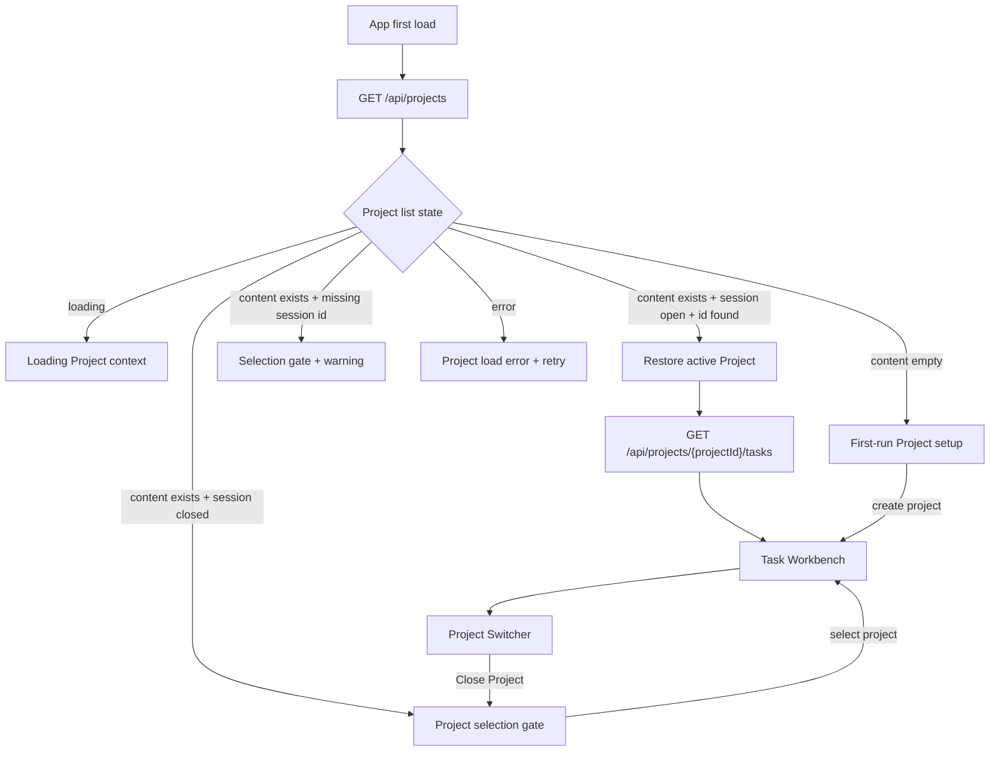

# S010: Formal Product Startup Flow And Project Session Restore

> 規格：S010 | 大小：M(13) | 狀態：✅ QA PASS — ready for `$shipping-release S010`
> 日期：2026-06-07
> 對應：PRD §0.1, §0.2 / S001 / S003 / S004 / spec-roadmap row S010

---

## 1. 目標

讓使用者打開 Grimo 時先得到正確的 Project context：第一次使用時建立第一個 Project；已經有 Project 且上次沒有明確 close 時，像 VS Code / JetBrains IDE 一樣恢復上次 Project；使用者按 `Close Project` 後，下次打開停在 Project selection gate，不偷選別的 Project，也不顯示假 Task。

S010 是 Milestone 1 的啟動流程補強。S001/S003 已完成 Project 建立與 Project list/create 分頁；S004 已完成 Project-owned Task create，但刻意留下「沒有 `currentProject` 時可用 fixture tasks 做 read-only visual baseline」的暫時狀態。S010 要移除這個暫時 fallback，讓 app shell、topbar、Task Workbench、待處理、Chat 都遵守「Project 先決定工作流和品質基準，之後才進 Task 工作台」。

Scope：

- App first load 由 app-level bootstrap 呼叫 `GET /api/projects`，決定 Project session 狀態。
- 使用 frontend `localStorage` 保存目前 Project session，不新增 backend preference table。
- 新增 topbar Project Switcher dropdown：可切換 Project、建立 Project、管理 Projects、`Close Project`。
- 新增 Project selection gate：有 Project 時列出 Project list；沒有 Project 時只顯示 first-run 建立入口。
- 建立或選擇 Project 成功後，設為 active Project，保存 session，直接進 Task Workbench。
- 沒有 active Project 時，Task 管理、待處理、Chat 不顯示 fixture tasks 或假 Project context。

Out of scope：

- 不做多 Project 同時開啟、多視窗、tabs、multi-root workspace。
- 不做 backend user preference / account setting。
- 不做 native folder picker、desktop packaging、Project delete/archive。
- 不新增 Task、Ready Gate、Dispatcher、Review Materials。
- 不改 backend Project / Task API shape。

相依狀態：

| 相依 | 類型 | 狀態 | 對 S010 的影響 |
| --- | --- | --- | --- |
| S001 | Code-level | shipped | Project create/list API 與 workflow recipe catalog 已存在。 |
| S003 | Code-level | shipped | Project 管理頁已是 list/create 分頁，`projectPath` 已簡化。 |
| S004 | Code-level | shipped | Task create/list 已是 Project-owned；S010 移除 no-project fixture fallback。 |
| S005-S008 | Ordering-only | backlog | S010 不依賴 chat/dispatch/review/QA backlog；它只整理 Project context 啟動。 |

Spec overlap scan：

- Active Milestone 1 目前沒有其他 in-flight spec；S010 不需要 supersede active spec。
- S003 已處理 Project 管理頁，不重做表單設計。
- S004 明確把 no-project fixture fallback 留給後續 Project selection shell spec；S010 正是該後續 spec。

## 2. 研究與設計

### 2.1 查到的事實

| 來源 | 查到什麼 | 對設計的影響 |
| --- | --- | --- |
| `docs/grimo/PRD.md` §0.1, §0.2 | Grimo 核心是 Project 底下的 Task 工作台；Project 決定工作流和品質基準；Chat 不是產品本體。 | app 啟動不能先進 generic chat 或假 Task board；要先建立/恢復 Project context。 |
| `frontend/src/App.tsx` | `currentProject=null` 時會 `setProjectTasks(tasks)`，topbar fallback 顯示 `grimo/web` 和假 path。 | S010 必須把 fixture fallback 改成 no-context gate，topbar 不顯示假 Project。 |
| `frontend/src/features/projects/Projects.tsx` | Project list 只有進 Projects page 才載入，且會選 `projectList[0]`。 | S010 要把 Project bootstrap 提到 app-level，Projects page 改成吃 app-level Project state 或同步 callback。 |
| `backend/src/main/java/io/github/samzhu/grimo/project/ProjectStore.java` | `findAll()` 以 `created_at DESC` 回 Project list。 | 沒有 session key 的舊狀態不自動選第一筆，避免使用者進錯 repo；選過一次後才 restore。 |
| `docs/grimo/specs/archive/2026-06-02-S004-task-creation-through-backend-api.md` | S004 記錄 no-project 時可暫留 fixture tasks，直到 Project selection shell spec 移除。 | S010 要把這個 temporary allowance 關掉，並補 Playwright evidence。 |
| `docs/grimo/design/screen-flow-contract.md` | page-flow spec 必須定義 Flow Header、State Matrix、Flow Steps、wireflow、CTA/navigation、Verification Mapping。 | S010 必須先完成 Screen Flow Contract，再進 task planning。 |
| VS Code Workspaces — https://code.visualstudio.com/docs/editing/workspaces/workspaces | VS Code 會保存 folder/workspace 的開啟狀態，重開後恢復原本 editor layout；沒有 workspace 時能力會降低。 | Grimo 應把 Project 視為工作根；quit app 不等於 close Project。 |
| VS Code Multi-root Workspaces — https://code.visualstudio.com/docs/editing/workspaces/multi-root-workspaces | VS Code 有明確 `Close Workspace` command，並能從 `Open Recent` 重新開 workspace。 | Grimo 要把 `Close Project` 設計成明確 command，不等同 app quit，也不刪 Project。 |
| JetBrains Open/Close Projects — https://www.jetbrains.com/help/idea/open-close-and-move-projects.html | JetBrains 支援 reopen projects on startup；Close Project 是 File menu action，會回到 project selection / welcome。 | S010 採用「退出 app 會 restore，明確 Close Project 才回 selection gate」的 session 語義。 |
| Linear Workspaces — https://linear.app/docs/workspaces | workspace name 在左上可進 settings / switch workspace；多 workspace 可從 switcher 選擇。 | Grimo topbar 的目前 Project context 應變成 switcher，而不是把 close 做成孤立大按鈕。 |
| Slack Switch Workspaces — https://slack.com/intl/en-gb/help/articles/1500002200741-Switch-between-workspaces | 多 workspace 產品把 workspace switcher 放在左上，目前 workspace icon/name 是切換入口。 | Project Switcher dropdown 可直接列出其他 Project，讓日常切換不必離開工作台。 |
| Notion Workspaces — https://www.notion.com/en-gb/help/create-delete-and-switch-workspaces | 點目前 workspace 名稱可展開 dropdown，選擇要跳轉的 workspace。 | Grimo `目前專案` 區塊應是可點的上下文入口。 |
| Figma User Flow — https://www.figma.com/resource-library/user-flow/ | User flow 要定義目標、entry point、steps、decision points、endpoint。 | S010 的 first-run、restore、close、missing-session 都要在同一份 flow contract 中列出。 |
| GitLab Empty States — https://design.gitlab.com/patterns/empty-states/ | Empty state 應提供下一步，且避免同一 context 有多個 primary actions。 | no Project 狀態只給一個主行動；有 Project 時 Project list card 是主要選擇，新增是次要 action。 |
| Carbon Empty States — https://carbondesignsystem.com/patterns/empty-states-pattern/ | Empty state 應放在原本資料會出現的位置，多個 empty state 同時存在時要避免多個 primary CTA。 | Task board 不用假資料填空；no-context gate 取代整個工作台內容。 |

Confidence：

| 決策 | 信心 | 依據 |
| --- | --- | --- |
| App-level Project bootstrap | Validated | PRD + 現有 `Projects.tsx` only-page load 問題。 |
| `localStorage` session restore | Validated for MVP | 無 backend preference 需求；React app 可用 effect 同步 browser storage。 |
| Topbar Project Switcher | Validated | IDE/workspace 產品研究 + 使用者確認。 |
| no silent fallback when last Project missing | Validated | 使用者確認；local repo context 風險高。 |
| no-project pages never show fixture tasks | Validated | PRD + S004 temporary allowance closure。 |

### 2.2 架構設計

S010 採用 frontend-owned session restore：



State ownership：

| State | Owner | 說明 |
| --- | --- | --- |
| `projects` | `App` | app-level Project list，供 bootstrap、selection gate、switcher、Projects page 使用。 |
| `projectBootstrapStatus` | `App` | `loading`, `ready`, `empty`, `error`。 |
| `currentProject` | `App` | 目前開啟的 Project；只有它存在時才載入 tasks。 |
| `projectSession` | `localStorage` through helper | 保存上次 active Project id 以及是否被明確 close。 |
| `projectTasks` | `App` | 只有 `currentProject` 存在時從 backend task API 載入；沒有 Project 時為空。 |

Project session localStorage contract：

```json
{
  "lastActiveProjectId": "01HZPROJECT001",
  "isClosed": false
}
```

| 欄位 | 型別/格式 | 規則 | 來源 | 設計理由 | BDD 要驗什麼 |
| --- | --- | --- | --- | --- | --- |
| `lastActiveProjectId` | string \| null | 選擇或建立 Project 成功後寫入；`Close Project` 不必清掉，但不能 auto-restore。 | frontend selected `Project.id` | 讓 app quit/reopen 後回到上次 Project。 | reload 後會找同 id Project；missing id 不會改選其他 Project。 |
| `isClosed` | boolean | `Close Project` 設 `true`；select/create Project 設 `false`。 | Project Switcher / selection gate action | 分辨「app 離開」和「使用者明確 close」。 | closed session reload 後停在 Project selection gate。 |

Bootstrap rules：

1. `GET /api/projects` pending 時，topbar 顯示 `載入 Project context` 或等價 loading 文案，不顯示 `grimo/web` 假 Project。
2. `content=[]` 時，主內容顯示 `建立第一個 Project` gate；唯一 primary action 是 `建立 Project`。
3. `content.length > 0` 且 `projectSession.isClosed=false` 且 `lastActiveProjectId` 存在於 `content[]` 時，選該 Project，載入其 tasks，進 Task Workbench。
4. `content.length > 0` 但沒有 session key 時，停在 Project selection gate，讓使用者選一次；S010 不從 existing DB 靜默選第一筆。
5. `content.length > 0` 且 `projectSession.isClosed=true` 時，停在 Project selection gate。
6. `lastActiveProjectId` 找不到時，停在 Project selection gate，顯示 `上次開啟的 Project 已不存在或無法載入，請選擇 Project。`，不可自動換成第一筆 Project。
7. `GET /api/projects` 失敗時，顯示錯誤與 `重試`，不可 fallback fixture Project / fixture Task。

Topbar Project Switcher rules：

- 有 active Project 時，topbar 顯示 `目前專案`、Project name、short projectPath 和 dropdown trigger。
- Dropdown 精簡列出 Project list，包含 name、short path、workflow；點其他 Project 會切換 active Project、更新 localStorage、載入該 Project tasks，並停在 Task Workbench。
- Dropdown actions：`新增 Project`、`管理 Projects`、`Close Project`。
- `Close Project` 只關閉 session，不刪 Project、不打 backend delete、不清 Project list。
- 沒有 active Project 時，topbar 顯示 `尚未開啟 Project`，不顯示假 projectPath。

No-context page rules：

| Surface | No active Project behavior |
| --- | --- |
| Task 管理 | 顯示 Project selection gate；不 render Task board fixture cards。 |
| 待處理 | 顯示 Project selection gate；不 render review/blocker fixture cards。 |
| Chat | 顯示 Project selection gate 或 context-required empty state；不開 blank generic chat。 |
| Workflow | 可保留為 recipe/reference view，但 topbar 仍顯示 no active Project；不暗示有 Project context。 |
| 專案 | 顯示 Project list/create 管理頁；selection action 會 active project 並可回 Task Workbench。 |

### 2.3 Screen Flow Contract

Flow Header：

| 欄位 | 內容 |
| --- | --- |
| Flow name | Formal product startup flow |
| Persona | 本機開發者 |
| User goal | 打開 Grimo 後進入正確的 Project 工作現場；若沒有開啟 Project，能清楚選擇或建立 Project。 |
| Entry point | app first load、topbar Project Switcher、`Close Project` command、Project selection gate |
| Success endpoint | active Project 的 Task Workbench，topbar 顯示真 Project，Task list 來自 `GET /api/projects/{projectId}/tasks`。 |
| Out of scope | 多視窗、多 root、Project delete/archive、backend preference、native folder picker、production packaging。 |

State Matrix：

| State | Data condition | 使用者看到什麼 | Primary action | Forbidden behavior | Evidence |
| --- | --- | --- | --- | --- | --- |
| loading | `GET /api/projects` pending | topbar/project gate 顯示 `載入 Project context` | none | 不顯示 `grimo/web` 或 fixture tasks | Playwright UI assertion |
| empty | `GET /api/projects` 回 `content=[]` | `建立第一個 Project` + 一段說明 Project 會決定 Task 工作流和品質基準 | `建立 Project` | 不顯示 Task board / fake Project / demo Task | Playwright UI + visual |
| ready | session open and Project id found | Task Workbench with current Project；topbar 顯示真 Project name/path | `新增 Task` | 不用 `projectList[0]` 偷換 session；不顯示 stale tasks | Playwright full-stack |
| selection | session closed, no session key, or missing session id | `選擇 Project` gate；有 Project list；可 `建立 Project` | Project card selection | 不自動進第一筆 Project；不顯示 fixture tasks | Playwright UI |
| error | Project list failed | `Project 載入失敗` + 可重試說明 | `重試` | 不把 fixture 當成功資料；不清掉已存在 localStorage session | Playwright UI |
| success | Project selected/created/switched | topbar 更新為該 Project，Task Workbench 載入該 Project tasks | `新增 Task` | 不停在 stale form；不保留前一 Project tasks | full-stack E2E |

Flow Steps：

| Step | Outcome | Screen / surface | User action | System response | Next state | Evidence |
| --- | --- | --- | --- | --- | --- | --- |
| 1 | 使用者第一次打開時知道還沒有 Project | App first load | open app | `GET /api/projects` 回空，顯示 first-run gate | empty | `project-startup.ui.spec.ts` |
| 2 | 使用者建立第一個 Project 後直接進工作台 | Project create | submit form | `POST /api/projects` 成功，保存 session，切到 tasks view | success | `project-startup.fullstack.spec.ts` or existing full-stack extended |
| 3 | 使用者重開 app 回到上次 Project | App reload | reload page | 讀 localStorage + `GET /api/projects`，restore matching Project | ready | Playwright UI/full-stack |
| 4 | 使用者明確 close Project 後回 selection | Project Switcher | click `Close Project` | `isClosed=true`，清 `currentProject`，tasks 清空 | selection | Playwright UI |
| 5 | 使用者從 selection 選 Project 後進工作台 | Project selection gate | click Project card | 保存 session，載入 selected Project tasks | success | Playwright UI |
| 6 | 上次 Project 找不到時不偷換 | App reload | stale localStorage id | 顯示 missing warning + selection gate | selection | Playwright UI |
| 7 | 使用者在工作台切換 Project | Project Switcher | click another Project | topbar/task list 改成新 Project context | success | Playwright UI |

Low-fidelity wireflow：

```text
App first load, active session exists
+--------------------------------------------------------------+
| [≡]  Grimo                  目前專案  grimoAPP        [v]    |
+--------------------------------------------------------------+
| 任務工作台                                                   |
| 搜尋任務 / 關鍵字                         [新增 Task]        |
| BACKLOG        DEFINING        READY        RUNNING ...      |
+--------------------------------------------------------------+

Project Switcher
                         +--------------------------------+
目前專案  grimoAPP [v] -> | grimoAPP                       |
                         | /Users/.../grimoAPP            |
                         | Web 服務開發                   |
                         |--------------------------------|
                         | skills-hub     /Users/...      |
                         | docs-site      /Users/...      |
                         |--------------------------------|
                         | 新增 Project                   |
                         | 管理 Projects                  |
                         | Close Project                  |
                         +--------------------------------+

After Close Project
+--------------------------------------------------------------+
| [≡]  Grimo                  尚未開啟 Project                 |
+--------------------------------------------------------------+
|                                                              |
|                 選擇或建立 Project                          |
|  Project 會決定 Task 的工作流、角色和品質基準。             |
|                                                              |
|  grimoAPP        /Users/.../grimoAPP        Web 服務開發     |
|  skills-hub      /Users/.../skills-hub      Web 服務開發     |
|                                                              |
|  [建立 Project]                                              |
+--------------------------------------------------------------+

First run, no Project
+--------------------------------------------------------------+
| [≡]  Grimo                  尚未建立 Project                 |
+--------------------------------------------------------------+
|                                                              |
|                 建立第一個 Project                          |
|  Project 會讓 Task 工作台有真實 repo / codebase context。   |
|  建立後會直接進入 Task 工作台。                             |
|                                                              |
|                 [建立 Project]                              |
+--------------------------------------------------------------+
```

這張 wireflow 只約定資訊架構和互動順序，不是 final pixels、不新增 design system，也不授權加入無關裝飾。

CTA/navigation rules：

- Primary action:
  - first-run empty：`建立 Project`
  - selection gate with existing Projects：Project card selection；`建立 Project` 是 secondary
  - ready Task Workbench：`新增 Task`
- Secondary actions: `新增 Project`, `管理 Projects`, `Close Project` 都在 Project Switcher dropdown。
- Cancel/back/retry:
  - Project load error 用 `重試` 重新呼叫 `GET /api/projects`。
  - Project create page 的 `返回列表` 保留 S003 行為；若是 first-run 且無 Project，返回後仍回 first-run gate。
- Success destination:
  - select/create/switch Project 成功後停在 Task Workbench。
- No-context behavior:
  - Task 管理、待處理、Chat 改顯示 Project selection gate，不顯示 fixture tasks。
- Duplicate primary CTA check:
  - 同一 gate 不出現兩個同級 primary CTA；有 Project list 時，Project card 是主要選擇，`建立 Project` 降級。

Verification Mapping：

| Behavior | Required evidence |
| --- | --- |
| Project bootstrap loading/empty/error/selection | Playwright UI assertions in `frontend/e2e/project-startup.ui.spec.ts` |
| Project restore/switch/close session | Playwright localStorage + UI assertions |
| create/select Project routes to Task Workbench | full-stack Playwright using real `/api` wiring |
| no fixture Task / fake Project in no-context states | Playwright assertions against text/card absence |
| responsive Project selection gate / switcher | visual snapshots at `1366x768`, `1440x900`, `390x844`, `820x1180` if layout changes |

### 2.4 做法比較

| 做法 | 採用 | 理由 |
| --- | --- | --- |
| A: Project-gated app bootstrap + VS Code-like session restore | yes | 符合使用者確認；quit app 恢復上次 Project，`Close Project` 才回 selection。 |
| B: 每次啟動自動選最新建立 Project | no | 實作最簡單，但會在舊 DB 或 missing session 情境偷偷選錯 repo。 |
| C: 每次啟動都進 Project list | no | 安全但日常多一步，沒有保留「上次工作現場」。 |
| D: Topbar Project Switcher dropdown | yes | 符合 workspace 產品慣例；切換/新增/管理/close 都放在目前 Project context 旁。 |
| E: Topbar 常駐 `Close Project` 按鈕 | no | 讓 close 過度顯眼，且沒有解決日常 switch Project。 |
| F: backend preference table | no for S010 | MVP 不需要登入或跨裝置 preference；frontend session 足夠且風險小。 |
| G: no-project 繼續顯示 fixture Task board | no | 這正是 S010 要修掉的流程錯亂來源。 |

### 2.5 Task 邊界提示

| Task 候選 | Class / file | 來源 | 正向情境 | 反向情境 | POC |
| --- | --- | --- | --- | --- | --- |
| T01 App bootstrap and session helper | `frontend/src/App.tsx`, `frontend/src/features/projects/project-session.ts` | PRD + user-confirmed restore rule | reload restores matching Project and loads its tasks | stale session id goes to selection gate, not first Project | not required |
| T02 Project selection gate | `frontend/src/features/projects/ProjectSelectionGate.tsx`, `frontend/src/styles.css` | Screen Flow Contract | no active Project shows selection or first-run gate | no fixture tasks/fake project visible | not required |
| T03 Project Switcher dropdown | `frontend/src/features/projects/ProjectSwitcher.tsx`, `frontend/src/App.tsx`, `frontend/src/styles.css` | Slack/Notion/Linear switcher research | user switches/creates/manages/closes Project from topbar | close does not delete backend Project | not required |
| T04 Projects page integration | `frontend/src/features/projects/Projects.tsx` | S003 + app-level Project state | Project create/select updates app session and returns to Task Workbench when launched from gate/switcher | Project page does not refetch duplicate stale Project list or lose loaded list unexpectedly | not required |
| T05 E2E / visual evidence | `frontend/e2e/project-startup.ui.spec.ts`, `frontend/e2e/project-onboarding.fullstack.spec.ts`, `frontend/e2e/task-workbench.visual.spec.ts` | QA strategy + S010 ACs | startup/restore/close/switch/no-context states are verified | release gate fails if fake data returns | not required |

## 3. BDD Contract

驗證命令：

執行：`./scripts/verify-release.sh`

通過條件：所有帶 `@spec:S010` 的 scenario 都有對應 test evidence，且標記 `@state:verified` 前必須通過 `./scripts/verify-release.sh` 或對應 CRITICAL command。Frontend calls `/api` 的流程必須至少有一條 full-stack browser path，不可只用 mocked route。

BDD 確認狀態：

- 已確認：採用 Project-gated App Bootstrap。
- 已確認：quit app / 離開程式不等於 close Project；下次打開恢復上次 Project。
- 已確認：`Close Project` 後下次打開停在 Project selection gate。
- 已確認：Project 切換入口採 topbar Project Switcher dropdown。
- 已確認：selection gate 有 Project 時先顯示 Project list；選 Project 後直接進 Task Workbench。
- 已確認：上次 Project 找不到時回 selection gate 並提示，不自動換成第一筆 Project。

AC 覆蓋矩陣：

| AC | 使用者結果 | Contract / 可觀察輸出 | Layer | State |
| --- | --- | --- | --- | --- |
| AC-S010-1 | 第一次打開 Grimo 時，使用者看到建立第一個 Project 的入口，不看到假 Task。 | `GET /api/projects.content=[]` -> `建立第一個 Project` gate；no `grimo/web`; no fixture task card | frontend | verified |
| AC-S010-2 | 使用者重開 app 會回到上次沒有 close 的 Project 工作台。 | localStorage `isClosed=false,lastActiveProjectId=<id>` + Project list contains id -> topbar shows Project, task API called for that id | frontend, fullstack | verified |
| AC-S010-3 | 使用者按 `Close Project` 後，Grimo 回到 Project selection gate，下次也不自動 restore。 | Project Switcher `Close Project` sets `isClosed=true`, clears currentProject, task board hidden | frontend | verified |
| AC-S010-4 | 使用者可從 topbar Project Switcher 直接切換 Project。 | dropdown lists `content[]`; selecting another Project updates topbar/session and calls `/api/projects/{id}/tasks` | frontend, fullstack | verified |
| AC-S010-5 | 上次 Project 找不到或 Project list 載入失敗時，使用者不會被送進錯 Project。 | missing id -> warning + selection gate; API error -> retry state; no silent fallback to first Project | frontend | verified |
| AC-S010-6 | 沒有 active Project 時，Task 管理、待處理、Chat 不顯示 fixture data。 | `currentProject=null` -> no `.task-card` fixture titles, no fake topbar path, no generic blank chat | frontend, visual | verified |

Feature: Formal Product Startup Flow

### Rule: App 啟動先決定 Project context

使用者結果：
使用者打開 Grimo 時，不會被帶進假專案或 demo 任務。沒有 Project 就建立第一個 Project；有可恢復 session 就直接回到上次 Project 的 Task Workbench。

Contract：
Frontend first load 呼叫 `GET /api/projects`，response 使用既有 `CollectionResponse<Project>`：

```json
{
  "content": [
    {
      "id": "01HZPROJECT001",
      "name": "grimoAPP",
      "description": "本機 AI 開發工作台",
      "projectPath": "/Users/samzhu/workspace/github-samzhu/grimoAPP",
      "workflowRecipeId": "web-service-development",
      "workflowRecipeName": "Web 服務開發",
      "status": "ACTIVE",
      "createdAt": "2026-06-07T00:00:00Z",
      "updatedAt": "2026-06-07T00:00:00Z",
      "workflowRoles": []
    },
    {
      "id": "01HZPROJECT002",
      "name": "skills-hub",
      "description": "Reusable skills workspace",
      "projectPath": "/Users/samzhu/workspace/github-samzhu/skills-hub",
      "workflowRecipeId": "web-service-development",
      "workflowRecipeName": "Web 服務開發",
      "status": "ACTIVE",
      "createdAt": "2026-06-07T01:00:00Z",
      "updatedAt": "2026-06-07T01:00:00Z",
      "workflowRoles": []
    }
  ]
}
```

Empty response：

```json
{
  "content": []
}
```

```gherkin
@spec:S010
@ac:AC-S010-1
@layer:frontend
@api:GET /api/projects
@state:proposed
Scenario: 第一次打開 Grimo 時建立第一個 Project
  Given backend Project list 回傳 {"content":[]}
  When 使用者打開 Grimo
  Then 使用者看到 "建立第一個 Project"
  And 使用者看到一個主要 action "建立 Project"
  And topbar 不顯示 "grimo/web"
  And Task Workbench fixture card 不可見
  # 技術證據：Playwright route GET /api/projects empty；assert no fixture task title / no fake project context
```

驗證綁定（Verification Bindings）：

- frontend: `frontend/e2e/project-startup.ui.spec.ts`
- command: `npm --prefix frontend run test:visual -- project-startup.ui.spec.ts`；shipping 前必須被 `./scripts/verify-release.sh` 收斂

```gherkin
@spec:S010
@ac:AC-S010-2
@layer:frontend,fullstack
@api:GET /api/projects, GET /api/projects/{projectId}/tasks
@state:proposed
Scenario: 重開 app 後恢復上次 Project
  Given localStorage has project session {"lastActiveProjectId":"01HZPROJECT001","isClosed":false}
  And GET /api/projects.content[] contains Project "01HZPROJECT001"
  When 使用者重新打開 Grimo
  Then topbar 顯示 "grimoAPP"
  And Grimo 停在 "任務工作台"
  And frontend calls GET /api/projects/01HZPROJECT001/tasks
  And frontend does not call task API for "01HZPROJECT002"
  # 技術證據：Playwright asserts topbar text and task request URL
```

驗證綁定（Verification Bindings）：

- frontend/fullstack: `frontend/e2e/project-startup.ui.spec.ts` and/or `frontend/e2e/project-startup.fullstack.spec.ts`
- command: `./scripts/verify-release.sh`

### Rule: Close Project 清 session，不刪 Project

使用者結果：
使用者按 `Close Project` 是關閉目前工作現場，不是刪掉 Project。之後 app 進入 Project selection gate，下次打開也等使用者選 Project。

Contract：

```json
{
  "lastActiveProjectId": "01HZPROJECT001",
  "isClosed": true
}
```

Field contract:

| 欄位 | 型別/格式 | 規則 | 來源 | 設計理由 | BDD 要驗什麼 |
| --- | --- | --- | --- | --- | --- |
| `lastActiveProjectId` | string | 保留上次 id 供提示/最近使用；不代表可 restore | previous active Project | Close Project 不刪 Project，也不需要丟失最近 context | close 後仍可在 Project list 看到該 Project |
| `isClosed` | boolean | close 設 true；select/create/switch 設 false | Project Switcher action | 分辨 quit app 與明確 close | reload 後停 selection gate |

```gherkin
@spec:S010
@ac:AC-S010-3
@layer:frontend
@state:proposed
Scenario: 使用者 Close Project 後回到 Project selection gate
  Given 使用者目前開啟 Project "grimoAPP"
  When 使用者打開 Project Switcher 並點 "Close Project"
  Then topbar 顯示 "尚未開啟 Project"
  And 主內容顯示 "選擇或建立 Project"
  And Project list 仍包含 "grimoAPP"
  And localStorage project session has "isClosed": true
  And Task Workbench fixture card 不可見
  # 技術證據：Playwright asserts localStorage, gate text, and no backend DELETE request
```

驗證綁定（Verification Bindings）：

- frontend: `frontend/e2e/project-startup.ui.spec.ts`
- command: `./scripts/verify-release.sh`

### Rule: Project Switcher 是日常切換入口

使用者結果：
使用者在 Task Workbench 不必先進 Project 管理頁，就能看到其他 Project 並切換；完整管理仍保留在 Projects page。

Contract：
Project Switcher 使用 app-level `projects.content[]`，不新增 backend endpoint。點 Project item：

1. `currentProject = selectedProject`
2. localStorage session 改成 `{"lastActiveProjectId": selectedProject.id, "isClosed": false}`
3. view 切回 `tasks`
4. 呼叫 `GET /api/projects/{selectedProject.id}/tasks`

```gherkin
@spec:S010
@ac:AC-S010-4
@layer:frontend,fullstack
@api:GET /api/projects/{projectId}/tasks
@state:proposed
Scenario: 使用者從 topbar switcher 切換 Project
  Given 使用者目前在 Project "grimoAPP" 的 Task Workbench
  And Project Switcher list includes "skills-hub"
  When 使用者打開 Project Switcher 並選擇 "skills-hub"
  Then topbar 顯示 "skills-hub"
  And Grimo 停在 "任務工作台"
  And frontend calls GET /api/projects/01HZPROJECT002/tasks
  And localStorage lastActiveProjectId becomes "01HZPROJECT002"
  # 技術證據：Playwright asserts dropdown item, request URL, topbar and storage
```

驗證綁定（Verification Bindings）：

- frontend/fullstack: `frontend/e2e/project-startup.ui.spec.ts`
- command: `./scripts/verify-release.sh`

### Rule: 不可偷偷換 Project，也不可用 fixture 偽裝成功

使用者結果：
如果上次 Project 不存在、Project API 失敗、或使用者已 close Project，Grimo 會停下來讓使用者選擇，不會自己進另一個 repo 的工作台。

Contract：

| Condition | UI result | Forbidden |
| --- | --- | --- |
| stale `lastActiveProjectId` | `上次開啟的 Project 已不存在或無法載入，請選擇 Project。` + selection gate | auto-select `content[0]` |
| `GET /api/projects` network/API failure | `Project 載入失敗` + `重試` | fallback `grimo/web` or fixture tasks |
| `currentProject=null` on Task/Blockers/Chat | selection gate/context required state | render fixture board, attention cards, blank generic chat |

```gherkin
@spec:S010
@ac:AC-S010-5
@layer:frontend
@api:GET /api/projects
@state:proposed
Scenario: 上次 Project 找不到時不自動改選別的 Project
  Given localStorage lastActiveProjectId is "missing-project"
  And GET /api/projects.content[] contains "grimoAPP" and "skills-hub"
  When 使用者打開 Grimo
  Then 使用者看到 "上次開啟的 Project 已不存在或無法載入，請選擇 Project。"
  And 使用者看到 Project selection gate
  And topbar 顯示 "尚未開啟 Project"
  And frontend does not call GET /api/projects/01HZPROJECT001/tasks
  # 技術證據：Playwright asserts warning and absence of task request
```

驗證綁定（Verification Bindings）：

- frontend: `frontend/e2e/project-startup.ui.spec.ts`
- command: `./scripts/verify-release.sh`

```gherkin
@spec:S010
@ac:AC-S010-6
@layer:frontend,visual
@state:proposed
Scenario: 沒有 active Project 時 Task 管理、待處理、Chat 不顯示 fixture data
  Given currentProject is null because the user closed Project
  When 使用者切到 "Task 管理"
  Then 使用者看到 "選擇或建立 Project"
  And no fixture task card title is visible
  When 使用者切到 "待處理"
  Then no REVIEW/BLOCKED fixture attention card is visible
  When 使用者切到 "Chat"
  Then generic blank chat is not shown as a working Task thread
  # 技術證據：Playwright asserts gate text and fixture task absence across pages
```

驗證綁定（Verification Bindings）：

- frontend/visual: `frontend/e2e/project-startup.ui.spec.ts`, `frontend/e2e/task-workbench.visual.spec.ts`
- command: `./scripts/verify-release.sh`

### 非功能需求檢查

| 分類 | 對應驗收 | 說明 |
| --- | --- | --- |
| Performance | AC-S010-2, AC-S010-4 | Bootstrap 只新增一次 Project list request；Project switch 只載入 selected Project tasks，不預載所有 Project tasks。 |
| Security | AC-S010-3 | `Close Project` 不刪 backend 資料、不清 local DB、不執行 shell；只改 frontend session。MVP security 維持 permit-all。 |
| Reliability | AC-S010-5 | stale session / API failure 不可進錯 Project；避免 Task 操作寫到錯 repo context。 |
| Usability | AC-S010-1, AC-S010-3, AC-S010-4 | first-run、selection、switch、close 都有單一明確下一步；topbar context 可被操作但不干擾工作台。 |
| Maintainability | AC-S010-2, AC-S010-6 | App-level Project bootstrap 取代分散在 Projects page 的隱式 selection；fixture data 不再扮演真狀態。 |

## 4. 介面與 API 設計

Backend API：N/A — S010 使用既有 API，不新增或修改 backend endpoint。

Existing API used by S010：

```http
GET /api/projects
GET /api/projects/{projectId}/tasks
POST /api/projects
```

Frontend session helper：

```ts
export type ProjectSession = {
  lastActiveProjectId: string | null;
  isClosed: boolean;
};

export function readProjectSession(): ProjectSession;
export function saveOpenProjectSession(projectId: string): void;
export function saveClosedProjectSession(lastActiveProjectId: string | null): void;
export function clearProjectSession(): void;
```

Rules：

- Invalid JSON in localStorage is treated as `{ lastActiveProjectId: null, isClosed: true }` and overwritten only after user selects/creates Project.
- `saveOpenProjectSession(projectId)` writes `isClosed=false`.
- `saveClosedProjectSession(lastActiveProjectId)` writes `isClosed=true`.
- Helper is frontend-only; backend remains source of truth for actual Project rows.

Frontend component contracts：

```ts
type ProjectSelectionGateProps = {
  projects: Project[];
  reason: "first-run" | "closed" | "missing-session" | "no-context";
  message?: string;
  onSelectProject: (project: Project) => void;
  onCreateProject: () => void;
  onRetry?: () => void;
};

type ProjectSwitcherProps = {
  currentProject: Project | null;
  projects: Project[];
  onSelectProject: (project: Project) => void;
  onCreateProject: () => void;
  onManageProjects: () => void;
  onCloseProject: () => void;
};
```

UI text contract：

| State | Required visible text / role |
| --- | --- |
| bootstrap loading | `載入 Project context` |
| first-run empty | `建立第一個 Project`, `建立 Project` |
| selection gate | `選擇或建立 Project` |
| stale session | `上次開啟的 Project 已不存在或無法載入，請選擇 Project。` |
| topbar no active Project | `尚未開啟 Project` |
| project load error | `Project 載入失敗`, `重試` |
| switcher close action | `Close Project` |

Storage：

N/A — no DB schema change. S010 stores only frontend session metadata in browser localStorage and uses backend Project rows as the source of truth.

## 5. 檔案規劃

| 檔案 | 動作 | 說明 |
| --- | --- | --- |
| `docs/grimo/specs/spec-roadmap.md` | modify | 新增 S010 active row。 |
| `docs/grimo/specs/2026-06-07-S010-formal-product-startup-flow.md` | new | 本 spec。 |
| `frontend/src/App.tsx` | modify | App-level Project bootstrap、Project session restore、no-context routing、Project Switcher composition。 |
| `frontend/src/features/projects/project-session.ts` | new | localStorage read/write helper，集中處理 invalid JSON、open/closed session。 |
| `frontend/src/features/projects/ProjectSelectionGate.tsx` | new | first-run / selection / missing-session / no-context gate。 |
| `frontend/src/features/projects/ProjectSwitcher.tsx` | new | topbar dropdown for Project context, switch, create, manage, close。 |
| `frontend/src/features/projects/Projects.tsx` | modify | 改成可接 app-level Project list/selection callback；create success 可回 Task Workbench。 |
| `frontend/src/features/task-board/TaskWorkbench.tsx` | modify | 沒有 active Project 時不 render board；或由 App 在 no-context 時改 render gate。 |
| `frontend/src/features/blockers/Blockers.tsx` | modify | no active Project 時不 render fixture attention data；或由 App 統一 gate。 |
| `frontend/src/features/task-forming-chat/AssistantChat.tsx` | modify | no active Project/Task 時顯示 context-required state，不開 blank generic chat。 |
| `frontend/src/styles.css` | modify | Project Switcher dropdown、Project selection gate、responsive layout。 |
| `frontend/e2e/project-startup.ui.spec.ts` | new | S010 mocked-API UI cases：first-run、restore、close、switch、stale session、API error、no fixture。 |
| `frontend/e2e/project-onboarding.fullstack.spec.ts` | modify | 建立 Project 成功後直接進 Task Workbench 並保存 session。 |
| `frontend/e2e/task-management.ui.spec.ts` | modify | S004 no-current Project case 更新為 S010 selection gate，不只 disabled create。 |
| `frontend/e2e/task-workbench.visual.spec.ts` | modify | 視覺基線移除 default fixture-first assumption，必要時新增 selection gate/switcher snapshots。 |
| `docs/grimo/design/frontend-design-context.md` | modify if implementation confirms copy/layout | 保存 S010 Project Switcher / selection gate 的 durable UI decision。 |
| `scripts/verify-release.sh` | verify/modify if needed | 確認 S010 UI/full-stack tests 被 release gate 收斂；缺漏時補上。 |

---

<!-- Sections 6-7 added by /planning-tasks after implementation -->

## 6. Task Plan

POC：not required — S010 不新增 package、SDK、backend schema 或未知 framework SPI；核心設計使用既有 React state/effect、既有 Project/Task API、既有 Playwright gate 與 browser `localStorage`。Pre-flight 已確認 spec 與 PRD 的 Project-first critical path 一致，未發現需要回 `/planning-spec` 的設計矛盾。

BDD layer split：

| Layer | Task | 主要 AC | 測試檔 | 驗證命令 |
| --- | --- | --- | --- | --- |
| Frontend BDD | `S010-T01 App bootstrap session BDD` | AC-S010-1, AC-S010-2, AC-S010-5 | `frontend/e2e/project-startup.ui.spec.ts` | `npm --prefix frontend run test:visual -- project-startup.ui.spec.ts` |
| Frontend BDD | `S010-T02 Project selection gate BDD` | AC-S010-1, AC-S010-3, AC-S010-5, AC-S010-6 | `frontend/e2e/project-startup.ui.spec.ts` | `npm --prefix frontend run test:visual -- project-startup.ui.spec.ts` |
| Frontend BDD | `S010-T03 Project switcher BDD` | AC-S010-3, AC-S010-4 | `frontend/e2e/project-startup.ui.spec.ts` | `npm --prefix frontend run test:visual -- project-startup.ui.spec.ts` |
| Full-stack E2E | `S010-T04 Project create and select full-stack BDD` | AC-S010-2, AC-S010-4 | `frontend/e2e/project-onboarding.fullstack.spec.ts`, `frontend/e2e/project-startup.fullstack.spec.ts` | `npm --prefix frontend run test:fullstack -- project-startup.fullstack.spec.ts` |
| Release / visual gate | `S010-T05 Release gate and visual evidence` | AC-S010-1 through AC-S010-6 | `frontend/e2e/task-workbench.visual.spec.ts`, `scripts/verify-release.sh` | `./scripts/verify-release.sh` |

Task files：

| # | Task | AC | 狀態 |
| --- | --- | --- | --- |
| T01 | [App bootstrap session BDD](../tasks/2026-06-07-S010-T01-app-bootstrap-session.md) | AC-S010-1, AC-S010-2, AC-S010-5 | PASS |
| T02 | [Project selection gate BDD](../tasks/2026-06-07-S010-T02-project-selection-gate.md) | AC-S010-1, AC-S010-3, AC-S010-5, AC-S010-6 | PASS |
| T03 | [Project switcher BDD](../tasks/2026-06-07-S010-T03-project-switcher.md) | AC-S010-3, AC-S010-4 | PASS |
| T04 | [Project create and select full-stack BDD](../tasks/2026-06-07-S010-T04-project-create-select-fullstack.md) | AC-S010-2, AC-S010-4 | PASS |
| T05 | [Release gate and visual evidence](../tasks/2026-06-07-S010-T05-release-visual-evidence.md) | AC-S010-1 through AC-S010-6 | PASS |

執行順序：T01 → T02 → T03 → T04 → T05

Task boundary rationale：

- T01 先建立 app-level bootstrap 與 session helper，因為 T02/T03/T04 都需要穩定的 Project state contract。
- T02 再建立 no-context gate，讓 no Project 狀態先停止顯示 fixture data。
- T03 加入 topbar Project Switcher，建立 close/switch 的日常入口。
- T04 用 real `/api` wiring 驗證建立/選擇 Project 後進 Task Workbench，不只停在 mocked UI。
- T05 收斂 release gate、visual snapshots 和 durable design context，防止 S010 只在單一測試檔通過但 shipping gate 漏接。

## 7. Implementation Results

Local release result: PASS on 2026-06-07.

使用者現在打開 Grimo 時會先得到真 Project context：沒有 Project 會看到 `建立第一個 Project`；有 Project 但沒有 open session、已 `Close Project`、或上次 Project 找不到時，會停在 `選擇或建立 Project`；只有 open session 找到 matching Project 時才直接進 `任務工作台`。topbar 的目前 Project 已成為 Project Switcher，可切換 Project、進新增/管理、或執行 `Close Project`。沒有 active Project 時，Task 管理、待處理、Chat 不再顯示 fixture board、attention cards 或 generic blank Chat。

Verification evidence：

| Gate | Result | Evidence |
| --- | --- | --- |
| Frontend build | PASS | `npm --prefix frontend run build` passed inside `./scripts/verify-release.sh`. |
| Frontend UI / visual | PASS | `npm --prefix frontend run test:visual` passed with 34 Chromium checks, including S010 bootstrap, restore, close, switch, stale-session, Project API failure retry, no-context gating, and Project selection / switcher snapshots. |
| Backend tests | PASS | `backend/gradlew test` passed inside `./scripts/verify-release.sh`; S010 did not add backend API or schema. |
| Full-stack E2E | PASS | `npm --prefix frontend run test:fullstack` passed with 7 Chromium checks, including `project-startup.fullstack.spec.ts` for create/select through real `/api` wiring. |
| Release gate | PASS | `./scripts/verify-release.sh` exited 0; log: `temp/verify-release.log`. |

Task results：

| Task | Result | Evidence |
| --- | --- | --- |
| S010-T01 | PASS | App bootstrap/session helper Red-Green; `project-startup.ui.spec.ts` covers first-run, restore, stale session. |
| S010-T02 | PASS | Project selection gate Red-Green; no-context Task/待處理/Chat gate coverage. |
| S010-T03 | PASS | Project Switcher Red-Green; close and switch update session and task API calls. |
| S010-T04 | PASS | Full-stack create/select paths pass through Vite `/api` proxy to Spring Boot and temporary SQLite state. |
| S010-T05 | PASS | Release gate includes S010 UI/full-stack evidence and updated deterministic snapshots. |

Design sync：

- `docs/grimo/design/frontend-design-context.md` now records App Shell / Project Startup decisions and visual evidence.
- `frontend/e2e/task-workbench.visual.spec.ts` now enters Task Workbench through an explicit mocked active Project session instead of relying on no-project fixture fallback.

### Independent QA Review

Verdict: **PASS**（2026-06-07）

QA 重新跑 canonical release gate，檢查 release script / QA registry 一致性、AC testability、production code generality、changed docs 與 implementation 是否一致。沒有 CRITICAL / IMPORTANT / MINOR blocking findings。QA review 中發現並修正一個非阻塞實作品質點：`Projects.tsx` 進 create mode 時可能重複載入 workflow recipes；修正後已重新跑 release gate。

| Layer | Result | Detail |
| --- | --- | --- |
| Automated tests | PASS | `./scripts/verify-release.sh` exited 0 after QA fixes. Log: `temp/verify-release.log`. |
| Coverage / Integration | PASS | QA strategy has no coverage target/tooling requirement. S010 frontend behavior is covered by `npm run test:visual`; create/select browser-to-backend flow is covered by `npm run test:fullstack` with Spring Boot + Vite + temporary SQLite. |
| Manual verification | N/A | All S010 ACs are automated through Playwright UI/visual or full-stack tests. |
| Testability gate | CLEAR | AC-S010-1 through AC-S010-6 each have executable evidence in `project-startup.ui.spec.ts`, `project-startup.fullstack.spec.ts`, or visual snapshots. No new backend API/schema or untestable external system was introduced. |
| Generality gate | CLEAR | Production code uses loaded Project rows, selected Project ids, and localStorage session state. Full-stack tests create dynamic Project names/paths and verify selected Project task API requests, so the implementation is not coupled to fixture ids such as `01HZPROJECT001`. |

AC verification map：

| AC | Status | Evidence |
| --- | --- | --- |
| AC-S010-1 | VERIFIED | Empty `GET /api/projects` shows `建立第一個 Project`; no fake Project/task fixture; visual snapshots cover gate viewports. |
| AC-S010-2 | VERIFIED | Open session restores matching Project and calls only that Project task API; full-stack create route persists open session and loads tasks. |
| AC-S010-3 | VERIFIED | `Close Project` writes `isClosed=true`, returns to selection gate, keeps Project list, and no DELETE request is made. |
| AC-S010-4 | VERIFIED | Project Switcher selects another Project, updates localStorage, and loads `/api/projects/{selectedProject.id}/tasks`; full-stack selection path also passes. |
| AC-S010-5 | VERIFIED | Stale session id shows warning and does not auto-select another Project; Project list API failure shows `Project 載入失敗`, keeps fixture fallback hidden, and `重試` can recover to first-run gate. |
| AC-S010-6 | VERIFIED | Task 管理、待處理、Chat render Project gate without active Project and do not show fixture board, attention cards, or generic blank Chat. |

QA evidence：

- `./scripts/verify-release.sh`: PASS; frontend build, 34 visual/UI checks, backend tests, 7 full-stack checks.
- Release log verdict includes S010 startup/switcher evidence and S010 full-stack Project startup coverage.

### Final Size Re-score (per estimation-scale.md)

| Dimension | Initial | Actual | Rationale |
| --- | ---: | ---: | --- |
| Tech risk | 2 | 1 | Implementation used existing React state/effect, browser localStorage, and existing Project/Task API clients; no new framework SPI or backend schema was needed. |
| Uncertainty | 2 | 2 | User decisions around VS Code-like restore, explicit `Close Project`, and Project Switcher were resolved during planning; no late product pivot occurred. |
| Dependencies | 3 | 3 | Behavior depends on shipped S001/S003/S004 Project and Task contracts plus existing Playwright release infrastructure. |
| Scope | 3 | 3 | Runtime change touched app shell, Projects flow, new Project gate/switcher/session helpers, styles, UI/full-stack tests, snapshots, release script, and docs. |
| Testing | 2 | 3 | Final gate required mocked UI scenarios, deterministic screenshots across four viewports, full-stack browser tests through Spring Boot + Vite + SQLite, and release-gate reconciliation. |
| Reversibility | 1 | 1 | No backend API/schema or persisted server data format changed; frontend session format is localStorage-only and can be reverted in one release. |
| **Total** | **13 / M** | **13 / M** | Bucket unchanged. Lower tech risk was offset by broader visual/full-stack verification. |
