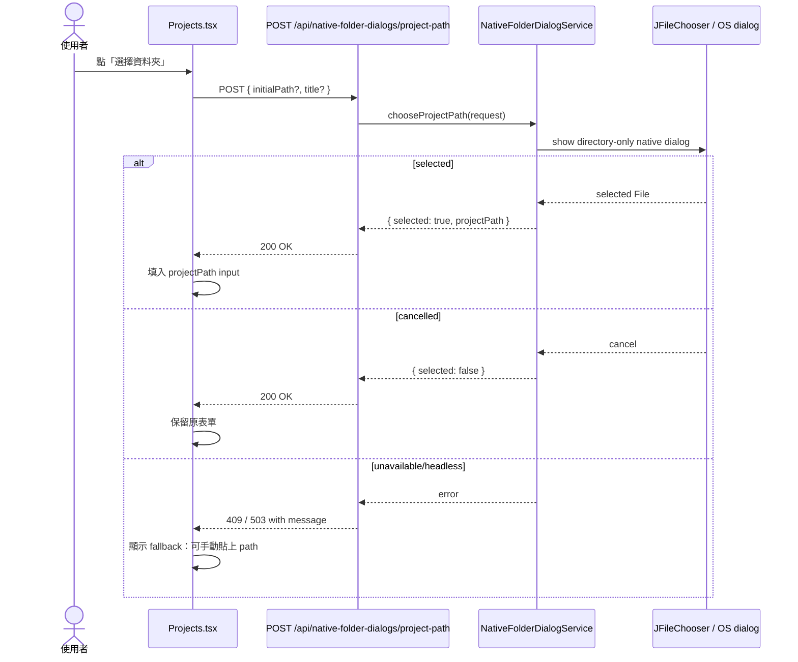

# S013: Native Project Path Folder Dialog

> 規格：S013 | 大小：M(8 story points / six_factor_score 14) | 狀態：✅ Shipped
> 日期：2026-06-08
> 對應：PRD §0.1 / §0.2 / S003 projectPath contract / S012 browser-native POC

---

> 歷史註記（2026-06-13）：S013 當時 shipped 的行為是 Native Folder Dialog Bridge。ADR-005 後來依 S014 決策覆寫為 Project Path Folder Browser；本 archive 保留 S013 shipped behavior，不代表目前推薦方向。

## 1. 目標

使用者建立 Project 時，可以用熟悉的 OS folder chooser 選 repo / codebase，Grimo 仍保存 backend 可驗證、agent 可操作的 absolute `projectPath`。

### 1.1 範圍

| 類別 | 內容 |
| --- | --- |
| In scope | 新增 local backend native folder dialog bridge；前端 `選擇資料夾` 改呼叫 native dialog API；dialog 成功後回填 `projectPath` input；取消選取不清空表單；headless / unavailable 時回可理解錯誤與 fallback。 |
| Out of scope | 不導入 Electron / Tauri packaging；不使用 browser `FileSystemDirectoryHandle` 作為 backend path；不讀資料夾內容；不執行 shell；不改 `POST /api/projects` public request shape。 |
| Active overlap | S012 已完成 mocked frontend picker T01，但使用者指出 backend directory browser 操作複雜；S012 已由 S013 supersede，未完成的 create form polish 另列 future follow-up。 |

### 1.2 相依與重疊掃描

| 來源 | 分類 | 狀態 | 對 S013 的影響 |
| --- | --- | --- | --- |
| S003 Project Path contract | Code-level | shipped | `projectPath` 是 public API 唯一路徑欄位；S013 必須產生同一種 absolute path，不新增 source/browser handle 欄位。 |
| S012 Project Creation folder picker and form polish | Superseded overlap | ⛔ superseded by S013 | S013 取代 S012 的 backend directory browsing approach；S012 form polish 不再綁在 folder picker，後續以新 spec 規劃。 |
| architecture A004 | Documented decision | current | 目前明確說 browser handle 不是 backend-operable；S013 不反駁這點，而是新增 native bridge 讓 backend 拿到 path。若採用，需補 ADR。 |

### 1.3 初始估算

| 維度 | 分數 | 理由 |
| --- | ---: | --- |
| Technical risk | 2 | Swing native dialog 在本機 POC 可用，但 HTTP request 觸發 GUI dialog 需要 UI thread/headless fallback。 |
| Uncertainty | 2 | 使用者方向明確；但 macOS/Windows/Linux dialog behavior 和 Playwright 自動化驗證有限。 |
| Dependencies | 2 | 依賴 S003 path contract、S012 create form 入口、Java desktop module。 |
| Scope | 2 | 主要新增 backend dialog endpoint/service、frontend API/UI fallback、full-stack/manual evidence。 |
| Testing | 3 | 真 OS dialog 不適合 CI 自動點選，需要 service/gateway mock tests + manual-ready POC gate + full-stack fallback path。 |
| Reversibility | 2 | 不改 DB schema 或 `POST /api/projects`，但會改 path selection UX 和 architecture decision。 |
| Total | 13 | M |

## 2. 研究與設計

### 2.1 查到的事實

| 來源 | 查到什麼 | 對設計的影響 |
| --- | --- | --- |
| `docs/grimo/architecture.md` A004 | `projectPath` 是 single optional backend path；browser handle 不可假裝成 server-operable path。 | S013 不能把 `FileSystemDirectoryHandle` 直接送給 backend；必須讓 backend/native layer 產生 absolute path。 |
| S012 browser-native POC | `showDirectoryPicker` 在 Chromium/localhost 可用，但 handle prototype 沒有 `path`；`webkitdirectory` 只回 relative path。 | Browser-native chooser 不能直接取代 `projectPath`；只能成為未來 browser-mediated file access，不適合 MVP path contract。 |
| `poc/S013-native-folder-bridge/NativeFolderDialogCapability.java` | Java 25 runtime：`headless=false`、`JFileChooser` 可載入、`DIRECTORIES_ONLY` 可設定、selected `File` 可轉 normalized absolute path。 | 現有 Spring Boot backend 可用 Java desktop bridge 做最小 native dialog POC，不需先引入 Electron/Tauri。 |
| Oracle `GraphicsEnvironment.isHeadless()` docs — https://docs.oracle.com/en/java/javase/26/docs/api/java.desktop/java/awt/GraphicsEnvironment.html | headless environment 不能支援 display、keyboard、mouse，GUI API 會丟 headless-related exception。 | Backend API 必須先檢查 headless；headless 時回 fallback error，不可讓 request hang。 |
| Oracle `JFileChooser` docs — https://docs.oracle.com/en/java/javase/26/docs/api/java.desktop/javax/swing/JFileChooser.html | `JFileChooser` 支援 `DIRECTORIES_ONLY` selection mode，selection result 是 `File`。 | Backend native dialog gateway 可回 `Path`，再沿用 `ProjectService` 的 path validation。 |
| Electron dialog docs — https://www.electronjs.org/docs/latest/api/dialog | `showOpenDialog` / `showOpenDialogSync` 可用 `openDirectory` 並回 `filePaths`。 | Electron 可解 UX 和 absolute path，但會引入 desktop shell/build/IPC；不是現有 stack 的最小變更。 |
| Tauri dialog docs — https://v2.tauri.app/plugin/dialog/ | dialog plugin 的 open API 可選 directory，desktop OS 回 filesystem paths。 | Tauri 是較好的長期 desktop packaging 候選，但需要 Rust/Tauri setup 與 permission model；不放進 S013 MVP。 |
| `frontend/src/features/projects/Projects.tsx` | S012 T01 已有 `選擇資料夾` button 和 picker state。 | S013 可重用入口文案，但替換背後 API：先呼叫 native dialog，失敗才 fallback 到 manual path / backend browser。 |

### 2.2 POC 結果

Browser-native POC recorded by archived S012:

```json
{
  "showDirectoryPickerType": "function",
  "exposesAbsolutePath": false,
  "webkitdirectoryReturnsRelativePaths": true
}
```

Native backend POC:

```bash
javac poc/S013-native-folder-bridge/NativeFolderDialogCapability.java
java -cp poc/S013-native-folder-bridge NativeFolderDialogCapability
```

Key output:

```json
{
  "javaVersion": "25.0.1",
  "osName": "Mac OS X",
  "headless": false,
  "chooserClass": "javax.swing.JFileChooser",
  "configuredSelectionMode": 1,
  "selectedAbsolutePath": "/var/folders/.../grimo-s013-native-dialog-...",
  "canReturnBackendProjectPath": true
}
```

Confidence:

| 決策 | Confidence | 證據 |
| --- | --- | --- |
| Browser native chooser can show familiar OS chooser | Validated | Chromium/localhost exposes `showDirectoryPicker`。 |
| Browser native chooser can provide backend `projectPath` | Rejected | No absolute path in handle surface; `webkitdirectory` relative only。 |
| Existing Java backend can return absolute path from a selected directory | Validated for non-interactive boundary | Java POC shows non-headless runtime, `JFileChooser.DIRECTORIES_ONLY`, normalized absolute path。 |
| HTTP endpoint can safely open real OS dialog in all environments | Hypothesis | Needs implementation with Swing EDT/headless timeout/cancel handling and manual POC。 |

### 2.3 架構設計

使用者看見 OS folder chooser；Grimo 保存的仍是 `projectPath` 字串。



Design rules:

- `POST /api/projects` 不變，仍只接受 `projectPath?: string`。
- Native dialog API 不建立 Project，只回填 path。
- `selected=false` 是正常取消，不是錯誤，不清空 `name`、`description`、`workflowRecipeId`。
- Headless/unavailable 是可恢復錯誤：UI 顯示「無法開啟系統資料夾選擇器，請手動貼上路徑」。
- Backend validates selected path exists/is directory/is readable before returning it.
- Native dialog gateway must be injectable so automated tests can mock selected/cancel/unavailable without opening real OS dialogs.
- MVP keeps Spring Security permit-all per project rule; endpoint is local development surface only.

### 2.4 Screen Flow Contract

Flow Header:

| 欄位 | 內容 |
| --- | --- |
| Flow name | Native Project Path folder dialog |
| Persona | 本機開發者 |
| User goal | 用熟悉的 OS folder chooser 選 repo path，不需要理解 backend directory tree。 |
| Entry point | Project Creation Page -> `專案路徑` -> `選擇資料夾` |
| Success endpoint | `專案路徑` input 填入 backend validated absolute path；使用者可繼續建立 Project。 |
| Out of scope | production desktop packaging、remote backend、browser-mediated file read/write、Electron/Tauri shell。 |

State Matrix:

| State | Data condition | 使用者看到什麼 | Primary action | Forbidden behavior | Evidence |
| --- | --- | --- | --- | --- | --- |
| loading | native dialog request pending | `正在開啟系統資料夾選擇器...`；form 保留 | none | 不重複送出多個 dialog request | Playwright mock |
| empty | N/A | N/A - OS dialog 沒有 app-rendered empty state | N/A | N/A | N/A |
| ready | backend supports native dialog | `選擇資料夾` button | `選擇資料夾` | 不顯示 backend system directory tree as primary UX | Playwright + manual POC |
| cancel | user cancels OS dialog | form 原值保留，顯示 optional note 或 no-op | `選擇資料夾` / manual input | 不當成錯誤、不清空 path | Backend/controller mock + UI test |
| error | headless/unavailable/invalid selected path | 顯示 fallback error，manual path input 可用 | manual input | request 不 hang；不建立 Project | Backend test + UI test |
| success | selected path valid | input 顯示 selected absolute path | `建立專案` | 不新增 `projectPathSource` 或 browser handle | Full-stack E2E |

Flow Steps:

| Step | Outcome | Screen / surface | User action | System response | Next state | Evidence |
| --- | --- | --- | --- | --- | --- | --- |
| 1 | 使用者知道可用 OS chooser | Project Creation Page | 查看 `專案路徑` | button 文案為 `選擇資料夾`，note 仍說可留空 | ready | Playwright |
| 2 | 使用者開啟 OS chooser | Project Creation Page | 點 `選擇資料夾` | frontend calls native dialog endpoint；UI 顯示 loading | loading | Playwright mock |
| 3 | 使用者取消 | OS dialog | Cancel | API 回 `{ "selected": false }`；form 保留 | cancel | Backend + UI |
| 4 | 使用者選 repo | OS dialog | 選 `/Users/.../grimoAPP` | API 回 `{ "selected": true, "projectPath": "/Users/.../grimoAPP" }` | success | Backend + manual POC |
| 5 | 使用者建立 Project | Project Creation Page | 點 `建立專案` | existing `POST /api/projects` receives `projectPath` only | Task Workbench | full-stack |

Low-fidelity wireflow:

```text
這不是 final pixels，也不是新 design system；只固定互動合約。

Project Creation Page
+------------------------------------------------+
| 專案路徑                                      |
| [/Users/samzhu/workspace/github-samzhu/grimoAPP] [選擇資料夾] |
| 未填會使用 Grimo 預設路徑                     |
+------------------------------------------------+
          | click
          v
Native OS Folder Chooser
+------------------------------------------------+
| macOS / Windows / Linux native dialog          |
| 使用者看自己熟悉的 Finder / Explorer / portal  |
+------------------------------------------------+
          | selected path
          v
Project Creation Page
+------------------------------------------------+
| 專案路徑                                      |
| [/Users/.../grimoAPP] [選擇資料夾]             |
| [建立專案]                                    |
+------------------------------------------------+
```

CTA/navigation rules:

- Primary action: page-level `建立專案`。
- Secondary actions: `選擇資料夾`；manual path input remains editable。
- Cancel/back/retry: OS dialog cancel returns to same form with original values。
- Success destination: still Project Creation Page until user clicks `建立專案`。
- No-context behavior: create page can open dialog without current Project。
- Duplicate primary CTA check: native dialog does not add another page-level primary CTA。

Verification Mapping:

| Behavior | Required evidence |
| --- | --- |
| native dialog endpoint selected/cancel/error contracts | backend API tests with mocked `NativeFolderDialogGateway` |
| frontend loading/cancel/error/success states | Playwright UI tests with mocked API |
| selected path used by Project create | full-stack Playwright request body + persisted read-back |
| real OS dialog can open | manual POC evidence on macOS; CI marks manual-ready |

### 2.5 做法比較

| 做法 | 採用 | 理由 |
| --- | --- | --- |
| A. Spring Boot native dialog bridge using Java desktop/Swing | yes | 最小貼近現有 stack；POC 顯示 backend runtime 非 headless 且可回 absolute path；不需要先決定 production packaging。 |
| B. Electron shell dialog | no for S013 MVP | 官方 dialog API 可回 `filePaths`，但要引入 Electron main process、IPC、packaging 和 security boundary，超出本 spec。 |
| C. Tauri dialog plugin | no for S013 MVP | 官方 plugin 可回 filesystem paths，長期可能更適合 desktop packaging；但需要 Rust/Tauri setup 與 permission model。 |
| D. Browser `showDirectoryPicker()` | no for `projectPath` | POC 驗證沒有 absolute path，不能給 backend/agent 當 repo path。 |
| E. Keep backend directory browser only | fallback only | 技術已能用，但使用者已明確指出操作複雜、看不懂系統資料夾。 |

### 2.6 Task 邊界提示

| Task 候選 | Class / file | 來源 | 正向情境 | 反向情境 | POC |
| --- | --- | --- | --- | --- | --- |
| S013-T01 Backend native dialog API BDD | `NativeFolderDialogController`, `NativeFolderDialogService`, `NativeFolderDialogGateway`, `SwingNativeFolderDialogGateway` | Oracle Swing docs + Java POC | mocked gateway selected path returns `{selected:true, projectPath}` | cancel returns `{selected:false}`; headless/unavailable returns recoverable error | POC completed, manual real dialog still required |
| S013-T02 Frontend native dialog integration BDD | `Projects.tsx`, `project-api.ts`, `project-types.ts`, `project-management.ui.spec.ts` | S012 T01 + S013 API | click `選擇資料夾` fills input from native dialog API | cancel/error keeps form values and manual path works | not required |
| S013-T03 Full-stack selected native path Project create | `project-onboarding.fullstack.spec.ts`, maybe release gate label | S003 projectPath contract | selected native path submits as `projectPath` only and persists | request lacks browser/source fields | manual-ready for real OS dialog; automated through Playwright route mock for dialog endpoint |
| S013-T04 ADR and design sync | ADR-005 at S013 shipping time, architecture/design/glossary | Architecture A004 | docs explain native bridge boundary | remote/backend headless limitations documented | not required |

## 3. BDD Contract

驗證命令：

執行：`scripts/verify-release.sh`
通過條件：所有帶 `S013` AC id 的 scenario 都有對應 test evidence；真 OS dialog evidence 可標 `MANUAL-READY`，但 selected/cancel/error API contracts 必須自動化。

AC 覆蓋矩陣：

| AC | 使用者結果 | Contract / 可觀察輸出 | Layer | State |
| --- | --- | --- | --- | --- |
| AC-S013-1 | 使用者按 `選擇資料夾` 時，系統走 native dialog API，不顯示 backend directory tree 作為主流程。 | `POST /api/native-folder-dialogs/project-path` request with optional `initialPath`。 | frontend, api | proposed |
| AC-S013-2 | 使用者選到資料夾後，`專案路徑` input 顯示 backend validated absolute path。 | `200 {"selected": true, "projectPath": "/Users/.../repo"}`。 | backend, frontend | proposed |
| AC-S013-3 | 使用者取消 OS dialog 時，表單內容不消失，也不顯示錯誤。 | `200 {"selected": false}`。 | backend, frontend | proposed |
| AC-S013-4 | backend 無法開 native dialog 時，使用者看到 fallback，可手動貼路徑。 | `409/503 {"error": "無法開啟系統資料夾選擇器，請手動貼上路徑"}`。 | backend, frontend | proposed |
| AC-S013-5 | 建立 Project 時仍只送 `projectPath`，不送 browser handle 或 source 欄位。 | `POST /api/projects` body contains `projectPath`; forbidden fields absent。 | fullstack | proposed |
| AC-S013-6 | S013 不讀資料夾內容、不執行 shell、不持久化 dialog selection。 | No DB schema change; API response only selected/path/error。 | backend, security | proposed |

Feature: Native Project Path folder dialog

### Rule: native dialog 回傳 backend 可操作的 Project Path

使用者結果：
使用者不需要在 app 裡瀏覽系統資料夾樹；點 `選擇資料夾` 後看到 OS folder chooser。選完 repo 後，新增專案頁只回填 `專案路徑`，建立 Project 還是由原本的 `POST /api/projects` 完成。

Contract:

```http
POST /api/native-folder-dialogs/project-path
Content-Type: application/json

{
  "initialPath": "/Users/samzhu/workspace/github-samzhu",
  "title": "選擇 Project 資料夾"
}
```

Selected:

```json
{
  "selected": true,
  "projectPath": "/Users/samzhu/workspace/github-samzhu/grimoAPP"
}
```

Cancelled:

```json
{
  "selected": false
}
```

Unavailable:

```json
{
  "error": "無法開啟系統資料夾選擇器，請手動貼上路徑"
}
```

Field contract:

| 欄位 | 型別/格式 | 規則 | 來源 | 設計理由 | BDD 要驗什麼 |
| --- | --- | --- | --- | --- | --- |
| `initialPath` | absolute path string, optional | client-provided hint；invalid 時 backend 可忽略並從 user home 開始 | Project Creation form current `projectPath` | 讓 dialog 從使用者目前填的附近開始 | invalid hint 不造成 500 |
| `title` | string, optional | client-provided display copy；backend may default | frontend | 讓 OS dialog 文案對應 Project creation | request 可省略 |
| `selected` | boolean | system-owned response | native dialog result | 區分 success/cancel，不把 cancel 當 error | selected true/false branches |
| `projectPath` | absolute path string | only present when `selected=true`; exists/is directory/is readable | selected `File` normalized by backend | 直接填入 existing `projectPath` input | response path 可被 Project create 使用 |
| `error` | string | only error response | backend validation/capability check | 使用者知道可以手動貼 path | UI displays exact message |

```gherkin
@spec:S013
@ac:AC-S013-1
@layer:frontend,api
@api:POST /api/native-folder-dialogs/project-path
@state:proposed
Scenario: 使用者從新增專案頁開啟系統資料夾選擇器
  Given（前提） 使用者位於 "新增專案" 頁
  When（動作） 使用者按 "選擇資料夾"
  Then（結果） browser 呼叫 POST /api/native-folder-dialogs/project-path
  And（而且） 頁面不顯示 backend directory child rows 作為主流程
  # 技術證據：Playwright route/request assertion
```

```gherkin
@spec:S013
@ac:AC-S013-2
@layer:backend,frontend
@api:POST /api/native-folder-dialogs/project-path
@state:proposed
Scenario: 使用者選到 repo 後表單填入 absolute path
  Given（前提） native dialog gateway 回傳 "/Users/samzhu/workspace/github-samzhu/grimoAPP"
  When（動作） API 回應 selected true
  Then（結果） "專案路徑" input 顯示 "/Users/samzhu/workspace/github-samzhu/grimoAPP"
  And（而且） Project 尚未建立，使用者仍可修改名稱、描述和工作流
  # 技術證據：backend MockMvc response + Playwright input value assertion
```

```gherkin
@spec:S013
@ac:AC-S013-3
@layer:backend,frontend
@api:POST /api/native-folder-dialogs/project-path
@state:proposed
Scenario: 使用者取消系統資料夾選擇器不會遺失表單
  Given（前提） 使用者已填 "專案名稱" 和 "專案描述"
  When（動作） native dialog 回傳 cancel
  Then（結果） API 回應 {"selected": false}
  And（而且） UI 保留原本的 "專案名稱"、"專案描述"、"專案路徑"
  # 技術證據：MockMvc selected false + Playwright form value assertion
```

```gherkin
@spec:S013
@ac:AC-S013-4
@layer:backend,frontend
@api:POST /api/native-folder-dialogs/project-path
@state:proposed
Scenario: 無法開啟 native dialog 時使用者可改手動貼路徑
  Given（前提） backend runtime 是 headless 或 dialog gateway unavailable
  When（動作） 使用者按 "選擇資料夾"
  Then（結果） UI 顯示 "無法開啟系統資料夾選擇器，請手動貼上路徑"
  And（而且） "專案路徑" input 仍可編輯
  # 技術證據：backend error status/body + Playwright editable assertion
```

```gherkin
@spec:S013
@ac:AC-S013-5
@layer:fullstack
@api:POST /api/projects
@state:proposed
Scenario: native dialog 選到的 path 仍用 projectPath 建立 Project
  Given（前提） "專案路徑" input 已由 native dialog 填入 "/Users/samzhu/workspace/github-samzhu/grimoAPP"
  When（動作） 使用者按 "建立專案"
  Then（結果） request body 包含 "projectPath"
  And（而且） request body 不包含 workspacePath、folderPath、projectPathSource、browserProjectPathKey 或 FileSystemDirectoryHandle
  # 技術證據：Playwright waitForRequest + persisted read-back
```

```gherkin
@spec:S013
@ac:AC-S013-6
@layer:backend,security
@api:POST /api/native-folder-dialogs/project-path
@state:proposed
Scenario: native dialog bridge 只選 path 不讀檔或執行命令
  Given（前提） 使用者選到一個可讀資料夾
  When（動作） backend 回傳 native dialog response
  Then（結果） response 只包含 selected/projectPath
  And（而且） 不新增 DB row、不讀資料夾內容、不執行 shell command
  # 技術證據：service test with fake gateway + no storage file plan
```

驗證綁定：

- backend: `backend/src/test/java/io/github/samzhu/grimo/project/NativeFolderDialogApiTests.java`
- frontend: `frontend/e2e/project-management.ui.spec.ts`
- fullstack: `frontend/e2e/project-onboarding.fullstack.spec.ts`
- manual POC: `poc/S013-native-folder-bridge/NativeFolderDialogCapability.java` plus real-dialog manual note
- command: `scripts/verify-release.sh`

### 非功能需求檢查

| 分類 | 對應驗收 | 說明 |
| --- | --- | --- |
| Performance | AC-S013-1, AC-S013-4 | Native dialog request 只能由 user click 觸發；headless/unavailable 不可 hang。 |
| Security | AC-S013-5, AC-S013-6 | 不傳 browser handle、不讀內容、不執行 shell；只回 normalized path。 |
| Reliability | AC-S013-3, AC-S013-4 | cancel 與 unavailable 都是可恢復狀態，不清空表單。 |
| Usability | AC-S013-1, AC-S013-2 | 使用者用 OS folder chooser，不需要理解 backend directory tree。 |
| Maintainability | AC-S013-6 | Native dialog gateway 可替換，未來可換 Electron/Tauri/native packaging bridge。 |

## 4. 介面與 API 設計

### Backend API

```java
record NativeFolderDialogRequest(String initialPath, String title) {}

record NativeFolderDialogResponse(boolean selected, String projectPath) {}

interface NativeFolderDialogGateway {
    NativeFolderSelection chooseDirectory(NativeFolderDialogOptions options);
}

record NativeFolderDialogOptions(Path initialPath, String title) {}

sealed interface NativeFolderSelection {
    record Selected(Path path) implements NativeFolderSelection {}
    record Cancelled() implements NativeFolderSelection {}
    record Unavailable(String message) implements NativeFolderSelection {}
}
```

Controller:

```http
POST /api/native-folder-dialogs/project-path
```

Service rules:

- If `GraphicsEnvironment.isHeadless()` or gateway unavailable, return recoverable error.
- If user cancels, return `200 {"selected": false}`.
- If selected path is invalid, return `400 {"error":"請選擇有效的本機資料夾"}`.
- If selected path is valid, return `200 {"selected": true, "projectPath": "<normalized absolute path>"}`.

### Frontend API

```ts
export type NativeFolderDialogRequest = {
  initialPath?: string;
  title?: string;
};

export type NativeFolderDialogResponse =
  | { selected: true; projectPath: string }
  | { selected: false };

export function chooseNativeProjectPath(
  input: NativeFolderDialogRequest,
): Promise<NativeFolderDialogResponse>;
```

Frontend behavior:

- `選擇資料夾` calls `chooseNativeProjectPath({ initialPath: form.projectPath || undefined })`.
- `selected=true` sets `form.projectPath`.
- `selected=false` changes nothing.
- error displays fallback text and leaves manual input enabled.

### Storage

N/A — S013 不新增或修改 DB table。Project 建立後仍由 existing `projects.workspace_path` internal column 保存 public `projectPath`。

## 5. 檔案規劃

| 檔案 | 動作 | 說明 |
| --- | --- | --- |
| `docs/grimo/specs/spec-roadmap.md` | modify | 登錄 S013，並標記 S012 已由 S013 supersede。 |
| `docs/grimo/specs/2026-06-08-S013-native-project-path-dialog.md` | new | 保存本 spec sections 1-5。 |
| `docs/grimo/specs/archive/2026-06-08-S012-project-creation-folder-picker.md` | archive | 保存 S012 closure：backend directory browser 不再作為 primary Project Path UX。 |
| `docs/grimo/glossary.md` | modify | 新增 Native Folder Dialog Bridge / Native Project Path Dialog。 |
| `docs/grimo/design/frontend-design-context.md` | modify | 記錄 Project Creation path selection UX 改為 OS chooser first。 |
| `docs/grimo/adr/ADR-005-project-path-folder-browser.md` | new later, later overwritten by S014 | S013 shipped 時記錄對 architecture A004 的延伸：local native bridge 可產生 backend path；此 ADR 後來依 S014 覆寫為 Project Path Folder Browser。 |
| `poc/S013-native-folder-bridge/NativeFolderDialogCapability.java` | new | 保存非互動 POC。 |
| `backend/src/main/java/io/github/samzhu/grimo/project/NativeFolderDialogController.java` | new later | Native dialog API endpoint。 |
| `backend/src/main/java/io/github/samzhu/grimo/project/NativeFolderDialogService.java` | new later | Headless/cancel/validation orchestration。 |
| `backend/src/main/java/io/github/samzhu/grimo/project/NativeFolderDialogGateway.java` | new later | Mockable gateway boundary。 |
| `backend/src/main/java/io/github/samzhu/grimo/project/SwingNativeFolderDialogGateway.java` | new later | Java desktop/Swing implementation。 |
| `backend/src/test/java/io/github/samzhu/grimo/project/NativeFolderDialogApiTests.java` | new later | Backend BDD for selected/cancel/unavailable/invalid path。 |
| `frontend/src/domain/project/project-types.ts` | modify later | Add native dialog request/response types。 |
| `frontend/src/features/projects/project-api.ts` | modify later | Add `chooseNativeProjectPath` client。 |
| `frontend/src/features/projects/Projects.tsx` | modify later | Replace backend directory browser primary path with native dialog flow。 |
| `frontend/e2e/project-management.ui.spec.ts` | modify later | Frontend states: loading, selected, cancel, unavailable fallback。 |
| `frontend/e2e/project-onboarding.fullstack.spec.ts` | modify later | Verify selected path still submits as `projectPath` only。 |

## 6. Task Plan

> 狀態：⏳ Plan
> POC：required and completed — S012 browser-native POC 已證明 browser folder picker 不能提供 backend absolute path；S013 Java desktop POC 已證明現有 backend runtime 可以用 `JFileChooser.DIRECTORIES_ONLY` 取得 normalized absolute path。真 OS dialog 的互動點選不放進 CI，實作後用 backend gateway mock + UI route mock + manual evidence 補足。

### 6.1 Pre-flight validation

| 檢查 | 結果 | 結論 |
| --- | --- | --- |
| PRD alignment | PASS | PRD Critical Path 要先建立/選擇 Project；S013 讓使用者更容易選 repo path，不改 Project 建立 contract。 |
| S003 `projectPath` contract | PASS | `POST /api/projects` 仍只收 `projectPath`，不新增 browser/source 欄位。 |
| S012 overlap | PASS | S012 T01 的 mocked frontend picker 已證明入口可行；S012 已由 S013 supersede，不再推 backend directory tree 作為 primary UX。 |
| Browser native capability | PASS / rejected for path contract | `showDirectoryPicker` 可開 OS chooser，但不暴露 absolute path；不能滿足 backend/agent path contract。 |
| Java desktop bridge capability | PASS | POC 顯示本機 runtime 非 headless，`JFileChooser` 可設定 directory-only 並回 absolute path。 |
| Automation risk | ACK | 真 OS dialog 無法可靠由 Playwright 點選；task plan 用 injectable gateway、自動化 contract tests、full-stack request assertion、manual POC evidence 分層驗證。 |

### 6.2 Task order

| 順序 | Task | 主要輸出 | 覆蓋 AC |
| ---: | --- | --- | --- |
| 1 | `S013-T01` Backend native dialog API BDD | `POST /api/native-folder-dialogs/project-path` selected/cancel/unavailable/invalid contracts | AC-S013-2, AC-S013-3, AC-S013-4, AC-S013-6 |
| 2 | `S013-T02` Frontend native dialog UI BDD | `選擇資料夾` 呼叫 native dialog API，selected 回填、cancel 保留、error fallback | AC-S013-1, AC-S013-2, AC-S013-3, AC-S013-4 |
| 3 | `S013-T03` Full-stack native path Project create BDD | selected path 建立 Project 時只送 `projectPath` 並可讀回 | AC-S013-5 |
| 4 | `S013-T04` ADR and design sync | ADR-005 at S013 shipping time、architecture/design/glossary/roadmap 同步 native bridge 邊界與限制 | AC-S013-6 |

### 6.3 BDD layer split

| Layer | Test / file | 驗證命令 |
| --- | --- | --- |
| Backend API | `backend/src/test/java/io/github/samzhu/grimo/project/NativeFolderDialogApiTests.java` | `cd backend && ./gradlew test --tests 'io.github.samzhu.grimo.project.NativeFolderDialogApiTests'` |
| Frontend UI | `frontend/e2e/project-management.ui.spec.ts` | `npm --prefix frontend run test:visual -- project-management.ui.spec.ts --grep "AC-S013-1|AC-S013-2|AC-S013-3|AC-S013-4"` |
| Full-stack | `frontend/e2e/project-onboarding.fullstack.spec.ts` | `npm --prefix frontend run test:fullstack -- project-onboarding.fullstack.spec.ts --grep "AC-S013-5"` |
| Docs / release hygiene | ADR-005 at S013 shipping time, `docs/grimo/architecture.md`, `docs/grimo/design/frontend-design-context.md`, `docs/grimo/glossary.md` | `git diff --check` |

### 6.4 AC coverage matrix

| AC | Task | Required evidence |
| --- | --- | --- |
| AC-S013-1 | S013-T02 | Playwright asserts `選擇資料夾` sends `POST /api/native-folder-dialogs/project-path` and `.directory-browser` is not the primary flow。 |
| AC-S013-2 | S013-T01, S013-T02 | Backend selected response returns validated absolute `projectPath`; UI fills the same value into `專案路徑` input。 |
| AC-S013-3 | S013-T01, S013-T02 | Backend cancel returns `{ "selected": false }`; UI keeps name/description/path/workflow values and shows no error。 |
| AC-S013-4 | S013-T01, S013-T02 | Backend unavailable/headless returns recoverable error; UI shows fallback message and manual path remains editable。 |
| AC-S013-5 | S013-T03 | Full-stack `POST /api/projects` body includes `projectPath` and excludes `workspacePath`, `folderPath`, `projectPathSource`, `browserProjectPathKey`, `FileSystemDirectoryHandle`。 |
| AC-S013-6 | S013-T01, S013-T04 | Gateway test/doc evidence shows bridge only returns selection result, does not read folder contents, execute shell, persist dialog selection, or change DB schema。 |

### 6.5 Temporary task files

- `docs/grimo/tasks/2026-06-08-S013-T01-backend-native-dialog-api.md`
- `docs/grimo/tasks/2026-06-08-S013-T02-frontend-native-dialog-ui.md`
- `docs/grimo/tasks/2026-06-08-S013-T03-fullstack-native-path-project-create.md`
- `docs/grimo/tasks/2026-06-08-S013-T04-adr-design-sync.md`

### 6.6 Handoff readiness

Next pending task: `S013-T01`.

Suggested command: `/implementing-task S013`

Do not continue S012-T02/T03; S012 is superseded by S013, and create form polish should return as a separate future spec.

## 7. Implementation Results

> 狀態：✅ Shipped

### 7.1 Verification results

| Command | Result | Evidence |
| --- | --- | --- |
| `cd backend && ./gradlew test --tests 'io.github.samzhu.grimo.project.NativeFolderDialogApiTests'` | PASS | 5 backend API tests cover selected, cancel, unavailable, invalid path, path-only response. |
| `npm --prefix frontend run test:visual -- project-management.ui.spec.ts --grep "AC-S013-1|AC-S013-2|AC-S013-3|AC-S013-4"` | PASS | 3 UI tests cover native dialog API call, selected path fill, cancel no-op, fallback error. |
| `npm --prefix frontend run test:visual -- project-management.ui.spec.ts` | PASS | 6 tests cover S013 plus S003 Project management regressions. |
| `npm --prefix frontend run build` | PASS | TypeScript and Vite production build pass after native dialog API types/client. |
| `npm --prefix frontend run test:fullstack -- project-onboarding.fullstack.spec.ts --grep "AC-S013-5"` | PASS | Full-stack browser flow mocks only native dialog endpoint and creates Project through real backend with `projectPath` only. |
| `npm --prefix frontend run test:fullstack -- project-onboarding.fullstack.spec.ts` | PASS | 5 full-stack Project onboarding tests pass on isolated full-stack ports. |
| `javac poc/S013-native-folder-bridge/NativeFolderDialogCapability.java && java -cp poc/S013-native-folder-bridge NativeFolderDialogCapability` | PASS | Java 25 on macOS reports `headless=false`, `JFileChooser`, `DIRECTORIES_ONLY`, and backend-operable temp absolute path. |
| `scripts/verify-release.sh` | PASS | Release gate passed: frontend build, 43 visual tests, backend tests, and 8 full-stack tests including S013 native path dialog evidence. Log: `temp/verify-release.log`. |

### 7.2 Key implementation findings

- `POST /api/native-folder-dialogs/project-path` now returns selected/cancel/error contracts without changing `POST /api/projects`.
- Backend tests inject `NativeFolderDialogGateway`, so CI never opens a real OS dialog.
- `SwingNativeFolderDialogGateway` checks `GraphicsEnvironment.isHeadless()` and returns a recoverable unavailable result before trying Swing UI.
- Frontend `選擇資料夾` now calls `chooseNativeProjectPath()` and no longer renders `.directory-browser` as the primary Project Creation UX.
- Full-stack config now defaults to backend `18080` and frontend `5174`, with Vite proxy target controlled by `GRIMO_API_PROXY_TARGET`; this avoids colliding with a developer's running localhost preview on `8080` / `5173`.
- Visual release gate now supports isolated port `15173` through `GRIMO_VISUAL_FRONTEND_PORT`, so `verify-release.sh` verifies the current worktree instead of reusing a developer preview server.
- QA strategy V4/V6 registry entries were updated to match the isolated visual/full-stack ports.
- S012 Local Directory Picker is superseded by S013; S012-T02/T03 were closed and Project Creation form polish remains a future follow-up.

### 7.3 AC results

| AC | Result | Evidence |
| --- | --- | --- |
| AC-S013-1 | PASS | `project-management.ui.spec.ts` asserts `選擇資料夾` sends `POST /api/native-folder-dialogs/project-path` and `.directory-browser` stays absent. |
| AC-S013-2 | PASS | Backend selected response validates normalized absolute `projectPath`; UI fills the same value into `專案路徑`. |
| AC-S013-3 | PASS | Backend cancel returns `{ "selected": false }`; UI preserves form values and shows no error. |
| AC-S013-4 | PASS | Backend unavailable returns recoverable error; UI shows fallback and keeps manual input editable. |
| AC-S013-5 | PASS | Full-stack `POST /api/projects` body includes `projectPath` and excludes `workspacePath`, `folderPath`, `projectPathSource`, `browserProjectPathKey`, `FileSystemDirectoryHandle`. |
| AC-S013-6 | PASS | Backend response is path-only; ADR-005 at S013 shipping time and architecture documented no read/no shell/no DB write/no persisted dialog selection boundary. |

### 7.4 Pending verification

| Item | Status | Follow-up |
| --- | --- | --- |
| Real OS dialog click-through | MANUAL-READY | Run the app locally, click `選擇資料夾`, select a folder in the OS dialog, and confirm the path fills `專案路徑`. Automated tests cover the same API/UI contract with gateway/route mocks. |
| Independent QA gate | PASS | `scripts/verify-release.sh` passed; all ACs are VERIFIED or MANUAL-READY. |

### 7.5 QA verdict

Verdict: **PASS**. S013 is ready for `/shipping-release S013`.

No blocking testability gap found:

- AC-S013-1 through AC-S013-6 have backend, frontend, full-stack, docs, or manual-ready evidence.
- Real OS dialog click-through remains manual-ready because CI cannot operate the host OS dialog reliably; selected/cancel/unavailable contracts are automated through backend gateway tests and frontend/full-stack route mocks.
- `scripts/verify-release.sh` is synced with S013 evidence and passed on 2026-06-08.

### 7.6 QA re-verification — 2026-06-08

Verdict: **PASS**.

| Layer | Result | Evidence |
| --- | --- | --- |
| Automated release gate | PASS | `scripts/verify-release.sh` passed. Log: `temp/verify-release.log`. |
| Frontend build | PASS | Vite production build completed inside release gate. |
| Visual regression | PASS | 43 Playwright visual tests passed, including AC-S013-1 through AC-S013-4 native dialog UI evidence. |
| Backend tests | PASS | Gradle backend tests passed, including `NativeFolderDialogApiTests`. |
| Full-stack tests | PASS | 8 Playwright full-stack tests passed, including AC-S013-5 Project creation from selected native path. |
| Testability gate | PASS | AC-S013-1 through AC-S013-6 are VERIFIED or MANUAL-READY; no UNTESTABLE acceptance criteria found. |
| Generality review | PASS | Production code uses selected `Path` plus filesystem validation; no test fixture path, browser handle, source field, directory read, shell command, or dialog selection persistence was found in the S013 production path. |
| Design sync | PASS | QA strategy V4/V6, `scripts/verify-release.sh`, architecture/design/glossary, ADR-005 at S013 shipping time, and S013 spec all described the same native dialog bridge boundary. |

Manual evidence remains intentionally `MANUAL-READY`: CI cannot click the host OS dialog reliably, so real OS click-through is verified by local human instruction while selected/cancel/unavailable contracts are automated through backend gateway tests and frontend/full-stack route mocks.

### 7.7 Final Size Re-score (per estimation-scale.md)

| Dimension | Initial | Actual | Rationale |
| --- | ---: | ---: | --- |
| Tech risk | 2 | 2 | Java desktop bridge and Swing dialog behavior were new to this codebase, but Oracle docs plus the S013 POC resolved the load-bearing risk. |
| Uncertainty | 2 | 2 | Product direction was clear after rejecting browser-native absolute paths; manual OS dialog evidence remains `MANUAL-READY`, not an unresolved product question. |
| Dependencies | 2 | 2 | Still depends on S003 `projectPath` contract, S012 path-selection evidence, and local Java desktop runtime; no extra external system was added. |
| Scope | 2 | 3 | Actual work crossed backend API/service/gateway, frontend API/UI, Playwright configs, full-stack tests, QA registry, ADR, architecture, glossary, and design context. |
| Testing | 3 | 3 | Required backend gateway tests, frontend visual tests, full-stack Playwright, release gate, POC evidence, and manual-ready OS dialog coverage. |
| Reversibility | 2 | 2 | No DB schema or `POST /api/projects` change, but the new local API endpoint and Project Creation UX require coordinated revert. |
| **six_factor_score** | **13 / M** | **14 / M** | Bucket unchanged; scope landed higher than planned. |
| **story_points** | **8** | **8** | Current scale maps M / six-factor 13-14 to 8 roadmap story points. |
